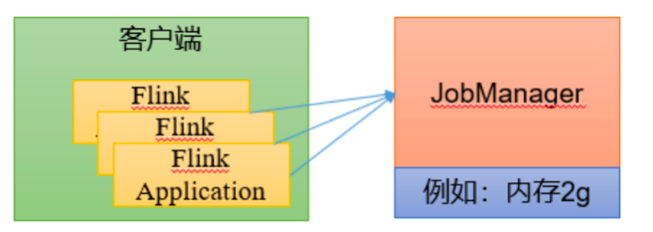

## Standalone运行模式

独立模式是独立运行的，不依赖任何外部的资源管理平台；当然独立也是有代价的：如果资源不足，或者出现故障，没有自动扩展或重分配资源的保证，必须手动处理。所以独立模式一般只用在开发测试或作业非常少的场景下。

### 会话模式部署

提前启动集群，并通过Web页面客户端提交任务（可以多个任务，但是集群资源固定）。



### 单作业模式部署

Flink的Standalone集群并不支持单作业模式部署。因为单作业模式需要借助一些资源管理平台。

### 应用模式部署

应用模式下不会提前创建集群，所以不能调用start-cluster.sh脚本。我们可以使用同样在bin目录下的standalone-job.sh来创建一个JobManager。


具体步骤如下：

1. 环境准备。在hadoop102中执行以下命令启动netcat。

   ```sh
   nc -lk 7777
   ```

2. 进入到Flink的安装路径下，将应用程序的jar包放到lib/目录下。

   ```sh
   mv FlinkTutorial-1.0-SNAPSHOT.jar lib/
   ```

3. 执行以下命令，启动JobManager。

   ```sh
   # 这里我们直接指定作业入口类，脚本会到lib目录扫描所有的jar包。
   bin/standalone-job.sh start --job-classname com.atguigu.wc.SocketStreamWordCount
   ```

4. 同样是使用bin目录下的脚本，启动TaskManager。

   ```sh
   bin/taskmanager.sh start
   ```

5. 在hadoop102上模拟发送单词数据。

   ```sh
   nc -lk 7777
   hello world
   ```

6. 在hadoop102:8081地址中观察输出数据

7. 如果希望停掉集群，同样可以使用脚本，命令如下。

   ```sh
   bin/taskmanager.sh stop
   bin/standalone-job.sh stop
   ```

   