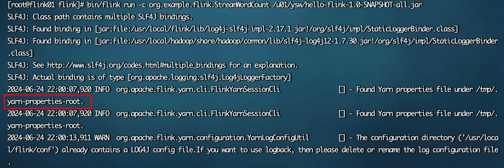

### 会话模式部署

1. 启动Hadoop集群（HDFS、YARN）。

2. 执行脚本命令向YARN集群申请资源，开启一个YARN会话，启动Flink集群。

   ```sh
   bin/yarn-session.sh -nm test
   ```

3. 参数

   * -d：分离模式，如果你不想让Flink YARN客户端一直前台运行，可以使用这个参数，即使关掉当前对话窗口，YARN session也可以后台运行。
   * -jm（--jobManagerMemory）：配置JobManager所需内存，默认单位MB。
   * -nm（--name）：配置在YARN UI界面上显示的任务名。
   * -qu（--queue）：指定YARN队列名。
   * -tm（--taskManager）：配置每个TaskManager所使用内存。

   注意：Flink1.11.0版本不再使用-n参数和-s参数分别指定TaskManager数量和slot数量，YARN会按照需求动态分配TaskManager和slot。所以从这个意义上讲，YARN的会话模式也不会把集群资源固定，同样是动态分配的。

   对比Standalone模式和Yarn模式启动后的taskManager数量

   Standalone模式

   

   Yarn模式

   

   YARN Session启动之后会给出一个Web UI地址以及一个YARN application ID，如下所示，用户可以通过Web UI或者命令行两种方式提交作业。

4. 提交作业

   * 通过Web UI提交作业

   * 通过命令行提交作业

     * 将FlinkTutorial-1.0-SNAPSHOT.jar任务上传至集群。

     * 执行以下命令将该任务提交到已经开启的Yarn-Session中运行。

       ```sh
       # 小细节：这里不需要和standalone模式那样指定-m（主机：端口），是因为会话模式会自动生成一个临时文件，记录需要将任务提交到哪一个应该下
       # bin/flink run -m flink01:8081 -c org.example.flink.StreamWordCount /u01/ysw/hello-flink-1.0-SNAPSHOT-all.jar 
       bin/flink run -c org.example.flink.StreamWordCount /u01/ysw/hello-flink-1.0-SNAPSHOT-all.jar 
       ```
       
       客户端可以自行确定JobManager的地址，也可以通过-m或者-jobmanager参数指定JobManager的地址，JobManager的地址在YARN Session的启动页面中可以找到。
       
       
       
       
     

5. 关闭flink集群应用

   ```sh
   echo "stop" | ./bin/yarn-session.sh -id application_1718806225016_0002
   ```

### 单作业模式部署

1. 执行命令提交作业。

   ```sh
   bin/flink run -d -t yarn-per-job -c org.example.flink.StreamWordCount /u01/ysw/hello-flink-1.0-SNAPSHOT-all.jar 
   ```

   注意：如果启动过程中报如下异常。

   > Exception in thread "Thread-5" java.lang.IllegalStateException: Trying to access closed classloader. Please check if you store classloaders directly or indirectly in static fields. If the stacktrace suggests that the leak occurs in a third party library and cannot be fixed immediately, you can disable this check with the configuration 'classloader.check-leaked-classloader'.

   解决办法：在flink的/opt/module/flink-1.17.0/conf/flink-conf.yaml配置文件中设置

   ```sh
   vim flink-conf.yaml
   classloader.check-leaked-classloader: false
   ```

2. 使用命令行查看或取消作业

   ```sh
   bin/flink list -t yarn-per-job -Dyarn.application.id=application_1718806225016_0004
   ------------------ Running/Restarting Jobs -------------------
   25.06.2024 00:25:46 : 7a2e1e55cfcdf56387786def1c3e0b14 : Flink Streaming Job (RUNNING)
   --------------------------------------------------------------
   bin/flink cancel -t yarn-per-job -Dyarn.application.id=application_1718806225016_0004 7a2e1e55cfcdf56387786def1c3e0b14
   ```


### 应用模式部署

1. 执行命令提交作业。

   ```sh
   # 对比单作业模式：bin/flink run -d -t yarn-per-job -c org.example.flink.StreamWordCount /u01/ysw/hello-flink-1.0-SNAPSHOT-all.jar 
   bin/flink run-application -t yarn-application -c org.example.flink.StreamWordCount /u01/ysw/hello-flink-1.0-SNAPSHOT-all.jar 
   ```

2. 在命令行中查看或取消作业。

   ```sh
   bin/flink list -t yarn-application -Dyarn.application.id=application_1718806225016_0004
   ------------------ Running/Restarting Jobs -------------------
   25.06.2024 00:25:46 : f00bd0d6189010598b68c1b42701a526 : Flink Streaming Job (RUNNING)
   --------------------------------------------------------------
   bin/flink cancel -t yarn-application -Dyarn.application.id=application_1718806225016_0004 f00bd0d6189010598b68c1b42701a526
   ```

3. 上传HDFS提交

   ```sh
   hadoop fs -mkdir /flink-dist
   hadoop fs -put lib /flink-dist
   hadoop fs -put plugins /flink-dist
   hadoop fs -mkdir /flink-jars
   hadoop fs -put /u01/ysw/hello-flink-1.0-SNAPSHOT-all.jar /flink-jars
   bin/flink run-application -t yarn-application	-Dyarn.provided.lib.dirs="hdfs://flink01:8020/flink-dist"	-c org.example.flink.StreamWordCount hdfs://flink01:8020/flink-jars/hello-flink-1.0-SNAPSHOT-all.jar
   ```

   这种方式下，flink本身的依赖和用户jar可以预先上传到HDFS，而不需要单独发送到集群，这就使得作业提交更加轻量了。


