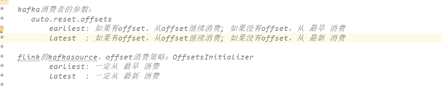
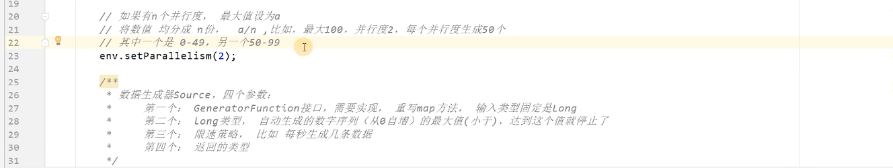

## 源算子

### 从集合中读取数据

```java
public static void main(String[] args) throws Exception {

    StreamExecutionEnvironment env = StreamExecutionEnvironment.getExecutionEnvironment();

    
List<Integer> data = Arrays.asList(1, 22, 3);
        DataStreamSource<Integer> ds = env.fromCollection(data);

	stream.print();

    env.execute();
}
```

### 从文件读取数据

1. 添加依赖

   ```xml
   <dependency>
               <groupId>org.apache.flink</groupId>
               <artifactId>flink-connector-files</artifactId>
               <version>${flink.version}</version>
   </dependency>
   ```

2. 例子

   ```java
   public static void main(String[] args) throws Exception {
           StreamExecutionEnvironment env = StreamExecutionEnvironment.getExecutionEnvironment();
           FileSource<String> fileSource = FileSource.forRecordStreamFormat(new TextLineInputFormat(), new Path("input/word.txt")).build();
           env.fromSource(fileSource,WatermarkStrategy.noWatermarks(),"file")
       .print();
           env.execute();
   }
   ```

3. 参数说明

   * 参数可以是目录，也可以是文件；还可以从HDFS目录下读取，使用路径hdfs://...；
   * l路径可以是相对路径，也可以是绝对路径；
   * 相对路径是从系统属性user.dir获取路径：idea下是project的根目录，standalone模式下是集群节点根目录；

### 从Socket读取数据

```java
DataStream<String> stream = env.socketTextStream("localhost", 7777);
```

### 从Kafka读取数据

1. 添加依赖

   ```groovy
   compile 'org.apache.flink:flink-connector-kafka:1.17.0'
   ```

2. 例子

   ```java
   public static void main(String[] args) throws Exception {
   
           StreamExecutionEnvironment env = StreamExecutionEnvironment.getExecutionEnvironment();
   
           KafkaSource<String> kafkaSource = KafkaSource.<String>builder()
                   .setBootstrapServers("localhost:9092")
                   .setTopics("test_topic")
                   .setGroupId("yknife")
                   .setStartingOffsets(OffsetsInitializer.latest())
                   .setValueOnlyDeserializer(new SimpleStringSchema())
                   .build();
   
           DataStreamSource<String> stream = env.fromSource(kafkaSource, WatermarkStrategy.noWatermarks(), "kafka-source");
           stream.print("Kafka");
           env.execute();
       }
   ```

   

   细节：flink的kafkaSource与kafka消费者客户端设置了auto.reset.offsets的不同在于，flink的kafkaSource的earliest是真正意义上的从头消费，而kafka消费者客户端如果归属于某一个消费组后并且上一次已经消费过一次数据，那么这次会接着消费组上次消费到的offset继续消费。

### 从数据生成器读取数据

1. 添加依赖

   ```groovy
   compile 'org.apache.flink:flink-connector-datagen:1.17.0'
   ```

2. 例子

   ```java
   public static void main(String[] args) throws Exception {
   
           StreamExecutionEnvironment env = StreamExecutionEnvironment.getExecutionEnvironment();
           env.setParallelism(1);
   
           DataGeneratorSource<String> dataGeneratorSource =
                   new DataGeneratorSource<>(
                           new GeneratorFunction<Long, String>() {
                               @Override
                               public String map(Long value) throws Exception {
                                   return "Number:"+value;
                               }
                           },
                           Long.MAX_VALUE,
                           RateLimiterStrategy.perSecond(10),
                           Types.STRING
                   );
           env
                   .fromSource(dataGeneratorSource, WatermarkStrategy.noWatermarks(), "datagenerator")
                   .print();
           env.execute();
       }
   ```

   小细节：

   

