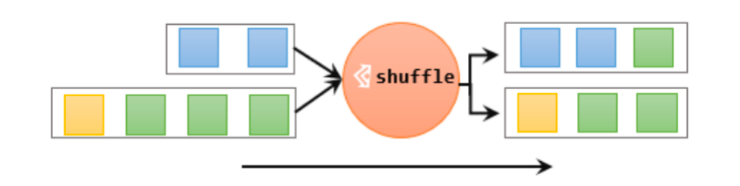
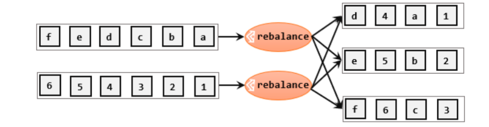
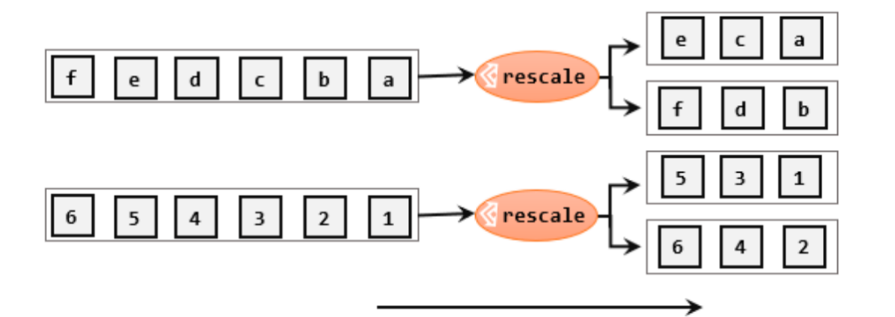

## 物理分区算子（Physical Partitioning）

常见的物理分区策略有：随机分配（Random）、轮询分配（Round-Robin）、重缩放（Rescale）和广播（Broadcast）。

### 随机分区（shuffle）

最简单的重分区方式就是直接“洗牌”。通过调用DataStream的.shuffle()方法，将数据随机地分配到下游算子的并行任务中去。

随机分区服从均匀分布（uniform distribution），所以可以把流中的数据随机打乱，均匀地传递到下游任务分区。因为是完全随机的，所以对于同样的输入数据, 每次执行得到的结果也不会相同。



经过随机分区之后，得到的依然是一个DataStream。

我们可以做个简单测试：将数据读入之后直接打印到控制台，将输出的并行度设置为2，中间经历一次shuffle。执行多次，观察结果是否相同。

```java
public class ShuffleExample {
    public static void main(String[] args) throws Exception {

        StreamExecutionEnvironment env = StreamExecutionEnvironment.getExecutionEnvironment();

		 env.setParallelism(2);

        DataStreamSource<Integer> stream = env.socketTextStream("hadoop102", 7777);;

        stream.shuffle().print()

        env.execute();
    }
}
```

### 轮询分区（Round-Robin）

轮询，简单来说就是“发牌”，按照先后顺序将数据做依次分发。通过调用DataStream的.rebalance()方法，就可以实现轮询重分区。rebalance使用的是Round-Robin负载均衡算法，可以将输入流数据平均分配到下游的并行任务中去。



```java
stream.rebalance()
```

### 重缩放分区（rescale）

重缩放分区和轮询分区非常相似。当调用rescale()方法时，其实底层也是使用Round-Robin算法进行轮询，但是只会将数据轮询发送到下游并行任务的一部分中。rescale的做法是分成小团体，发牌人只给自己团体内的所有人轮流发牌。



```java
stream.rescale()
```

### 广播（broadcast）

这种方式其实不应该叫做“重分区”，因为经过广播之后，数据会在不同的分区都保留一份，可能进行重复处理。可以通过调用DataStream的broadcast()方法，将输入数据复制并发送到下游算子的所有并行任务中去。

```java
stream.broadcast()
```

### 全局分区（global）

全局分区也是一种特殊的分区方式。这种做法非常极端，通过调用.global()方法，会将所有的输入流数据都发送到下游算子的第一个并行子任务中去。这就相当于强行让下游任务并行度变成了1，所以使用这个操作需要非常谨慎，可能对程序造成很大的压力。

```java
stream.global()
```

### 自定义分区（Custom）

当Flink提供的所有分区策略都不能满足用户的需求时，我们可以通过使用partitionCustom()方法来自定义分区策略。

1. 自定义分区器

   ```java
   public class MyPartitioner implements Partitioner<String> {
   
       @Override
       public int partition(String key, int numPartitions) {
           return Integer.parseInt(key) % numPartitions;
       }
   }
   ```

2. 使用自定义分区

   ```java
   public class PartitionCustomDemo {
       public static void main(String[] args) throws Exception {
   //        StreamExecutionEnvironment env = StreamExecutionEnvironment.getExecutionEnvironment();
           StreamExecutionEnvironment env = StreamExecutionEnvironment.createLocalEnvironmentWithWebUI(new Configuration());
   
           env.setParallelism(2);
   
           DataStreamSource<String> socketDS = env.socketTextStream("hadoop102", 7777);
   
           DataStream<String> myDS = socketDS
                   .partitionCustom(
                           new MyPartitioner(),
                           value -> value);
                   
   
           myDS.print();
   
           env.execute();
       }
   }
   ```

   