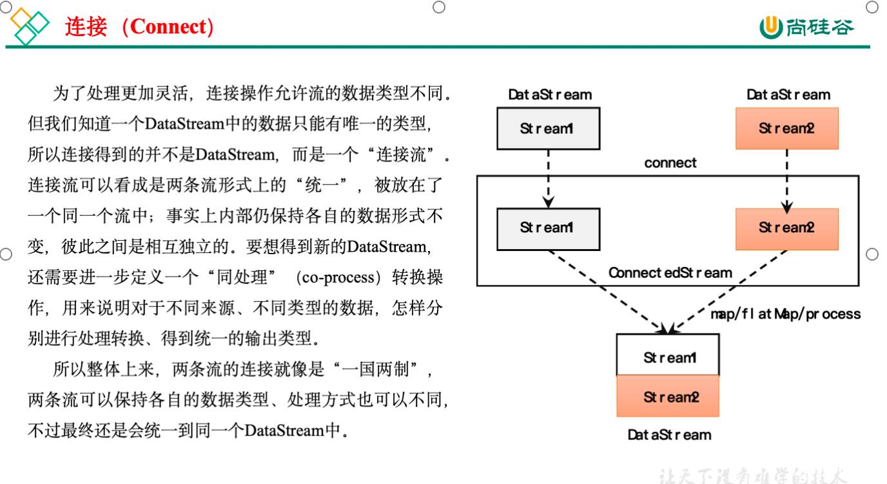

## 合流

### 联合（Union）

最简单的合流操作，就是直接将多条流合在一起，叫作流的“联合”（union）。联合操作要求必须流中的**数据类型必须相同**，合并之后的新流会包括所有流中的元素，数据类型不变。

```java
stream1.union(stream2).union(stream3);  
//参数可以是多个DataStream
stream1.union(stream2, stream3, ...);
```

注意：union()的参数可以是多个DataStream，所以联合操作可以实现多条流的合并。

```java
public class UnionExample {

    public static void main(String[] args) throws Exception {

        StreamExecutionEnvironment env = StreamExecutionEnvironment.getExecutionEnvironment();

        env.setParallelism(1);

        DataStreamSource<Integer> ds1 = env.fromElements(1, 2, 3);
        DataStreamSource<Integer> ds2 = env.fromElements(2, 2, 3);
        DataStreamSource<String> ds3 = env.fromElements("2", "2", "3");

        ds1.union(ds2,ds3.map(Integer::valueOf))
           .print();

        env.execute();
    }
}
```

### 连接（Connect）

流的联合虽然简单，不过受限于数据类型不能改变，灵活性大打折扣，所以实际应用较少出现。除了联合（union），Flink还提供了另外一种方便的合流操作——连接（connect）。

1. 连接流

   

   **代码实现：**需要分为两步：首先基于一条DataStream调用.connect()方法，传入另外一条DataStream作为参数，将两条流连接起来，得到一个ConnectedStreams；然后再调用同处理方法得到DataStream。这里可以的调用的同处理方法有.map()/.flatMap()，以及.process()方法。

   ```java
   public class ConnectDemo {
   
       public static void main(String[] args) throws Exception {
   
           StreamExecutionEnvironment env = StreamExecutionEnvironment.getExecutionEnvironment();
           env.setParallelism(1);
   
   //        DataStreamSource<Integer> source1 = env.fromElements(1, 2, 3);
   //        DataStreamSource<String> source2 = env.fromElements("a", "b", "c");
   
           SingleOutputStreamOperator<Integer> source1 = env
                   .socketTextStream("hadoop102", 7777)
                   .map(i -> Integer.parseInt(i));
   
           DataStreamSource<String> source2 = env.socketTextStream("hadoop102", 8888);
   
           /**
            * TODO 使用 connect 合流
            * 1、一次只能连接 2条流
            * 2、流的数据类型可以不一样
            * 3、 连接后可以调用 map、flatmap、process来处理，但是各处理各的
            */
           ConnectedStreams<Integer, String> connect = source1.connect(source2);
   
           SingleOutputStreamOperator<String> result = connect.map(new CoMapFunction<Integer, String, String>() {
               @Override
               public String map1(Integer value) throws Exception {
                   return "来源于数字流:" + value.toString();
               }
   
               @Override
               public String map2(String value) throws Exception {
                   return "来源于字母流:" + value;
               }
           });
   
           result.print();
   
           env.execute();    }
   }
   ```

   上面的代码中，ConnectedStreams有两个类型参数，分别表示内部包含的两条流各自的数据类型；由于需要“一国两制”，因此调用.map()方法时传入的不再是一个简单的MapFunction，而是一个**CoMapFunction**，表示分别对两条流中的数据执行map操作。这个接口有三个类型参数，依次表示第一条流、第二条流，以及合并后的流中的数据类型。需要实现的方法也非常直白：.**map1()就是对第一条流中数据的map操作，.map2()则是针对第二条流**。

2. CoProcessFunction

   与CoMapFunction类似，如果是调用.map()就需要传入一个CoMapFunction，需要实现map1()、map2()两个方法；而调用.process()时，传入的则是一个CoProcessFunction。它也是“处理函数”家族中的一员，用法非常相似。它需要实现的就是processElement1()、processElement2()两个方法，在每个数据到来时，会根据来源的流调用其中的一个方法进行处理。

   值得一提的是，ConnectedStreams也可以直接调用.keyBy()进行按键分区的操作，得到的还是一个ConnectedStreams：

   ```java
   connectedStreams.keyBy(keySelector1, keySelector2);
   ```

   这里传入两个参数keySelector1和keySelector2，是两条流中各自的键选择器；当然也可以直接传入键的位置值（keyPosition），或者键的字段名（field），这与普通的keyBy用法完全一致。ConnectedStreams进行keyBy操作，**其实就是把两条流中key相同的数据放到了一起**，然后针对来源的流再做各自处理，这在一些场景下非常有用。

   **案例需求：**连接两条流，输出能根据id匹配上的数据（类似inner join效果）

   ```java
   public class ConnectKeybyDemo {
       public static void main(String[] args) throws Exception {
           StreamExecutionEnvironment env = StreamExecutionEnvironment.getExecutionEnvironment();
           env.setParallelism(2);
   
           DataStreamSource<Tuple2<Integer, String>> source1 = env.fromElements(
                   Tuple2.of(1, "a1"),
                   Tuple2.of(1, "a2"),
                   Tuple2.of(2, "b"),
                   Tuple2.of(3, "c")
           );
           DataStreamSource<Tuple3<Integer, String, Integer>> source2 = env.fromElements(
                   Tuple3.of(1, "aa1", 1),
                   Tuple3.of(1, "aa2", 2),
                   Tuple3.of(2, "bb", 1),
                   Tuple3.of(3, "cc", 1)
           );
   
           ConnectedStreams<Tuple2<Integer, String>, Tuple3<Integer, String, Integer>> connect = source1.connect(source2);
   
           // 多并行度下，需要根据 关联条件 进行keyby，才能保证key相同的数据到一起去，才能匹配上
           ConnectedStreams<Tuple2<Integer, String>, Tuple3<Integer, String, Integer>> connectKey = connect.keyBy(s1 -> s1.f0, s2 -> s2.f0);
   
           SingleOutputStreamOperator<String> result = connectKey.process(
                   new CoProcessFunction<Tuple2<Integer, String>, Tuple3<Integer, String, Integer>, String>() {
                       // 定义 HashMap，缓存来过的数据，key=id，value=list<数据>
                       Map<Integer, List<Tuple2<Integer, String>>> s1Cache = new HashMap<>();
                       Map<Integer, List<Tuple3<Integer, String, Integer>>> s2Cache = new HashMap<>();
   
                       @Override
                       public void processElement1(Tuple2<Integer, String> value, Context ctx, Collector<String> out) throws Exception {
                           Integer id = value.f0;
                           // TODO 1.来过的s1数据，都存起来
                           if (!s1Cache.containsKey(id)) {
                               // 1.1 第一条数据，初始化 value的list，放入 hashmap
                               List<Tuple2<Integer, String>> s1Values = new ArrayList<>();
                               s1Values.add(value);
                               s1Cache.put(id, s1Values);
                           } else {
                               // 1.2 不是第一条，直接添加到 list中
                               s1Cache.get(id).add(value);
                           }
   
                           //TODO 2.根据id，查找s2的数据，只输出 匹配上 的数据
                           if (s2Cache.containsKey(id)) {
                               for (Tuple3<Integer, String, Integer> s2Element : s2Cache.get(id)) {
                                   out.collect("s1:" + value + "<--------->s2:" + s2Element);
                               }
                           }
                       }
   
                       @Override
                       public void processElement2(Tuple3<Integer, String, Integer> value, Context ctx, Collector<String> out) throws Exception {
                           Integer id = value.f0;
                           // TODO 1.来过的s2数据，都存起来
                           if (!s2Cache.containsKey(id)) {
                               // 1.1 第一条数据，初始化 value的list，放入 hashmap
                               List<Tuple3<Integer, String, Integer>> s2Values = new ArrayList<>();
                               s2Values.add(value);
                               s2Cache.put(id, s2Values);
                           } else {
                               // 1.2 不是第一条，直接添加到 list中
                               s2Cache.get(id).add(value);
                           }
   
                           //TODO 2.根据id，查找s1的数据，只输出 匹配上 的数据
                           if (s1Cache.containsKey(id)) {
                               for (Tuple2<Integer, String> s1Element : s1Cache.get(id)) {
                                   out.collect("s1:" + s1Element + "<--------->s2:" + value);
                               }
                           }
                       }
                   });
   
           result.print();
   
           env.execute();
       }
   }
   ```

   ### 思考：上述source1与source2关联的时候会不会产生重复数据？

   不会，每新关联起来的一对数据都是之前从未产生的，所以不会存在重复的关联数据。

   

   

