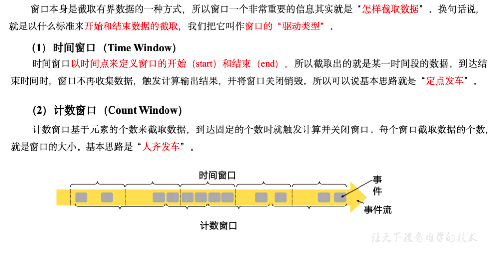
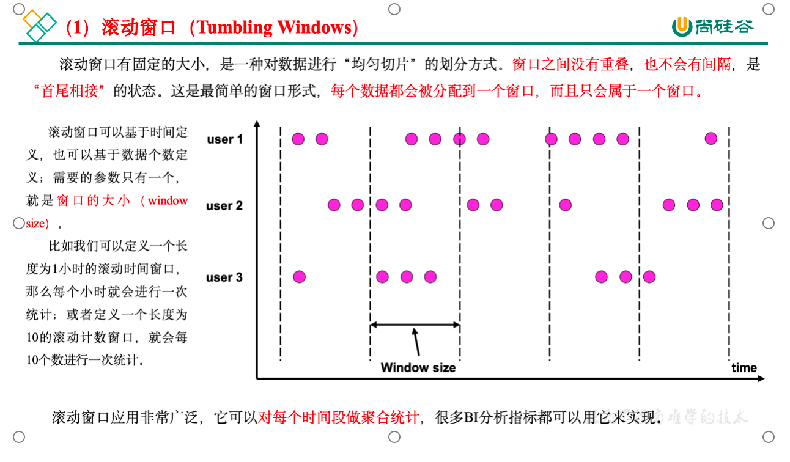
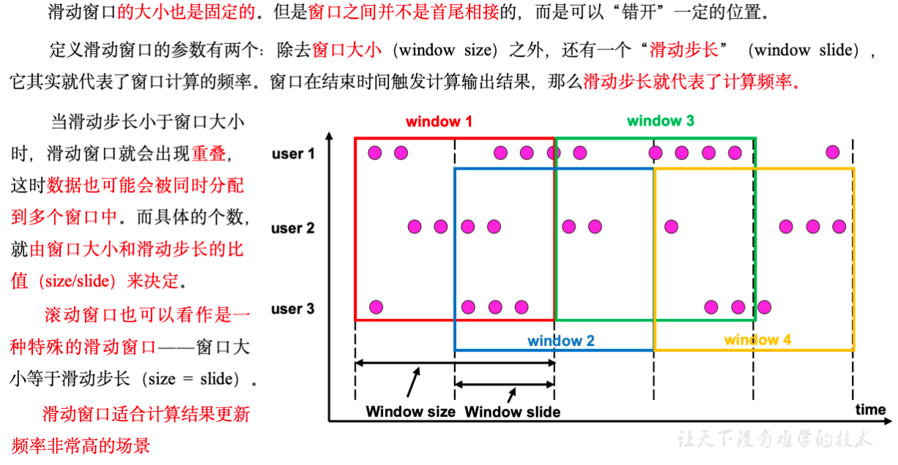
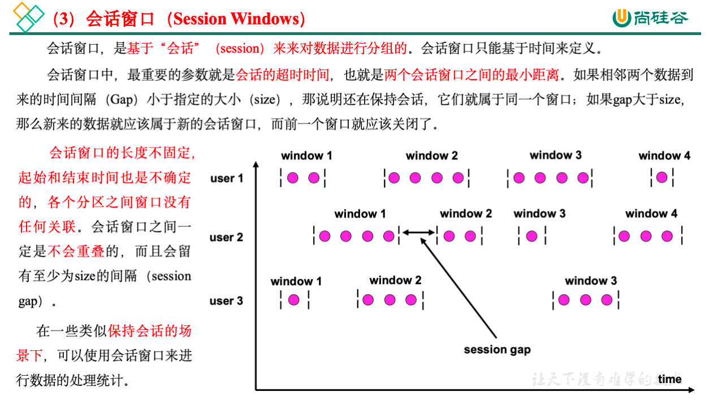
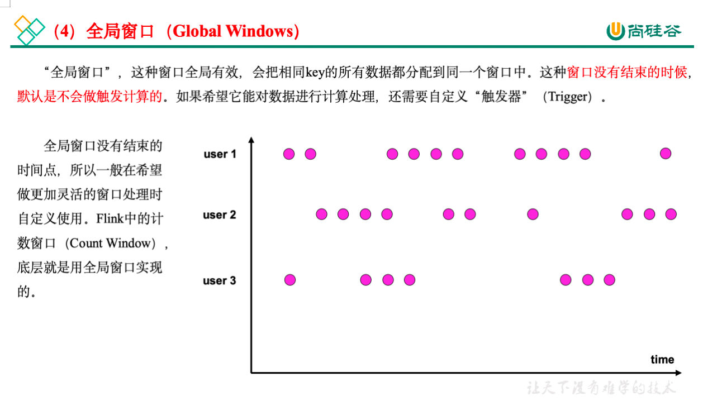

## 窗口

### 窗口分类

* 按照驱动类型分

  

* 按照窗口分配数据的规则分类

  根据分配数据的规则，窗口的具体实现可以分为4类：滚动窗口（Tumbling Window）、滑动窗口（Sliding Window）、会话窗口（Session Window），以及全局窗口（Global Window）。

  1. 滚动窗口

     

  2. 滑动窗口

     

  3. 会话窗口

     

  4. 全局窗口

     

### 按键分区（Keyed）和非按键分区（Non-Keyed）

* 按键分区窗口（Keyed Windows）

  ```java
  stream.keyBy(...).window(...)
  ```

* 非按键分区（Non-Keyed Windows）

  ```java
  stream.windowAll(...)
  ```

  如果没有进行keyBy，那么原始的DataStream就不会分成多条逻辑流。这时窗口逻辑只能在一个任务（task）上执行，就相当于并行度变成了1。

  注意：**对于非按键分区的窗口操作，手动调大窗口算子的并行度也是无效的**，windowAll本身就是一个非并行的操作。

### 窗口分配器

* 时间窗口

  1. 滚动处理时间窗口

     ```java
     stream.keyBy(...)
            .window(TumblingProcessingTimeWindows.of(Time.seconds(5)))
            .aggregate(...)
     ```

     这里.of()方法需要传入一个Time类型的参数size，表示滚动窗口的大小，我们这里创建了一个长度为5秒的滚动窗口。

     另外，.of()还有一个重载方法，可以传入两个Time类型的参数：size和offset。第一个参数当然还是窗口大小，第二个参数则表示窗口起始点的偏移量。

     > For example, if you want window a stream by hour,but window begins at the 15th minutes of each hour, you can use {@code of(Time.hours(1),Time.minutes(15))},then you will get time windows start at 0:15:00,1:15:00,2:15:00,etc.

     ```java
     stream.keyBy(...)
            .window(TumblingProcessingTimeWindows.of(Time.hours(1),Time.minutes(15)))
            .aggregate(...)
     ```

  2. 滑动处理时间窗口

     ```java
     stream.keyBy(...)
            .window(SlidingProcessingTimeWindows.of(Time.seconds(10)，Time.seconds(5)))
            .aggregate(...)
     ```

     这里.of()方法需要传入两个Time类型的参数：size和slide，前者表示滑动窗口的大小，后者表示滑动窗口的滑动步长。我们这里创建了一个长度为10秒、滑动步长为5秒的滑动窗口。

     滑动窗口同样可以追加第三个参数，用于指定窗口起始点的偏移量，用法与滚动窗口完全一致。

  3. 处理时间会话窗口

     ```java
     stream.keyBy(...)
            .window(ProcessingTimeSessionWindows.withGap(Time.seconds(10)))
            .aggregate(...)
     ```

     这里.withGap()方法需要传入一个Time类型的参数size，表示会话的超时时间，也就是最小间隔session gap。我们这里创建了静态会话超时时间为10秒的会话窗口。

     另外，还可以调用withDynamicGap()方法定义session gap的动态提取逻辑。

     ```java
     wsKS.window(ProcessingTimeSessionWindows.withDynamicGap(new SessionWindowTimeGapExtractor<WaterSensor>() {
         @Override
         public long extract(WaterSensor element) {
           	//默认单位是ms
             return element.getTs()*1000;
         }
     }))
     ```

* 计数窗口

  1. 滚动计数窗口

     ```java
     stream.keyBy(...)
            .countWindow(10)
     ```

     我们定义了一个长度为10的滚动计数窗口，当窗口中元素数量达到10的时候，就会触发计算执行并关闭窗口。

  2. 滑动计数窗口

     ```java
     stream.keyBy(...)
            .countWindow(10，3)
     ```

     我们定义了一个长度为10、滑动步长为3的滑动计数窗口。每个窗口统计10个数据，**每隔3个数据就统计输出一次结果(即以步长激活窗口，而不是窗口长度，统计最邻近的10个数)**。

  3. 计数窗口没有会话窗口

* 全局窗口

  ```java
  stream.keyBy(...)
         .window(GlobalWindows.create());
  ```

  需要注意使用全局窗口，必须自行定义触发器才能实现窗口计算，否则起不到任何作用。上面说的countWindow，底层就时由全局窗口实现的。

  ```java
  /**
       * Windows this {@code KeyedStream} into sliding count windows.
       *
       * @param size The size of the windows in number of elements.
       * @param slide The slide interval in number of elements.
       */
      public WindowedStream<T, KEY, GlobalWindow> countWindow(long size, long slide) {
          return window(GlobalWindows.create())
                  .evictor(CountEvictor.of(size))
                  .trigger(CountTrigger.of(slide));
      }
  ```

### 窗口函数

* 增量聚合函数（ReduceFunction / AggregateFunction）

  1. ReduceFunction

     ```java
     public static void main(String[] args) throws Exception {
     
             StreamExecutionEnvironment env = StreamExecutionEnvironment.getExecutionEnvironment();
             env.setParallelism(1);
             DataStreamSource<String> source = env.socketTextStream("localhost", 8888);
             SingleOutputStreamOperator<WaterSensor> mapDs = source.map(new WaterSensorMapFunction());
             KeyedStream<WaterSensor, String> wsKS = mapDs.keyBy(w -> w.getId());
             WindowedStream<WaterSensor, String, TimeWindow> wsWS = wsKS.window(TumblingProcessingTimeWindows.of(Time.seconds(10)));
             SingleOutputStreamOperator<WaterSensor> reduce = wsWS.reduce(new ReduceFunction<WaterSensor>() {
                 @Override
                 public WaterSensor reduce(WaterSensor value1, WaterSensor value2) throws Exception {
                   	//只有value1不触发（即当前窗口的第一条数据不触发）
                   	//同时有value1,value2时，来一条value2立刻触发一次
                     System.out.println("value1:"+value1+",value2:"+value2);
                     return new WaterSensor(value1.getId(), value2.getTs(), value1.getVc() + value2.getVc());
                 }
             });
       			//每10秒触发输出一次结果
             reduce.print();
             env.execute();
         }
     ```

  2. AggregateFunction

     AggregateFunction可以看作是ReduceFunction的通用版本，这里有三种类型：输入类型（IN）、累加器类型（ACC）和输出类型（OUT）。输入类型IN就是输入流中元素的数据类型；累加器类型ACC则是我们进行聚合的中间状态类型；而输出类型当然就是最终计算结果的类型了。

     接口中有四个方法：

     1. createAccumulator()：创建一个累加器，这就是为聚合创建了一个初始状态，每个聚合任务只会调用一次。
     2. add()：将输入的元素添加到累加器中。
     3. getResult()：从累加器中提取聚合的输出结果。
     4. merge()：合并两个累加器，并将合并后的状态作为一个累加器返回。

     所以可以看到，AggregateFunction的工作原理是：首先调用createAccumulator()为任务初始化一个状态（累加器）；而后每来一个数据就调用一次add()方法，对数据进行聚合，得到的结果保存在状态中；等到了窗口需要输出时，再调用getResult()方法得到计算结果。很明显，与ReduceFunction相同，AggregateFunction也是增量式的聚合；而由于输入、中间状态、输出的类型可以不同，使得应用更加灵活方便。

     ```java
     public static void main(String[] args) throws Exception {
     
             StreamExecutionEnvironment env = StreamExecutionEnvironment.getExecutionEnvironment();
             env.setParallelism(1);
             DataStreamSource<String> source = env.socketTextStream("localhost", 8888);
             SingleOutputStreamOperator<WaterSensor> mapDs = source.map(new WaterSensorMapFunction());
             KeyedStream<WaterSensor, String> wsKS = mapDs.keyBy(w -> w.getId());
             WindowedStream<WaterSensor, String, TimeWindow> wsWS = wsKS.window(TumblingProcessingTimeWindows.of(Time.seconds(15)));
             SingleOutputStreamOperator<String> aggregate = wsWS.aggregate(new AggregateFunction<WaterSensor, Integer, String>() {
                 @Override
                 public Integer createAccumulator() {
                     return 0;
                 }
     
                 @Override
                 public Integer add(WaterSensor value, Integer accumulator) {
                     System.out.println("value:"+value);
                     return accumulator+value.getVc();
                 }
     
                 @Override
                 public String getResult(Integer accumulator) {
                     return accumulator+"";
                 }
     
                 @Override
                 public Integer merge(Integer a, Integer b) {
                   	//只有会话窗口才会用到
                   	System.out.println("调用merge方法");
                     return null;
                 }
             });
             aggregate.print();
             env.execute();
         }
     ```

* 全窗口函数（full window functions）

  有些场景下，我们要做的计算必须基于全部的数据才有效，这时做增量聚合就没什么意义了；另外，输出的结果有可能要包含上下文中的一些信息（比如窗口的起始时间），这是增量聚合函数做不到的。

  所以，我们还需要有更丰富的窗口计算方式。窗口操作中的另一大类就是全窗口函数。与增量聚合函数不同，全窗口函数需要先收集窗口中的数据，并在内部缓存起来，等到窗口要输出结果的时候再取出数据进行计算。

  在Flink中，全窗口函数也有两种：WindowFunction和ProcessWindowFunction。

  1. 窗口函数（WindowFunction）

     WindowFunction字面上就是“窗口函数”，它其实是老版本的通用窗口函数接口。我们可以基于WindowedStream调用.apply()方法，传入一个WindowFunction的实现类。

     ```java
     stream
         .keyBy(<key selector>)
         .window(<window assigner>)
         .apply(new MyWindowFunction());
     ```

     这个类中可以获取到包含窗口所有数据的可迭代集合（Iterable），还可以拿到窗口（Window）本身的信息。

     不过WindowFunction能提供的上下文信息较少，也没有更高级的功能。**事实上，它的作用可以被ProcessWindowFunction全覆盖，所以之后可能会逐渐弃用**。

  2. 处理窗口函数（ProcessWindowFunction）

     ProcessWindowFunction是Window API中最底层的通用窗口函数接口。之所以说它“最底层”，是因为除了可以拿到窗口中的所有数据之外，ProcessWindowFunction还可以获取到一个“上下文对象”（Context）。这个上下文对象非常强大，不仅能够获取窗口信息，还可以访问当前的时间和状态信息。这里的时间就包括了处理时间（processing time）和事件时间水位线（event time watermark）。这就使得ProcessWindowFunction更加灵活、功能更加丰富，其实就是一个增强版的WindowFunction。

     事实上，ProcessWindowFunction是Flink底层API——处理函数（process function）中的一员，关于处理函数我们会在后续章节展开讲解。

     ```java
     public static void main(String[] args) throws Exception {
             StreamExecutionEnvironment env = StreamExecutionEnvironment.getExecutionEnvironment();
             env.setParallelism(1);
             DataStreamSource<String> source = env.socketTextStream("localhost", 8888);
             SingleOutputStreamOperator<WaterSensor> mapDs = source.map(new WaterSensorMapFunction());
             KeyedStream<WaterSensor, String> wsKS = mapDs.keyBy(w -> w.getId());
             WindowedStream<WaterSensor, String, TimeWindow> wsWS = wsKS.window(TumblingProcessingTimeWindows.of(Time.seconds(10)));
             SingleOutputStreamOperator<String> process = wsWS.process(new ProcessWindowFunction<WaterSensor, String, String, TimeWindow>() {
                 @Override
                 public void process(String key, Context context, Iterable<WaterSensor> elements, Collector<String> out) throws Exception {
                     long start = context.window().getStart();
                     long end = context.window().getEnd();
                     String startFormat = DateFormatUtils.format(start, "yyyy-MM-dd HH:mm:ss.SSS");
                     String endFormat = DateFormatUtils.format(end, "yyyy-MM-dd HH:mm:ss.SSS");
                     long count = elements.spliterator().estimateSize();
                     out.collect("key:" + key + ",start:" + startFormat + ",end:" + endFormat + ",count:" + count + "," + elements);
                 }
             });
             process.print();
             env.execute();
         }
     ```

* 增量聚合和全窗口函数的结合使用

  我们之前在调用WindowedStream的.reduce()和.aggregate()方法时，只是简单地直接传入了一个ReduceFunction或AggregateFunction进行增量聚合。除此之外，其实还可以传入第二个参数：一个全窗口函数，可以是WindowFunction或者ProcessWindowFunction。

  ```java
  // ReduceFunction与WindowFunction结合
  public <R> SingleOutputStreamOperator<R> reduce(
          ReduceFunction<T> reduceFunction，WindowFunction<T，R，K，W> function) 
  
  // ReduceFunction与ProcessWindowFunction结合
  public <R> SingleOutputStreamOperator<R> reduce(
          ReduceFunction<T> reduceFunction，ProcessWindowFunction<T，R，K，W> function)
  
  // AggregateFunction与WindowFunction结合
  public <ACC，V，R> SingleOutputStreamOperator<R> aggregate(
          AggregateFunction<T，ACC，V> aggFunction，WindowFunction<V，R，K，W> windowFunction)
  
  // AggregateFunction与ProcessWindowFunction结合
  public <ACC，V，R> SingleOutputStreamOperator<R> aggregate(
          AggregateFunction<T，ACC，V> aggFunction,
          ProcessWindowFunction<V，R，K，W> windowFunction)
  ```

  这样调用的处理机制是：基于第一个参数（增量聚合函数）来处理窗口数据，每来一个数据就做一次聚合；等到窗口需要触发计算时，则调用第二个参数（全窗口函数）的处理逻辑输出结果。需要注意的是，这里的全窗口函数就不再缓存所有数据了，而是直接将增量聚合函数的结果拿来当作了Iterable类型的输入。

  ```java
  public class AggAndProcessExample {
      public static void main(String[] args) throws Exception {
          StreamExecutionEnvironment env = StreamExecutionEnvironment.getExecutionEnvironment();
          env.setParallelism(1);
          DataStreamSource<String> source = env.socketTextStream("localhost", 8888);
          SingleOutputStreamOperator<WaterSensor> mapDs = source.map(new WaterSensorMapFunction());
          KeyedStream<WaterSensor, String> wsKS = mapDs.keyBy(w -> w.getId());
          WindowedStream<WaterSensor, String, TimeWindow> wsWS = wsKS.window(TumblingProcessingTimeWindows.of(Time.seconds(10)));
          SingleOutputStreamOperator<String> aggregate = wsWS.aggregate(
                  new MyAgg(),
                  new MyProcess()
          );
          aggregate.print();
          env.execute();
      }
  
      public static class MyAgg implements AggregateFunction<WaterSensor,Integer,String> {
          @Override
          public Integer createAccumulator() {
              return 0;
          }
  
          @Override
          public Integer add(WaterSensor value, Integer accumulator) {
              System.out.println("value:"+value);
              return accumulator+value.getVc();
          }
  
          @Override
          public String getResult(Integer accumulator) {
              return accumulator+"";
          }
  
          @Override
          public Integer merge(Integer a, Integer b) {
              return null;
          }
      }
  
      public static class MyProcess extends ProcessWindowFunction< ,String,String,TimeWindow> {
          @Override
          public void process(String key, Context context, Iterable<String> elements, Collector<String> out) throws Exception {
              long start = context.window().getStart();
              long end = context.window().getEnd();
              String startFormat = DateFormatUtils.format(start, "yyyy-MM-dd HH:mm:ss.SSS");
              String endFormat = DateFormatUtils.format(end, "yyyy-MM-dd HH:mm:ss.SSS");
              long count = elements.spliterator().estimateSize();
              out.collect("key:" + key + ",start:" + startFormat + ",end:" + endFormat + ",count:" + count + "," + elements);
          }
      }
  }
  ```

### 其他API

* 触发器（Trigger）

  ```java
  stream.keyBy(...)
         .window(...)
         .trigger(new MyTrigger())
  ```

  源码，帮助理解触发器的作用

  ```java
  public class ProcessingTimeTrigger extends Trigger<Object, TimeWindow> {
    @Override
      public TriggerResult onElement(
              Object element, long timestamp, TimeWindow window, TriggerContext ctx) {
        	//注册定时器
          ctx.registerProcessingTimeTimer(window.maxTimestamp());
          return TriggerResult.CONTINUE;
      }
    @Override
      public TriggerResult onProcessingTime(long time, TimeWindow window, TriggerContext ctx) {
        	//触发后续操作
          return TriggerResult.FIRE;
      }
  }
  ```

  ```java
  @Override
    public long maxTimestamp() {
      	// 窗口结束时间-1ms
        return end - 1;
    }
  ```

* 移除器（Evictor）

  ```java
  stream.keyBy(...)
         .window(...)
         .evictor(new MyEvictor())
  ```

### 其他

* 窗口什么时候触发？

  时间进展 >= 窗口的最大时间戳(end - 1ms)

* 窗口时怎么划分的？

  同下面一个问题

* 窗口的开始时间是怎么确定的?

  ```java
  //org.apache.flink.streaming.api.windowing.assigners.TumblingProcessingTimeWindows#assignWindows
  @Override
  public Collection<TimeWindow> assignWindows(
          Object element, long timestamp, WindowAssignerContext context) {
      final long now = context.getCurrentProcessingTime();
      if (staggerOffset == null) {
          staggerOffset =
                  windowStagger.getStaggerOffset(context.getCurrentProcessingTime(), size);
      }
    	// start:第一条数据到来的时间向下取整，取窗口长度的整数倍
    	// end:start+size(窗口长度)
    	// 窗口前开后闭，如：[0，10)，因为窗口的maxTimestamp=end-1ms
      long start =
              TimeWindow.getWindowStartWithOffset(
                      now, (globalOffset + staggerOffset) % size, size);
      return Collections.singletonList(new TimeWindow(start, start + size));
  }
  ```

  ```java
  //org.apache.flink.streaming.api.windowing.windows.TimeWindow#getWindowStartWithOffset
  public static long getWindowStartWithOffset(long timestamp, long offset, long windowSize) {
        final long remainder = (timestamp - offset) % windowSize;
        // handle both positive and negative cases
        if (remainder < 0) {
            return timestamp - (remainder + windowSize);
        } else {
            return timestamp - remainder;
        }
    }
  ```

* 窗口的生命周期

  创建:属于本窗口的第一条数据来的时候，现new的，放入一个singleton单例的集合中
  销毁(关窗):时间进展>= 窗口的最大时间戳(end - 1ms) +允许迟到的时间(默认0)