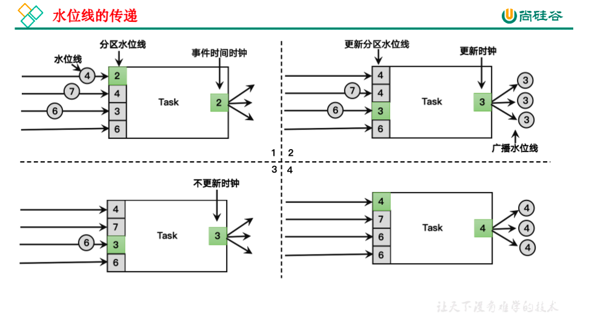
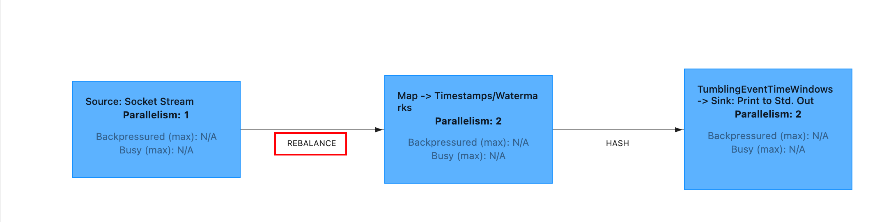
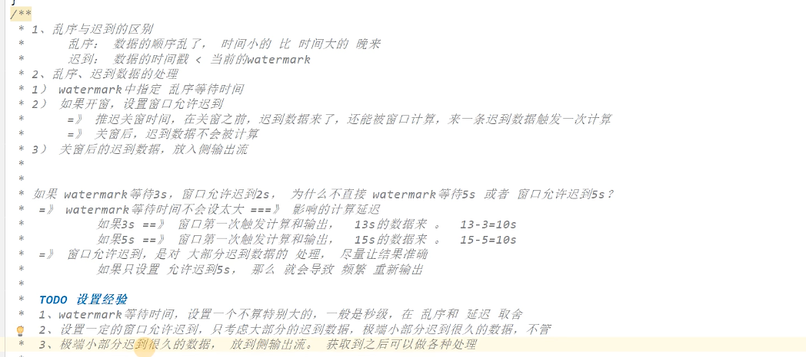

## 水位线

概念，暂未整理

### Flink内置水位线

1. 有序流中内置水位线设置

   对于有序流，主要特点就是时间戳单调增长，所以永远不会出现迟到数据的问题。这是周期性生成水位线的最简单的场景，直接调用WatermarkStrategy.forMonotonousTimestamps()方法就可以实现。

   ```java
   public static void main(String[] args) throws Exception {
       StreamExecutionEnvironment env = StreamExecutionEnvironment.getExecutionEnvironment();
       env.setParallelism(1);
       DataStreamSource<String> source = env.socketTextStream("localhost", 8888);
       SingleOutputStreamOperator<WaterSensor> mapDs = source.map(new WaterSensorMapFunction());
       WatermarkStrategy<WaterSensor> watermarkStrategy = WatermarkStrategy
         			// 指定watermark生成：升序的watermark，没有等待时间
               .<WaterSensor>forMonotonousTimestamps()
         			//指定 时间戳分配器，从数据中提取
               .withTimestampAssigner(
                       new SerializableTimestampAssigner<WaterSensor>() {
                           @Override
                           public long extractTimestamp(WaterSensor element, long recordTimestamp) {
                             	// todo recordTimestamp总是为负long的最小值-9223372036854775808，暂不知道recordTimestamp的作用
                               System.out.println(element + "," + recordTimestamp);
                             	//返回的时间戳，要 毫秒
                               return element.getTs() * 1000;
                           }
                       }
               );
     	//指定 watermark策略
       SingleOutputStreamOperator<WaterSensor> watermarks = mapDs.assignTimestampsAndWatermarks(watermarkStrategy);
       KeyedStream<WaterSensor, String> wsKS = watermarks.keyBy(w -> w.getId());
   		//  使用 事件时间语义 的窗口
       WindowedStream<WaterSensor, String, TimeWindow> window = wsKS.window(TumblingEventTimeWindows.of(Time.seconds(10)));
       SingleOutputStreamOperator<String> process = window.process(new ProcessWindowFunction<WaterSensor, String, String, TimeWindow>() {
           @Override
           public void process(String key, Context context, Iterable<WaterSensor> elements, Collector<String> out) throws Exception {
               long start = context.window().getStart();
               long end = context.window().getEnd();
               String startFormat = DateFormatUtils.format(start, "yyyy-MM-dd HH:mm:ss.SSS");
               String endFormat = DateFormatUtils.format(end, "yyyy-MM-dd HH:mm:ss.SSS");
               long count = elements.spliterator().estimateSize();
               out.collect("key:" + key + ",start:" + startFormat + ",end:" + endFormat + ",count:" + count + "," + elements);
           }
       });
       process.print();
       env.execute();
   }
   ```

2. 乱序流中内置水位线设置

   由于乱序流中需要等待迟到数据到齐，所以必须设置一个固定量的延迟时间。这时生成水位线的时间戳，就是当前数据流中最大的时间戳减去延迟的结果，相当于把表调慢，当前时钟会滞后于数据的最大时间戳。调用WatermarkStrategy. forBoundedOutOfOrderness()方法就可以实现。这个方法需要传入一个maxOutOfOrderness参数，表示“最大乱序程度”，它表示数据流中乱序数据时间戳的最大差值；如果我们能确定乱序程度，那么设置对应时间长度的延迟，就可以等到所有的乱序数据了。

   ```java
   public static void main(String[] args) throws Exception {
           StreamExecutionEnvironment env = StreamExecutionEnvironment.getExecutionEnvironment();
           env.setParallelism(1);
           DataStreamSource<String> source = env.socketTextStream("localhost", 8888);
           SingleOutputStreamOperator<WaterSensor> mapDs = source.map(new WaterSensorMapFunction());
           WatermarkStrategy<WaterSensor> watermarkStrategy = WatermarkStrategy
             			//设置最大乱序程度为3秒
                   .<WaterSensor>forBoundedOutOfOrderness(Duration.ofSeconds(3))
                   .withTimestampAssigner(
                           new SerializableTimestampAssigner<WaterSensor>() {
                               @Override
                               public long extractTimestamp(WaterSensor element, long recordTimestamp) {
                                   System.out.println(element + "," + recordTimestamp);
                                   return element.getTs() * 1000;
                               }
                           }
                   );
           SingleOutputStreamOperator<WaterSensor> watermarks = mapDs.assignTimestampsAndWatermarks(watermarkStrategy);
           KeyedStream<WaterSensor, String> wsKS = watermarks.keyBy(w -> w.getId());
           WindowedStream<WaterSensor, String, TimeWindow> window = wsKS.window(TumblingEventTimeWindows.of(Time.seconds(10)));
           SingleOutputStreamOperator<String> process = window.process(new ProcessWindowFunction<WaterSensor, String, String, TimeWindow>() {
               @Override
               public void process(String key, Context context, Iterable<WaterSensor> elements, Collector<String> out) throws Exception {
                   long start = context.window().getStart();
                   long end = context.window().getEnd();
                   String startFormat = DateFormatUtils.format(start, "yyyy-MM-dd HH:mm:ss.SSS");
                   String endFormat = DateFormatUtils.format(end, "yyyy-MM-dd HH:mm:ss.SSS");
                   long count = elements.spliterator().estimateSize();
                   out.collect("key:" + key + ",start:" + startFormat + ",end:" + endFormat + ",count:" + count + "," + elements);
               }
           });
           process.print();
           env.execute();
       }
   ```


### 自定义水位线生成器

* 周期性水位线生成器（Periodic Generator）

  ```java
  public static void main(String[] args) throws Exception {
      StreamExecutionEnvironment env = StreamExecutionEnvironment.getExecutionEnvironment();
      env.setParallelism(1);
      env.getConfig().setAutoWatermarkInterval(2000);
      DataStreamSource<String> source = env.socketTextStream("localhost", 8888);
      SingleOutputStreamOperator<WaterSensor> mapDs = source.map(new WaterSensorMapFunction());
      WatermarkStrategy<WaterSensor> watermarkStrategy = WatermarkStrategy
              .<WaterSensor>forGenerator(context -> new MyWatermarkGenerator<>(3000L))
              .withTimestampAssigner(new SerializableTimestampAssigner<WaterSensor>() {
                  @Override
                  public long extractTimestamp(WaterSensor element, long recordTimestamp) {
                      return element.getTs()*1000;
                  }
              });
  
      SingleOutputStreamOperator<WaterSensor> watermarks = mapDs.assignTimestampsAndWatermarks(watermarkStrategy);
      KeyedStream<WaterSensor, String> keyBy = watermarks.keyBy(w -> w.getId());
      WindowedStream<WaterSensor, String, TimeWindow> window = keyBy.window(TumblingEventTimeWindows.of(Time.seconds(10)));
      SingleOutputStreamOperator<String> process = window.process(new ProcessWindowFunction<WaterSensor, String, String, TimeWindow>() {
          @Override
          public void process(String key, Context context, Iterable<WaterSensor> elements, Collector<String> out) throws Exception {
              long start = context.window().getStart();
              long end = context.window().getEnd();
              String startFormat = DateFormatUtils.format(start, "yyyy-MM-dd HH:mm:ss.SSS");
              String endFormat = DateFormatUtils.format(end, "yyyy-MM-dd HH:mm:ss.SSS");
              long count = elements.spliterator().estimateSize();
              out.collect("key:" + key + ",start:" + startFormat + ",end:" + endFormat + ",count:" + count + "," + elements);
          }
      });
      process.print();
      env.execute();
  
  }
  ```
  
  ```java
  //自定义watermark生成器
  public class MyWatermarkGenerator<T> implements WatermarkGenerator<T> {
  
      Long delayTs;
  
      Long maxTs;
  
  
      public MyWatermarkGenerator(Long delayTs) {
          this.delayTs = delayTs;
          this.maxTs = Long.MIN_VALUE + this.delayTs + 1;
      }
  
      @Override
      public void onEvent(T event, long eventTimestamp, WatermarkOutput output) {
          System.out.println("调用onEvent方法，eventTimestamp="+eventTimestamp);
          maxTs = Math.max(maxTs, eventTimestamp);
      }
  
      @Override
      public void onPeriodicEmit(WatermarkOutput output) {
          System.out.println("调用onPeriodicEmit方法，watermark="+(maxTs -  delayTs - 1));
          output.emitWatermark(new Watermark(maxTs -  delayTs - 1));
      }
  }
  ```
  
  我们在onPeriodicEmit()里调用output.emitWatermark()，就可以发出水位线了；这个方法由系统框架周期性地调用，默认200ms一次。
  
  如果想修改默认周期时间，可以通过下面方法修改。例如：修改为400ms
  
  ```java
  env.getConfig().setAutoWatermarkInterval(400L);
  ```
  
* 断点式水位线生成器（Punctuated Generator）

  断点式生成器会不停地检测onEvent()中的事件，当发现带有水位线信息的事件时，就立即发出水位线。我们把发射水位线的逻辑写在onEvent方法当中即可。
  
* 在数据源中发送水位线

  我们也可以在自定义的数据源中抽取事件时间，然后发送水位线。这里要注意的是，在自定义数据源中发送了水位线以后，就不能再在程序中使用assignTimestampsAndWatermarks方法来生成水位线了。**在自定义数据源中生成水位线和在程序中使用assignTimestampsAndWatermarks方法生成水位线二者只能取其一。**示例程序如下：

  ```java
  env.fromSource(
  kafkaSource, WatermarkStrategy.forBoundedOutOfOrderness(Duration.ofSeconds(3)), "kafkasource"
  )
  ```

  ```java
  public static void main(String[] args) throws Exception {
          StreamExecutionEnvironment env = StreamExecutionEnvironment.getExecutionEnvironment();
          env.setParallelism(1);
  
          KafkaSource<String> kafkaSource = KafkaSource.<String>builder()
                  .setBootstrapServers("localhost:9092")
                  .setTopics("my-topic")
                  .setGroupId("yknife1")
                  .setStartingOffsets(OffsetsInitializer.earliest())
                  .setValueOnlyDeserializer(new SimpleStringSchema())
                  .build();
  				//在自定义数据源中生成水位线和在程序中使用assignTimestampsAndWatermarks方法生成水位线二者只能取其一
          DataStreamSource<String> stream = env.fromSource(kafkaSource, WatermarkStrategy.forBoundedOutOfOrderness(Duration.ofSeconds(3)), "kafka-source");
          SingleOutputStreamOperator<WaterSensor> map = stream.map(new WaterSensorMapFunction());
          SingleOutputStreamOperator<String> process = map.keyBy(w -> w.getId())
            			//kafka数据源这里只能使用处理时间语义
                  .window(TumblingProcessingTimeWindows.of(Time.seconds(10)))
                  .process(new ProcessWindowFunction<WaterSensor, String, String, TimeWindow>() {
                      @Override
                      public void process(String key, Context context, Iterable<WaterSensor> elements, Collector<String> out) throws Exception {
                          long start = context.window().getStart();
                          long end = context.window().getEnd();
                          String startFormat = DateFormatUtils.format(start, "yyyy-MM-dd HH:mm:ss.SSS");
                          String endFormat = DateFormatUtils.format(end, "yyyy-MM-dd HH:mm:ss.SSS");
                          long count = elements.spliterator().estimateSize();
                          out.collect("key:" + key + ",start:" + startFormat + ",end:" + endFormat + ",count:" + count + "," + elements);
                      }
                  });
          process.print();
          env.execute();
      }
  
  /*
  这行是topic历史数据，程序启动马上就输出了
  key:s1,start:2024-07-29 20:24:40.000,end:2024-07-29 20:24:50.000,count:3,[WaterSensor{id='s1', ts=1, vc=1}, WaterSensor{id='s1', ts=2, vc=2}, WaterSensor{id='s1', ts=3, vc=3}]
  这行以后是实时输入的结果
  key:s1,start:2024-07-29 20:25:40.000,end:2024-07-29 20:25:50.000,count:1,[WaterSensor{id='s1', ts=4, vc=4}]
  key:s1,start:2024-07-29 20:25:50.000,end:2024-07-29 20:26:00.000,count:2,[WaterSensor{id='s1', ts=5, vc=5}, WaterSensor{id='s1', ts=6, vc=6}]
  key:s1,start:2024-07-29 20:26:00.000,end:2024-07-29 20:26:10.000,count:1,[WaterSensor{id='s1', ts=7, vc=7}]
  */
  ```

### 水位线的传递



在流处理中，上游任务处理完水位线、时钟改变之后，要把当前的水位线再次发出，广播给所有的下游子任务。而当一个任务接收到多个上游并行任务传递来的水位线时，**应该以最小的那个作为当前任务的事件时钟**。

水位线在上下游任务之间的传递，非常巧妙地避免了分布式系统中没有统一时钟的问题，**每个任务都以“处理完之前所有数据”为标准来确定自己的时钟**。

```java
StreamExecutionEnvironment env = StreamExecutionEnvironment.createLocalEnvironmentWithWebUI(new Configuration());
        env.setParallelism(2);
        DataStreamSource<String> source = env.socketTextStream("localhost", 8888);
        SingleOutputStreamOperator<WaterSensor> mapDs = source.map(new WaterSensorMapFunction());
        WatermarkStrategy<WaterSensor> watermarkStrategy = WatermarkStrategy
                .<WaterSensor>forBoundedOutOfOrderness(Duration.ofSeconds(3))
                .withTimestampAssigner(
                        new SerializableTimestampAssigner<WaterSensor>() {
                            @Override
                            public long extractTimestamp(WaterSensor element, long recordTimestamp) {
                                System.out.println(element + "," + recordTimestamp);
                                return element.getTs() * 1000;
                            }
                        }
                )
          //设置空闲等待
         // .withIdleness(Duration.ofSeconds(10));
          ;
        SingleOutputStreamOperator<WaterSensor> watermarks = mapDs.assignTimestampsAndWatermarks(watermarkStrategy);
        KeyedStream<WaterSensor, String> wsKS = watermarks.keyBy(w -> w.getId());
        WindowedStream<WaterSensor, String, TimeWindow> window = wsKS.window(TumblingEventTimeWindows.of(Time.seconds(10)));
        SingleOutputStreamOperator<String> process = window.process(new ProcessWindowFunction<WaterSensor, String, String, TimeWindow>() {
            @Override
            public void process(String key, Context context, Iterable<WaterSensor> elements, Collector<String> out) throws Exception {
                long start = context.window().getStart();
                long end = context.window().getEnd();
                String startFormat = DateFormatUtils.format(start, "yyyy-MM-dd HH:mm:ss.SSS");
                String endFormat = DateFormatUtils.format(end, "yyyy-MM-dd HH:mm:ss.SSS");
                long count = elements.spliterator().estimateSize();
                out.collect("key:" + key + ",start:" + startFormat + ",end:" + endFormat + ",count:" + count + "," + elements);
            }
        });
        process.print();
        env.execute();
    }
/*
输入：
s1,1,1
s1,2,2
s1,13,13
s1,14,14
输出：
WaterSensor{id='s1', ts=1, vc=1},-9223372036854775808
WaterSensor{id='s1', ts=2, vc=2},-9223372036854775808
WaterSensor{id='s1', ts=13, vc=13},-9223372036854775808
WaterSensor{id='s1', ts=14, vc=14},-9223372036854775808
2> key:s1,start:1970-01-01 08:00:00.000,end:1970-01-01 08:00:10.000,count:2,[WaterSensor{id='s1', ts=1, vc=1}, WaterSensor{id='s1', ts=2, vc=2}]
解释：当全局并行度为1的时候，当s1,13,13这条数据后窗口就会关闭，但是当全局并行度为2，并没有。原因是，4条数据被轮询发给2个分区，当其中一个分区的水位线变更为10（13-3）的时候，另外一个分区的水位线才是-1（2-3），取较小的-1为整体的水位线，所以当输入“s1,13,13”时窗口还没有触发，当输入“s1,14,14”后窗口才被触发。
*/
```

在多个上游并行任务中，如果有其中一个没有数据，由于当前Task是以最小的那个作为当前任务的事件时钟，就会导致当前Task的水位线无法推进，就可能导致窗口无法触发。只有当两个分区的最小水位线都大于等于窗口最大时间戳，当前窗口才会被触发。



此时，另外一种触发窗口方式，设置空闲等待

```java
//TODO未详细验证,暂时效果是发现窗口会在输入“s1,13,13”后马上触发
WatermarkStrategy
      .<Integer>forMonotonousTimestamps()
      .withTimestampAssigner((r, ts) -> r * 1000L)
      .withIdleness(Duration.ofSeconds(5))  //空闲等待5s（理解应该是上游分区时间戳更新后的5s）
```

附录：尚硅谷例子（感觉不需要用这个例子已经可以说明，因为只要保证上游分区一段时间不发数据即可，不用伪造一个分区完全接受不了不到任何数据）

```java
public class WatermarkIdlenessDemo {
    public static void main(String[] args) throws Exception {
        StreamExecutionEnvironment env = StreamExecutionEnvironment.getExecutionEnvironment();

        env.setParallelism(2);


        // 自定义分区器：数据%分区数，只输入奇数，都只会去往map的一个子任务
        SingleOutputStreamOperator<Integer> socketDS = env
                .socketTextStream("hadoop102", 7777)
                .partitionCustom(new MyPartitioner(), r -> r)
                .map(r -> Integer.parseInt(r))
                .assignTimestampsAndWatermarks(
                        WatermarkStrategy
                                .<Integer>forMonotonousTimestamps()
                                .withTimestampAssigner((r, ts) -> r * 1000L)
                                .withIdleness(Duration.ofSeconds(5))  //空闲等待5s
                );


        // 分成两组： 奇数一组，偶数一组 ， 开10s的事件时间滚动窗口
        socketDS
                .keyBy(r -> r % 2)
                .window(TumblingEventTimeWindows.of(Time.seconds(10)))
                .process(new ProcessWindowFunction<Integer, String, Integer, TimeWindow>() {
                    @Override
                    public void process(Integer integer, Context context, Iterable<Integer> elements, Collector<String> out) throws Exception {
                        long startTs = context.window().getStart();
                        long endTs = context.window().getEnd();
                        String windowStart = DateFormatUtils.format(startTs, "yyyy-MM-dd HH:mm:ss.SSS");
                        String windowEnd = DateFormatUtils.format(endTs, "yyyy-MM-dd HH:mm:ss.SSS");

                        long count = elements.spliterator().estimateSize();

                        out.collect("key=" + integer + "的窗口[" + windowStart + "," + windowEnd + ")包含" + count + "条数据===>" + elements.toString());

                    }
                })
                .print();


        env.execute();
    }
}
```

### 迟到数据的处理

1. 推迟水印推进

   在水印产生时，设置一个乱序容忍度，推迟系统时间的推进，保证窗口计算被延迟执行，为乱序的数据争取更多的时间进入窗口。

   ```java
   WatermarkStrategy.forBoundedOutOfOrderness(Duration.ofSeconds(10));
   ```

2. 设置窗口延迟关闭

   Flink的窗口，也允许迟到数据。当触发了窗口计算后，会先计算当前的结果，但是此时并不会关闭窗口。

   以后每来一条迟到数据，就触发一次这条数据所在窗口计算(增量计算)。直到wartermark 超过了窗口结束时间+推迟时间，此时窗口会真正关闭。

   ```java
   .window(TumblingEventTimeWindows.of(Time.seconds(5)))
   .allowedLateness(Time.seconds(3))
   ```

   注意:

   允许迟到只能运用在event time上

3. 使用侧流接收迟到的数据

   ```java
   .windowAll(TumblingEventTimeWindows.of(Time.seconds(5)))
   .allowedLateness(Time.seconds(3))
   .sideOutputLateData(lateWS)
   ```

4. 完整案例代码

   ```java
   public static void main(String[] args) throws Exception {
       StreamExecutionEnvironment env = StreamExecutionEnvironment.createLocalEnvironmentWithWebUI(new Configuration());
       env.setParallelism(1);
       DataStreamSource<String> source = env.socketTextStream("localhost", 8888);
       SingleOutputStreamOperator<WaterSensor> mapDs = source.map(new WaterSensorMapFunction());
       WatermarkStrategy<WaterSensor> watermarkStrategy = WatermarkStrategy
         			//1.设置推迟水印推进.产生watermark时，设置推迟水印推进时间，即最大乱序时间
               .<WaterSensor>forBoundedOutOfOrderness(Duration.ofSeconds(3))
               .withTimestampAssigner(
                       new SerializableTimestampAssigner<WaterSensor>() {
                           @Override
                           public long extractTimestamp(WaterSensor element, long recordTimestamp) {
                               System.out.println(element + "," + recordTimestamp);
                               return element.getTs() * 1000;
                           }
                       }
               );
       SingleOutputStreamOperator<WaterSensor> watermarks = mapDs.assignTimestampsAndWatermarks(watermarkStrategy);
       KeyedStream<WaterSensor, String> wsKS = watermarks.keyBy(w -> w.getId());
       OutputTag<WaterSensor> outputTag = new OutputTag<>("late-data", Types.POJO(WaterSensor.class));
       WindowedStream<WaterSensor, String, TimeWindow> window = wsKS
               .window(TumblingEventTimeWindows.of(Time.seconds(10)))
         			//2.设置窗口延迟关闭.
               .allowedLateness(Time.seconds(2))
         			//3.使用侧流接收迟到的数据
               .sideOutputLateData(outputTag);
       SingleOutputStreamOperator<String> process = window.process(new ProcessWindowFunction<WaterSensor, String, String, TimeWindow>() {
           @Override
           public void process(String key, Context context, Iterable<WaterSensor> elements, Collector<String> out) throws Exception {
               long start = context.window().getStart();
               long end = context.window().getEnd();
               String startFormat = DateFormatUtils.format(start, "yyyy-MM-dd HH:mm:ss.SSS");
               String endFormat = DateFormatUtils.format(end, "yyyy-MM-dd HH:mm:ss.SSS");
               long count = elements.spliterator().estimateSize();
               out.collect("key:" + key + ",start:" + startFormat + ",end:" + endFormat + ",count:" + count + "," + elements);
           }
       });
       process.print();
     	//4.输出迟到数据
       process.getSideOutput(outputTag).printToErr("lateData");
       env.execute();
   }
   ```

5. 总结与思考

   
