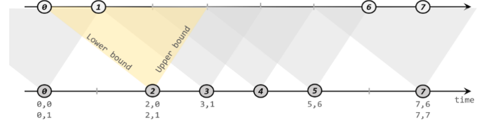

## 基于时间的合流

可以发现，根据某个key合并两条流，与关系型数据库中表的join操作非常相近。事实上，Flink中两条流的connect操作，就可以通过keyBy指定键进行分组后合并，实现了类似于SQL中的join操作；另外connect支持处理函数，可以使用自定义实现各种需求，其实已经能够处理双流join的大多数场景。

不过处理函数是底层接口，所以尽管connect能做的事情多，但在一些具体应用场景下还是显得太过抽象了。比如，如果我们希望统计固定时间内两条流数据的匹配情况，那就需要自定义来实现——其实这完全可以用窗口（window）来表示。为了更方便地实现基于时间的合流操作，Flink的DataStrema API提供了内置的join算子。

### 窗口联结

窗口联结在代码中的实现，首先需要调用DataStream的.join()方法来合并两条流，得到一个JoinedStreams；接着通过.where()和.equalTo()方法指定两条流中联结的key；然后通过.window()开窗口，并调用.apply()传入联结窗口函数进行处理计算。通用调用形式如下：

```java
stream1.join(stream2)
        .where(<KeySelector>)
        .equalTo(<KeySelector>)
        .window(<WindowAssigner>)
        .apply(<JoinFunction>)
```

上面代码中.where()的参数是键选择器（KeySelector），用来指定第一条流中的key；而.equalTo()传入的KeySelector则指定了第二条流中的key。两者相同的元素，如果在同一窗口中，就可以匹配起来，并通过一个“联结函数”（JoinFunction）进行处理了。

这里.window()传入的就是窗口分配器，之前讲到的三种时间窗口都可以用在这里：滚动窗口（tumbling window）、滑动窗口（sliding window）和会话窗口（session window）。

而后面调用.apply()可以看作实现了一个特殊的窗口函数。注意这里只能调用.apply()，没有其他替代的方法。

传入的JoinFunction也是一个函数类接口，使用时需要实现内部的.join()方法。这个方法有两个参数，分别表示两条流中成对匹配的数据。

其实仔细观察可以发现，窗口join的调用语法和我们熟悉的SQL中表的join非常相似：

```sql
SELECT * FROM table1 t1, table2 t2 WHERE t1.id = t2.id; 
```

这句SQL中where子句的表达，等价于inner join ... on，所以本身表示的是两张表基于id的“内连接”（inner join）。而Flink中的window join，同样类似于inner join。也就是说，最后处理输出的，只有两条流中数据按key配对成功的那些；如果某个窗口中一条流的数据没有任何另一条流的数据匹配，那么就不会调用JoinFunction的.join()方法，也就没有任何输出了。

```java
public static void main(String[] args) throws Exception {
        StreamExecutionEnvironment env = StreamExecutionEnvironment.getExecutionEnvironment();
        env.setParallelism(1);

        SingleOutputStreamOperator<Tuple2<String, Integer>> ds1 = env.fromElements(
                Tuple2.of("a", 1),
                Tuple2.of("a", 2),
                Tuple2.of("c", 3),
                Tuple2.of("d", 4)
        ).assignTimestampsAndWatermarks(
                WatermarkStrategy.<Tuple2<String, Integer>>forMonotonousTimestamps()
                        .withTimestampAssigner((t, ts) -> t.f1 * 1000L)
        );


        SingleOutputStreamOperator<Tuple3<String, Integer,Integer>> ds2 = env.fromElements(
                Tuple3.of("a", 1,1),
                Tuple3.of("a", 11,1),
                Tuple3.of("c", 6,1),
                Tuple3.of("d", 12,1)
        ).assignTimestampsAndWatermarks(
                WatermarkStrategy.<Tuple3<String, Integer,Integer>>forMonotonousTimestamps()
                        .withTimestampAssigner((t, ts) -> t.f1 * 1000L)
        );

        DataStream<String> join = ds1.join(ds2)
                .where(t -> t.f0)
                .equalTo(t -> t.f0)
                .window(TumblingEventTimeWindows.of(Time.seconds(10)))
                .apply(new JoinFunction<Tuple2<String, Integer>, Tuple3<String, Integer, Integer>, String>() {
                    @Override
                    public String join(Tuple2<String, Integer> first, Tuple3<String, Integer, Integer> second) throws Exception {
                        return first + "<-->" + second;
                    }
                });
        join.print();
        env.execute();
    }
/*
输出结果：
(a,1)<-->(a,1,1)
(a,2)<-->(a,1,1)
(c,3)<-->(c,6,1)
解析：只有id相同，且在同一个窗口中的数据会被关联
*/
```

### 间隔联结（Interval Join）

在有些场景下，我们要处理的时间间隔可能并不是固定的。这时显然不应该用滚动窗口或滑动窗口来处理——**因为匹配的两个数据有可能刚好“卡在”窗口边缘两侧，于是窗口内就都没有匹配了**；会话窗口虽然时间不固定，但也明显不适合这个场景。基于时间的窗口联结已经无能为力了。

为了应对这样的需求，Flink提供了一种叫作“间隔联结”（interval join）的合流操作。顾名思义，间隔联结的思路就是针对一条流的每个数据，开辟出其时间戳前后的一段时间间隔，看这期间是否有来自另一条流的数据匹配。

1. 间隔联结的原理

   间隔联结具体的定义方式是，我们给定两个时间点，分别叫作间隔的“上界”（upperBound）和“下界”（lowerBound）；于是对于一条流（不妨叫作A）中的任意一个数据元素a，就可以开辟一段时间间隔：[a.timestamp + lowerBound, a.timestamp + upperBound],即以a的时间戳为中心，下至下界点、上至上界点的一个闭区间：我们就把这段时间作为可以匹配另一条流数据的“窗口”范围。所以对于另一条流（不妨叫B）中的数据元素b，如果它的时间戳落在了这个区间范围内，a和b就可以成功配对，进而进行计算输出结果。所以匹配的条件为：

   a.timestamp + lowerBound <= b.timestamp <= a.timestamp + upperBound

   这里需要注意，做间隔联结的两条流A和B，也必须基于相同的key；下界lowerBound应该小于等于上界upperBound，两者都可正可负；间隔联结目前**只支持事件时间语义**。

   如下图所示，我们可以清楚地看到间隔联结的方式：

   

   下方的流A去间隔联结上方的流B，所以基于A的每个数据元素，都可以开辟一个间隔区间。我们这里设置下界为-2毫秒，上界为1毫秒。于是对于时间戳为2的A中元素，它的可匹配区间就是[0, 3],流B中有时间戳为0、1的两个元素落在这个范围内，所以就可以得到匹配数据对（2, 0）和（2, 1）。同样地，A中时间戳为3的元素，可匹配区间为[1, 4]，B中只有时间戳为1的一个数据可以匹配，于是得到匹配数据对（3, 1）。

   所以我们可以看到，间隔联结同样是一种内连接（inner join）。与窗口联结不同的是，interval join做匹配的时间段是基于流中数据的，所以并不确定；而且流B中的数据可以不只在一个区间内被匹配。

2. 间隔联结的调用

   间隔联结在代码中，是基于KeyedStream的联结（join）操作。DataStream在keyBy得到KeyedStream之后，可以调用.intervalJoin()来合并两条流，传入的参数同样是一个KeyedStream，两者的key类型应该一致；得到的是一个IntervalJoin类型。后续的操作同样是完全固定的：先通过.between()方法指定间隔的上下界，再调用.process()方法，定义对匹配数据对的处理操作。调用.process()需要传入一个处理函数，这是处理函数家族的最后一员：“处理联结函数”ProcessJoinFunction。

   通用调用形式如下：

   ```java
   stream1
       .keyBy(<KeySelector>)
       .intervalJoin(stream2.keyBy(<KeySelector>))
       .between(Time.milliseconds(-2), Time.milliseconds(1))
       .process (new ProcessJoinFunction<Integer, Integer, String(){
   
           @Override
           public void processElement(Integer left, Integer right, Context ctx, Collector<String> out) {
               out.collect(left + "," + right);
           }
       });
   ```

   可以看到，抽象类ProcessJoinFunction就像是ProcessFunction和JoinFunction的结合，内部同样有一个抽象方法.processElement()。与其他处理函数不同的是，它多了一个参数，这自然是因为有来自两条流的数据。参数中left指的就是第一条流中的数据，right则是第二条流中与它匹配的数据。每当检测到一组匹配，就会调用这里的.processElement()方法，经处理转换之后输出结果。

3. 代码

   1. 正常使用

      ```sql
      public static void main(String[] args) throws Exception {
              StreamExecutionEnvironment env = StreamExecutionEnvironment.getExecutionEnvironment();
              env.setParallelism(1);
      
              SingleOutputStreamOperator<Tuple2<String, Integer>> ds1 = env.fromElements(
                      Tuple2.of("a", 1),
                      Tuple2.of("a", 2),
                      Tuple2.of("c", 3),
                      Tuple2.of("d", 4)
              ).assignTimestampsAndWatermarks(
                      WatermarkStrategy.<Tuple2<String, Integer>>forMonotonousTimestamps()
                              .withTimestampAssigner((t, ts) -> t.f1 * 1000L)
              );
              KeyedStream<Tuple2<String, Integer>, String> ks1 = ds1.keyBy(t -> t.f0);
      
      
              SingleOutputStreamOperator<Tuple3<String, Integer,Integer>> ds2 = env.fromElements(
                      Tuple3.of("a", 1,1),
                      Tuple3.of("a", 11,1),
                      Tuple3.of("c", 6,1),
                      Tuple3.of("d", 12,1)
              ).assignTimestampsAndWatermarks(
                      WatermarkStrategy.<Tuple3<String, Integer,Integer>>forMonotonousTimestamps()
                              .withTimestampAssigner((t, ts) -> t.f1 * 1000L)
              );
              KeyedStream<Tuple3<String, Integer, Integer>, String> ks2 = ds2.keyBy(t -> t.f0);
              SingleOutputStreamOperator<String> process = ks1.intervalJoin(ks2)
                      .between(Time.seconds(-2), Time.seconds(2))
                      .process(new ProcessJoinFunction<Tuple2<String, Integer>, Tuple3<String, Integer, Integer>, String>() {
                          @Override
                          public void processElement(Tuple2<String, Integer> left, Tuple3<String, Integer, Integer> right, Context ctx, Collector<String> out) throws Exception {
                              out.collect(left + "<-->" + right);
                          }
                      });
              process.print();
              env.execute();
          }
      ```

   2. 处理迟到数据

      ```java
      public static void main(String[] args) throws Exception {
              StreamExecutionEnvironment env = StreamExecutionEnvironment.getExecutionEnvironment();
              env.setParallelism(1);
              KeyedStream<Tuple2<String, Integer>, String> ks1 = env.socketTextStream("localhost", 7777)
                      .map(new MapFunction<String, Tuple2<String, Integer>>() {
                          @Override
                          public Tuple2<String, Integer> map(String value) throws Exception {
                              String[] split = value.split(",");
                              return Tuple2.of(split[0], Integer.valueOf(split[1]) );
                          }
                      })
                      .assignTimestampsAndWatermarks(
                              WatermarkStrategy.<Tuple2<String, Integer>>forBoundedOutOfOrderness(Duration.ofSeconds(3))
                                      .withTimestampAssigner((t, ts) -> t.f1 * 1000L)
                      ).keyBy(t -> t.f0);
      
              KeyedStream<Tuple3<String, Integer,Integer>, String> ks2 = env.socketTextStream("localhost", 8888)
                      .map(new MapFunction<String, Tuple3<String, Integer,Integer>>() {
                          @Override
                          public Tuple3<String, Integer,Integer> map(String value) throws Exception {
                              String[] split = value.split(",");
                              return Tuple3.of(split[0], Integer.valueOf(split[1]) ,Integer.valueOf(split[2]));
                          }
                      })
                      .assignTimestampsAndWatermarks(
                              WatermarkStrategy.<Tuple3<String, Integer, Integer>>forBoundedOutOfOrderness(Duration.ofSeconds(3))
                                      .withTimestampAssigner((t, ts) -> t.f1 * 1000L)
                      ).keyBy(t -> t.f0);
              OutputTag<Tuple2<String, Integer>> ks1Tag = new OutputTag<>("ks1-late", Types.TUPLE(Types.STRING, Types.INT));
              OutputTag<Tuple3<String, Integer,Integer>> ks2Tag = new OutputTag<>("ks2-late", Types.TUPLE(Types.STRING, Types.INT,Types.INT));
      /**
               * TODO Interval join
               * 1、只支持事件时间
               * 2、指定上界、下界的偏移，负号代表时间往前，正号代表时间往后
               * 3、process中，只能处理 join上的数据
               * 4、两条流关联后的watermark，以两条流中最小的为准
               * 5、如果 当前数据的事件时间 < 当前的watermark，就是迟到数据， 主流的process不处理
               *  => between后，可以指定将 左流 或 右流 的迟到数据 放入侧输出流
               */
              SingleOutputStreamOperator<String> process = ks1.intervalJoin(ks2)
                      .between(Time.seconds(-2), Time.seconds(2))
                      .sideOutputLeftLateData(ks1Tag)
                      .sideOutputRightLateData(ks2Tag)
                      .process(new ProcessJoinFunction<Tuple2<String, Integer>, Tuple3<String, Integer, Integer>, String>() {
                          @Override
                          public void processElement(Tuple2<String, Integer> left, Tuple3<String, Integer, Integer> right, Context ctx, Collector<String> out) throws Exception {
                              out.collect(left + "<-->" + right);
                          }
                      });
              process.print();
              process.getSideOutput(ks1Tag).printToErr("ks1的迟到数据");
              process.getSideOutput(ks2Tag).printToErr("ks2的迟到数据");
              env.execute();
          }
      ```

      