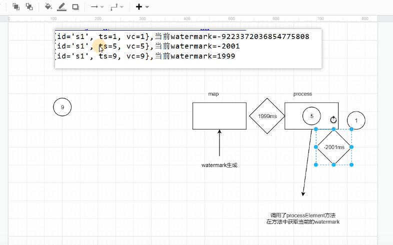

## 处理函数

### 处理函数分类

我们知道，DataStream在调用一些转换方法之后，有可能生成新的流类型；例如调用.keyBy()之后得到KeyedStream，进而再调用.window()之后得到WindowedStream。对于不同类型的流，其实都可以直接调用.process()方法进行自定义处理，这时传入的参数就都叫作处理函数。当然，它们尽管本质相同，都是可以访问状态和时间信息的底层API，可彼此之间也会有所差异。

Flink提供了8个不同的处理函数：

1. ProcessFunction

   最基本的处理函数，基于DataStream直接调用.process()时作为参数传入。

2. KeyedProcessFunction

   对流按键分区后的处理函数，基于KeyedStream调用.process()时作为参数传入。要想使用定时器，比如基于KeyedStream。

3. ProcessWindowFunction

   开窗之后的处理函数，也是全窗口函数的代表。基于WindowedStream调用.process()时作为参数传入。

4. ProcessAllWindowFunction

   同样是开窗之后的处理函数，基于AllWindowedStream调用.process()时作为参数传入。

5. CoProcessFunction

   合并（connect）两条流之后的处理函数，基于ConnectedStreams调用.process()时作为参数传入。关于流的连接合并操作，我们会在后续章节详细介绍。

6. ProcessJoinFunction

   间隔连接（interval join）两条流之后的处理函数，基于IntervalJoined调用.process()时作为参数传入。

7. BroadcastProcessFunction

   广播连接流处理函数，基于BroadcastConnectedStream调用.process()时作为参数传入。这里的“广播连接流”BroadcastConnectedStream，是一个未keyBy的普通DataStream与一个广播流（BroadcastStream）做连接（conncet）之后的产物。关于广播流的相关操作，我们会在后续章节详细介绍。

8. KeyedBroadcastProcessFunction

   按键分区的广播连接流处理函数，同样是基于BroadcastConnectedStream调用.process()时作为参数传入。与BroadcastProcessFunction不同的是，这时的广播连接流，是一个KeyedStream与广播流（BroadcastStream）做连接之后的产物。

### 基本处理函数（ProcessFunction）

* 处理函数的功能和使用

  我们之前学习的转换算子，一般只是针对某种具体操作来定义的，能够拿到的信息比较有限。如果我们想要访问事件的时间戳，或者当前的水位线信息，都是完全做不到的。跟时间相关的操作，目前我们只会用窗口来处理。而在很多应用需求中，要求我们对时间有更精细的控制，需要能够获取水位线，甚至要“把控时间”、定义什么时候做什么事，这就不是基本的时间窗口能够实现的了。

  这时就需要使用底层的处理函数。处理函数提供了一个“定时服务”（TimerService），我们可以通过它访问流中的事件（event）、时间戳（timestamp）、水位线（watermark），甚至可以注册“定时事件”。而且处理函数继承了AbstractRichFunction抽象类，所以拥有富函数类的所有特性，同样可以访问状态（state）和其他运行时信息。此外，处理函数还可以直接将数据输出到侧输出流（side output）中。所以，处理函数是最为灵活的处理方法，可以实现各种自定义的业务逻辑。

  处理函数的使用与基本的转换操作类似，只需要直接基于DataStream调用.process()方法就可以了。方法需要传入一个ProcessFunction作为参数，用来定义处理逻辑。

  ```java
  stream.process(new MyProcessFunction())
  ```

  这里ProcessFunction不是接口，而是一个抽象类，继承了AbstractRichFunction；MyProcessFunction是它的一个具体实现。所以所有的处理函数，都是富函数（RichFunction），富函数可以调用的东西这里同样都可以调用。

* ProcessFunction解析

  在源码中我们可以看到，抽象类ProcessFunction继承了AbstractRichFunction，有两个泛型类型参数：I表示Input，也就是输入的数据类型；O表示Output，也就是处理完成之后输出的数据类型。

  内部单独定义了两个方法：一个是必须要实现的抽象方法.processElement()；另一个是非抽象方法.onTimer()。

  ```java
  public abstract class ProcessFunction<I, O> extends AbstractRichFunction {
  
      ...
      public abstract void processElement(I value, Context ctx, Collector<O> out) throws Exception;
  
      public void onTimer(long timestamp, OnTimerContext ctx, Collector<O> out) throws Exception {}
      ...
  
  }
  ```

  1. 抽象方法.processElement()

     用于“处理元素”，定义了处理的核心逻辑。这个方法对于流中的每个元素都会调用一次，参数包括三个：输入数据值value，上下文ctx，以及“收集器”（Collector）out。方法没有返回值，处理之后的输出数据是通过收集器out来定义的。

     * value：当前流中的输入元素，也就是正在处理的数据，类型与流中数据类型一致。
     * ctx：类型是ProcessFunction中定义的内部抽象类Context，表示当前运行的上下文，可以获取到当前的时间戳，并提供了用于查询时间和注册定时器的“定时服务”（TimerService），以及可以将数据发送到“侧输出流”（side output）的方法.output()。
     * out：“收集器”（类型为Collector），用于返回输出数据。使用方式与flatMap算子中的收集器完全一样，直接调用out.collect()方法就可以向下游发出一个数据。这个方法可以多次调用，也可以不调用。

     通过几个参数的分析不难发现，ProcessFunction可以轻松实现flatMap、map、filter这样的基本转换功能；而通过富函数提供的获取上下文方法.getRuntimeContext()，也可以自定义状态（state）进行处理，这也就能实现聚合操作的功能了。

  2. 非抽象方法.onTimer()

     这个方法只有在注册好的定时器触发的时候才会调用，而定时器是通过“定时服务”TimerService来注册的。打个比方，注册定时器（timer）就是设了一个闹钟，到了设定时间就会响；而.onTimer()中定义的，就是闹钟响的时候要做的事。所以它本质上是一个基于时间的“回调”（callback）方法，通过时间的进展来触发；在事件时间语义下就是由水位线（watermark）来触发了。

     定时方法.onTimer()也有三个参数：时间戳（timestamp），上下文（ctx），以及收集器（out）。这里的timestamp是指设定好的触发时间，事件时间语义下当然就是水位线了。另外这里同样有上下文和收集器，所以也可以调用定时服务（TimerService），以及任意输出处理之后的数据。

     既然有.onTimer()方法做定时触发，我们用ProcessFunction也可以自定义数据按照时间分组、定时触发计算输出结果；这其实就实现了窗口（window）的功能。所以说ProcessFunction其实可以实现一切功能。

     注意：在Flink中，只有“按键分区流”KeyedStream才支持设置定时器的操作。

  

### 按键分区处理函数（KeyedProcessFunction）

1. 定时器（Timer）和定时服务（TimerService）

   在.onTimer()方法中可以实现定时处理的逻辑，而它能触发的前提，就是之前曾经注册过定时器、并且现在已经到了触发时间。注册定时器的功能，是通过上下文中提供的“定时服务”来实现的。

   定时服务与当前运行的环境有关。前面已经介绍过，ProcessFunction的上下文（Context）中提供了.timerService()方法，可以直接返回一个TimerService对象。TimerService是Flink关于时间和定时器的基础服务接口，包含以下六个方法：

   ```java
   // 获取当前的处理时间
   long currentProcessingTime();
   
   // 获取当前的水位线（事件时间）
   long currentWatermark();
   
   // 注册处理时间定时器，当处理时间超过time时触发
   void registerProcessingTimeTimer(long time);
   
   // 注册事件时间定时器，当水位线超过time时触发
   void registerEventTimeTimer(long time);
   
   // 删除触发时间为time的处理时间定时器
   void deleteProcessingTimeTimer(long time);
   
   // 删除触发时间为time的处理时间定时器
   void deleteEventTimeTimer(long time);
   ```

   六个方法可以分成两大类：基于处理时间和基于事件时间。而对应的操作主要有三个：获取当前时间，注册定时器，以及删除定时器。需要注意，尽管处理函数中都可以直接访问TimerService，不过只有基于KeyedStream的处理函数，才能去调用注册和删除定时器的方法；未作按键分区的DataStream不支持定时器操作，只能获取当前时间。

   **TimerService会以键（key）和时间戳为标准，对定时器进行去重**；也就是说对于每个key和时间戳，最多只有一个定时器，如果注册了多次，onTimer()方法也将只被调用一次。

2. KeyedProcessFunction案例

   基于keyBy之后的KeyedStream，直接调用.process()方法，这时需要传入的参数就是KeyedProcessFunction的实现类。

   ```java
   stream.keyBy( t -> t.f0 )
          .process(new MyKeyedProcessFunction())
   ```

   类似地，KeyedProcessFunction也是继承自AbstractRichFunction的一个抽象类，与ProcessFunction的定义几乎完全一样，区别只是在于类型参数多了一个K，这是当前按键分区的key的类型。同样地，我们必须实现一个.processElement()抽象方法，用来处理流中的每一个数据；另外还有一个非抽象方法.onTimer()，用来定义定时器触发时的回调操作。

   ```java
   public class KeyedProcessTimerDemo {
       public static void main(String[] args) throws Exception {
           StreamExecutionEnvironment env = StreamExecutionEnvironment.getExecutionEnvironment();
           env.setParallelism(1);
   
   
           SingleOutputStreamOperator<WaterSensor> sensorDS = env
                   .socketTextStream("hadoop102", 7777)
                   .map(new WaterSensorMapFunction())
                   .assignTimestampsAndWatermarks(
                           WatermarkStrategy
                                   .<WaterSensor>forBoundedOutOfOrderness(Duration.ofSeconds(3))
                                   .withTimestampAssigner((element, ts) -> element.getTs() * 1000L)
                   );
   
   
           KeyedStream<WaterSensor, String> sensorKS = sensorDS.keyBy(sensor -> sensor.getId());
   
           // TODO Process:keyed
           SingleOutputStreamOperator<String> process = sensorKS.process(
                   new KeyedProcessFunction<String, WaterSensor, String>() {
                       /**
                        * 来一条数据调用一次
                        * @param value
                        * @param ctx
                        * @param out
                        * @throws Exception
                        */
                       @Override
                       public void processElement(WaterSensor value, Context ctx, Collector<String> out) throws Exception {
                           //获取当前数据的key
                           String currentKey = ctx.getCurrentKey();
   
                           // TODO 1.定时器注册
                           TimerService timerService = ctx.timerService();
   
                           // 1、事件时间的案例
                           Long currentEventTime = ctx.timestamp(); // 数据中提取出来的事件时间
                           timerService.registerEventTimeTimer(5000L);
                           System.out.println("当前key=" + currentKey + ",当前时间=" + currentEventTime + ",注册了一个5s的定时器");
   
                           // 2、处理时间的案例
   //                        long currentTs = timerService.currentProcessingTime();
   //                        timerService.registerProcessingTimeTimer(currentTs + 5000L);
   //                        System.out.println("当前key=" + currentKey + ",当前时间=" + currentTs + ",注册了一个5s后的定时器");
   
   
                           // 3、获取 process的 当前watermark
   //                        long currentWatermark = timerService.currentWatermark();
   //                        System.out.println("当前数据=" + value + ",当前watermark=" + currentWatermark);
   
   
                           
                           // 注册定时器： 处理时间、事件时间
   //                        timerService.registerProcessingTimeTimer();
   //                        timerService.registerEventTimeTimer();
                           // 删除定时器： 处理时间、事件时间
   //                        timerService.deleteEventTimeTimer();
   //                        timerService.deleteProcessingTimeTimer();
   
                           // 获取当前时间进展： 处理时间-当前系统时间，  事件时间-当前watermark
   //                        long currentTs = timerService.currentProcessingTime();
   //                        long wm = timerService.currentWatermark();
                       }
   
   
                       /**
                        * TODO 2.时间进展到定时器注册的时间，调用该方法
                        * @param timestamp 当前时间进展，就是定时器被触发时的时间
                        * @param ctx       上下文
                        * @param out       采集器
                        * @throws Exception
                        */
                       @Override
                       public void onTimer(long timestamp, OnTimerContext ctx, Collector<String> out) throws Exception {
                           super.onTimer(timestamp, ctx, out);
                           String currentKey = ctx.getCurrentKey();
   
                           System.out.println("key=" + currentKey + "现在时间是" + timestamp + "定时器触发");
                       }
                   }
           );
   
           process.print();
   
           env.execute();
       }
   }
   ```

   案例总结：

   1. 定时器触发时间。不像窗口触发时间，当设置定时器后，比如，5秒的定时器，当时间时间推移到5秒时，watermark只到4999ms，定时器需要真正5秒到达才触发，比如，事件事件到达6秒

   2. 定时器排重。定时器根据key+时间戳排重。

   3. watermark推移是整个节点全局的。比如，每个key都注册了5秒的定时器，那么在5秒到来时，所有key的定时器的都会一起触发，而不会因为数据的影响。

   4. 获取事件时间和处理时间的区别：

      * 事件时间：ctx.timestamp(); 
      * 处理时间：timerService.currentProcessingTime();

   5. 事件时间和处理时间注册时的区别：

      * 事件时间：timerService.registerEventTimeTimer(5000L);
      * 处理时间：timerService.registerProcessingTimeTimer(currentTs + 5000L);

   6. 获取onTimer中的时间戳。与获取、注册时间不同，在onTimer中获取timestamp的方法是一致的，使用参数中timestamp即可。

   7. watermark的滞后性。timerService中获取watermark总是滞后的，为上一条数据的事件时间-1ms，因为process方法一次只处理一条数据，watermark为特殊的一条数据，当处理当前数据时，watermark还没有进入process方法。

      


### 窗口处理函数

### 案例

案例需求：实时统计一段时间内的出现次数最多的水位。例如，统计最近10秒钟内出现次数最多的两个水位，并且每5秒钟更新一次。我们知道，这可以用一个滑动窗口来实现。于是就需要开滑动窗口收集传感器的数据，按照不同的水位进行统计，而后汇总排序并最终输出前两名。这其实就是著名的“Top N”问题。

* 使用ProcessAllWindowFunction

  思路一：一种最简单的想法是，我们干脆不区分不同水位，而是将所有访问数据都收集起来，统一进行统计计算。所以可以不做keyBy，直接基于DataStream开窗，然后使用全窗口函数ProcessAllWindowFunction来进行处理。
  在窗口中可以用一个HashMap来保存每个水位的出现次数，只要遍历窗口中的所有数据，自然就能得到所有水位的出现次数。最后把HashMap转成一个列表ArrayList，然后进行排序、取出前两名输出就可以了。

  ```java
  public static void main(String[] args) throws Exception {
          StreamExecutionEnvironment env = StreamExecutionEnvironment.getExecutionEnvironment();
          env.setParallelism(1);
          DataStreamSource<String> source = env.socketTextStream("localhost", 8888);
          SingleOutputStreamOperator<WaterSensor> mapDs = source.map(new WaterSensorMapFunction());
          WatermarkStrategy<WaterSensor> watermarkStrategy = WatermarkStrategy
                  .<WaterSensor>forBoundedOutOfOrderness(Duration.ofSeconds(3))
                  .withTimestampAssigner(
                          new SerializableTimestampAssigner<WaterSensor>() {
                              @Override
                              public long extractTimestamp(WaterSensor element, long recordTimestamp) {
  //                                System.out.println(element + "," + recordTimestamp);
                                  return element.getTs() * 1000;
                              }
                          }
                  );
          SingleOutputStreamOperator<String> process = mapDs.assignTimestampsAndWatermarks(watermarkStrategy)
                  .windowAll(SlidingEventTimeWindows.of(Time.seconds(10), Time.seconds(5)))
                  .process(new ProcessAllWindowFunction<WaterSensor, String, TimeWindow>() {
                      @Override
                      public void process(Context context, Iterable<WaterSensor> elements, Collector<String> out) throws Exception {
                          Map<Integer,Integer> result = new HashMap<>();
                          Iterator<WaterSensor> iterator = elements.iterator();
                          //根据vc进行累加
                          while (iterator.hasNext()){
                              WaterSensor next = iterator.next();
                              Integer vc = next.getVc();
                              Integer orDefault = result.getOrDefault(vc, 0);
                              result.put(vc,++orDefault);
                          }
                          //排序vc的count
                          List<Tuple2<Integer, Integer>> list = result.entrySet().stream()
                                  .map(en -> Tuple2.of(en.getKey(), en.getValue()))
                                  .sorted(new Comparator<Tuple2<Integer, Integer>>() {
                                      @Override
                                      public int compare(Tuple2<Integer, Integer> o1, Tuple2<Integer, Integer> o2) {
                                          return o2.f1.compareTo(o1.f1);
                                      }
                                  }).collect(Collectors.toList());
                          StringBuilder builder = new StringBuilder();
                          //只输出top2
                          for (int i = 0; i < Math.min(2,list.size()); i++) {
                              Tuple2<Integer, Integer> tuple2 = list.get(i);
                              builder.append(tuple2+"\n");
                          }
                          builder.append("======\n");
                          out.collect(builder.toString());
                      }
                  });
          process.print();
          env.execute();
      }
  ```

* 使用KeyedProcessFunction

  思路二：在上一小节的实现过程中，我们没有进行按键分区，直接将所有数据放在一个分区上进行了开窗操作。这相当于将并行度强行设置为1，在实际应用中是要尽量避免的，所以Flink官方也并不推荐使用AllWindowedStream进行处理。另外，我们在全窗口函数中定义了HashMap来统计vc的出现次数，计算过程是要先收集齐所有数据、然后再逐一遍历更新HashMap，这显然不够高效。
  基于这样的想法，我们可以从两个方面去做优化：一是对数据进行按键分区，分别统计vc的出现次数；二是进行增量聚合，得到结果最后再做排序输出。所以，我们可以使用增量聚合函数AggregateFunction进行浏览量的统计，然后结合ProcessWindowFunction排序输出来实现Top N的需求。
  具体实现可以分成两步：先对每个vc统计出现次数，然后再将统计结果收集起来，排序输出最终结果。由于最后的排序还是基于每个时间窗口的，输出的统计结果中要包含窗口信息，我们可以输出包含了vc、出现次数（count）以及窗口结束时间的Tuple3。之后先按窗口结束时间分区，然后用KeyedProcessFunction来实现。
  用KeyedProcessFunction来收集数据做排序，这时面对的是窗口聚合之后的数据流，而窗口已经不存在了；我们需要确保能够收集齐所有数据，所以应该在窗口结束时间基础上再“多等一会儿”。具体实现上，可以采用一个延迟触发的事件时间定时器。基于窗口的结束时间来设定延迟，其实并不需要等太久——因为我们是靠水位线的推进来触发定时器，而水位线的含义就是“之前的数据都到齐了”。所以我们只需要设置1毫秒的延迟，就一定可以保证这一点。

  而在等待过程中，之前已经到达的数据应该缓存起来，我们这里用一个自定义的HashMap来进行存储，key为窗口的标记，value为List。之后每来一条数据，就把它添加到当前的HashMap中，并注册一个触发时间为窗口结束时间加1毫秒（windowEnd + 1）的定时器。待到水位线到达这个时间，定时器触发，我们可以保证当前窗口所有vc的统计结果Tuple3都到齐了；于是从HashMap中取出进行排序输出。

  简化步骤：

  1. 增量聚合
  2. 全窗口函数打标窗口结束时间
  3. 根据结束时间作为key，将窗口的数据逐条保存到HashMap
  4. 设置比窗口结束时间略大的定时器
  5. 触发定时器，倒序并取前3

  ```java
  public class KeyedTopNWindowExample {
  
  
      public static void main(String[] args) throws Exception {
          StreamExecutionEnvironment env = StreamExecutionEnvironment.getExecutionEnvironment();
          env.setParallelism(1);
          DataStreamSource<String> source = env.socketTextStream("localhost", 8888);
          SingleOutputStreamOperator<WaterSensor> watermark = source.map(new WaterSensorMapFunction())
                  .assignTimestampsAndWatermarks(WatermarkStrategy
                          .<WaterSensor>forBoundedOutOfOrderness(Duration.ofSeconds(3))
                          .withTimestampAssigner(
                                  new SerializableTimestampAssigner<WaterSensor>() {
                                      @Override
                                      public long extractTimestamp(WaterSensor element, long recordTimestamp) {
                                          return element.getTs() * 1000;
                                      }
                                  }
                          ));
  
          SingleOutputStreamOperator<Tuple3<Integer, Integer, Long>> aggregate = watermark.keyBy(w -> w.getVc())
                  .window(SlidingEventTimeWindows.of(Time.seconds(10), Time.seconds(5)))
                  .aggregate(new AggregateFunction<WaterSensor, Integer, Integer>() {
                      @Override
                      public Integer createAccumulator() {
                          return 0;
                      }
  
                      @Override
                      public Integer add(WaterSensor value, Integer accumulator) {
                          return accumulator + 1;
                      }
  
                      @Override
                      public Integer getResult(Integer accumulator) {
                          return accumulator;
                      }
  
                      @Override
                      public Integer merge(Integer a, Integer b) {
                          return null;
                      }
                  }, new ProcessWindowFunction<Integer, Tuple3<Integer, Integer, Long>, Integer, TimeWindow>() {
                      @Override
                      public void process(Integer key, Context context, Iterable<Integer> elements, Collector<Tuple3<Integer, Integer, Long>> out) throws Exception {
                          Integer count = elements.iterator().next();
                          long end = context.window().getEnd();
                          out.collect(Tuple3.of(key, count, end));
                      }
                  });
  
          aggregate.keyBy(t->t.f2)
                  .process(new TopN(3))
                  .print();
          env.execute();
      }
  
      public static class TopN extends KeyedProcessFunction<Long,Tuple3<Integer,Integer,Long>,String>{
  
          int threshold;
  
          Map<Long,List<Tuple3<Integer,Integer,Long>>> result = new HashMap<>();
  
          public TopN(int threshold) {
              this.threshold = threshold;
          }
  
          @Override
          public void processElement(Tuple3<Integer, Integer, Long> value, Context ctx, Collector<String> out) throws Exception {
              Long end = value.f2;
              List<Tuple3<Integer, Integer, Long>> list = result.getOrDefault(end, new ArrayList<>());
              list.add(value);
              result.put(end,list);
              ctx.timerService().registerEventTimeTimer(end);
          }
  
          @Override
          public void onTimer(long timestamp, OnTimerContext ctx, Collector<String> out) throws Exception {
              Long end = ctx.getCurrentKey();
              List<Tuple3<Integer, Integer, Long>> list = result.get(end);
              list.sort(new Comparator<Tuple3<Integer, Integer, Long>>() {
                  @Override
                  public int compare(Tuple3<Integer, Integer, Long> o1, Tuple3<Integer, Integer, Long> o2) {
                      return o2.f1.compareTo(o1.f1);
                  }
              });
              StringBuilder builder = new StringBuilder();
              for (int i = 0; i < Math.min(threshold,list.size()); i++) {
                  Tuple3<Integer, Integer, Long> ws = list.get(i);
                  builder.append(ws+"\n");
              }
              builder.append("======\n");
              out.collect(builder.toString());
          }
      }
  }
  ```

### 侧输出流

处理函数还有另外一个特有功能，就是将自定义的数据放入“侧输出流”（side output）输出。这个概念我们并不陌生，之前在讲到窗口处理迟到数据时，最后一招就是输出到侧输出流。而这种处理方式的本质，其实就是处理函数的侧输出流功能。

我们之前讲到的绝大多数转换算子，输出的都是单一流，流里的数据类型只能有一种。而侧输出流可以认为是“主流”上分叉出的“支流”，所以可以由一条流产生出多条流，而且这些流中的数据类型还可以不一样。利用这个功能可以很容易地实现“分流”操作。

具体应用时，**只要在处理函数的.processElement()或者.onTimer()方法中**，调用上下文的.output()方法就可以了。

案例需求：对每个传感器，水位超过10的输出告警信息

```java
public static void main(String[] args) throws Exception {
        StreamExecutionEnvironment env = StreamExecutionEnvironment.getExecutionEnvironment();
        env.setParallelism(1);
        DataStreamSource<String> source = env.socketTextStream("localhost", 8888);
        SingleOutputStreamOperator<WaterSensor> watermark = source.map(new WaterSensorMapFunction())
                .assignTimestampsAndWatermarks(WatermarkStrategy
                        .<WaterSensor>forBoundedOutOfOrderness(Duration.ofSeconds(3))
                        .withTimestampAssigner(
                                new SerializableTimestampAssigner<WaterSensor>() {
                                    @Override
                                    public long extractTimestamp(WaterSensor element, long recordTimestamp) {
                                        return element.getTs() * 1000;
                                    }
                                }
                        ));

        OutputTag<String> outputTag = new OutputTag<String>("warn", Types.STRING);

        SingleOutputStreamOperator<WaterSensor> process = watermark.keyBy(w -> w.getId())
                .process(new KeyedProcessFunction<String, WaterSensor, WaterSensor>() {
                    @Override
                    public void processElement(WaterSensor value, Context ctx, Collector<WaterSensor> out) throws Exception {
                        if (value.getVc() > 10) {
                            ctx.output(outputTag, "当前watersensor=" + value.getVc() + ",大于10...");
                        }
                        out.collect(value);
                    }
                });
        process.print("主流");
        process.getSideOutput(outputTag).printToErr("警告");
        env.execute();
    }
```


