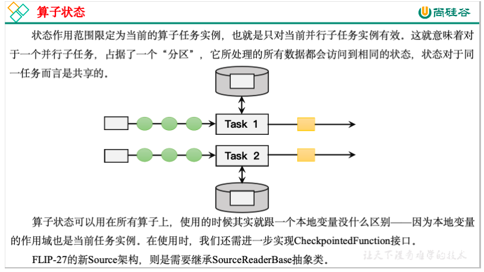
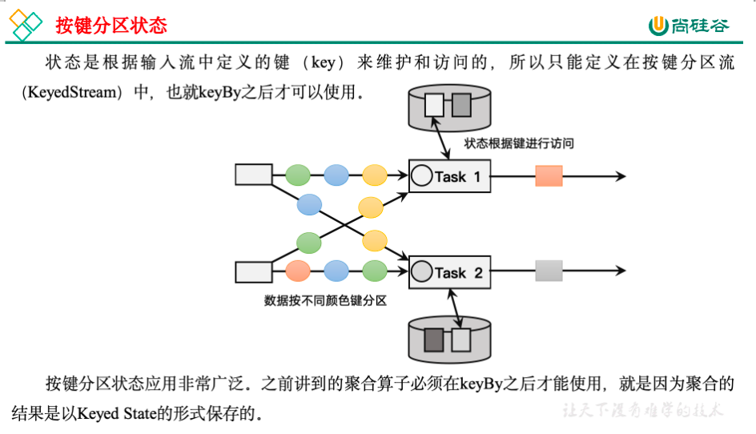

## 状态

### 状态的分类

1. 托管状态（Managed State）和原始状态（Raw State）

   Flink的状态有两种：托管状态（Managed State）和原始状态（Raw State）。托管状态就是由Flink统一管理的，状态的存储访问、故障恢复和重组等一系列问题都由Flink实现，我们只要调接口就可以；而原始状态则是自定义的，相当于就是开辟了一块内存，需要我们自己管理，实现状态的序列化和故障恢复。

   **通常我们采用Flink托管状态来实现需求**。

2. 算子状态（Operator State）和按键分区状态（Keyed State）

   接下来我们的重点就是托管状态（Managed State）。

   我们知道在Flink中，一个算子任务会按照并行度分为多个并行子任务执行，而不同的子任务会占据不同的任务槽（task slot）。由于不同的slot在计算资源上是物理隔离的，所以Flink能管理的状态在并行任务间是无法共享的，每个状态只能针对当前子任务的实例有效。

   而很多有状态的操作（比如聚合、窗口）都是要先做keyBy进行按键分区的。按键分区之后，任务所进行的所有计算都应该只针对当前key有效，所以状态也应该按照key彼此隔离。在这种情况下，状态的访问方式又会有所不同。

   基于这样的想法，我们又可以将托管状态分为两类：算子状态和按键分区状态。

   

   

   另外，也可以通过富函数类（Rich Function）来自定义Keyed State，所以只要提供了富函数类接口的算子，也都可以使用Keyed State。所以即使是map、filter这样无状态的基本转换算子，我们也可以通过富函数类给它们“追加”Keyed State。比如RichMapFunction、RichFilterFunction。在富函数中，我们可以调用.getRuntimeContext()获取当前的运行时上下文（RuntimeContext），进而获取到访问状态的句柄；这种富函数中自定义的状态也是Keyed State。从这个角度讲，Flink中所有的算子都可以是有状态的。

   无论是Keyed State还是Operator State，它们都是在本地实例上维护的，也就是说每个并行子任务维护着对应的状态，算子的子任务之间状态不共享。

### 按键分区状态（Keyed State）

按键分区状态（Keyed State）顾名思义，是任务按照键（key）来访问和维护的状态。它的特点非常鲜明，就是以key为作用范围进行隔离。

需要注意，使用Keyed State必须基于KeyedStream。没有进行keyBy分区的DataStream，即使转换算子实现了对应的富函数类，也不能通过运行时上下文访问Keyed State。

* 值状态（ValueState）

  顾名思义，状态中只保存一个“值”（value）。ValueState<T>本身是一个接口，源码中定义如下：

  ```java
  public interface ValueState<T> extends State {
      T value() throws IOException;
      void update(T value) throws IOException;
  }
  ```

  在具体使用时，为了让运行时上下文清楚到底是哪个状态，我们还需要创建一个“状态描述器”（StateDescriptor）来提供状态的基本信息。例如源码中，ValueState的状态描述器构造方法如下：

  ```java
  public ValueStateDescriptor(String name, Class<T> typeClass) {
      super(name, typeClass, null);
  }
  ```

  这里需要传入状态的名称和类型——这跟我们声明一个变量时做的事情完全一样。

  案例：各种传感器，监控连续两次差值大于10就报警

  ```java
  public static void main(String[] args) throws Exception {
          StreamExecutionEnvironment env = StreamExecutionEnvironment.getExecutionEnvironment();
          env.setParallelism(1);
          DataStreamSource<String> source = env.socketTextStream("localhost", 8888);
          SingleOutputStreamOperator<WaterSensor> watermark = source.map(new WaterSensorMapFunction())
                  .assignTimestampsAndWatermarks(WatermarkStrategy
                          .<WaterSensor>forBoundedOutOfOrderness(Duration.ofSeconds(3))
                          .withTimestampAssigner(
                                  new SerializableTimestampAssigner<WaterSensor>() {
                                      @Override
                                      public long extractTimestamp(WaterSensor element, long recordTimestamp) {
                                          return element.getTs() * 1000;
                                      }
                                  }
                          ));
  
          watermark.keyBy(w->w.getId())
                  .process(new KeyedProcessFunction<String, WaterSensor, String>() {
                      ValueState<Integer> vcState;
  
                      @Override
                      public void open(Configuration parameters) throws Exception {
                          vcState = getRuntimeContext().getState(new ValueStateDescriptor<>("vcState", Types.INT));
                      }
  
                      @Override
                      public void processElement(WaterSensor value, Context ctx, Collector<String> out) throws Exception {
  
                          Integer _vc = vcState.value()==null?0:vcState.value();
                          Integer vc = value.getVc();
                          if(Math.abs(vc-_vc)>10){
                              out.collect("key:"+ctx.getCurrentKey()+",上次状态："+_vc+",两次vc的差值大于10...");
                          }
                          vcState.update(vc);
                      }
                  }).print();
  
          env.execute();
      }
  ```

  总结：

  1. 状态需要在open方法中创建。不在open方法创建，无法取得上下文，会抛出异常。
  2. 与存储普通变量的区别。在这个例子中，如果使用Int变量存储，无法根据key进行区别判断，比较会出现混乱。（当然还有其他问题，这里按下不表...）

* 列表状态

  将需要保存的数据，以列表（List）的形式组织起来。在ListState<T>接口中同样有一个类型参数T，表示列表中数据的类型。ListState也提供了一系列的方法来操作状态，使用方式与一般的List非常相似。

  1. Iterable<T> get()：获取当前的列表状态，返回的是一个可迭代类型Iterable<T>；
  2. update(List<T> values)：传入一个列表values，直接对状态进行覆盖；
  3. add(T value)：在状态列表中添加一个元素value；
  4. addAll(List<T> values)：向列表中添加多个元素，以列表values形式传入。

  类似地，ListState的状态描述器就叫作ListStateDescriptor，用法跟ValueStateDescriptor完全一致。

  案例:针对每种传感器输出最高的3个水位值

  ```java
  public static void main(String[] args) throws Exception {
          StreamExecutionEnvironment env = StreamExecutionEnvironment.getExecutionEnvironment();
          env.setParallelism(1);
          DataStreamSource<String> source = env.socketTextStream("localhost", 8888);
          SingleOutputStreamOperator<WaterSensor> watermark = source.map(new WaterSensorMapFunction())
                  .assignTimestampsAndWatermarks(WatermarkStrategy
                          .<WaterSensor>forBoundedOutOfOrderness(Duration.ofSeconds(3))
                          .withTimestampAssigner(
                                  new SerializableTimestampAssigner<WaterSensor>() {
                                      @Override
                                      public long extractTimestamp(WaterSensor element, long recordTimestamp) {
                                          return element.getTs() * 1000;
                                      }
                                  }
                          ));
  
          watermark.keyBy(w->w.getId())
                  .process(new KeyedProcessFunction<String, WaterSensor, String>() {
  
                      ListState<Integer> vcListState;
  
                      @Override
                      public void open(Configuration parameters) throws Exception {
                          vcListState = getRuntimeContext().getListState(new ListStateDescriptor<>("vcListState", Types.INT));
                      }
  
                      @Override
                      public void processElement(WaterSensor value, Context ctx, Collector<String> out) throws Exception {
                          vcListState.add(value.getVc());
                          Iterable<Integer> iterable = vcListState.get();
                          List<Integer> list = Lists.newArrayList(iterable.iterator());
                          list.sort(Comparator.reverseOrder());
                          if(list.size()>3){
                              list.remove(3);
                          }
                          out.collect("传感器："+value.getId()+",最大3个值是："+list);
                          vcListState.update(list);
                      }
                  }).print();
  
  
          env.execute();
  
      }
  ```

* Map状态

  把一些键值对（key-value）作为状态整体保存起来，可以认为就是一组key-value映射的列表。对应的MapState<UK, UV>接口中，就会有UK、UV两个泛型，分别表示保存的key和value的类型。同样，MapState提供了操作映射状态的方法，与Map的使用非常类似。

  1. UV get(UK key)：传入一个key作为参数，查询对应的value值；
  2. put(UK key, UV value)：传入一个键值对，更新key对应的value值；
  3. putAll(Map<UK, UV> map)：将传入的映射map中所有的键值对，全部添加到映射状态中；
  4. remove(UK key)：将指定key对应的键值对删除；
  5.  boolean contains(UK key)：判断是否存在指定的key，返回一个boolean值。另外，MapState也提供了获取整个映射相关信息的方法；
  6. Iterable<Map.Entry<UK, UV>> entries()：获取映射状态中所有的键值对；
  7. Iterable<UK> keys()：获取映射状态中所有的键（key），返回一个可迭代Iterable类型；
  8. Iterable<UV> values()：获取映射状态中所有的值（value），返回一个可迭代Iterable类型；
  9. boolean isEmpty()：判断映射是否为空，返回一个boolean值。

  案例：统计每种传感器每种水位值出现的次数。

  ```java
  public static void main(String[] args) throws Exception {
          StreamExecutionEnvironment env = StreamExecutionEnvironment.getExecutionEnvironment();
          env.setParallelism(1);
          DataStreamSource<String> source = env.socketTextStream("localhost", 8888);
          SingleOutputStreamOperator<WaterSensor> watermark = source.map(new WaterSensorMapFunction())
                  .assignTimestampsAndWatermarks(WatermarkStrategy
                          .<WaterSensor>forBoundedOutOfOrderness(Duration.ofSeconds(3))
                          .withTimestampAssigner(
                                  new SerializableTimestampAssigner<WaterSensor>() {
                                      @Override
                                      public long extractTimestamp(WaterSensor element, long recordTimestamp) {
                                          return element.getTs() * 1000;
                                      }
                                  }
                          ));
          watermark.keyBy(w->w.getId())
                  .process(new KeyedProcessFunction<String, WaterSensor, String>() {
  
                      MapState<Integer,Integer> vcMapState;
  
                      @Override
                      public void open(Configuration parameters) throws Exception {
                          vcMapState = getRuntimeContext().getMapState(new MapStateDescriptor<>("vcMapState", Types.INT, Types.INT));
                      }
  
                      @Override
                      public void processElement(WaterSensor value, Context ctx, Collector<String> out) throws Exception {
                          Integer vc = value.getVc();
                          if(vcMapState.contains(vc)){
                              Integer count = vcMapState.get(vc);
                              vcMapState.put(vc,++count);
                          }else {
                              vcMapState.put(vc,1);
                          }
                          StringBuilder builder = new StringBuilder();
                          builder.append("水位统计情况：\n");
                          for(Map.Entry<Integer,Integer> entry:vcMapState.entries()){
                              builder.append(entry+"\n");
                          }
                          builder.append("=====\n");
                          out.collect("传感器："+value.getId()+","+builder.toString());
                      }
                  }).print();
  
          env.execute();
      }
  ```

* 规约状态

  类似于值状态（Value），不过需要对添加进来的所有数据进行归约，将归约聚合之后的值作为状态保存下来。ReducingState<T>这个接口调用的方法类似于ListState，只不过它保存的只是一个聚合值，所以调用.add()方法时，不是在状态列表里添加元素，而是直接把新数据和之前的状态进行归约，并用得到的结果更新状态。

  归约逻辑的定义，是在归约状态描述器（ReducingStateDescriptor）中，通过传入一个归约函数（ReduceFunction）来实现的。这里的归约函数，就是我们之前介绍reduce聚合算子时讲到的ReduceFunction，所以状态类型跟输入的数据类型是一样的。

  ```java
  public ReducingStateDescriptor(
      String name, ReduceFunction<T> reduceFunction, Class<T> typeClass) {...}
  ```

  这里的描述器有三个参数，其中第二个参数就是定义了归约聚合逻辑的ReduceFunction，另外两个参数则是状态的名称和类型。

  案例：计算每种传感器的水位和

  ```java
  public static void main(String[] args) throws Exception {
  
          StreamExecutionEnvironment env = StreamExecutionEnvironment.getExecutionEnvironment();
          env.setParallelism(1);
          DataStreamSource<String> source = env.socketTextStream("localhost", 8888);
          SingleOutputStreamOperator<WaterSensor> watermark = source.map(new WaterSensorMapFunction())
                  .assignTimestampsAndWatermarks(WatermarkStrategy
                          .<WaterSensor>forBoundedOutOfOrderness(Duration.ofSeconds(3))
                          .withTimestampAssigner(
                                  new SerializableTimestampAssigner<WaterSensor>() {
                                      @Override
                                      public long extractTimestamp(WaterSensor element, long recordTimestamp) {
                                          return element.getTs() * 1000;
                                      }
                                  }
                          ));
  
          watermark.keyBy(w->w.getId())
                  .process(new KeyedProcessFunction<String, WaterSensor, String>() {
  
                      ReducingState<Integer> vcReduceState;
  
                      @Override
                      public void open(Configuration parameters) throws Exception {
                          vcReduceState = getRuntimeContext().getReducingState(new ReducingStateDescriptor<>("vcReduceState", Integer::sum, Types.INT));
                      }
  
                      @Override
                      public void processElement(WaterSensor value, Context ctx, Collector<String> out) throws Exception {
                          vcReduceState.add(value.getVc());
                          out.collect("传感器："+value.getId()+",水位和："+vcReduceState.get());
                      }
                  }).print();
          env.execute();
      }
  ```

* 聚合状态

  与归约状态非常类似，聚合状态也是一个值，用来保存添加进来的所有数据的聚合结果。与ReducingState不同的是，它的聚合逻辑是由在描述器中传入一个更加一般化的聚合函数（AggregateFunction）来定义的；这也就是之前我们讲过的AggregateFunction，里面通过一个累加器（Accumulator）来表示状态，所以聚合的状态类型可以跟添加进来的数据类型完全不同，使用更加灵活。

  同样地，AggregatingState接口调用方法也与ReducingState相同，调用.add()方法添加元素时，会直接使用指定的AggregateFunction进行聚合并更新状态。

  案例：计算每种传感器的平均水位

  ```java
  public class AggStateExample {
  
      public static void main(String[] args) throws Exception {
          StreamExecutionEnvironment env = StreamExecutionEnvironment.getExecutionEnvironment();
          env.setParallelism(1);
          DataStreamSource<String> source = env.socketTextStream("localhost", 8888);
          SingleOutputStreamOperator<WaterSensor> watermark = source.map(new WaterSensorMapFunction())
                  .assignTimestampsAndWatermarks(WatermarkStrategy
                          .<WaterSensor>forBoundedOutOfOrderness(Duration.ofSeconds(3))
                          .withTimestampAssigner(
                                  new SerializableTimestampAssigner<WaterSensor>() {
                                      @Override
                                      public long extractTimestamp(WaterSensor element, long recordTimestamp) {
                                          return element.getTs() * 1000;
                                      }
                                  }
                          ));
  
          watermark.keyBy(w->w.getId())
                  .process(new KeyedProcessFunction<String, WaterSensor, String>() {
  
                      AggregatingState<Integer,Double> vcAggregateState;
  
                      @Override
                      public void open(Configuration parameters) throws Exception {
                          vcAggregateState = getRuntimeContext().getAggregatingState(new AggregatingStateDescriptor<>("vcAggregateState", new MyAggregateFunction(), Types.TUPLE(Types.INT, Types.INT)));
                      }
  
                      @Override
                      public void processElement(WaterSensor value, Context ctx, Collector<String> out) throws Exception {
                          vcAggregateState.add(value.getVc());
                          out.collect("传感器："+value.getId()+",平均值："+vcAggregateState.get());
                      }
                  }).print();
  
          env.execute();
  
  
      }
  
      public static class MyAggregateFunction implements AggregateFunction<Integer,Tuple2<Integer,Integer>,Double>{
  
          @Override
          public Tuple2<Integer, Integer> createAccumulator() {
              return Tuple2.of(0,0);
          }
  
          @Override
          public Tuple2<Integer, Integer> add(Integer value, Tuple2<Integer, Integer> accumulator) {
              return Tuple2.of(accumulator.f0+value,accumulator.f1+1);
          }
  
          @Override
          public Double getResult(Tuple2<Integer, Integer> accumulator) {
              return accumulator.f0*1d/accumulator.f1;
          }
  
          @Override
          public Tuple2<Integer, Integer> merge(Tuple2<Integer, Integer> a, Tuple2<Integer, Integer> b) {
              return null;
          }
      }
  }
  ```

  补充：

  * 两个int相除得到double的写法

    ```java
    int a = 3;
    int b = 0;
    （a*1d）/b //编译器可以提示除0错误
     a/(b*1d) //编译器不提示除0错误
      //结论，使用前一种写法更通用
      //冷知识，不像整型除以0会抛出异常，浮点类型除以0不会抛出异常，而会返回+-Infinity
    ```

  * AggregateFunction中的merge什么时候用到

    会话窗口。

    stream.keyBy("userId").window(EventTimeSessionWindows.withGap(Time.seconds(gap)))
    在普通的翻滚窗口和滑动窗口中，窗口的范围是按时间区间固定的，虽然范围有可能重合，但是处理起来是各自独立的，并不会相互影响。但是会话窗口则不同，其范围是根据事件之间的时间差是否超过gap来确定的（超过gap就形成一个新窗口），也就是说并非固定。所以，我们需要在每个事件进入会话窗口算子时就为它分配一个**初始窗口**，起点是它本身所携带的时间戳（这里按event time处理），终点则是时间戳加上gap的偏移量。这样的话，如果两个事件所在的初始窗口没有相交，说明它们属于不同的会话；如果相交，则说明它们属于同一个会话，**并且要把这两个初始窗口合并在一起**，作为新的会话窗口。多个事件则依次类推，最终形成上面图示的情况。


### 状态生存时间（TTL）

在实际应用中，很多状态会随着时间的推移逐渐增长，如果不加以限制，最终就会导致存储空间的耗尽。一个优化的思路是直接在代码中调用.clear()方法去清除状态，但是有时候我们的逻辑要求不能直接清除。这时就需要配置一个状态的“生存时间”（time-to-live，TTL），当状态在内存中存在的时间超出这个值时，就将它清除。

具体实现上，如果用一个进程不停地扫描所有状态看是否过期，显然会占用大量资源做无用功。状态的失效其实不需要立即删除，所以我们可以给状态附加一个属性，也就是状态的“失效时间”。状态创建的时候，设置 失效时间 = 当前时间 + TTL；之后如果有对状态的访问和修改，我们可以再对失效时间进行更新；当设置的清除条件被触发时（比如，状态被访问的时候，或者每隔一段时间扫描一次失效状态），就可以判断状态是否失效、从而进行清除了。

配置状态的TTL时，需要创建一个StateTtlConfig配置对象，然后调用状态描述器的.enableTimeToLive()方法启动TTL功能。

```java
StateTtlConfig ttlConfig = StateTtlConfig
    .newBuilder(Time.seconds(10))
    .setUpdateType(StateTtlConfig.UpdateType.OnCreateAndWrite)
    .setStateVisibility(StateTtlConfig.StateVisibility.NeverReturnExpired)
    .build();

ValueStateDescriptor<String> stateDescriptor = new ValueStateDescriptor<>("my state", String.class);

stateDescriptor.enableTimeToLive(ttlConfig);
```

这里用到了几个配置项：

1. newBuilder()

   状态TTL配置的构造器方法，必须调用，返回一个Builder之后再调用.build()方法就可以得到StateTtlConfig了。方法需要传入一个Time作为参数，这就是设定的状态生存时间。

2. setUpdateType()

   设置更新类型。更新类型指定了什么时候更新状态失效时间，这里的OnCreateAndWrite表示只有创建状态和更改状态（写操作）时更新失效时间。另一种类型OnReadAndWrite则表示无论读写操作都会更新失效时间，也就是只要对状态进行了访问，就表明它是活跃的，从而延长生存时间。这个配置默认为OnCreateAndWrite。

3. setStateVisibility()

   设置状态的可见性。**所谓的“状态可见性”，是指因为清除操作并不是实时的，所以当状态过期之后还有可能继续存在，这时如果对它进行访问，能否正常读取到就是一个问题了**。这里设置的NeverReturnExpired是默认行为，表示从不返回过期值，也就是只要过期就认为它已经被清除了，应用不能继续读取；这在处理会话或者隐私数据时比较重要。对应的另一种配置是ReturnExpireDefNotCleanedUp，就是如果过期状态还存在，就返回它的值。

   除此之外，TTL配置还可以设置在保存检查点（checkpoint）时触发清除操作，或者配置增量的清理（incremental cleanup），还可以针对RocksDB状态后端使用压缩过滤器（compaction filter）进行后台清理。这里需要注意，**目前的TTL设置只支持处理时间**。

```java
public static void main(String[] args) throws Exception {
        StreamExecutionEnvironment env = StreamExecutionEnvironment.getExecutionEnvironment();
        env.setParallelism(1);
        DataStreamSource<String> source = env.socketTextStream("localhost", 8888);
        SingleOutputStreamOperator<WaterSensor> watermark = source.map(new WaterSensorMapFunction())
                .assignTimestampsAndWatermarks(WatermarkStrategy
                        .<WaterSensor>forBoundedOutOfOrderness(Duration.ofSeconds(3))
                        .withTimestampAssigner(
                                new SerializableTimestampAssigner<WaterSensor>() {
                                    @Override
                                    public long extractTimestamp(WaterSensor element, long recordTimestamp) {
                                        return element.getTs() * 1000;
                                    }
                                }
                        ));

        watermark.keyBy(w->w.getId())
                .process(new KeyedProcessFunction<String, WaterSensor, String>() {
                    ValueState<Integer> vcState;

                    @Override
                    public void open(Configuration parameters) throws Exception {
                        StateTtlConfig config = StateTtlConfig.newBuilder(Time.seconds(5))
                                .setUpdateType(StateTtlConfig.UpdateType.OnReadAndWrite)
                                .setStateVisibility(StateTtlConfig.StateVisibility.NeverReturnExpired)
                                .build();
                        ValueStateDescriptor<Integer> stateDescriptor = new ValueStateDescriptor<>("vcState", Types.INT);
                        stateDescriptor.enableTimeToLive(config);
                        this.vcState = getRuntimeContext().getState(stateDescriptor);
                    }

                    @Override
                    public void processElement(WaterSensor value, Context ctx, Collector<String> out) throws Exception {
                        Integer vc = vcState.value();
                        out.collect("传感器："+value.getId()+",状态值："+vc);
                        if(value.getVc()>10)
                            vcState.update(value.getVc());
                    }
                }).print();

        env.execute();
    }
```

