## 检查点

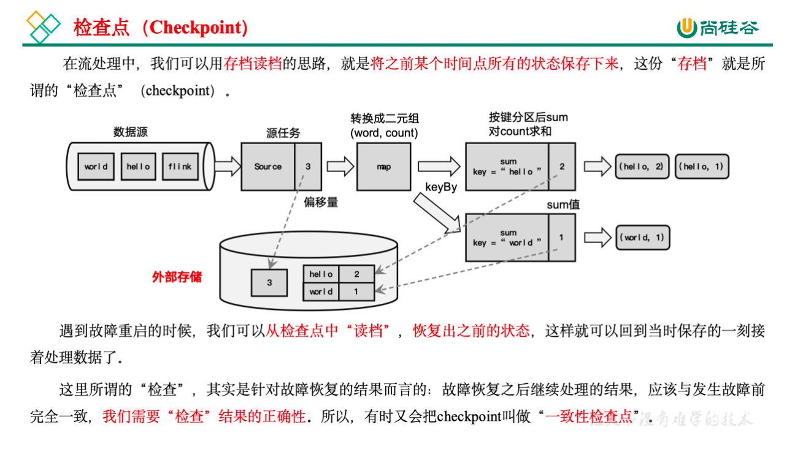

### 检查点的保存

1. 周期性的触发保存

   “随时存档”确实恢复起来方便，可是需要我们不停地做存档操作。如果每处理一条数据就进行检查点的保存，当大量数据同时到来时，就会耗费很多资源来频繁做检查点，数据处理的速度就会受到影响。所以在Flink中，检查点的保存是周期性触发的，间隔时间可以进行设置。

2. 保存的时间点

   **我们应该在所有任务（算子）都恰好处理完一个相同的输入数据的时候，将它们的状态保存下来**。

   这样做可以实现一个数据被所有任务（算子）完整地处理完，状态得到了保存。

   **如果出现故障**，我们恢复到之前保存的状态，故障时正在处理的所有数据都需要重新处理；**我们只需要让源（source）任务向数据源重新提交偏移量、请求重放数据就可以了**。当然这需要源任务可以把偏移量作为算子状态保存下来，而且外部数据源能够重置偏移量；kafka就是满足这些要求的一个最好的例子。

3. 保存的具体流程

   检查点的保存，最关键的就是要等所有任务将“同一个数据”处理完毕。下面我们通过一个具体的例子，来详细描述一下检查点具体的保存过程。

   回忆一下我们最初实现的统计词频的程序——word count。这里为了方便，我们直接从数据源读入已经分开的一个个单词，例如这里输入的是：

   “hello”，“world”，“**hello**”，“flink”，“hello”，“world”，“hello”，“flink”…

   ​	我们所需要的就是每个任务都处理完“**hello**”之后保存自己的状态。

### 从检查点恢复状态

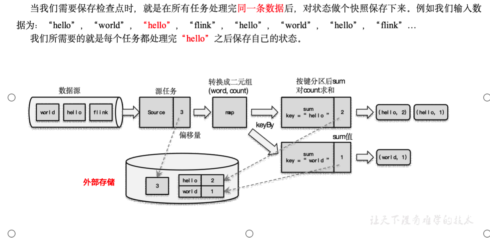

### 检查点算法

在Flink中，采用了基于Chandy-Lamport算法的分布式快照，可以在不暂停整体流处理的前提下，将状态备份保存到检查点。

1. 检查点分界线（Barrier）

   借鉴水位线的设计，在数据流中插入一个特殊的数据结构，专门用来表示触发检查点保存的时间点。收到保存检查点的指令后，Source任务可以在当前数据流中插入这个结构；之后的所有任务只要遇到它就开始对状态做持久化快照保存。由于数据流是保持顺序依次处理的，因此遇到这个标识就代表之前的数据都处理完了，可以保存一个检查点；而在它之后的数据，引起的状态改变就不会体现在这个检查点中，而需要保存到下一个检查点。

   这种特殊的数据形式，把一条流上的数据按照不同的检查点分隔开，所以就叫做检查点的“分界线”（Checkpoint Barrier）。

   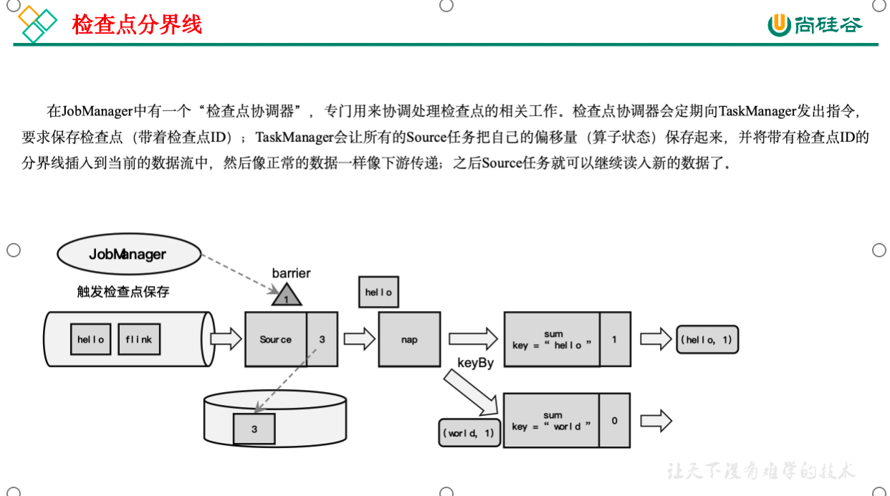

2. 分布式快照算法（Barrier对齐的精准一次）

   watermark指示的是“之前的数据全部到齐了”，而barrier指示的是“之前所有数据的状态更改保存入当前检查点”：它们都是一个“截止时间”的标志。所以在处理多个分区的传递时，也要以是否还会有数据到来作为一个判断标准。

   具体实现上，Flink使用了Chandy-Lamport算法的一种变体，被称为“异步分界线快照”算法。算法的核心就是两个原则：

   当上游任务向多个并行下游任务发送barrier时，需要广播出去；

   而当多个上游任务向同一个下游任务传递分界线时，需要在下游任务执行“分界线对齐”操作，也就是需要等到所有并行分区的barrier都到齐，才可以开始状态的保存。

   1. 场景说明

      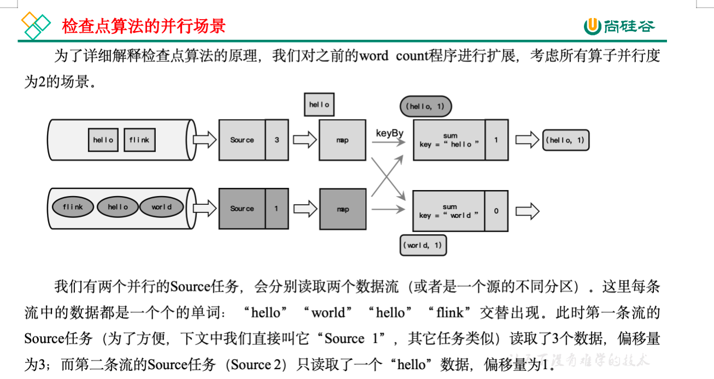

   2. 检查点保存算法具体过程为：

      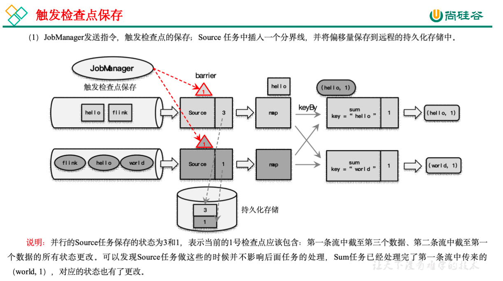

      （1）触发检查点：JobManager向Source发送Barrier；

      （2）Barrier发送：向下游广播发送；

      （3）Barrier对齐：下游需要收到上游所有并行度传递过来的Barrier才做自身状态的保存；

      （4）状态保存：有状态的算子将状态保存至持久化。**持久化成功后会想jobManager发送ack**。

      （5）先处理缓存数据，然后正常继续处理

      完成检查点保存之后，任务就可以继续正常处理数据了。**这时如果有等待分界线对齐时缓存的数据，需要先做处理**；然后再按照顺序依次处理新到的数据。当JobManager收到所有任务成功保存状态的信息，就可以确认当前检查点成功保存。之后遇到故障就可以从这里恢复了。

      （补充）由于分界线对齐要求先到达的分区做缓存等待，一定程度上会影响处理的速度；当出现背压时，下游任务会堆积大量的缓冲数据，检查点可能需要很久才可以保存完毕。

      为了应对这种场景，Barrier对齐中提供了至少一次语义以及Flink 1.11之后提供了不对齐的检查点保存方式，可以将未处理的缓冲数据也保存进检查点。这样，当我们遇到一个分区barrier时就不需等待对齐，而是可以直接启动状态的保存了。

3. 分布式快照算法（Barrier对齐的至少一次）

   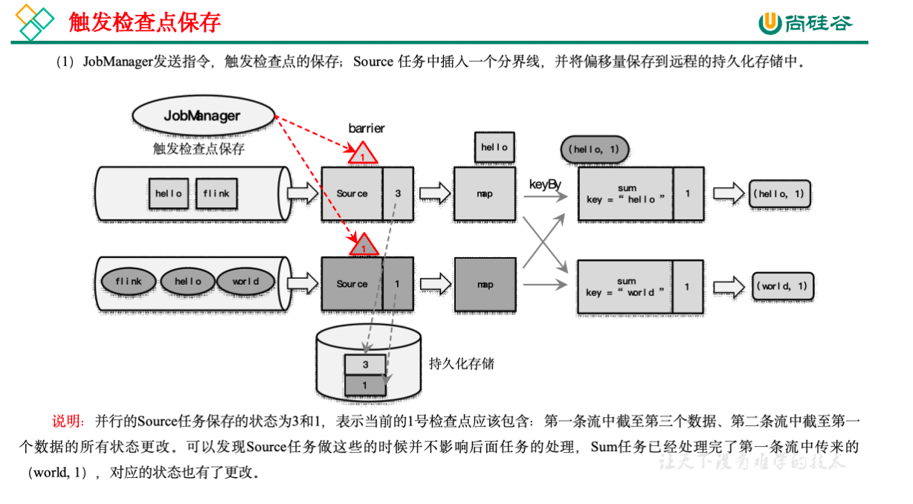

   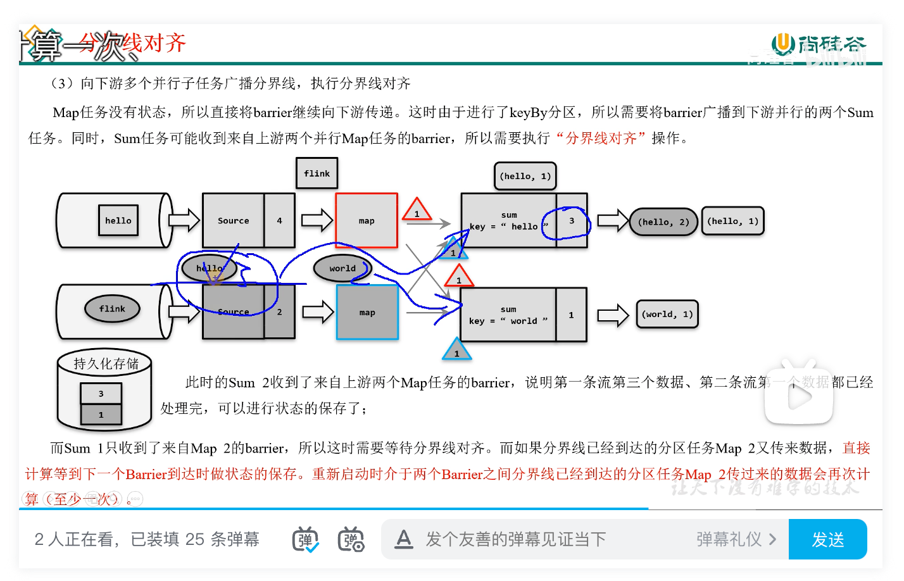

   与“Barrier对齐的精准一次”不同，图中第二条流的第三条数据“hello”到达sum缓冲区时，**不会因为Barrier未对齐而阻塞**，会计算到结果当中，此时的sum结果为4，这时，如果系统故障，这条“hello”被重放，**那么hello的数据量就会被多算一次**。

4. 分布式快照算法（非Barrier对齐的精准一次）

   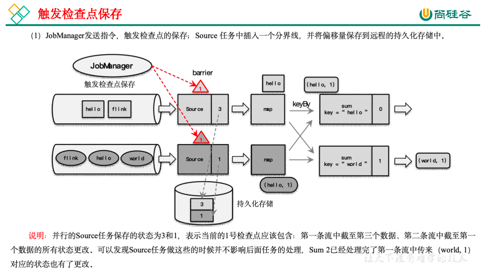

   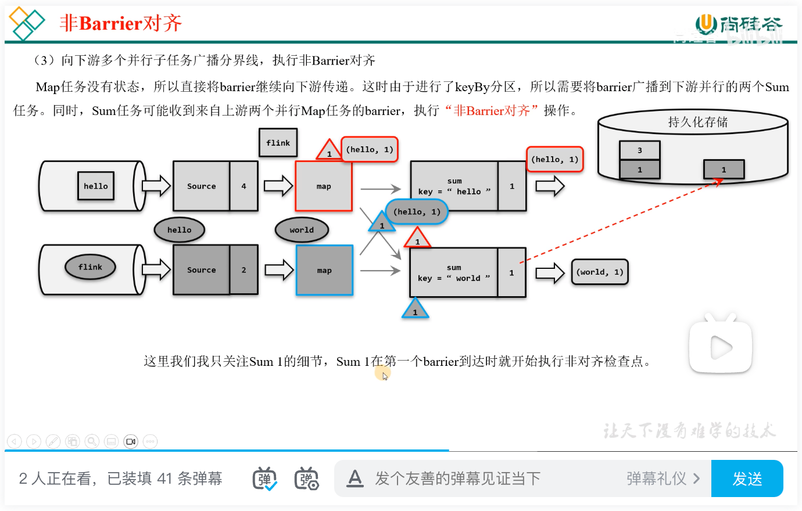

   细节：sum1在第一个barrier到达（输入缓冲区）时就开始执行非检查点。

   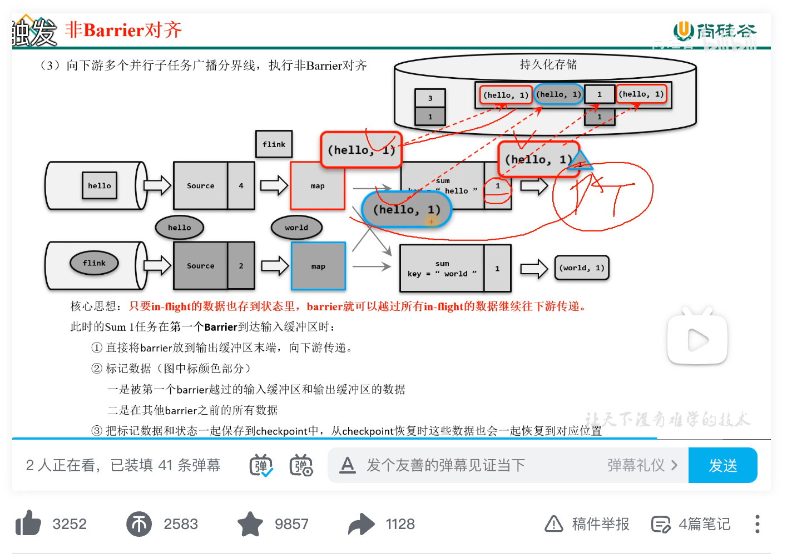

   将barrier移动到末端的目的：不造成阻塞

总结：

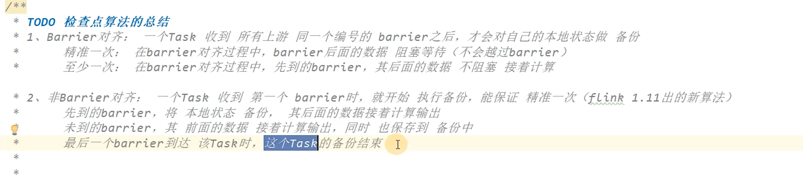

### 检查点配置

1. 启用检查点

   默认情况下，Flink程序是禁用检查点的。如果想要为Flink应用开启自动保存快照的功能，需要在代码中显式地调用执行环境的.enableCheckpointing()方法：

   ```java
   StreamExecutionEnvironment env = 
   StreamExecutionEnvironment.getExecutionEnvironment();
   
   // 每隔1秒启动一次检查点保存
   env.enableCheckpointing(1000);
   ```

   这里需要传入一个长整型的毫秒数，表示周期性保存检查点的间隔时间。如果不传参数直接启用检查点，默认的间隔周期为500毫秒，这种方式已经被弃用。

   检查点的间隔时间是对处理性能和故障恢复速度的一个权衡。如果我们希望对性能的影响更小，可以调大间隔时间；而如果希望故障重启后迅速赶上实时的数据处理，就需要将间隔时间设小一些。

2. 检查点存储

   检查点具体的持久化存储位置，取决于“检查点存储”的设置。默认情况下，检查点存储在JobManager的堆内存中。而对于大状态的持久化保存，Flink也提供了在其他存储位置进行保存的接口。

   具体可以通过调用检查点配置的.setCheckpointStorage()来配置，需要传入一个CheckpointStorage的实现类。Flink主要提供了两种CheckpointStorage：作业管理器的堆内存和文件系统。

   ```java
   // 配置存储检查点到JobManager堆内存
   env.getCheckpointConfig().setCheckpointStorage(new JobManagerCheckpointStorage());
   
   // 配置存储检查点到文件系统
   env.getCheckpointConfig().setCheckpointStorage(new FileSystemCheckpointStorage("hdfs://namenode:40010/flink/checkpoints"));
   ```

   对于实际生产应用，我们一般会将CheckpointStorage配置为高可用的分布式文件系统（HDFS，S3等）。

3. 其它高级配置

   检查点还有很多可以配置的选项，可以通过获取检查点配置（CheckpointConfig）来进行设置。

   ```java
   CheckpointConfig checkpointConfig = env.getCheckpointConfig();
   ```

   1. 常用高级配置

      * 检查点模式（CheckpointingMode）

        设置检查点一致性的保证级别，有“精确一次”（exactly-once）和“至少一次”（at-least-once）两个选项。默认级别为exactly-once，而对于大多数低延迟的流处理程序，at-least-once就够用了，而且处理效率会更高。

      * 超时时间（checkpointTimeout）

        用于指定检查点保存的超时时间，超时没完成就会被丢弃掉。传入一个长整型毫秒数作为参数，表示超时时间。

      * 最小间隔时间（minPauseBetweenCheckpoints）

        用于指定在上一个检查点完成之后，检查点协调器最快等多久可以出发保存下一个检查点的指令。这就意味着即使已经达到了周期触发的时间点，只要距离上一个检查点完成的间隔不够，就依然不能开启下一次检查点的保存。这就为正常处理数据留下了充足的间隙。当指定这个参数时，实际并发为1。

      * 最大并发检查点数量（maxConcurrentCheckpoints）

        用于指定运行中的检查点最多可以有多少个。由于每个任务的处理进度不同，完全可能出现后面的任务还没完成前一个检查点的保存、前面任务已经开始保存下一个检查点了。这个参数就是限制同时进行的最大数量。

      * 开启外部持久化存储（enableExternalizedCheckpoints）

        用于开启检查点的外部持久化，而且默认在作业失败的时候不会自动清理，如果想释放空间需要自己手工清理。里面传入的参数ExternalizedCheckpointCleanup指定了当作业取消的时候外部的检查点该如何清理。

        DELETE_ON_CANCELLATION：在作业取消的时候会自动删除外部检查点，但是如果是作业失败退出，则会保留检查点。

        RETAIN_ON_CANCELLATION：作业取消的时候也会保留外部检查点。

      * 检查点连续失败次数（tolerableCheckpointFailureNumber）

        用于指定检查点连续失败的次数，当达到这个次数，作业就失败退出。默认为0，这意味着不能容忍检查点失败，并且作业将在第一次报告检查点失败时失败。

   2. 开启非对齐检查点

      * 非对齐检查点（enableUnalignedCheckpoints）

        不再执行检查点的分界线对齐操作，启用之后可以大大减少产生背压时的检查点保存时间。这个设置要求检查点模式（CheckpointingMode）必须为exctly-once，并且最大并发的检查点个数为1。

      * 对齐检查点超时时间（alignedCheckpointTimeout）

        该参数只有在启用非对齐检查点的时候有效。参数默认是0，表示一开始就直接用非对齐检查点。如果设置大于0，一开始会使用对齐的检查点，当对齐时间超过该参数设定的时间，则会自动切换成非对齐检查点。

      * 代码

        ```java
        public class CheckpointConfigDemo {
            public static void main(String[] args) throws Exception {
                StreamExecutionEnvironment env = StreamExecutionEnvironment.createLocalEnvironmentWithWebUI(new Configuration());
                env.setParallelism(1);
        
                // 代码中用到hdfs，需要导入hadoop依赖、指定访问hdfs的用户名
                System.setProperty("HADOOP_USER_NAME", "atguigu");
        
                // TODO 检查点配置
                // 1、启用检查点: 默认是barrier对齐的，周期为5s, 精准一次
                env.enableCheckpointing(5000, CheckpointingMode.EXACTLY_ONCE);
                CheckpointConfig checkpointConfig = env.getCheckpointConfig();
                // 2、指定检查点的存储位置
                checkpointConfig.setCheckpointStorage("hdfs://hadoop102:8020/chk");
                // 3、checkpoint的超时时间: 默认10分钟
                checkpointConfig.setCheckpointTimeout(60000);
                // 4、同时运行中的checkpoint的最大数量
                checkpointConfig.setMaxConcurrentCheckpoints(1);
                // 5、最小等待间隔: 上一轮checkpoint结束 到 下一轮checkpoint开始 之间的间隔，设置了>0,并发就会变成1
                checkpointConfig.setMinPauseBetweenCheckpoints(1000);
                // 6、取消作业时，checkpoint的数据 是否保留在外部系统
                // DELETE_ON_CANCELLATION:主动cancel时，删除存在外部系统的chk-xx目录 （如果是程序突然挂掉，不会删）
                // RETAIN_ON_CANCELLATION:主动cancel时，外部系统的chk-xx目录会保存下来
                checkpointConfig.setExternalizedCheckpointCleanup(CheckpointConfig.ExternalizedCheckpointCleanup.RETAIN_ON_CANCELLATION);
                // 7、允许 checkpoint 连续失败的次数，默认0--》表示checkpoint一失败，job就挂掉
                checkpointConfig.setTolerableCheckpointFailureNumber(10);
        
                // TODO 开启 非对齐检查点（barrier非对齐）
                // 开启的要求： Checkpoint模式必须是精准一次，最大并发必须设为1
                checkpointConfig.enableUnalignedCheckpoints();
                // 开启非对齐检查点才生效： 默认0，表示一开始就直接用 非对齐的检查点
                // 如果大于0， 一开始用 对齐的检查点（barrier对齐）， 对齐的时间超过这个参数，自动切换成 非对齐检查点（barrier非对齐）
                checkpointConfig.setAlignedCheckpointTimeout(Duration.ofSeconds(1));
        
        
                env
                        .socketTextStream("hadoop102", 7777)
                        .flatMap(
                                (String value, Collector<Tuple2<String, Integer>> out) -> {
                                    String[] words = value.split(" ");
                                    for (String word : words) {
                                        out.collect(Tuple2.of(word, 1));
                                    }
                                }
                        )
                        .returns(Types.TUPLE(Types.STRING, Types.INT))
                        .keyBy(value -> value.f0)
                        .sum(1)
                        .print();
        
                env.execute();
            }
        }
        ```

   ### 通用增量 checkpoint (changelog)

   在 1.15 之前，只有RocksDB 支持增量快照。不同于产生一个包含所有数据的全量备份，增量快照中只包含自上一次快照完成之后被修改的记录，因此可以显著减少快照完成的耗时。

   Rocksdb状态后端启用增量checkpoint：

   ```java
   EmbeddedRocksDBStateBackend backend = new EmbeddedRocksDBStateBackend(true);
   ```

   从 1.15 开始，不管hashmap还是rocksdb 状态后端都可以通过开启changelog实现通用的增量checkpoint。

   1. 执行过程

      1. 带状态的算子任务将状态更改写入变更日志（记录状态）

         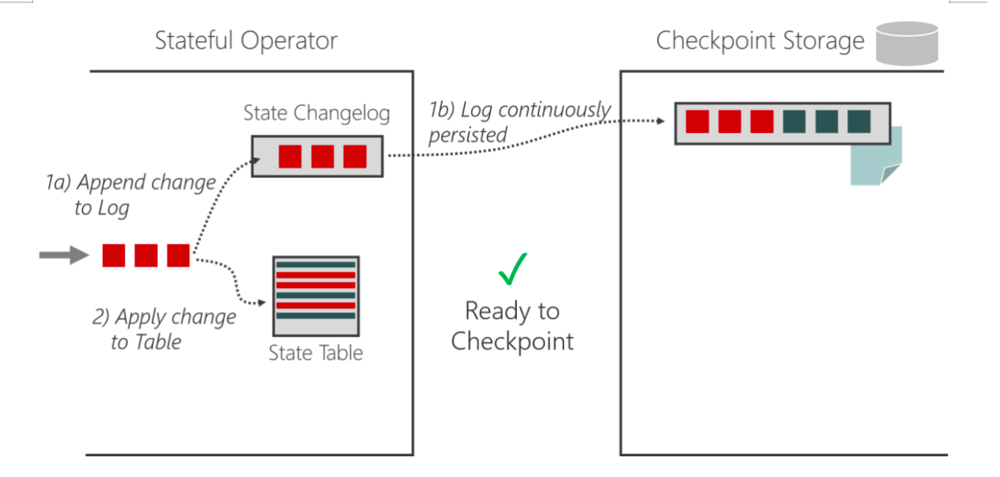

      2. 状态物化：状态表定期保存，独立于检查点

         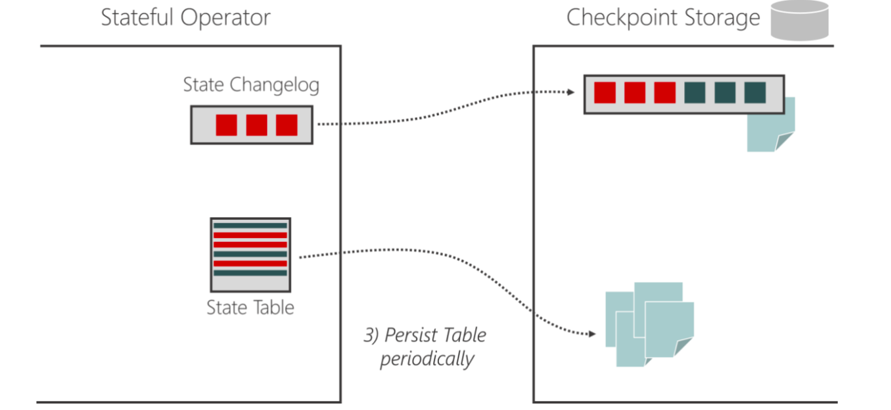

      3. 状态物化完成后，状态变更日志就可以被截断到相应的点

         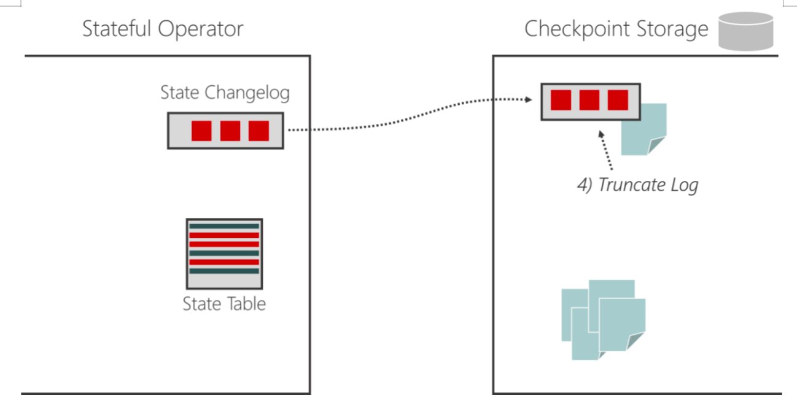

   2. 注意事项

      1. 目前标记为实验性功能，开启后可能会造成资源消耗增大：
         *  HDFS上保存的文件数变多
         * 消耗更多的IO带宽用于上传变更日志
         * 更多的CPU用于序列化状态更改
         * TaskManager使用更多内存来缓存状态更改
      2. 使用限制
         * Checkpoint的最大并发必须为1
         * 从 Flink 1.15 开始，只有文件系统的存储类型实现可用（memory测试阶段）
         *  不支持 NO_CLAIM 模式

   3. 使用方式

      1. 方式一：配置文件指定

         ```yaml
         state.backend.changelog.enabled: true
         state.backend.changelog.storage: filesystem 
         # 存储 changelog 数据
         dstl.dfs.base-path: hdfs://hadoop102:8020/changelog 
         execution.checkpointing.max-concurrent-checkpoints: 1
         execution.savepoint-restore-mode: CLAIM
         ```

      2. 方式二：在代码中设置

         * 添加依赖

           ```groovy
           compile 'org.apache.flink:flink-statebackend-changelog:1.17.0'
           ```

         * 开启changelog

           ```java
           env.enableChangelogStateBackend(true);
           ```

   ### 最终检查点

   如果数据源是有界的，就可能出现部分Task已经处理完所有数据，变成finished状态，不继续工作。从 Flink 1.14 开始，这些finished状态的Task，也可以继续执行检查点。自 1.15 起默认启用此功能，并且可以通过功能标志禁用它：

   ```java
   Configuration config = new Configuration();
   config.set(ExecutionCheckpointingOptions.ENABLE_CHECKPOINTS_AFTER_TASKS_FINISH, false);
   StreamExecutionEnvironment env = StreamExecutionEnvironment.getExecutionEnvironment(config);
   ```

   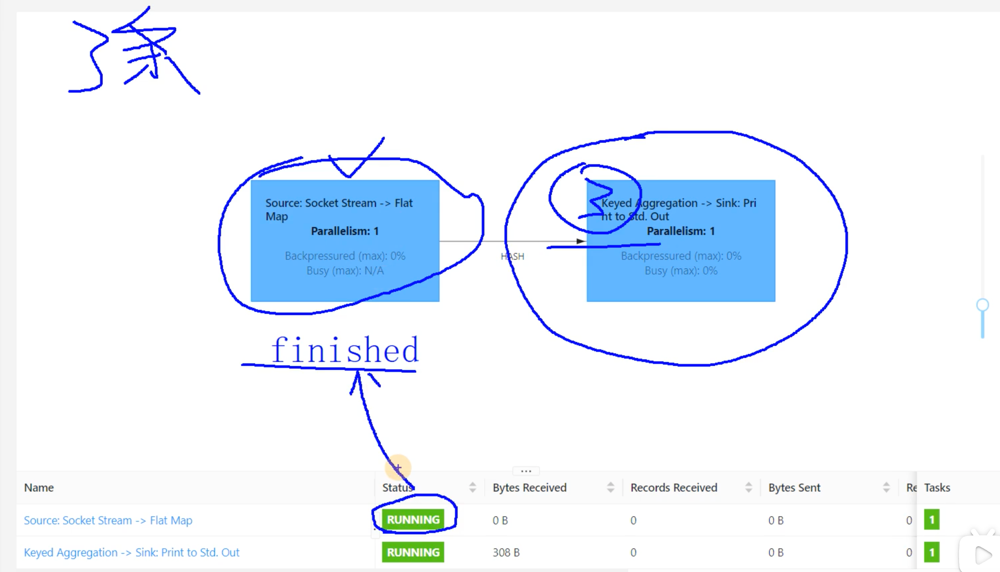

   最终检查点的作用？

   在有界流情况下，图中Source+flatMap节点处理完成会变成马上变成finish，这时所有节点还没有执行完，所有检查点保存也没有结束，当需要保存整体的检查点时，发现Source+flatMap，保存会失败。所以要增加最终检查点功能。

   

   


​	


