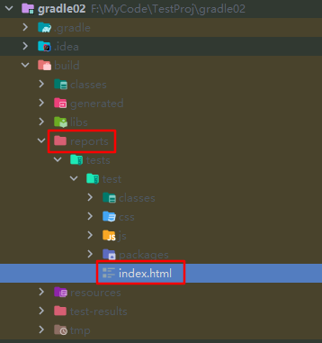
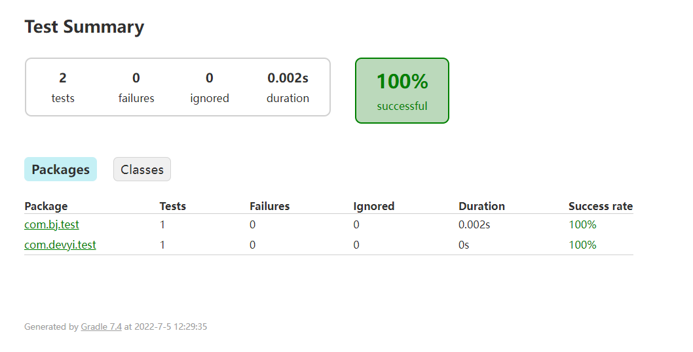

## [2.8、Gradle 对测试支持](https://www.bilibili.com/video/BV1yT41137Y7?p=22)

测试任务自动检测并执行测试源集中的所有单元测试。测试执行完成后会生成一个报告。支持JUnit 和 TestNG 测试。

### 2.8.1、默认测试目录及标准输出


### 2.8.2、Junit 使用

Gradle 对于Junit4.x 支持

```groovy
dependencies {
    testImplementation group: 'junit' ,name: 'junit', version: '4.12'
}
test {
    useJUnit()
}
```


Gradle 对于Junit5.x 版本支持

```groovy
dependencies {
    testImplementation 'org.junit.jupiter:junit-jupiter-api:5.8.1' 
    testRuntimeOnly 'org.junit.jupiter:junit-jupiter-engine:5.8.1'
}
test {
    useJUnitPlatform()
}
```

注意：无论是 Junt4.x 版本还是Junit5.x 版本，我们只需在 build.gradle 目录下执行gradle test 指令，gradle 就会帮我们执行所有的加了@Test 注解的测试，并生成测试报告。

**轶哥提示：**

测试报告在项目`build-reports`目录下，浏览器打开index.html即可查看



### [2.8.3、包含和排除特定测试](https://www.bilibili.com/video/BV1yT41137Y7?p=22&t=298.4)

```groovy
test {
    enabled true 
    useJUnit() 
    include 'com/**'
    exclude 'com/abc/**'
}
```

gradle 在junit 中的批量测试,可以设置包含或者排除某些特定测试。