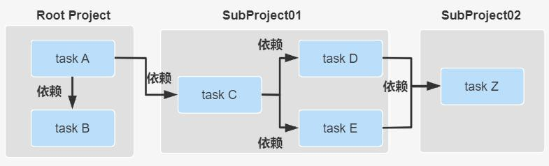
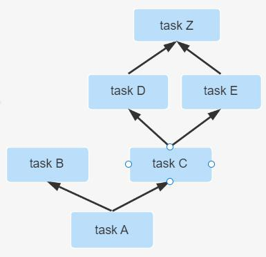

## 项目的生命周期

Gradle 项目的生命周期分为三大阶段: Initialization -> Configuration -> Execution. 每个阶段都有自己的职责,具体如下图所示:

- **Initialization 阶段**主要目的是初始化构建, 它又分为两个子过程,一个是执行 Init Script,另一个是执行 Setting Script。
- init.gradle 文件会在每个项目 build 之前被调用，用于做一些初始化的操作，它主要有如下作用：

- - 配置内部的仓库信息（如公司的 maven  仓库信息）； 
  - 配置一些全局属性；
  - 配置用户名及密码信息（如公司仓库的用户名和密码信息）。

- Setting Script 则更重要, 它初始化了一次构建所参与的所有模块。
- **Configuration 阶段**：这个阶段开始加载项目中所有模块的 Build Script。所谓 "加载" 就是执行 build.gradle 中的语句, 根据脚本代码创建对应的 task, 最终根据所有 task 生成由 **Task 组成的有向无环图**(Directed Acyclic Graphs)，如下:

从而构成如下**有向无环树**：

- **Execution 阶段**：这个阶段会根据上个阶段构建好的有向无环图，按着顺序执行 Task【Action 动作】。