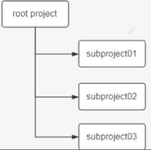

## settings 文件

首先对 settings 文件的几点说明：

1、作用：主要是在项目初始化阶段确定一下引入哪些工程需要加入到项目构建中,为构建项目工程树做准备。

2、工程树：gradle 中有工程树的概念，类似于 maven 中的project 与module。



3、内容：里面主要定义了当前 gradle 项目及子 project 的项目名称

4、位置：必须放在根工程目录下。

5、名字：为`settings.gradle` 文件，不能发生变化

6、对应实例：与 org.gradle.api.initialization.Settings 实例是一一对应的关系。每个项目只有一个settings 文件。

7、关注：作为开发者我们只需要关注该文件中的include 方法即可。使用相对路径【 :  】引入子工程。

8.一个子工程只有在setting 文件中配置了才会被 gradle 识别,这样在构建的时候才会被包含进去。案例如下所示：

```groovy
//根工程项目名
rootProject.name = 'root'
//包含的子工程名称
include 'subject01' 
include 'subject02' 
include 'subject03'
//包含的子工程下的子工程名称
include 'subject01:subproject011' 
include 'subject01:subproject012'
```

项目名称中 **":" 代表项目的分隔符**, 类似路径中的 "/". 如果**以 ":" 开头则表示相对于 root project** 。然后 Gradle 会为每个带有 build.gradle 脚本文件的工程构建一个与之对应的 Project 对象。