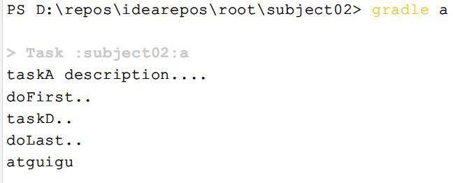

### 任务的行为

案例如下：doFirst、doLast 两个方法可以在任务内部定义，也可以在任务外部定义

```groovy
def map=new HashMap<String,Object>();
//action属性可以设置为闭包，设置task自身的行为
map.put("action",{println "taskD.."})
task(map,"a"){
    description   'taskA description	'
    group "atguigu"
    //在task内部定义doFirst、doLast行为
    doFirst {
        def name = 'doFirst..' 
        println name
    }
    doLast {
        def name = 'doLast..' 
        println name
    }
}
//在task外部定义doFirst、doLast行为
a.doFirst {
    println it.description
}
a.doLast {
    println it.group
}
```

测试：gradle a , 输出如下所示：



**底层原理分析**：无论是定义任务自身的 action,还是添加的doLast、doFirst 方法，其实底层都被放入到一个Action 的List 中了，最初这个 action List 是空的，当我们设置了 action【任务自身的行为】,它先将action 添加到列表中，此时列表中只有一个action,后续执行doFirst 的时候doFirst 在action 前面添加，执行 doLast 的时候doLast 在action 后面添加。doFirst 永远添加在actions List 的第一位，保证添加的Action 在现有的 action List 元素的最前面；doLast 永远都是在action List 末尾添加，保证其添加的Action 在现有的action List 元素的最后面。一个往前面添加,一个往后面添加，最后这个action List 就按顺序形成了doFirst、doSelf、doLast 三部分的 Actions,就达到 doFirst、doSelf、doLast 三部分的 Actions 顺序执行的目的。

**提示 1**:其中<<代表doLast,在gradle5.x 版本之后就废弃,不能使用了,如下所示: 

```groovy
task hello << {
    println 'Hello world!'
}
```

