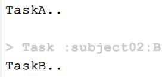

### [3.3.3、任务的依赖方式](https://www.bilibili.com/video/BV1yT41137Y7?p=26)

Task 之间的依赖关系可以在以下几部分设置：

1. 参数依赖
2. 内部依赖
3. 外部依赖

#### 方式一：参数方式依赖

```groovy
task A {
    doLast {
        println "TaskA.."
    }
}
task 'B' {
    doLast {
        println "TaskB.."
    }
}
//参数方式依赖: dependsOn后面用冒号
task 'C'(dependsOn: ['A', 'B']) {
    doLast {
        println "TaskC.."
    }
}}
```

**方式二:内部依赖**

```groovy
//参数方式依赖
task 'C' {
    //内部依赖：dependsOn后面用 = 号
    dependsOn= [A,B] 
    doLast {
        println "TaskC.."
    }
}
```

#### 测试: gradle C

**方式三：外部依赖**

//外部依赖:可变参数,引号可加可不加

```
C.dependsOn(B,'A')
```

#### 当然：task 也支持跨项目依赖

在subproject01 工程的 build.gradle 文件中定义:

```groovy
task A {
    doLast {
        println "TaskA.."
    }
}
```

在subproject02 工程的 build.gradle 文件中定义:

```groovy
task B{
    dependsOn(":subproject01:A") //依赖根工程下的subject01中的任务A ：跨项目依赖。
    doLast {
        println "TaskB.."
    }
}
```

测试：gradle B ,控制台显示如下



**拓展 1**：当一个 Task 依赖多个Task 的时候，被依赖的Task 之间如果没有依赖关系，那么它们的执行顺序是随机的,并无影响。

#### 拓展 2：重复依赖的任务只会执行一次,比如：

A->B、C 

B->C

任务A 依赖任务 B 和任务 C、任务 B 依赖C 任务。执行任务A 的时候，显然任务C 被重复依赖了，C 只会执行一次。