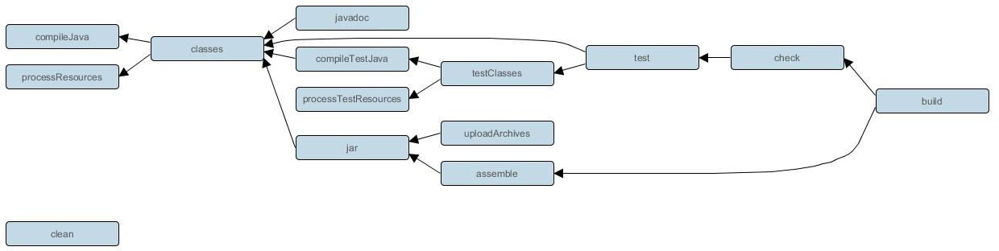

### [3.3.4、任务执行](https://www.bilibili.com/video/BV1yT41137Y7?p=27)

#### 任务执行语法：gradle [taskName...] [--option-name...]。

| 分类                                                         | 解释                                                         |
| ------------------------------------------------------------ | ------------------------------------------------------------ |
| **常见的任务（\*）**                                         | `gradle build`: 构建项目:编译、测试、打包等操作`gradle run` :运行一个服务,需要application 插件支持，并且指定了主启动类才能运行`gradle clean`: 请求当前项目的 build 目录`gradle init` : 初始化 gradle 项目使用`gradle wrapper`:生成wrapper 文件夹的。gradle wrapper 升级wrapper 版本号：`gradle wrapper --gradle-version=4.4``gradle wrapper --gradle-version 5.2.1 --distribution-type all` :关联源码用 |
| **项目报告相关任务**                                         | `gradle projects` : 列出所选项目及子项目列表，以层次结构的形式显示`gradle tasks`: 列出所选项目【当前 project,不包含父、子】的已分配给任务组的那些任务。`gradle tasks --all` :列出所选项目的所有任务。`gradle tasks --group="build setup"`:列出所选项目中指定分组中的任务。`gradle help --task someTask` :显示某个任务的详细信息`gradle dependencies` :查看整个项目的依赖信息，以依赖树的方式显示`gradle properties` 列出所选项目的属性列表 |
| 调试相关选项                                                 | -h,--help: 查看帮助信息-v, --version:打印 Gradle、 Groovy、 Ant、 JVM 和操作系统版本信息。-S, --full-stacktrace:打印出所有异常的完整(非常详细)堆栈跟踪信息。-s,--stacktrace: 打印出用户异常的堆栈跟踪(例如编译错误)。-Dorg.gradle.daemon.debug=true: 调试 Gradle  守护进程。-Dorg.gradle.debug=true:调试 Gradle 客户端(非 daemon)进程。-Dorg.gradle.debug.port=(port number):指定启用调试时要侦听的端口号。默认值为 5005。 |
| 性能选项:【**备注**: 在gradle.properties 中指定这些选项中的许多选项，因此不需要命令行标志】 | --build-cache, --no-build-cache： 尝试重用先前版本的输出。默认关闭(off)。--max-workers: 设置 Gradle 可以使用的woker 数。默认值是处理器数。-parallel, --no-parallel: 并行执行项目。有关此选项的限制，请参阅并行项目执行。默认设置为关闭(off) |
| 守护进程选项                                                 | --daemon, --no-daemon:  使用 Gradle 守护进程运行构建。默认是on--foreground:在前台进程中启动 Gradle  守护进程。-Dorg.gradle.daemon.idletimeout=(number of milliseconds):Gradle Daemon 将在这个空闲时间的毫秒数之后停止自己。默认值为 10800000(3 小时)。 |
| 日志选项                                                     | -Dorg.gradle.logging.level=(quiet,warn,lifecycle,info,debug):通过 Gradle 属性设置日志记录级别。-q, --quiet: 只能记录错误信息-w, --warn: 设置日志级别为 warn-i, --info: 将日志级别设置为 info-d, --debug:登录调试模式(包括正常的堆栈跟踪) |
| **其它(\*)**                                                 | -x:-x 等价于: --exclude-task : 常见gradle -x test clean build--rerun-tasks: 强制执行任务，忽略up-to-date ,常见gradle build --rerun-tasks--continue: 忽略前面失败的任务,继续执行,而不是在遇到第一个失败时立即停止执行。每个遇到的故障都将在构建结束时报告，常见：gradle build --continue。gradle init --type pom :将maven 项目转换为gradle 项目(根目录执行)gradle [taskName] :执行自定义任务 |
| ...                                                          |                                                              |

更 详 细 请 参 考 官 方 文 档 : [https://docs.gradle.org/current/userguide/command_line_interface.html#sec:command_line_executing_tasks](https://docs.gradle.org/current/userguide/command_line_interface.html)

拓展：gradle  任务名是缩写:  任务名支持驼峰式命名风格的任务名缩写，如：connectTask  简写为：cT,执行任务 gradle cT。

拓展 1:前面提到的Gradle 指令本质:一个个的task[任务], Gradle 中所有操作都是基于任务完成的。

**拓展 2**：gradle 默认各指令之间相互的依赖关系：

相关解释：

