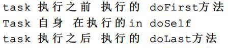

### 任务类型

前面我们定义的task 都是DefaultTask 类型的,如果要完成某些具体的操作完全需要我们自己去编写gradle 脚本，势必有些麻烦，那有没有一些现成的任务类型可以使用呢？有的，Gradle 官网给出了一些现成的任务类型帮助我们快速完成想要的任务，我们只需要在创建任务的时候，指定当前任务的类型即可，然后即可使用这种类型中的属性和API 方法了。

| 常见任务类型             | 该类型任务的作用                                             |
| ------------------------ | ------------------------------------------------------------ |
| Delete                   | 删除文件或目录                                               |
| Copy                     | 将文件复制到目标目录中。此任务还可以在复制时重命名和筛选文件。 |
| CreateStartScripts       | 创建启动脚本                                                 |
| Exec                     | 执行命令行进程                                               |
| GenerateMavenPom         | 生成 Maven 模块描述符(POM)文件。                             |
| GradleBuild              | 执行 Gradle 构建                                             |
| Jar                      | 组装 JAR 归档文件                                            |
| JavaCompile              | 编译 Java 源文件                                             |
| Javadoc                  | 为 Java 类 生 成 HTML API 文 档                              |
| PublishToMavenRepository | 将 MavenPublication  发布到 mavenartifactrepostal。          |
| Tar                      | 组装 TAR 存档文件                                            |
| Test                     | 执行 JUnit (3.8.x、4.x 或 5.x)或 TestNG 测试。               |
| Upload                   | 将 Configuration 的构件上传到一组存储库。                    |
| War                      | 组装 WAR 档案。                                              |
| Zip                      | 组装 ZIP 归档文件。默认是压缩 ZIP 的内容。                   |

**提示 1**：如果想看更详细的gradle 自带Task 类型，请参考官方文档: https://docs.gradle.org/current/dsl/index.html

**提示 2**:  官方文档在给出这些任务类型的时候，同时给出了案例代码，可以点进去上述官网地址中的某个类型中观看

具体使用例如：

tasks.register('myClean', Delete) { delete buildDir

}

在命令行执行 gradle myClean 发现就可以将当前project 的 build 目录删除当然除了gradle 自带的 task 类型,我们也可以自定义task 类型，如下所示： **拓展 4**:自定义 Task 类型

def myTask=task MyDefinitionTask (type: CustomTask) myTask.doFirst(){

println "task 执行之前 执行的 doFirst方法"

}

myTask.doLast(){

println "task 执行之后 执行的 doLast方法"

}

class CustomTask extends DefaultTask {

//@TaskAction表示Task本身要执行的方法@TaskAction

def doSelf(){

println "Task 自身 在执行的in doSelf"

}

}

测试：gradle MyDefinitionTask

控制台输出：