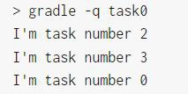

### 动态分配任务

gradle 的强大功能不仅仅用于定义任务的功能。例如，可以使用它在循环中注册同一类型的多个任务

4.times { counter -> tasks.register("task$counter") {

doLast {

println "I'm task number $counter"

}

}

}

一旦注册了任务,就可以通过 API 访问它们。例如，您可以使用它在运行时动态地向任务添加依赖项。Ant 不允许这样的事情发生。

4.times { counter -> tasks.register("task$counter") {

doLast {

println "I'm task number $counter"

}

}

}

tasks.named('task0') { dependsOn('task2', 'task3') }

构建 4 个任务,但是任务 0 必须依赖于任务 2 和 3,那么代表任务 2 和 3 需要在任务 0 之前优先加载。具体测试如下:

### 