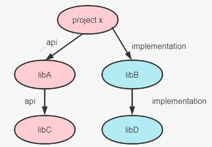
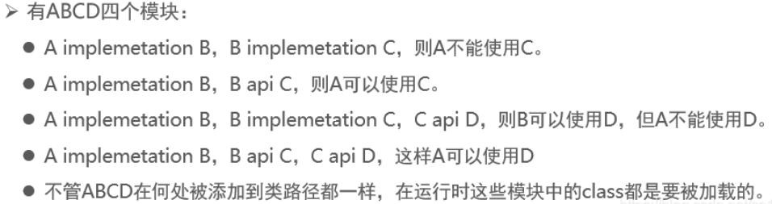

### 依赖的类型

类似于 Maven 的 scope 标签，gradle 也提供了依赖的类型,具体如下所示:

| compileOnly            | 由java插件提供,曾短暂的叫provided,后续版本已经改成了compileOnly,适用于编译期需要而不需要打包的情况 |
| ---------------------- | ------------------------------------------------------------ |
| **runtimeOnly**        | 由 java 插件提供,只在运行期有效,编译时不需要,比如mysql 驱动包。,取代老版本中被移除的 runtime |
| **implementation**     | 由 java 插件提供,针对源码[src/main 目录] ,在编译、运行时都有效,取代老版本中被移除的 compile |
| testCompileOnly        | 由 java 插件提供,用于编译测试的依赖项，运行时不需要          |
| testRuntimeOnly        | 由 java 插件提供,只在测试运行时需要，而不是在测试编译时需要,取代老版本中被移除的testRuntime |
| **testImplementation** | 由 java 插件提供,针对测试代码[src/test 目录] 取代老版本中被移除的testCompile |
| **providedCompile**    | war 插件提供支持，编译、测试阶段代码需要依赖此类jar 包，而运行阶段容器已经提供了相应的支持，所以无需将这些文件打入到war 包中了;例如servlet-api.jar、jsp-api.jar |
| compile                | 编译范围依赖在所有的 classpath 中可用，同时它们也会被打包。在gradle 7.0 已经移除 |
| runtime                | runtime 依赖在运行和测试系统的时候需要,在编译的时候不需要,比如mysql 驱动包。在 gradle 7.0 已经移除 |
| **api**                | java-library 插件提供支持,这些依赖项可以传递性地导出给使用者，用于编译时和运行时。取代老版本中被移除的 compile |
| compileOnlyApi         | java-library 插件提供支持,在声明模块和使用者在编译时需要的依赖项，但在运行时不需要。 |

#### 官方文档参考：

[https://docs.gradle.org/current/userguide/java_library_plugin.html#java_library_plugin:](https://docs.gradle.org/current/userguide/java_library_plugin.html) 各个依赖范围的关系和说明[https://docs.gradle.org/current/userguide/upgrading_version_6.html#sec:configuration_removal ](https://docs.gradle.org/current/userguide/upgrading_version_6.html): 依赖范围升级和移除https://docs.gradle.org/current/userguide/java_library_plugin.html#java_library_plugin：API 和implemention 区别[https://docs.gradle.org/current/userguide/java_plugin.html#java_plugin:](https://docs.gradle.org/current/userguide/java_plugin.html) 执行java 命令时都使用了哪些依赖范围的依赖。**提示 1**：java 插件提供的功能，java-library 插件都提供。

### 、api 与implementation 区别

如下所示：

**编译时**:如果 libC 的内容发生变化,由于使用的是 api 依赖,依赖会传递,所以 libC、libA、projectX 都要发生变化,都需要重新编译,速度慢,**运行时：**libC、libA、projectX 中的class 都要被加载。

**编译时:**如果libD 的内容发生变化,由于使用的是implemetation 依赖,依赖不会传递,只有libD、libB 要变化并重新编译,速度快,**运行时：**libC、libA、projectX 中的class 都要被加载。

#### 拓展 3:api 和implementation 案例分析

api 的适用场景是多module 依赖，moduleA 工程依赖了 module B，同时module B 又需要依赖了 module C，modelA 工程也需要去依赖 module C,这个时候避免重复依赖module,可以使用 module B api  依赖的方式去依赖module C,modelA 工程只需要依赖 moduleB 即可。

**总之，除非涉及到多模块依赖，为了避免重复依赖，咱们会使用api,其它情况我们优先****选择implementation，****拥有大量的api 依赖项会显著增加构建时间。**