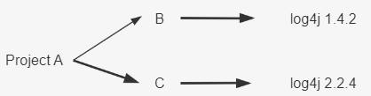
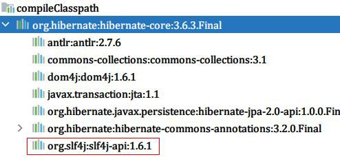
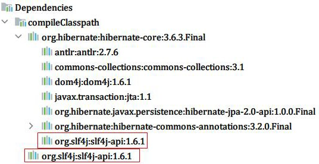

### 依赖冲突及解决方案

依赖冲突是指 "在编译过程中, 如果存在某个依赖的多个版本, 构建系统应该选择哪个进行构建的问题",如下所示:

A、B、C 都是本地子项目 module，log4j 是远程依赖。

**编译时：** B 用 1.4.2 版本的  log4j，C 用 2.2.4 版本的  log4j,B 和 C 之间没有冲突

**打包时：** 只能有一个版本的代码最终打包进最终的A对应的jar |war包，对于  Gradle 来说这里就有冲突了

案例演示：我们在 build.gradle 引入依赖库

dependencies {

testImplementation 'org.junit.jupiter:junit-jupiter-api:5.8.1' testRuntimeOnly 'org.junit.jupiter:junit-jupiter-engine:5.8.1' implementation 'org.hibernate:hibernate-core:3.6.3.Final'

}

修 改 build.gradle

dependencies {

testImplementation 'org.junit.jupiter:junit-jupiter-api:5.8.1' testRuntimeOnly 'org.junit.jupiter:junit-jupiter-engine:5.8.1' implementation 'org.hibernate:hibernate-core:3.6.3.Final' implementation 'org.slf4j:slf4j-api:1.4.0'

}

如上所示：默认下，Gradle 会使用最新版本的 jar 包【考虑到新版本的 jar 包一般都是向下兼容的】，实际开发中，还是建议使用官方自带的这种解决方案。**当然除此之外，Gradle 也为我们提供了一系列的解决依赖冲突的方法**: **exclude 移除一个依赖**，**不允许依赖传递**，**强制使用某个版本**。

- Exclude 排除某个依赖

dependencies {

testImplementation 'org.junit.jupiter:junit-jupiter-api:5.8.1' testRuntimeOnly 'org.junit.jupiter:junit-jupiter-engine:5.8.1' implementation('org.hibernate:hibernate-core:3.6.3.Final'){

//排除某一个库(slf4j)依赖:如下三种写法都行

exclude group: 'org.slf4j' exclude module: 'slf4j-api'

exclude group: 'org.slf4j',module: 'slf4j-api'

}

//排除之后,使用手动的引入即可。implementation 'org.slf4j:slf4j-api:1.4.0'

}

- 不允许依赖传递

dependencies {

testImplementation 'org.junit.jupiter:junit-jupiter-api:5.8.1' testRuntimeOnly 'org.junit.jupiter:junit-jupiter-engine:5.8.1' implementation('org.hibernate:hibernate-core:3.6.3.Final'){

//不允许依赖传递，一般不用

transitive(false)

}

//排除之后,使用手动的引入即可implementation 'org.slf4j:slf4j-api:1.4.0'

}

在添加依赖项时,如果设置 transitive 为false,表示关闭依赖传递。即内部的所有依赖将不会添加到编译和运行时的类路径。

- 强制使用某个版本

dependencies {

testImplementation 'org.junit.jupiter:junit-jupiter-api:5.8.1' testRuntimeOnly 'org.junit.jupiter:junit-jupiter-engine:5.8.1' implementation('org.hibernate:hibernate-core:3.6.3.Final')

//强制使用某个版本!!【官方建议使用这种方式】

implementation('org.slf4j:slf4j-api:1.4.0!!')

//这种效果和上面那种一样,强制指定某个版本implementation('org.slf4j:slf4j-api:1.4.0'){

version{

strictly("1.4.0")

}

}

}

**拓展**：我们可以先查看当前项目中到底有哪些依赖冲突：

//下面我们配置，当 Gradle 构建遇到依赖冲突时，就立即构建失败

configurations.all() **{**

Configuration configuration **->**

//当遇到版本冲突时直接构建失败configuration.resolutionStrategy.failOnVersionConflict()

**}**