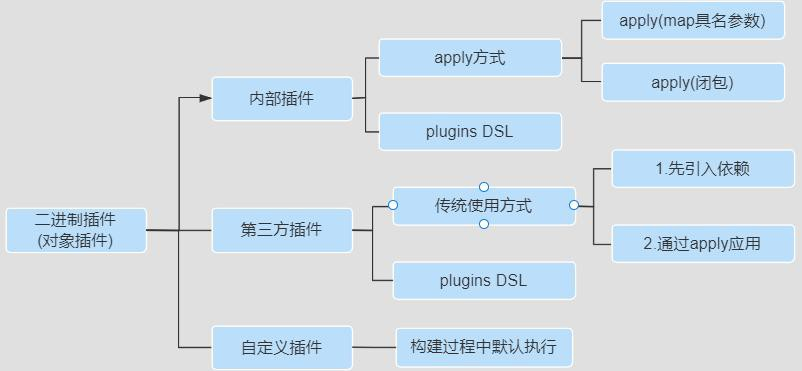
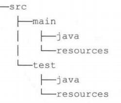
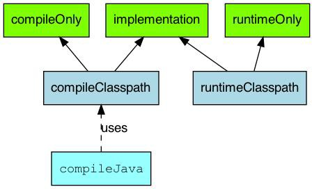
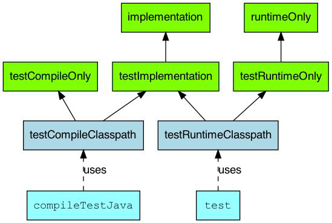

## Gradle 插件

### 、使用插件的原因

简单的说,通过应用插件我们可以:

1. 促进代码重用、减少功能类似代码编写、提升工作效率
2. 促进项目更高程度的模块化、自动化、便捷化
3. 可插拔式的的扩展项目的功能

### 、插件的作用

在项目构建过程中做很多事情，把插件应用到项目中，通常可以完成:

1、可以添加任务【task】到项目中，从而帮助完成测试、编译、打包等。

2、可以添加依赖配置到项目中。

3、可以向项目中拓展新的扩展属性、方法等。

4、可以对项目进行一些约定，如应用 Java 插件后，约定src/main/java 目录是我们的源代码存在位置，编译时编译这个目录下的Java 源代码文件。

### 、插件的分类和使用

#### 第一种：脚本插件

脚本插件的本质就是一个脚本文件，使用脚本插件时通过apply from:将脚本加载进来就可以了，后面的脚本文件可以是本地的也可以是网络上的脚本文件，下面定义一段脚本，我们在 build.gradle 文件中使用它，具体如下：

//version.gradle文件ext {

company= "尚硅谷" cfgs = [

compileSdkVersion : JavaVersion.VERSION_1_8

]

spring = [

version : '5.0.0'

]

}

下面将将在构建文件中使用这个脚本文件，具体如下:

//build.gradle文件

//map作为参数

apply from: 'version.gradle' task taskVersion{

doLast{

println "公司名称为：${company},JDK版本是${cfgs.compileSdkVersion},版本号是${spring.version}"

}

}

上述代码的执行结果如下：

PS D:\repos\idearepos\root> gradle -q taskVersion

版本是2.0,版本号是1

**意义：**脚本文件模块化的基础，可按功能把我们的脚本进行拆分一个个公用、职责分明的文件，然后在主脚本文件引用， 比如：将很多共有的库版本号一起管理、应用构建版本一起管理等。

#### 第二种：对象插件之内部插件[核心插件]

二进制插件[对象插件]就是实现了 org.gradle.api.Plugin  接口的插件，每个 Java Gradle 插件都有一个 plugin id。

可通过如下方式使用一个 Java 插件： apply plugin : 'java' //map具名参数方式或者：

//也可以使用**闭包**作为project.apply方法的一个参数apply{

plugin 'java'

}

通过上述代码就将 Java  插件应用到我们的项目中了，对于 Gradle 自带的核心插件都有唯一的 plugin id，其中 java  是Java 插件的 plugin id,这个 plugin id 必须是唯一的，可使用应用包名来保证 plugin id 的唯一性。这里的 java  对应的具体类型是 org.gradle.api.plugins.JavaPlugin，所以可以使用如下方式使用 Java 插件：

//使用方式1：Map具名参数,全类名

apply **plugin**:org.gradle.api.plugins.JavaPlugin

//org.gradle.api.plugins默认导入*：*使用方式2 apply **plugin**:JavaPlugin

apply **plugin**: **'java'** //核心插件，无需事先引入，使用方式3:插件的id

Gradle 中提供的二进制插件【核心插件】,可参考: https://docs.gradle.org/current/userguide/plugin_reference.html

#### 第二种：对象插件之第三方插件

如果是使用第三方发布的二进制插件，一般需要配置对应的仓库和类路径,

//使用传统的应用方式buildscript **{**

ext **{**

springBootVersion = **"2.3.3.RELEASE"**

**}**

repositories **{**

mavenLocal()

maven **{** url [**'http://maven.aliyun.com/nexus/content/groups/public'** ](http://maven.aliyun.com/nexus/content/groups/public')**}**

jcenter()

**}**

// 此处先引入插件

dependencies **{**

classpath(**"org.springframework.boot:spring-boot-gradle-plugin:**$**{**springBootVersion**}****"**)

**}**

**}**

**//再应用插件**

apply **plugin**: **'org.springframework.boot'** //社区插件,需要事先引入，不必写版本号

但是如果是第三方插件已经被托管在 https://plugins.gradle.org/ 网站上，就可以不用在 buildscript 里配置 classpath

依赖了，直接使用新出的 plugins DSL 的方式引用，案例如下： 使 用 plugins DSL 方 式

plugins {

id 'org.springframework.boot' version '2.4.1'

}

**注意**：

1. 如果使用老式插件方式buildscript{}要放在build.gradle 文件的最前面,而新式plugins{}没有该限制。
2. 托管在网站gradle 插件官网的第三方插件有两种使用方式，一是传统的buildscript 方式，一种是 plugins DSL 方式 。

#### 第二种：对象插件之用户自定义插件

**interface** GreetingPluginExtension { Property<String> getMessage() Property<String> getGreeter()

}

**class** GreetingPlugin **implements** Plugin<Project> {

**void** apply(Project project) {

**def** extension = project.extensions.create(**'greeting'**, GreetingPluginExtension) project.task(**'hello'**) **{**

doLast **{**

println **"**$**{**extension.message.get()**}** **from** $**{**extension.greeter.get()**}****"**

**}**

**}**

}

}

apply **plugin**: GreetingPlugin

// Configure the extension using a DSL block greeting **{**

message = **'Hi'**

greeter = **'Gradle'**

**}**

参考地址：https://docs.gradle.org/current/userguide/custom_plugins.html

我们直接执行 hello 任务./gradle hello 即可,这种方式实现的插件我们一般不使用，因为这种方式局限性太强，只能本

Project，而其他的Project 不能使用。

### 、buildSrc 项目

buildSrc 是Gradle 默认的插件目录，编译 Gradle 的时候会自动识别这个目录，将其中的代码编译为插件。

1.首先先建立一个名为 buildSrc 的 java Module,将 buildSrc 从 included modules 移除,重新构建,然后只保留 build.gradle

和src/main 目录，其他全部删掉,注意名字一定是 buildSrc,不然会找不到插件。2.然后修改Gradle 中的内容

apply plugin: 'groovy' // 必 须apply plugin: 'maven-publish'

dependencies {

implementation gradleApi() //必须implementation localGroovy() //必须

}

repositories {

google() jcenter()

mavenCentral() //必须

}

//把项目入口设置为src/main/groovy sourceSets {

main {

groovy {

srcDir 'src/main/groovy'

}

}

}

1. 创建入口目录，在src/main 下创建代码入口目录，如下：
2. 然后实现插件代码Text.groovy，注意文件后缀为groovy,文件要引入package com.atguigu

package com.atguigu

import org.gradle.api.Plugin import org.gradle.api.Project

class Text implements Plugin<Project>{ @Override

void apply(Project project) { project.task("atguigu"){

doLast{

println("自定义atguigu插件")

}

}

}

}

1. 接下来在 main 目录下创建 resources 目录,在 resources 目录下创建 META-INF 目录，在 META-INF 目录下创建

gradle-plugins 目录，在gradle-plugins 目录下创建properties 文件

1. properties 文件可以自己命名，但是要以.properties 结尾，比如 com.atguigu.plugin.properties,其 com.atguigu.plugin 就是定义的包名路径.

1. 最后需要在properties 文件中指明我们实现插件的全类名 implementation-class=com.atguigu.Text

到目前为止我们的插件项目已经写完了，在 module 引入我们写的插件 apply plugin:'com.atguigu.plugin',然后执行插件的Task，./gradle atguigu

输出:

这种形式的写法，在我们整个工程的module 都可以使用，但也只是限制在本工程，其他工程不能使用。

**改进**：

第二种写插件的方式他只能在本工程中使用，而其他的项目工程不能使用，有时候我们需要一个插件在多个工程中使用， 这时候我们就需要把插件上传maven 中。

第一步: 首先将上述buildSrc 目录复制一份，修改文件夹名，然后在settings.gradle 文件中使用include 引入第二步：修改build.gradle 文件，发布到maven 仓库中

apply plugin: 'groovy' // 必 须apply plugin: 'maven-publish' dependencies {

implementation gradleApi() //必须implementation localGroovy() //必须

}

repositories {

google() jcenter()

mavenCentral() //必须

}

sourceSets { //把项目入口设置为src/main/groovy main {

groovy {

srcDir 'src/main/groovy'

}

}

}

publishing {

publications {

myLibrary(MavenPublication) {

groupId = 'com.atguigu.plugin' //指定GAV坐标信息artifactId = 'library'

version = '1.1'

from components.java//发布jar包

//from components.web///引入war插件，发布war包

}

}

repositories {

maven { url "$rootDir/lib/release" }

//发布项目到私服中

//	maven {

//	name = 'myRepo' //name属性可选,表示仓库名称，url必填

//	//发布地址:可以是本地仓库或者maven私服

//	//url = layout.buildDirectory.dir("repo")

//	//url=['http://my.org/repo'](http://my.org/repo')

//	// change URLs to point to your repos, e.g. http://my.org/repo

//	//认证信息:用户名和密码

//	credentials {

//	username = 'joe'

//	password = 'secret'

//	}

//	}

}

}

第三步：执行publish 指令,发布到根 project 或者maven 私服仓库。

第四步：使用插件,在项目级 build.gradle 文件中将插件添加到 classpath：

buildscript {

repositories {

maven { url "$rootDir/lib/release" }

}

dependencies {

classpath "com.atguigu.plugin:library:1.1"

}

}

apply plugin: 'java'

//是在 atguiguplugin  中定义的插件 ID apply plugin: 'com.atguigu.plugin'

第五步：执行 gradle build 指令就会在控制台看到自定义插件的输出，说明自定义插件就已经生效了。

最后，至于如何写一个插件，能帮助项目更加自动化或者便捷化，是值得大家未来需要长期思考、关注、努力的点。

### 、插件的关注点

#### 第一点: 插件的引用

**apply** plugin: '插件名'

#### 第二点:主要的功能[任务]

当我们在工程中引入插件后，插件会自动的为我们的工程添加一些额外的任务来完成相应的功能。以Java 插件为例，当我们加入java 插件之后，就加入了如下功能：

具体大家可通过gradle tasks 查看加入某个插件前后的区别。

说明：Gradle 中的任务依赖关系是很重要的，它们之间的依赖关系就形成了构建的基本流程。

#### 第三点:工程目录结构

一些插件对工程目结构有约定，所以我们一般遵循它的约定结构来创建工程，这也是 Gradle 的“约定优于配置”原则。例如java 插件规定的项目源集目录结构如下所示：

如果要使用某个插件就应该按照它约定的目录结构设置，这样能大大提高我们的效率，当然各目录结构也可以自己定义。

#### 第四点：依赖管理

比如前面我们提到的 依赖的类型[依赖管理]部分，不同的插件提供了不同的依赖管理。

#### 第五点：常用的属性

例如：Java  插件会为工程添加一些常用的属性,我们可以直接在编译脚本中直接使用。属性名称	类型	默认值	描述

reportsDirName	String	reports	生成报告的目录名称reportsDir	File（只读）buildDir/reportsDirName	生成报告的目录

testResultsDirName	String	test-results	生成测试result.xml 文件的目录名称testResultsDir	File（只读）reportsDir/testReportDirName	生成测试报告的目录

libsDirName	String	libs	生成lib 库的目录名称libsDir	File（只读）buildDir/libsDirName	生成lib 库的目录distsDirName	String	distributions	生成发布文件的目录名称distsDir	File（只读）buildDir/distsDirName	生成发布文件的目录docsDirName	String	docs	生成帮助文档的目录名称docsDir	File（只读）buildDir/docsDirName	生成帮助文档的目录

dependencyCacheDirNameString	dependency-cache	存储缓存资源依赖信息的目录名称dependencyCacheDir	File（只读）buildDir/dependencyCacheDirName存储缓存资源依赖信息的目录

当然，这里还有一些其它属性

属性名称	类型	默认值	描述

包含工程的资源集合（source

sourceSets	SourceSetContainer (只读)	Not null

JavaVersion，也可以使用字符串或数字，

sets.）

编译java 文件时指定使用的java

sourceCompatibility

比 如 '1.5' 或 者 1.5

根据使用的JVM 定

版本

targetCompatibility

JavaVersion，也可以使用字符串或数字，

sourceCompatibility生成classes 的java 版本

比 如 '1.5' 或 者 1.5

archivesBaseName  String	projectName

作为归档文件的默认名称，如JAR 或者ZIP 文件的名称

### 、Java 插件分析

参考官网：https://docs.gradle.org/current/userguide/plugin_reference.html,以Java 插件为例，讲解需要关注的几点：

#### 第一点：我们要关注插件使用

plugins {

id 'java'

}

**第二点：我们要关注插件的功能**

我们可通过官方文档介绍了解某个插件功能或者百度、再或者大家可以通过 gradle tasks 查看加入java 插件前后的区别。

#### 第三点：项目布局

一般加入一个插件之后，插件也会提供相应的目录结构，例如：java 插件的目录结构

当然这个默认的目录结构也是可以改动的例如：

sourceSets {

main {

java {

srcDirs = ['src/java']

}

resources {

srcDirs = ['src/resources']

}

}

}

也可设置源集的属性等信息。

#### 第四点：依赖管理：以java 插件为例，提供了很多依赖管理项

**源集依赖关系配置**

#### 测试源集依赖关系配置第五点：额外的属性和方法：

可参考官方文档： sourceCompatibility(JavaVersion.*VERSION_1_8*)