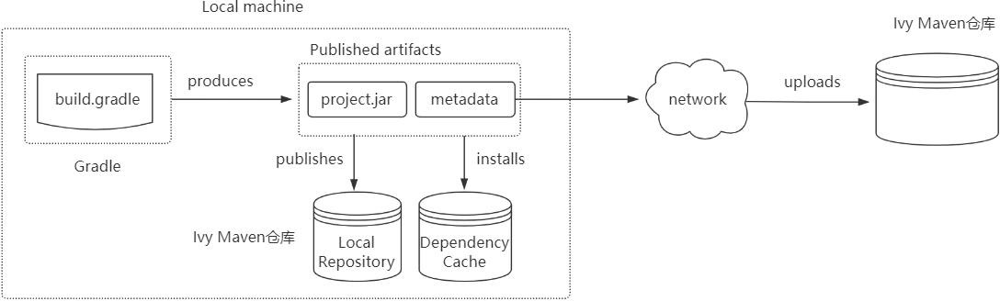

## publishing 项目发布

接下来,将咱们写好的模块发布发布到公司的私服以供别人使用,如下所示：

### 、引入maven 发布的插件

plugins {

id 'java-library' //如果发布war包，需要war插件,java-library支持带源码、文档发布id 'maven-publish'

}

1. 1. 1. **、设置发布代码**

//带源码和javadoc的发布:需要'java-library'插件支持:它是java的升级版，java插件的功能java-library都有

//javadoc.options.encoding="UTF-8"

//java {

//	withJavadocJar()

//	withSourcesJar()

//} publishing **{**

publications **{**

myLibrary(MavenPublication) **{**

groupId = **'org.gradle.sample'** //指定GAV坐标信息artifactId = **'library'**

version = **'1.1'**

from components.java//发布jar包

//from components.web///引入war插件，发布war包

**}**

**}**

repositories **{**

**//本地仓库位于USER_HOME/.m2/repository** **mavenLocal()**

**//发布项目到私服中**

maven **{**

name = **'myRepo'** //name属性可选,表示仓库名称，url必填

//发布地址:可以是本地仓库或者maven私服

//url = layout.buildDirectory.dir("repo")

// change URLs to point to your repos, e.g. http://my.org/repo

**def** releasesRepoUrl = layout.buildDirectory.dir(**'repos/releases'**)

**def** snapshotsRepoUrl = layout.buildDirectory.dir(**'repos/snapshots'**)

url = version.endsWith(**'SNAPSHOT'**) ? snapshotsRepoUrl : releasesRepoUrl

//认证信息:用户名和密码

//	credentials {

//	username = 'joe'

//	password = 'secret'

//	}

**}**

**}**

**}**

### 、执行发布指令

执 行 发 布 命 令 ， 将 项 目 发 布 到 本 地 仓 库 或 者 远 程 仓 库 。 常 见 的 发 布 指 令 有 ： generatePomFileForPubNamePublication: 生成 pom  文件publishPubNamePublicationToRepoNameRepository:发布项目到指定仓库,如果没有仓库名，默认为maven

publishPubNamePublicationToMavenLocal: 将 PubName  发布复制到本地 Maven 仓库中包括POM 文件和其他元数据。

#### publish: 发布到 repositories 中指定的仓库(为比如 Maven 私服)

publishToMavenLocal: 执行所有发布任务中的操作发布到本地 maven 仓库【默认在用户家目录下的.m2/repository】。