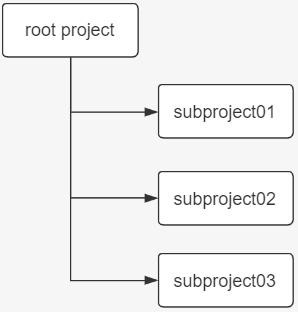

## 生命周期中Hook

生命周期中的这些钩子函数都是由 gradle 自动回调完成的,利用这些钩子函数可以帮助我们实现一些我们想要的功能。

Gradle 在生命周期各个阶段都提供了用于回调的钩子函数:

Gradle 初始化阶段:

- 在 settings.gradle 执行完后,会回调 Gradle 对象的 settingsEvaluated 方法
- 在构建所有工程 build.gradle 对应的Project 对象后,也既初始化阶段完毕,会回调 Gradle 对象的projectsLoaded 方法

Gradle 配置阶段:

- Gradle 会循环执行每个工程的 build.gradle 脚本文件
- 在执行当前工程build.gradle 前,会回调Gradle 对象的 beforeProject 方法和当前Project 对象的 beforeEvaluate 方法, 虽然 beforeEvalute 属于 project 的生命周期, 但是此时 build script 尚未被加载, 所以 beforeEvaluate 的设置依 然要在 init script 或 setting script 中进行,不要在 build script 中使用 project.beforeEvaluate 方法。
- 在执行当前工程 build.gradle 后,会回调 Gradle 对象的afterProject 方法和当前Project 对象的 afterEvaluate 方法
- 在所有工程的 build.gradle 执行完毕后，会回调 Gradle 对象的 projectsEvaluated 方法
- 在构建 Task 依赖有向无环图后,也就是配置阶段完毕,会回调TaskExecutionGraph 对象的 whenReady 方法

Gradle 执行阶段:

- Gradle 会循环执行Task 及其依赖的 Task
- 在当前 Task 执行之前,会回调 TaskExecutionGraph 对象的 beforeTask 方法
- 在当前 Task 执行之后,会回调 TaskExecutionGraph 对象的 afterTask 方法当所有的 Task 执行完毕后，会回调 Gradle 对象的 buildFinish 方法。

**提示：**Gradle 执行脚本文件的时候会生成对应的实例，主要有如下几种对象：

1、Gradle 对象：在项目初始化时构建，全局单例存在，只有这一个对象

2、Project 对象：**每一个build.gradle文件** 都会转换成一个 Project 对象,类似于maven中的pom.xml文件

3、Settings 对象：settings.gradle 会转变成一个 settings  对象,和整个项目是一对一的关系,一般只用到include方法

4.、Task对象: 从前面的有向无环图中，我们也可以看出，gradle最终是基于Task的,一个项目可以有一个或者多个Task

钩子函数代码演示：项目目录结构如下：

在root project 的settings.gradle 文件中添加：

gradle.settingsEvaluated **{** //1.settingsEvaluated钩子函数,在初始化阶段完成

println **"settingsEvaluated"**

**}**

gradle.projectsLoaded **{** //2.projectsLoaded钩子函数,在初始化阶段完成println **"projectsLoaded"**

**}**

//声明一个变量：表示当前项目名,在每次执行某个项目的beforeEvaluate方法时先给projectName变量赋值

//这样方便在：gradle.beforeProject和afterProject两个钩子函数使用。

**def** projectName=**""**

gradle.addProjectEvaluationListener( **new** ProjectEvaluationListener(){

//3.执行各个project的beforeEvaluate：在配置阶段完成@Override

**void** beforeEvaluate(Project project) { projectName=project.name

println **"**$**{**project.name**}** **Project beforeEvaluate"**

}

//5.执行各个project的afterEvaluate：在配置阶段完成@Override

**void** afterEvaluate(Project project, ProjectState projectState) { println **"**$**{**project.name**}** **Project afterEvaluate"**

}

});

gradle.beforeProject **{**//4.执行各个project的beforeProject：在配置阶段完成

println **"**$**{**projectName**}** **beforeProject..."**

**}**

gradle.afterProject **{**//6.执行各个project的afterProject：在配置阶段完成

println **"**$**{**projectName**}** **afterProject..."**

**}**

//7.所有工程的 build.gradle 执行完毕后，回调 Gradle 对象的 projectsEvaluated 方法：在配置阶段完成

**def** rootProjectName=rootProject.getName() gradle.projectsEvaluated **{**

println **"**$**{**rootProjectName**}** **projectsEvaluated..."**

**}**

//8.配置阶段完毕后，回调 TaskExecutionGraph 对象的 whenReady 方法：在配置阶段完成

gradle.taskGraph.whenReady **{**

println **"**$**{**rootProjectName**}** **taskGraph whenReady..."**

**}**

//9.在当前Task执行之前,会回调 TaskExecutionGraph 对象的 beforeTask方法：在执行阶段完成gradle.taskGraph.beforeTask **{**task **->**

println **"this is the task** $**{**task.name**}** **of the project** $**{**task.getProject().name**}** **beforeTask.."**

**}**

//10.在当前Task执行之后,会回调 TaskExecutionGraph 对象的 afterTask方法：在执行阶段完成gradle.taskGraph.afterTask **{**task **->**

println **"this is the task** $**{**task.name**}** **of the project** $**{**task.getProject().name**}**  **afterTask.."**

**}**

//11.当所有的 Task 执行完毕后，会回调 Gradle 对象的 buildFinish 方法：在执行阶段完成

gradle.buildFinished **{**

println **"**$**{**rootProjectName**}** **buildFinished..."**

**}**

在root 的build.gradle 文件中添加:

task A {

println "root taskA" doFirst(){

println "root taskA doFirst"

}

doLast(){

println "root taskA doLast"

}

}

在subject01 的 build.gradle 文件中添加:

task B {

println "SubProject01 taskB" doFirst(){

println "SubProject01 taskB doFirst"

}

doLast(){

println "SubProject01 taskB doLast"

}

}

在subject02 的 build.gradle 文件中添加:

*//task C* *在上面*

task C{

*//* *依赖**task D*

dependsOn 'D'

println "SubProject02 taskC" doFirst(){

println "SubProject02 taskC doFirst"

}

doLast(){

println "SubProject02 taskC doLast"

}

}

*//task D* *在下面*

task D {

println "SubProject02 taskD" doFirst(){

println "SubProject02 taskD doFirst"

}

doLast(){

println "SubProject02 taskD doLast"

}

}

测试：在root 工程的根目录执行：gradle C .就能看到 gradle 生命周期的三个阶段，及每个阶段执行的钩子函数、还有在执行阶段有依赖关系的任务的执行顺序问题。

拓展 1：在settings.gradle 中添加监听器，**查看task 有向无环图**:

gradle.taskGraph.addTaskExecutionGraphListener(**new** TaskExecutionGraphListener() { @Override *//* *生成有向无环图*

**void** graphPopulated(TaskExecutionGraph taskExecutionGraph) { taskExecutionGraph.allTasks.forEach(task->{*//**核心逻辑:通过**taskExecutionGraph**获得所有的**task*

taskExecutionGraph.allTasks.forEach(releaseTask->{

println **"尚硅谷:"** + releaseTask.getProject().name + **":"** + releaseTask.name

})

})

}

})

测试：在root 工程根目录下执行：gradle C。查看测试结果：

拓展 2: 计算 Gradle 构建过程中各个阶段的耗时:需要注意，这里只是计算了初始化阶段的 settings 文件，并没有计算

init.gradle 初始化的时间。

**def** projectName=rootProject.getName() *//**定义项目名*

**long** beginOfSetting = System.*currentTimeMillis*() *//**初始化阶段开始时间*

**def** beginOfConfig *//* *配置阶段开始时间*

**def** configHasBegin = **false** *//**配置阶段是否开始了，只执行一次*

**def** beginOfProjectConfig = **new** HashMap() *//**存放每个**build.gradle* *执行之前的时间*

**def** beginOfTaskExecute *//* *执行阶段开始时间*

gradle.projectsLoaded **{** *//* *初始化阶段执行完毕*

println **"**$**{**projectName**}****工程 初始化总耗时**  $**{**System.*currentTimeMillis*() - beginOfSetting**}** **ms"**

**}**

*//build.gradle* *执行前*

gradle.beforeProject **{**Project project **->** **if**(!configHasBegin){

configHasBegin = **true**

beginOfConfig = System.*currentTimeMillis*()

}

beginOfProjectConfig.put(project,System.*currentTimeMillis*())

**}**

*//build.gradle* *执行后*

gradle.afterProject **{**Project project **->**

**def** begin = beginOfProjectConfig.get(project)

**if**(project.name == projectName) {

println **"根工程**$**{**projectName**}** **配置阶段耗时：**$**{**System.*currentTimeMillis*() - begin**}** **ms"**

}**else**{

println **"子工程**$**{**project.name**}** **配置阶段耗时：**$**{**System.*currentTimeMillis*() - begin**}** **ms"**

}

**}**

gradle.taskGraph.whenReady **{***//**配置阶段完毕*

println **"整个**$**{**projectName**}****项目在配置阶段总耗时：**$**{**System.*currentTimeMillis*() - beginOfConfig**}** **ms"**

beginOfTaskExecute = System.*currentTimeMillis*()

**}**

*//**执行阶段开始*

gradle.taskGraph.beforeTask **{**Task task **->**

task.doFirst **{**

task.ext.beginOfTask = System.*currentTimeMillis*()

**}**

task.doLast **{**

println **"**$**{**task.name**}****在执行阶段耗时：**$**{**System.*currentTimeMillis*() - task.ext.beginOfTask**}** **ms"**

**}**

**}**

gradle.buildFinished **{***//**执行阶段完毕*

println **" 执行阶段总耗时：**$**{**System.*currentTimeMillis*() - beginOfTaskExecute**}** **ms"**

println **" 整个构建过程耗时：**$**{**System.*currentTimeMillis*() - beginOfSetting**}** **ms"**

**}**