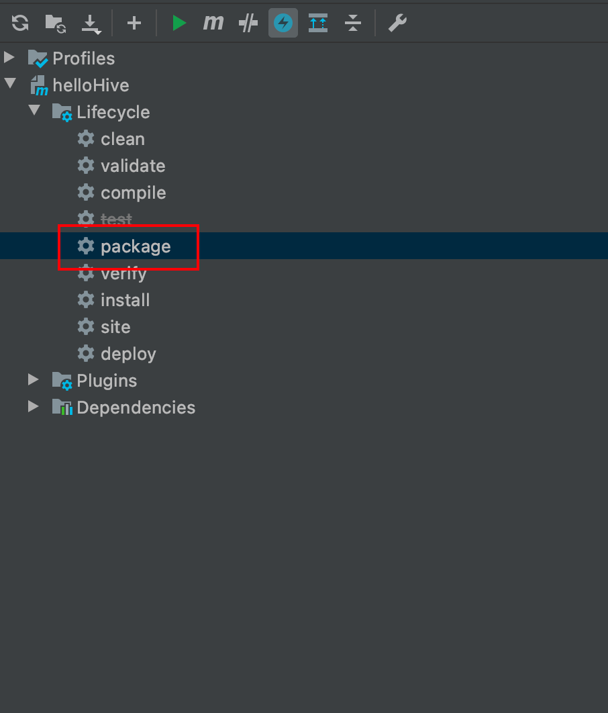

### 编写Java代码

```java
public class MyStringLength extends GenericUDF {
    @Override
    public ObjectInspector initialize(ObjectInspector[] objectInspectors) throws UDFArgumentException {
        if(objectInspectors.length!=1)
            throw new UDFArgumentException("参数个数不为1");

        return PrimitiveObjectInspectorFactory.javaIntObjectInspector;
    }

    @Override
    public Object evaluate(DeferredObject[] deferredObjects) throws HiveException {
        if(deferredObjects.length<=0)return 0;
        Object o = deferredObjects[0].get();
        if(o==null)return 0;
        return o.toString().length();
    }

    @Override
    public String getDisplayString(String[] strings) {
        return "";
    }
}
```

### 打包

使用maven工程打包命令即可



### 添加jar

```sql
add jar /u01/ysw/helloHive-1.0-SNAPSHOT.jar
```

### 创建UDF

```sql
create temporary function my_len as "org.example.hive.MyStringLength"
```

### 使用

```sql
select my_len(name) from business;
```

