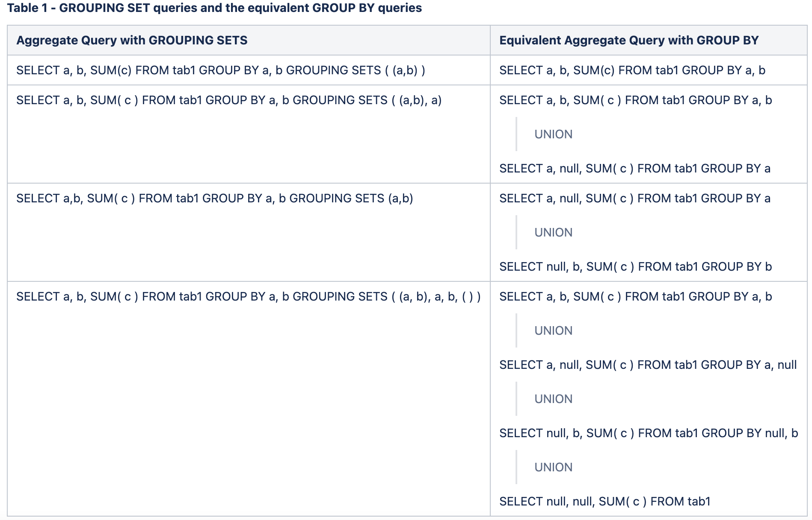

### 用途

可以将各种分组的排列组合union在一起

### grouping set与普通group by的对应关系



### 数据准备

```sql
1001,yknife,male,10
1002,lanlan,female,20
1003,lilei,male,10
1004,hanmeimei,female,30
1005,zhangsan,male,40
1006,wangwu,male,20
-- 创建表
create table emp(id string,name string,sex string,dept_id string) row format delimited fields terminated by ',';
-- 加载数据
load data local inpath '/u01/ysw/groupingSets.txt' into table emp;
-- 使用grouping sets
select sex,dept_id,count(*) from emp group by sex,dept_id grouping sets ((sex,dept_id),sex,dept_id,());
-- 结果
+---------+----------+------+
| NULL    | NULL     | 6    |
| NULL    | 10       | 2    |
| NULL    | 20       | 2    |
| NULL    | 30       | 1    |
| NULL    | 40       | 1    |
| female  | NULL     | 2    |
| female  | 20       | 1    |
| female  | 30       | 1    |
| male    | NULL     | 4    |
| male    | 10       | 2    |
| male    | 20       | 1    |
| male    | 40       | 1    |
+---------+----------+------+
```

