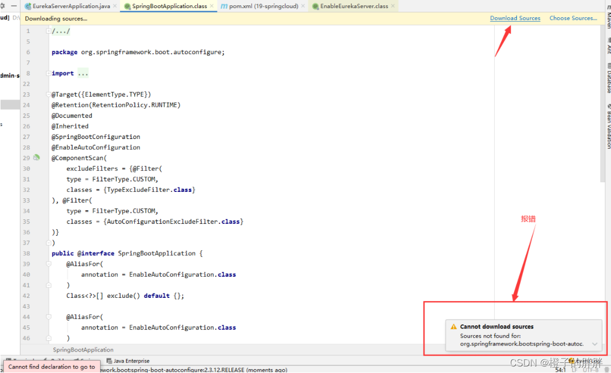
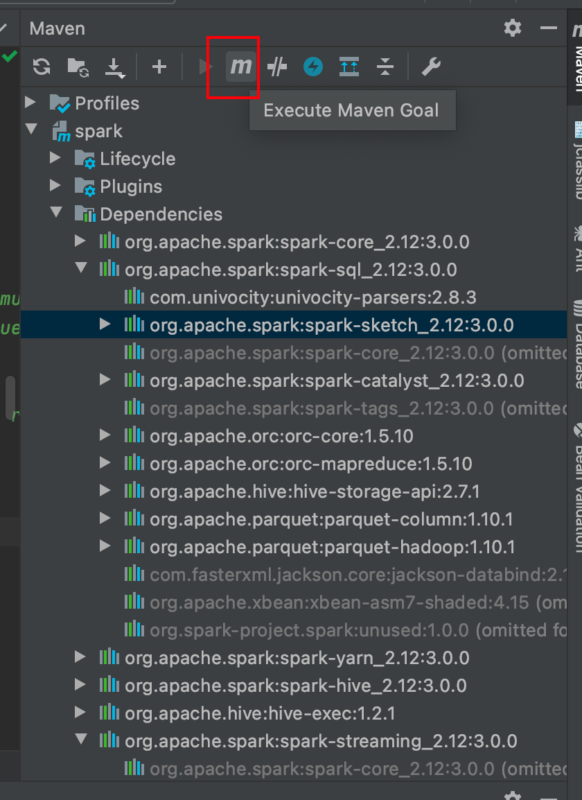

## IDEA Maven 下载源码出现：Cannot download sources Sources not found for: xxx

### 现象



### 点击Execute Maven Goal按钮



```sh
mvn dependency:resolve -Dclassifier=sources
```

执行后，IDEA会重新下载依赖包，下载完后再看源码就没有问题了。
