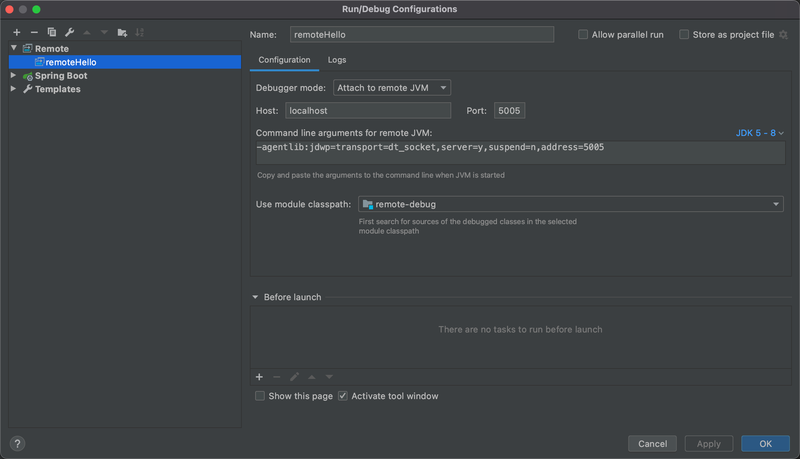

1. 打包SpringBoot的jar

2. 在idea中创建remote

   

3. 在SpringBoot的启动命令中加入远程debug的参数

   ```sh
   java -Xdebug -agentlib:jdwp=transport=dt_socket,server=y,suspend=n,address=5005 -jar remote-debug-0.0.1-SNAPSHOT.jar
   ```

   