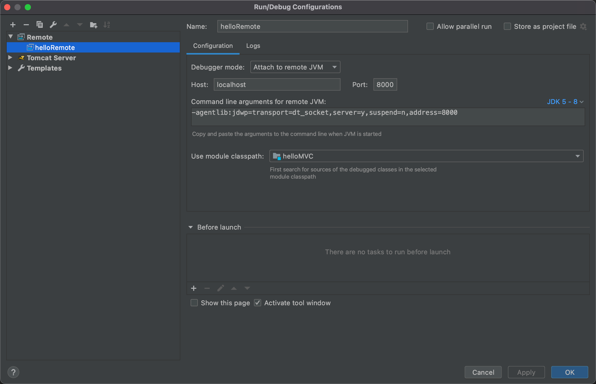

### JPDA概念

JPDA(Java platform debugger architecture)是java平台调试架构的简称，由java虚拟机后端和调试平台前端组成。

- 1、java虚拟机提供了java调试功能；
- 2、调试平台通过调试交互协议向java虚拟机请求服务，以对在虚拟机中运行的程序进行调试。

### idea 配置方法

#### 1. 启动tomcat 的jpda支持

启动tomcat的时候，不能只用默认启动方法

```undefined
./catalina.sh start
```

应该替换为

```undefined
./catalina.sh jpda start
```

默认jpda的端口是 8000，端口是调试平台与java虚拟机的通讯端口。

修改默认端口的方法，设置java_opts

```bash
JPDA_OPTS="-agentlib:jdwp=transport=dt_socket,address=1043,server=y,suspend=n"
```

#### 2. 本地建立JPDA断点调试前台

Run/Debug Configuration 中添加Remote 或者 远程tomcatServer 添加对应ip 和设置的端口号即可。

