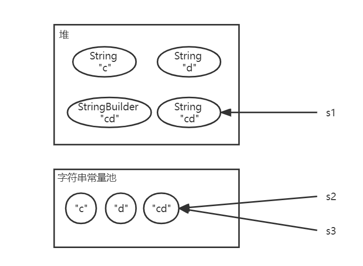
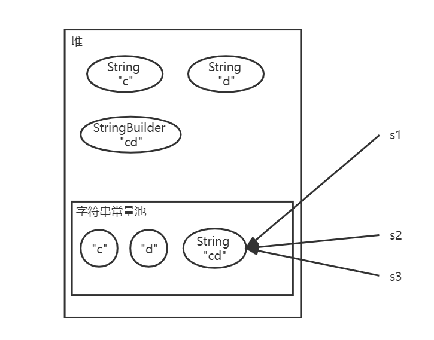
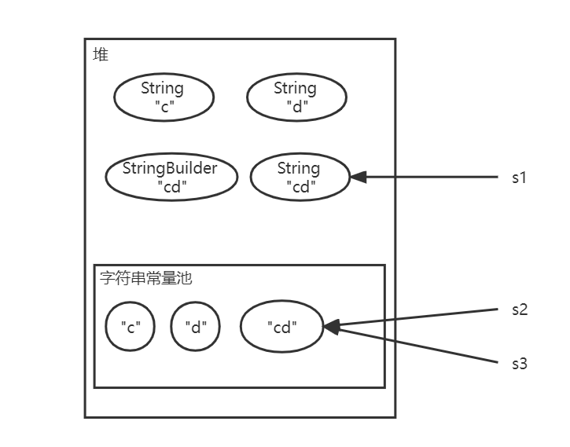
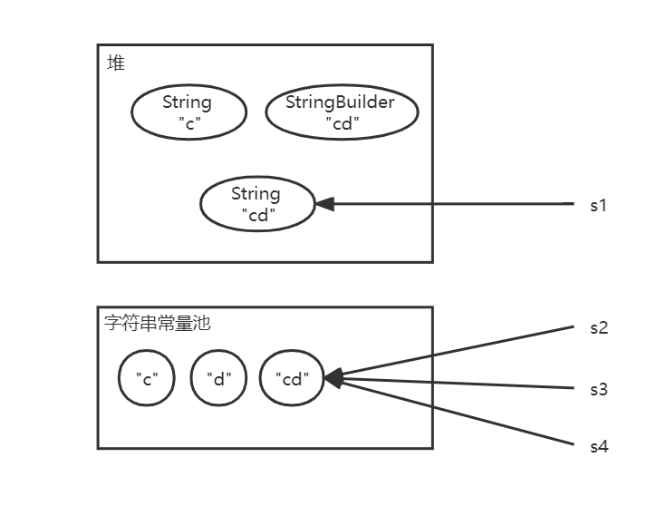
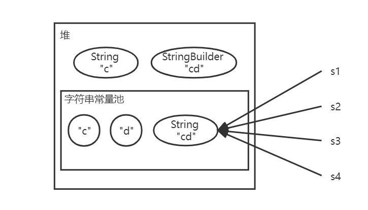

# 举例分析Java字符串相加 创建对象的过程、intern()方法、以及字符串的相等判断

## 前言

这部分我研究了好久，终于找到一个方法去理解。举例和画图对这部分的学习很有帮助，在此记录一下。

[字符串常量池](https://so.csdn.net/so/search?q=字符串常量池&spm=1001.2101.3001.7020)也叫StringTable。常量池中不会存在相同内容的字符串常量。

## 字符串对象的创建方式

有两种方式：

**（1）字面量直接赋值：如 String str = "a"。**

该方式JVM会先在字符串常量池中找有没有值为"a"的字符串，若存在，则直接返回其引用给变量str；若不存在，则创建一个字符串放入[常量池](https://so.csdn.net/so/search?q=常量池&spm=1001.2101.3001.7020)，然后返回其引用。

通过该方式创建的字符串，引用的都是字符串常量池中的对象，若字符串值相同，则引用相同，故使用==判断时它们的**地址相同**。

**（2）new关键字创建String对象：如 String str = new String("a")。**

（注意new方式的构造方法可以有多种参数，如字符串、byte数组、char数组等。）

该方式JVM也会先在字符串常量池中找有没有值为"a"的字符串，若存在，则直接用该字符串创建一个String对象并放入堆中，返回堆中对象的地址引用；若不存在，则先创建一个值为"a"的字符串放入常量池，然后用该字符串创建一个String对象放入堆中。故该方法会创建一个或两个对象。

通过该方式创建的字符串，每创建一个就会在堆中开辟一个空间、创建一个新对象，故无论值是否相同，它们的**地址都不同**，使用==判断时都为false。

## 举例分析创建对象的过程

```java
String s1 = "a";
String s2 = "b";
String s3 = "ab";
String s4 = "a" + "b";
String s5 = s1 + s2;
String s6 = new String("a") + new String("b");
String s7 = new String("a"+"b");
String s8 = new String("a") + "b";
```

① String s1 = "a";

在创建字符串对象时，jvm先到字符串常量池中检查，如果池中存在该字符串，就直接返回它的引用，否则就实例化一个字符串对象并放入池中。当前常量池中没有"a"，故创建一个字符串放入池中。

②③ 同①。

第三行代码运行后，当前字符串常量池中有"a"，"b"，"ab"。

④ String s4 = "a" + "b";

[字符串常量](https://so.csdn.net/so/search?q=字符串常量&spm=1001.2101.3001.7020)相加操作由于**编译期优化**，会直接被合并为一个字符串，即该行代码相 当于String s4 = "ab"。然后在字符串常量池中找是否存在字符串"ab"，此处存在，故该行代码不创建对象，且s4==s3（若不存在，则会将合并后的字符串放入常量池中）。

⑤ String s5 = s1 + s2;

字符串变量相加与不同于常量相加，其底层会使用StringBuilder，通过反编译可以知道该行代码相当于new StringBuilder().append("a").append("b").toString();

分析该代码产生对象的过程：

• new StringBuilder()---创建一个StringBuilder对象，放入堆中；

• .append("a")---由于常量池中已经有了字符串"a"，因此无需创建任何对象（若当前池中不存在"a"，则会先在常量池中创建一个字符串"a"，再执行append()）。append方法返回的是this即原StringBuilder对象，值为a，不会另外创建新的StringBuilder对象或String对象；

• .append("b")---同上，无需创建对象；

• .toString()---该方法会在堆中创建一个String类型对象，该方法和字符串常量池无关。

因此，该例中共在堆中创建了两个字符串对象（一个StringBuilder对象，一个String对象）。s5引用的是堆中的String对象。

**强调一下：**StringBuilder 的 toString() 方法，在字符串常量池中，不会生成"ab"。

⑥ String s6 = new String("a") + new String("b");

分析过程：先在堆中创建一个空的StringBuilder对象，再在堆中创建一个值为"a"的String对象，然后调用StringBuilder.append(String "a")；再在堆中创建值为"b"的String对象，然后调用StringBuilder.append(String "b")；最后调用StringBuilder.toString()生成String对象放入堆中。

⑦ String s7 = new String("a"+"b");

"a"+"b"直接会合并为"ab"，相当于String s7 = new String("ab")。

⑧ String s8 = new String("a") + "b";

分析过程：先创建一个空的StringBuilder对象，再创建一个值为"a"的String对象，然后调用StringBuilder.append("a")；然后在字符串常量池中找"b"，因为存在"b"所以直接调用StringBuilder.append("b")（若常量池中不存在"b"，则会先在常量池中创建字符串"b"然后调用append()方法，而无需创建在堆中创建值为"b"的String对象）；最后调用StringBuilder.toString()生成String对象。

## intern()方法

上边强调过，字符串变量拼接得到的字符串不会被放入字符串常量池中。但是通过intern()方法可以实现把字符串对象（的引用）放入常量池中。

字符串常量池的位置在不同jdk版本中有所不同，在jdk1.6中，常量池位于方法区中，jdk1.7及之后，常量池位于堆中。因此导致intern()方法在jdk 1.7前后版本中有所不同。

（1）**jdk 1.6**及之前版本中，先在字符串常量池中查找该字符串对象：

• 若常量池中存在，则不会放入池中。直接返回字符串常量池中该字符串对象的地址。

• 若不存在，则会在常量池中**复制一个该字符串**，然后返回**常量池中的该字符串**。

（2）**jdk 1.7**及之后版本中，先在字符串常量池中查找该字符串对象：

• 若常量池中存在，则不会放入池中。直接返回字符串常量池中该字符串对象的地址。

• 若不存在，则会在常量池中**创建一个该堆中字符串对象的引用地址**，然后返回常量池中的该**引用地址的引用**，即**堆中对象的引用**。也可以理解为：会把这个字符串对象**移动到**字符串常量池，然后返回**常量池中的该对象**。（注意1.7之后字符串常量池位于堆中，所以返回的该对象实际上位于**堆中的常量池**。）

#### 举例分析intern()方法在不同jdk版本中的区别

##### 例1：

```java
String s1 = "cd";
String s2 = s1.intern();
System.out.println(s1 == s2);
```

对于字面量字符串，它直接存在于字符串常量池，在调用intern()方法时不同jdk版本无区别。

s1在调用intern()方法后返回的是常量池中的"cd"。因此s1和s2均指向常量池中的"cd"，输出为true。


##### 例2：

```java
String s1 = new String("c") + new String("d");
String s2 = s1.intern();
String s3 = "cd";
System.out.println(s1 == s2);
System.out.println(s1 == s3);
System.out.println(s2 == s3);
```

（1）jdk 1.6中：

① String s1 = new String("c") + new String("d");

该行代码运行完：

**堆**中有：值为"c"的String对象，值为"d"的String对象，值为"cd"的StringBuilder对象，值为"cd"的String对象；

**字符串常量池**中有："c"，"d"。

② String s2 = s1.intern();

检查发现字符串常量池中没有"cd"，于是创建字符串"cd"放入常量池，并返回常量池中的"cd"的引用，即s2指向常量池中的"cd"。

③ String s3 = "cd";

检查发现字符串常量池中已存在"cd"，于是直接返回常量池中的"cd"的引用，即s3也指向常量池中的"cd"。

④⑤⑥

所以s1指向堆中的对象"cd"，s2和s3指向字符串常量池中的"cd"。故分别为false，false，true。




（2）jdk 1.7中：

① 同上。

② String s2 = s1.intern();

检查发现字符串常量池中没有"cd"，于是将堆中字符串对象"cd"放入堆中的常量池（s1的指向也变到了堆中的常量池中），并返回常量池中的该对象。s2最终指向堆中的常量池中的对象"cd"。

③ String s3 = "cd";

检查发现字符串常量池中已存在"cd"，于是直接返回常量池中的这个引用，即s3也指向堆中的常量池中的对象"cd"。

④⑤⑥

所以s1，s2，s3均指向堆中的常量池中的对象"cd"。故分别为true，true，true。




##### 例3：

调整一下例2中第2、3行的顺序：

```java
String s1 = new String("c") + new String("d");
String s2 = "cd";
String s3 = s1.intern();
System.out.println(s1 == s2);
System.out.println(s1 == s3);
System.out.println(s2 == s3);
```

（1）jdk 1.6中：

① String s1 = new String("c") + new String("d");

该行代码运行完：

**堆**中有：值为"c"的String对象，值为"d"的String对象，值为"cd"的StringBuilder对象，值为"cd"的String对象；

**字符串常量池**中有："c"，"d"。

② String s2 = "cd";

检查发现字符串常量池中没有"cd"，于是创建字符串"cd"放入常量池，并返回常量池中的"cd"的引用，即s2指向常量池中的"cd"。

③ String s3 = s1.intern();

检查发现字符串常量池中已存在"cd"，于是直接返回常量池中的"cd"的引用，即s3也指向常量池中的"cd"。

④⑤⑥

所以s1指向堆中的"cd"，s2，s3指向常量池中的"cd"。故分别为false，false，true。


（2）jdk 1.7中：输出同jdk1.6。




##### 例4：

```java
String s1 = new String("c") + "d";
String s2 = s1.intern();
System.out.println(s1 == s2);
String s3 = "cd";
String s4 = s3.intern();
System.out.println(s3 == s4);
System.out.println(s2 == s4);
```

（1）jdk 1.6中：

最终s1指向堆中的"cd"，s2、s3、s4指向字符串常量池中的"cd"。

三行输出分别为false，true，true。



（2）jdk 1.7中：

最终s1、s2、s3、s4都指向堆中常量池中的"cd"。

三行输出分别为true，true，true。




## 总结

（1）只有**连续的字符串常量**（引号包裹的字符串）进行相加时，才会在**编译期**被**优化**合并；只要出现字符串变量，就会在调用StringBuilder的append()方法，当然如果同时出现连续的字符串常量也会进行优化。

（2）字面量赋值的字符串存放在字符串常量池中，new的字符串对象存放在堆中。当创建字符串对象时，jvm会先检查字符串常量池。

（3）通过拼接得到的字符串，调用intern()方法，就可以存放到字符串常量池中。但是该方法在jdk 1.7前后有所不同：

• 1.7之前：该方法总是返回**字符串常量池**中的对象；

• 1.7及之后：若字符串常量池中已有该字符串，就直接返回常量池中的字符串引用；否则就把该字符串对象放入常量池，然后返回**堆中的常量池中的该对象的引用**。