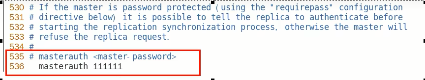

1. 官网地址：https://redis.io/docs/management/replication/

2. 架构图

   

3. 功能

   就是主从复制，master以写为主，slave以读为主，当master数据变化的时候，自动将新的数据异步同步到其他的slave数据库

4. 特性

   - 读写分离
   - 容灾恢复
   - 数据备份
   - 水平扩容支撑高并发

5. 配置步骤

   1. 配从(库)不配主(库)

   2. 权限细节，重要

      master如果配置了requirepass参数，需要密码登录 ，那么slave就要配置masterauth来设置校验密码，否则的话master会拒绝slave的访问请求

      

   3. 基本操作命令

      ```sh
      # 从节点
      info replication ：可以查看复制结点的主从关系和配置信息
      replicaof 主库IP 主库端口 ：一般写入进Redis.conf配置文件内，重启后依然生效
      # 改换门庭
      slaveof 主库IP 主库端口 ：
      每次与master断开之后，都需要重新连接，除非你配置进了redis.conf文件；在运行期间修改slave节点的信息，如果该数据库已经是某个主数据库的从数据库，那么会停止和原主数据库的同步关系 
      #自立为王
      slaveof no one ：使当前数据库停止与其他数据库的同步，$\textcolor{red}{转成主数据库，自立为王}$
      ```

   4. 主配置文件

      1. 开启daemonize yes

      2. 注释掉bind 127.0.0.1

      3. protected-mode no

      4. 指定端口

      5. 指定当前工作目录，dir

         ```sh
         dir /usr/local/redis/data/
         ```

      6. pid文件名字，pidfile (可以不改)

      7. log文件名字，logfile

         ```sh
         logfile "/usr/local/redis/data/6379.log"
         ```

      8. requiredpass

         ```sh
         requiredpass 111111
         ```

      9. dump.rdb名字

         ```sh
         dbfilename dump6379.rdb
         ```

      10. aof文件，appendfilename

          

      11. 从机访问主机的通行密码masterauth，必须配置

          

          **从机需要配置，主机不用**

          

      

      

      

      

   

   