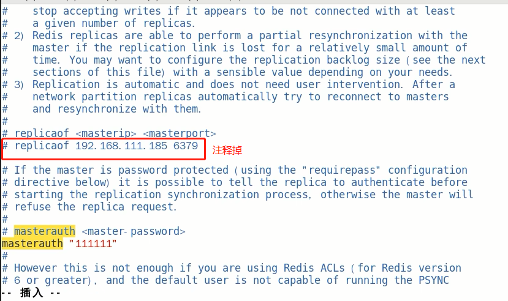

### 一主二仆

#### 方案一：配置文件固定写死主从关系

1. 配从(库)不配(主)库：配置从机

   

2. 先master后两台slave依次启动

   ```sh
   redis-server data/redis6379.conf
   ```

3. 进入redis的shell后，info replication

   ```sh
   info replication
   ```

   

4. 常见问题解答

   1. 从机可以执行写命令吗？

      **不可以，从机只能读**

   2. 从机切入点问题？

      是从头开始复制还是从切入点开始复制

       A：master启动，写到k3 slave1跟着master同时启动，跟着写到k3 slave2写到k3后才启动，那之前的是否也可以复制? 

      可以，首次一锅端，后续跟随，master写，slave跟

   3. 主机shutdown后，从机会上位吗？

      **从机不动，原地待命，从机数据可以正常使用，等待主机重启归来**

   4. 主机shutdown后，重启后主从关系还在吗？从机还能否顺利复制？

      主从关系依然存在，从机依旧是从机，可以顺利复制

   5. 某台从机down后，master继续，从机重启后它能跟上大部队吗？

      可以，类似于从机切入点问题

#### 方案二：命令操作手动主从关系指令

1. 从机停机去掉配置文件中的配置项，3台目前都是主机状态，各不从属

   

2. 3台master

   

3. 预设的从机上执行命令

   salveof 主库IP 主库端口

   

4. 用命令使用的话，2台从机重启后，关系还在吗？

   不会存在了

5. #### 配置 VS 命令的区别，配置，持久稳定永久生效；命令，当成生效


### 薪火相传

1. 上一个slave可以是下一个slave的master，slave同样可以接收其他slaves的连接和同步请求，那么该slave作为了链条中下一个的master,可以有效减轻主master的写压力
2. 中途变更转向:会清除之前的数据，重新建立主从关系并拷贝最新的
3. slaveof 新主库IP 新主库端口

### 反客为主

slaveof no one 使当前数据库停止与其他数据库的同步关系

