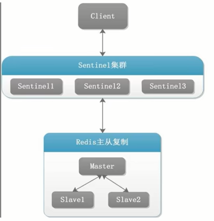

## 哨兵集群搭建

* 3个哨兵：自动监控和维护集群，不存放数据，只是吹哨人
* 1主2从：用于数据读取和存放

### 操作步骤

1. 拷贝sentinel.conf文件

2. 重要参数项说明

   - bind：服务监听地址，用于客户端连接，默认本机地址

   - daemonize：是否以后台daemon方式运行

   - protected-model：安全保护模式

   - port：端口

   - logfile：日志文件路径

   - pidfile：pid文件路径

   - dir：工作目录

   - sentinel monitor

     设置要监控的master服务器

     quorum表示最少有几个哨兵认可客观下线，同意故障迁移的法定票数

     

     网络是不可靠的有时候一个sentinel会因为网络堵塞而误以为master redis已经死掉，在sentinel集群环境下需要多个sentinel互相沟通来确认某个master是否真的死掉了，quorum这个参数是进行客观下线的一个依据，意思是至少有quorum个sentinel认为这个master有故障，才会对这个master进行下线以及故障转移。因为有的时候，某个sentinel节点可能因为自身网络原因，导致无法连接master，而此时master并没有出现故障，所以，这就需要多个sentinel都一致认为改master有问题，才可以进行下一步操作，这就保证了公平性和高可用。

   - sentinel auth−pass

     master设置了密码，连接master服务的密码

   - 其他

     | sentinel down-after-milliseconds | 指定多少毫秒之后，主节点没有应答哨兵，此时哨兵主观上认为主节点下线 |
     | -------------------------------- | ------------------------------------------------------------ |
     | sentinel parallel-syncs          | 表示允许并行同步的slave个数，当Master挂了后，哨兵会选出新的Master，此时，剩余的slave会向新的master发起同步数据 |
     | sentinel failover-timeout        | 故障转移的超时时间，进行故障转移时，如果超过设置的毫秒，表示故障转移失败 |
     | sentinel notification-script     | 配置当某一事件发生时所需要执行的脚本                         |
     | sentinel client-reconfig-script  | 客户端重新配置主节点参数脚本                                 |