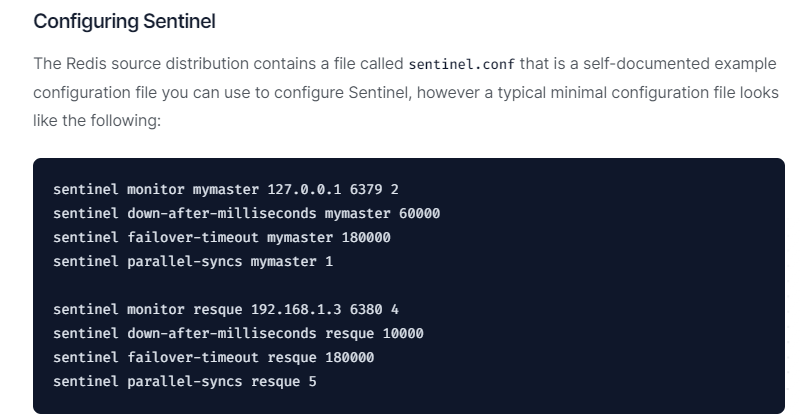

## 模拟主节点异常

### 问题思考

1. 两台从机数据是否OK

   两台从机数据OK

2. 是否会从剩下的2台机器上选出新的master

   会投票选出新的master主机

   

3. 之前down机的master机器重启回来，谁将会是新老大？会不会双master冲突

   本案例中6381被选举为新的master，上位成功

   重启6379之后，它会从原来的master降级为slave

   6380还是slave，只不过是换了一个新老大6381(从跟随6379变成跟随6381)

   

### 对比配置文件

老master的redis6379.conf文件

新master的redis6381.conf文件

### 结论

文件的内容，在运行期间会被sentinel动态进行更改

### 其他

生产上都是不同机房不同服务器，很少出现3个哨兵全部挂掉的情况

可以同时监控多个master，一行一个

### 遇到的坑

1. 当master下线后，如果没有配置masterauth,无法连接上新的master，这时会出现旧的master中的数据依然是旧数据的情况