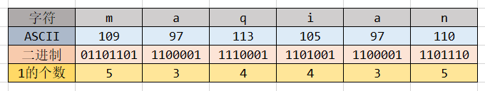

## 一、概述

任何一门程序语言都离不开位运算这个功能，redis虽然不是一门编程语言，但也是一个和编程密切关联的工具，并且所有的数据信息肯定都是以二进制的形式存放的，所以自然少不了位运算的功能。

## 二、使用方法

redis中位运算相关的方法：

- `GETBIT key offset`：获取第offset位的bit，不存的的比特位返回0。
- `SETBIT key offset value`：给第offset位设置成value。
- `BITCOUNT key [start] [end]`：计算key中1的个数。
- `BITOP operation destkey key [key]`：执行位操作，位操作包含`与(AND)`、`或(OR)`、`异或(XOR)`以及 `非(NOT)`。
- `BITPOS key value [start] [end]`：查询`key`中第一次出现`value`的位置，`start`和`end`表示字符的开始和结束位置。


### 三、示例

以字符串`maqian` 为示例，对应的ASCII码和二进制位如下所示：



### 1. 获取比特位

获取第一个字符`m` 的第`0~7` 比特`01101101`：

```sh
127.0.0.1:6379> set name maqian
OK
127.0.0.1:6379> getbit name 0
(integer) 0
127.0.0.1:6379> getbit name 1
(integer) 1
127.0.0.1:6379> getbit name 2
(integer) 1
127.0.0.1:6379> getbit name 3
(integer) 0
127.0.0.1:6379> getbit name 4
(integer) 1
127.0.0.1:6379> getbit name 5
(integer) 1
127.0.0.1:6379> getbit name 6
(integer) 0
127.0.0.1:6379> getbit name 7 //getbit name 8则获得'a'字符的第一位二进制数
(integer) 1
```

## 2. 获取1的个数

`maqian` 字符串中1的个数为5+3+4+4+3+5=24个：

```
127.0.0.1:6379> bitcount name
(integer) 24
127.0.0.1:6379> bitcount name 0 1 # 只计算前面两个字符ma中1的个数：5 + 3 = 8
(integer) 8
```

### 3. 设置比特位

把第`m` 的第六位变成1，即相当于把m的ascii码+2，此时字符表示的是`o` ：

```
127.0.0.1:6379> setbit name 6 1
(integer) 0
127.0.0.1:6379> get name
"oaqian"
```

### 4. 与或非操作

```
127.0.0.1:6379> set a a
OK
127.0.0.1:6379> set b b
OK
127.0.0.1:6379> bitop and dst a b  # 与
(integer) 1
127.0.0.1:6379> get dst
"`"
127.0.0.1:6379> bitop or dst a b  # 或
(integer) 1
127.0.0.1:6379> get dst
"c"
127.0.0.1:6379> bitop xor dst a b  # 异或
(integer) 1
127.0.0.1:6379> get dst
"x03"
```

### 5. 查询第一个1的位置

```
127.0.0.1:6379> set name maqian
OK
127.0.0.1:6379> bitpos name 1 # 查询整个字符串第一个1的位置
(integer) 1
127.0.0.1:6379> bitpos name 1 2 3  # 查询第三个字符和第四个字符qi中第一次出现1的位置
(integer) 17
```