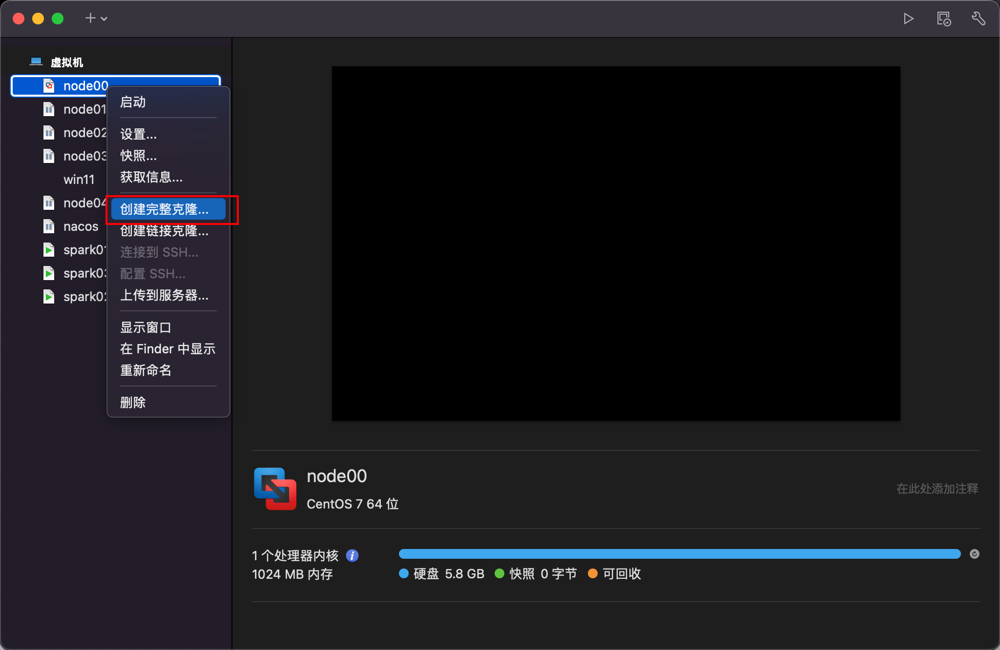

1. 克隆完整虚拟机

   

2. 设置IP

   ```shell
   su root
   vim /etc/sysconfig/network-scripts/ifcfg-ens33
   //编辑后保存
   BOOTPROTO="static"
   IPADDR=192.168.225.10
   GATEWAY=192.168.225.2
   DNS1=192.168.225.2
   ```

3. 设置主机名

   ```shell
   vim /etc/hostname
   //编辑后保存
   node00
   ```

4. 设置主机IP映射

   ```shell
   vim /etc/hosts
   //编辑后保存
   192.168.225.10 node00
   192.168.225.11 node01
   192.168.225.12 node02
   192.168.225.13 node03
   ```

5. reboot

   