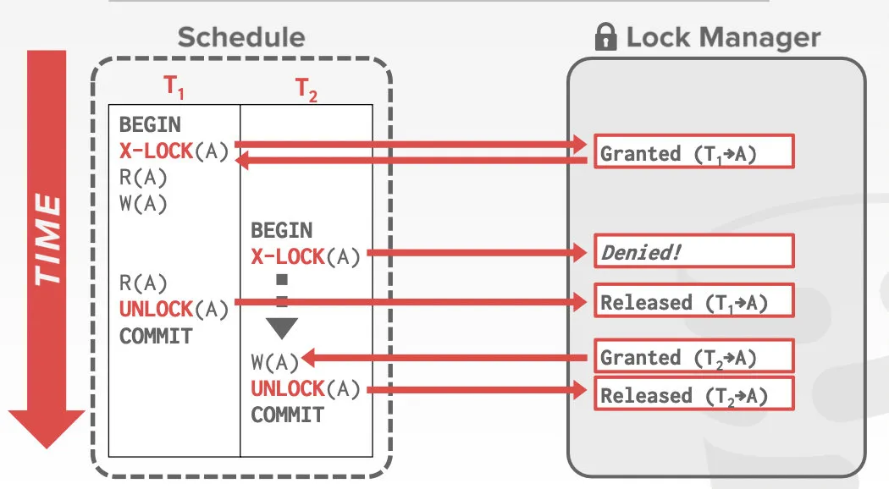
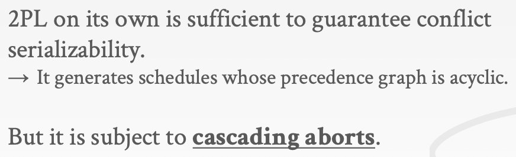
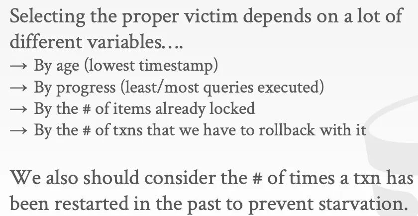

## 二阶段锁

接下来的Lecture将基于并发控制理论介绍DBMS中事务的具体实现方式，本Lecture将具体介绍两阶段锁（Two-Phase Locking）这个实现方式

在上一个Lecture中所介绍的判断执行调度是否满足冲突可串行化的方法需要等到执行调度里所包括的多个事务都执行完之后才能判断出这个执行调度是否可串行化，但等到执行调度所包括的事务全都执行完并提交了之后，它们就都已经完成了对DBMS的更新，如果这个执行调度是不可串行化的，那么DBMS的一致性就会被破坏，因此这种检测可串行化的方式是无济于事的

相应的解决方法是我们用锁来保护数据库中的被共享的对象，从而避免数据竞争导致，进而避免R-W/W-R/W-W冲突，因此Dependency Graph中就可以减少相应的有向边，进而无法成环，执行调度就可以从不可串行化变为可串行化。一个朴素的加锁的方法如下：

在事务T1访问A之前，先通过DBMS的锁管理器（Lock Manager）获取A的锁并且注册（记录下来“A的锁当前归T1所有”），之后事务T2想访问A，于是也要获得A的锁，锁管理器便会拒绝它的请求，T2之后便阻塞在这里，直到T1完成了对A的全部操作后通过锁管理器释放A的锁，T2才可以通过锁管理器获取A的锁，并且完成对A的全部操作后释放A的锁

## Lock Types

老生常谈，Lock&Latch的区别如下：

Lock保护的不是具体的数据结构，而是数据库的抽象的内容，比如说向锁管理器申请的可以是对数据库的表的某一行的锁，这个锁会保护涉及这一行的所有的索引里面关于这一行的部分

一般在实际场景中都是先获取Lock，即我们要操作的逻辑对象的锁，对这个逻辑对象内部的数据结构实际进行操作时再获取Latch

接下来详细介绍Lock，Lock有如下两种类别

- S-Lock，共享锁
  和Latch中的读锁差不多
- X-Lock，排他锁
  和Latch中的写锁差不多

在带有Lock的情况下，事务执行的过程如下：

- 事务获取对应的锁
- 锁管理器授权或阻塞事务
- 事务释放锁

锁管理器内部的数据结构记录着锁的情况

如下的场景中就使用了X/S这两种Lock：

那么通过加锁，能将原本不可串行化的执行调度的执行结果变成正确的吗？如下所示，可以发现，T1事务和T2事务还是没有隔离开，导致调度的执行结果依旧不具有一致性

因此，后来的DBMS方面的学者专家们就在此之上进行改进，提出了两阶段锁来实现并发控制

## Two-Phase Locking

二阶段锁是一个并发控制协议，它规定了一个事务在运行的过程中如何跟其他事务之间协调锁，从而实现可串行化。使用两阶段锁不需要提前知道完整的执行调度，它会在调度进行的过程中避免不可串行化的情况发生

二阶段锁中有两个阶段

- 增长阶段（Growing）
  在这个阶段事务只能不断地获得锁，不能释放锁
- 缩小阶段（Shrinking）
  在这个阶段只能释放释放锁，不能再获取新的锁

在一个事务的生命周期里，它所持有的锁的数量的增长趋势如下所示，最后将所有获取过的锁都释放后会提交事务：

使用二阶段锁便可以使得不可串行化的执行调度的最终执行结果具有一致性，如下所示，在两阶段锁协议下，事务T1执行完`W(A)`后并不会立即释放A的锁，因为二阶段锁协议的规定就是“先一直获取各个锁，然后把所有获取的锁逐个释放”，直到`R(A)`执行完了之后T1才会释放锁（如果按照之前的策略，先获取X-Lock，再释放X-Lock，然后再获取S-Lock，之后再释放S-Lock，这就违反了两阶段锁的协议）

与此同时，在事务T1释放A的锁之前，事务T2获取A的锁的操作会被一直阻塞，直到T1把A的锁释放

在使用了二阶段锁协议后，相应的执行调度对应的依赖图（Dependency Graph）一定没有环，二阶段锁可以严格地保证冲突可串行化

但二阶段锁也有一些问题：级联回滚（Cascading Aborts）

如下所示，T1释放锁之后，T2事务开始被执行，T2对A的操作是基于T1对A进行临时修改后的版本进行的，如果T1事务没有提交而是被abort了，那么T2必须跟着T1一起回滚（如果T2进行的是读操作，那么这也被称为脏读，"dirty reads"）

那么应该如何解决级联回滚的问题呢？

级联回滚本质上的原因是T2事务在T1事务更新得到的临时版本的数据上进行了操作，那我们可以通过一些手段让T2不在T1修改得到的临时版本上进行操作：比如说，可以让事务先获取各个需要获取的锁，等到它commit时再一次性把这些锁释放掉，这样的话，T2就不可能在临时版本上进行操作，因为当T2能获得锁执行事务时，和它访问共享数据的其他事务已经被提交了。这个方法也被称为严格二阶段锁（Strong Strict 2PL，简称SS2PL），如下图中被红色方框圈出的部分所描述的那样，可以解决脏读的问题

严格二阶段锁协议下，事务所持有锁的数量变化如下所示：

严格二阶段锁协议的特点是事务所修改的数据在事务结束之前，其他事务都不能读写，这个协议的好处就是不会产生级联回滚。而且事务可能对数据进行了很多次更新，但在严格二阶段锁协议下，需要回滚时，直接回滚到事务开始时即可，不用管它进行过多少次更新，因为这个事务在进行数据更新时，绝对不会有其他的事务也在更新共享的数据

举个例子，事务T1是A给B转账100，事务T2是计算A和B的账户余额的和

如果完全不使用二阶段锁，那么就有可能像下面这样出现不一致

如果使用了二阶段锁协议，那就可以保证一致性，等效成T1事务先执行，然后T2事务执行。但存在潜在的级联回滚问题

如果使用了严格二阶段锁协议，如下所示，既可以保证一致性，也可以避免级联回滚

再回到前面介绍过的关于执行调度的Venn图：

在全部可能发生的执行调度里，事务串行执行是很小的子集，冲突可串行化的执行调度是更大的子集，视图可串行化的执行调度对应还要再大一点的子集

不会级联回滚的执行调度和基于强二阶段锁协议的执行调度对应的集合如图中所示

## Deadlock Detection + Prevention

接下来分析二阶段锁中的死锁问题

结合如下的执行调度的场景进行分析，它采用了严格二阶段锁协议，并且事务T1的业务逻辑是先操作A再操作B，事务T2的业务逻辑是先操作B再操作A，因此它们获取锁的顺序不同，就导致了下图的死锁

因此，严格二阶段锁协议可能会导致死锁

为了解决死锁的问题，DBMS有如下两种方案

- Deadlock Detection，死锁检测
  DBMS内部会维护一个锁等待图（waits-for graph），它记录了当前所有并发的事务里谁在等谁的锁，图中每个节点对应一个事务，每条有向边对应一个锁的等待关系（从Ti指向Tj的有向边代表着事务Ti等待Tj释放一个锁），DBMS会周期性地检查这个图，看看图里有没有成环，如果有的话就会想办法把环给解开

结合如下的例子来理解：

如果DBMS检测到锁等待图里出现了环，那就会选择一个victim事务，让它回滚，这样环就会解开，死锁被拆除（这和哲学家吃饭问题很像）。被选择的victim事务要么会重启要么会中止，这和它是怎么被调用的有关：如果这个事务是DBMS用户的业务的一部分，就可以把它abort，因为用户的业务代码里会有一些应对abort情况的逻辑（比如说转账的事务进行到一半然后被abort，那么就会在前端告诉用户“转账失败，请稍后再试”）；如果用户要求DBMS定时地触发一些SQL语句，到了定好的时间，用户的业务代码可能不在执行，因此如果abort了的话用户可能就不知道，这种情况下就需要DBMS去重启事务。
并且这个策略里有一些trade-off，因为DBMS是周期性地检查锁等待图，如果周期的频率很高的话，处理死锁的开销就比较大，因此不易检查地太频繁；但频率太低也不好，这有可能导致一些陷入死锁的事务被卡了好久
不光是死锁检测的频率要做trade-off，选哪个事务当victim也要权衡，我们可以综合考虑“这个事务已经执行了多长时间”（让一个已经执行了很长时间的事务回滚，这不太合理），“事务执行了多少”（可以以每个事务都执行了多少条SQL语句这样的指标来衡量），“这个事务已经得到了多少个锁”（DBMS倾向于让得到的锁多的事务回滚，因为得到的锁越多，就有可能让更多的其他事务陷入阻塞，这样的事务回滚了之后其他事务就都能继续往下执行了），以及如下所示的其他因素

那么，选好了victim之后，我们该如何回滚事务呢？有如下两个方案

**Approach 1** 完全回滚，让victim事务回滚到它开始执行时的状态，就好像它没发生过
**Approach 2** 最小化地去回滚，去判断到底是哪几个SQL语句造成的死锁，回滚到这些语句还没开始执行的状态即可，没必要完全回滚，并且与此同时让其他事务继续执行

- Deadlock Prevention，死锁预防
  前面介绍的处理死锁的策略是通过建图来检测是否已经发生了死锁，并且在已经构成死锁后去解开死锁
  Deadlock Prevention这个策略是去预防死锁，不让死锁发生
  其具体的实现方法如下：
  先根据时间戳给各个事务优先级，规定越先开始的事务它的优先级越高
  死锁的预防有两个方案：

- - Wait-Die，高优先级的事务想获取低优先级事务已经拥有了的锁时，那么它将等待低优先级的事务去释放锁；如果低优先级的事务想获取高优先级的事务已经拥有了的锁，那么这个事务直接abort回滚
  - Wound-Wait，高优先级的事务想获取低优先级的事务已经持有的锁时，持有锁的低优先级事务会abort并且释放锁；低优先级的事务想获取高优先级事务已经持有的锁时，它会等待高优先级事务释放这个锁

这两个方案本质上是不让事务之间互相等待，因为事务之间互相等待就有可能死锁
结合例子理解，如下所示：

此外还要注意，因为预防死锁被abort了的事务重新开始执行时，它的时间戳（即优先级）不会发生变化，不然就有可能一直因为优先级太低被abort，造成饥饿

## Hierarchical Locking

到目前为止锁探讨的锁的粒度一般都是DBMS中如tuple这种的对象的锁，如果一个事务想修改很多很多个tuple，那么它就要不停地获取/释放tuple的锁，这会带来很大的开销，导致性能变差

因此我们不妨加大锁的粒度，当事务想获取锁时，DBMS可以根据实际情况对锁的粒度进行调整（锁的是attribute还是tuple还是数据库文件里的一个页，还是整个表），从而减少事务需要获取的锁的数量

但锁的粒度也有trade-off，需要在获取/释放锁的开销和并行性之间做权衡

DBMS中锁的粒度层级如下所示：

如果想获取table的锁，需要检查它的全部tuple的锁的情况，只要其中有一个tuple的锁被其他事务持有，那当前事务就暂时不能获取这个table的锁，如果检查到了最后一个tuple才发现有tuple被其他事务锁住，这便十分低效，尤其是表很大tuple、很多的情况下

意向锁（Intention Locks）的存在可以解决上面的问题：通过对table这种更高层级的对象加一些标记来表明它是否含有被锁住的tuple，有了这样的意向标记（它并没有真的锁住table），想获取table的锁的事务就不必逐个检查这个table里的tuple

意向锁有三种

- IS e.g. table含有的tuple中有被上共享锁的
- IX e.g. table含有的tuple中有被上排他锁的
- SIX e.g. table含有的tuple中有被上排他锁的，并且整个table也被上了共享锁

这三种意向锁和排他锁，共享锁一起组成了更加复杂的锁兼容矩阵：

举例分析后面两段话，如果想对tuple加S/IS锁，那必须先对tuple所在的table加IS锁；如果相对tuple加X/IX/SIX锁，那必须先对其所在的table加IX锁

结合例子理解，

例子1:

（IS和IX可以兼容）

例子2:

（T1可能是带着一个谓词去寻找符合的tuple，然后更新）

（因为要读整个R表，所以需要给它上S锁，又因为需要更新某些tuple，所以要给这些tuple上X锁，进而需要先给R表上IX锁，因此要给R表上SIX锁，并且读表的时候不需要给tuple上S锁，因为已经给整个表上了S锁）

（点查询需要给某个tuple上S锁，因此需要先给table上IS锁，SIX和IS可兼容）

并且由于遵守了严格二阶段锁协议，在T1事务和T2事务结束之前，图中这些锁都不能释放，T3到达时，由于要全表扫描，因此需要给table上S锁，但由于SIX和S不兼容（本质上是IX和S不兼容，内部有tuple正在更新时不能读表），所以它要阻塞等待，直到T1释放它所持有的所有锁

这种具有层次结构的锁在实际工程中很好用，因为避免了需要上太多锁的情况

