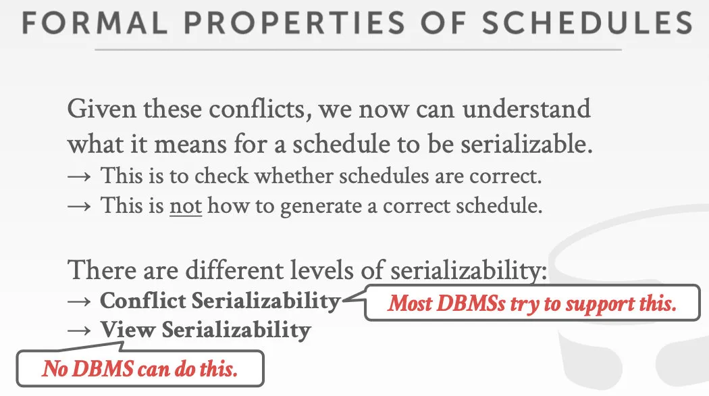

接下来将介绍DBMS的事务与并发相关问题

如下所示的层次图并不代表着DBMS实现的所有组件，

除此之外DBMS还有两大组件横跨了多个层级：并发控制，数据库恢复

- 并发控制是想避免数据竞争的发生，数据竞争在操作系统的相关知识中已经被介绍多次，笔者不多赘述
- 数据库恢复是想在实现持久化时一直保持正确的数据库状态：假设银行业务中想实现“从A账户转100元给B账户”，但如果A账户扣100元这个操作被写入磁盘之后机房断电了，如果当机器恢复过来时没有采取一定的恢复手段使得B账户加100元，那么就出现了错误（这和xv6文件系统通过日志实现事务的目的是相同的，都是想使得机器的crash不影响系统的状态的正确性）

接下来的几个Lecture会先介绍并发控制

数据库的并发控制与恢复都是基于事务的ACID理论，首先介绍事务

事务的定义如下：

事务是一系列的操作（e.g. 可以是一系列的SQL语句），DBMS通过执行这一系列的操作从而达成更高级的功能（比如说前面提到的转账的问题就属于事务）。并且事务也是DBMS执行的最基本单位：DBMS不允许只完成部分的事务，只存在两种可能：事务彻底完成/事务没发生。

为了实现事务，历史上DBMS的开发者们提出过各种策略：

一个很“想当然”的想法—Strawman System

到达DBMS的事务被串行处理，在事务开始之前把数据库文件复制一份，在这个复制得到的文件上执行事务，如果事务成功执行，那么把原本的数据库文件删除即可；如果执行失败，那么把复制得到的文件删了就行

这个策略理论上可行，但不可以实践，因为如果数据库文件很大的话，再复制一份的话磁盘可能放不下；并且彻底的串行会导致极差的性能，彼此之间无关的事务是可以并发的

那么DBMS该如何实现事务的并发呢？

显然不可以放任所有的事务直接去并发执行，这样的话，它们的内部操作彼此之间互相交错地被执行，事务之间互相影响，很可能导致数据库状态的错误

为了便于分析问题，我们使用下面的简化后的模型

对于DBMS使用者，比如说负责后端业务的程序员，想要实现事务，可以通过如下的SQL关键字：

实现事务正确性的标准是ACID，其具体介绍如下：

consistency可以理解为事务结束之后，系统中的invariants不会变化

isolation更详细的是说一个事务在执行时，其他的事务对数据库数据的更改它是看不见的，它对于数据的更改也不会被其他事务看到，直到它commit了之后，其他的事务才可以看见它的更改

ACID的一个通俗解释如下：

接下来将分别研究ACID的四个方面

## Atomicity

事务的原子性

一个事务的执行只会有两种结局，一是完成全部的内部操作之后执行commit，二是中途被abort，可以是客户端主动发出的中止，也可以被DBMS中止，这会形成回滚的效果，相当于事务还没开始执行

想要实现事务的原子性，有如下手段：

- Logging，日志
  这也是最常用的方法，事务在执行的过程中，每执行一步都要记录一下“如果要回滚这一步该怎么办”，就相当于在走路时，每走一步就留下一个记号，这样便可以原路返回。这种日志也被称为"undo log"-回滚日志，内存和磁盘中都会有它的备份，它就像是飞机的黑匣子
  这样的话，当事务执行到一半，用户发起回滚或者DBMS决定开始回滚时，DBMS就会依据留下的log一步一步地把所有执行过的语句所造成的更新撤回
  日志还有其他的好处：可以在业务出错时拿来复盘分析用；也可以提升性能，因为这样的话就可以在需要对文件数据进行写操作时，先写入内存里的日志，而不是基于业务需求直接进行随机的磁盘读写，这会让用户在有些时候被阻塞住
  结合笔者见过的例子来具体分析一下日志系统对于性能的提升，xv6文件系统中的日志系统便是：在事务中如果涉及到对文件的写，那么会通过`log_write`函数先写入缓存池和内存里的日志缓存，直到事务完成后向磁盘提交日志，然后根据被写入磁盘的日志文件install日志，这样的话，事务内部对文件的写就不用在落盘后才能返回，而是写入内存中的缓存池和日志缓存后就可以返回，不用让用户被阻塞

- Shadow Paging，只备份被修改了的那些页
  事务想修改哪些文件页，DBMS就给这些页做备份，事务操作这些备份，如果事务成功提交，那就拿备份替换下原有的页，否则就删除备份，实现回滚
  这和Strawman System的思想差不多，现代数据库中使用这样的策略的并不多，绝大部分都是使用日志实现原子性

## Consistency

对一致性这个概念的解释不太容易，因为它十分抽象，感觉还是slides中说的最为精辟：

数据库中的所反映出的外部世界应该是逻辑上正确的，而且我们对数据库所执行的查询的结果也是逻辑上能讲的通的（A给B转100块钱，A扣100，B加100，A和B的总和不能变）。笔者认为，这也可理解为，事务中的一系列内部操作结束之后invariants不能被破坏

一致性分为如下两方面：

- Database Consistency，数据一致性

后面发生的事务要能看到在它之前发生的事务导致的结果

- Transaction Consistency，事务一致性
  这是由业务去保证的

如果数据库在事务开始之前是一致的，那么在事务结束的时候也应该是一致的

## Isolation

理想情况下，事务之间的隔离可以做到用户在执行事务时，好像数据库没有其他的用户在使用（这和操作系统的虚拟化类似），无法看见其他的事务在被提交之前的中间结果，能看到的只有事务开始时数据库的状态

实现隔离性的好处在于可以给负责写业务的程序员提供很好的抽象和便利，“A给B转100元”这个业务里只需要考虑给A扣100，给B加100，写这个业务的时候可以认为“只有我这一个用户在操纵数据库”。如果没有实现隔离的话就要被迫考虑很多其他的事情，比如说“有没有其他人在操纵B的账户”，“B的账户余额是否达到了上限”，实现了隔离之后，业务程序员只需写好事务对应的SQL语句然后commit，如果确实存在着前面的问题，事务就会失败，然后就会回滚重做

为了实现事务的隔离性，就需要数据库的并发控制机制去决定事务之间的交错的执行是以怎样的一个顺序/时间表来进行，不可以随意地交错执行。实现并发控制有两大流派：

- 悲观协议：不要让问题发生，在问题出现之前就让线程停住
- 乐观协议：我们假设并发的冲突是少数的，只在问题出现之后再去回滚

举个例子分析，假设有如下的业务场景，T1和T2是两个业务里面实现的事务

（上图最后一句话表明，我们还要使得可能同时到达的两个事务看起来像是串行地被执行）

因此，如下所示，两个事务直接串行执行是没有一致性的问题的

但如果这两个事务是并发执行的，那么该如何让它们在保证一致性的情况下交错执行？

在如下所示的场景下，并发事务的交错执行就出现了一致性问题：

上图的一系列操作，在DBMS的视角下，其实是进行了如下的一系列读和写

那么我们该如何实现一个算法，让DBMS能够判断出一系列的读写是否会导致一致性的错误？

一系列操作的执行顺序被称为数据库系统的执行调度，两个输出结果相同的执行调度被称为是等价调度，按顺序来执行一个个事务，不进行事务操作的交错执行的执行调度是串行调度。如果一个执行调度能够和串行执行等价，那么它就拥有正确的一致性，它也被称作可串行化调度（Serializable Schedule）。而且如果每个事务都保证了一致性的话，那么每个可串行化调度也都可以保证一致性。

那么应该如何判断一个执行调度是可串行化调度呢？如果实现了这一点，DBMS就可以判断出某个调度是否会导致一致性的错误

首先，我们需要实现一个算法去证明两个执行调度是等价的，这就需要引入如下的新概念：冲突操作（"conflicting" operations）

如果两个操作来自不同的事务，它们都在操作同一个数据并且至少其中一个是操作是写，那么这两个操作就是冲突的。基于这个定义，有如下三种的冲突：

- R-W冲突：

这破坏了隔离性，又被称为“不可重复读”

- W-R冲突：

事务T2开始之前，事务T1还没有提交，如果T1最终abort了，应该最终只给A加2，但由于T2是基于T1提交之前的结果来执行的，T2没有回滚，所以最终还是给A加了4，这就出现了一致性的问题
总结一下就是：一个事务里面更新了某个值之后，但还没有提交，有其他的事务基于这个值去做了其他操作，那么就有可能导致这样的W-R冲突，一致性出现问题

- W-W冲突

两个事务都对相同的对象进行写操作，overwrite之后破坏一致性（上图最后的结果是Andrew对应$19，逻辑上是错误的）

关注冲突操作的意义在于：两个事务中冲突的操作不能在时间序列上交换位置，否则会改变执行调度的结果。接下来会基于上面的这三种冲突，介绍判断一个调度是不是可串行化的方法

可串行化分为如下两个等级：

- Conflict Serializability，冲突可串行性/基于冲突的可串行判断
  这涉及一个新的概念：冲突等价（conflict equivalent）
  如果两个执行调度包含了相同事务的相同操作，并且有相同的冲突，那么这两个调度就被称为冲突等效的

如果某个执行调度S和某个真正串行的执行调度冲突等效，那么它就是冲突可串行化的（conflict serializable）
如何判断某个schedule是conflict serializable的呢？
根据如下的原则：

如果一个调度S经过交换位于不同事务里，时间上连续，并且两者之间不构成前面说的那三种冲突的操作在时间序列上的位置后可以转换为串行的调度，那么它就是冲突可串行化的
结合实例进行分析，如下的调度就是一个冲突可串行化调度

根据上面的判断规则，我们可以交换两个事务中连续且不冲突的操作的位置，像下面这样：

->next->

然后再进行3次这种交换（详见slides），就可以变成下面的串行化调度，因此这个调度就是冲突可串行化的

这个基于swap的算法对于仅包含两个事务的执行调度很有效，但如果调度中有很多事务，这个算法的开销会变得巨大，并不适合

因此后来就有了如下的基于依赖图的算法：
如果一对冲突操作中Ti事务里的0i操作先于Tj事务里的0j操作执行，那么就在依赖图中画从Ti指向Tj的一条有向边

如果图中出现了环，那么对应的调度就不是可串行化的
笔者认为，这个算法之所以可以work，是因为如果Ti事务里的0i操作和Tj事务里的0j操作之间冲突，并且0i操作要在0j操作之前执行的话，假设这个执行调度能串行化，那串行化后的结果必定是Ti事务先执行，因此图中就有了从Ti到Tj的一条边，如果之后还能画出从Tj到Ti的边，那就表明，串行化后是Tj先发生，就和前面矛盾，因此无法串行化
结合实例分析（更多例子详见slides），如下所示：

当然也有一些特例，对于有些执行调度，使用依赖图（Dependency Graph）判断只会得出“不可串行化”的结论，但实际上是可以达到和串行化调度一样的效果，因此也可以被看作是可串行化的，举个例子来说，如下所示：

因为在执行调度开始之前B一定是非负的，T1事务中对B的行为是让B增加，所以为了串行化哪怕强行让T1的`W(B)`在T2的`R(B)`之前执行，都不会改变`if(B>=0)`的判断结果，无论如何`cnt++`都会被执行

- View Serializability，基于观察的可串行性
  如下例子所示，使用依赖图得到的结果是不可串行，

但左侧的执行调度实际上的结果就是T3执行的`W(A)`决定A的值，这必然和T1->T2->T3串行执行的效果相同

基于观察的可串行性说的就是通过观察来确定某个执行调度是可串行还是不可串行，它与冲突可串行性相比，对执行调度的要求要更加宽松，但目前还没有DBMS能实现它

基于冲突的可串行性判断和基于观察的可串行性判断都无法对一个执行调度是否可串行做出100%正确的判断，毕竟DBMS内部的算法无法像人一样彻底理解业务场景，而且绝大多数的DBMS都是使用基与冲突的可串行性判断，因为它的实现不困难

总结一下，所有的业务中的执行调度（all schedules）大概分为如下Venn图所示的几种：

## Durability

事务的持久性要求事务提交的所有更改必须被写入存储介质持久化，并且不能有更新只进行一半的情况，也不能有事务失败之后更新被残留的情况

DBMS通过使用前面提到的logging或shadow paging手段实现这一点

最后总结一下ACID：

数据库实现事务是非常有必要的，这可以极大程度上减轻编写业务的复杂程度，在DBMS中，事务间的并发控制是可以自动进行的

