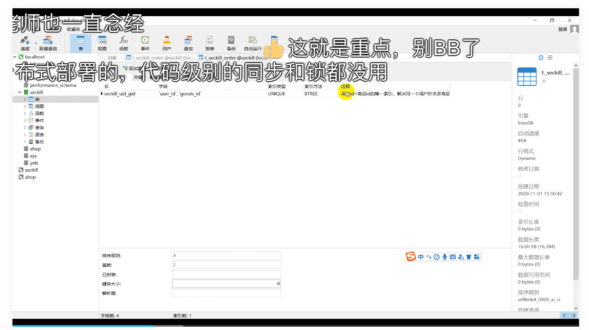
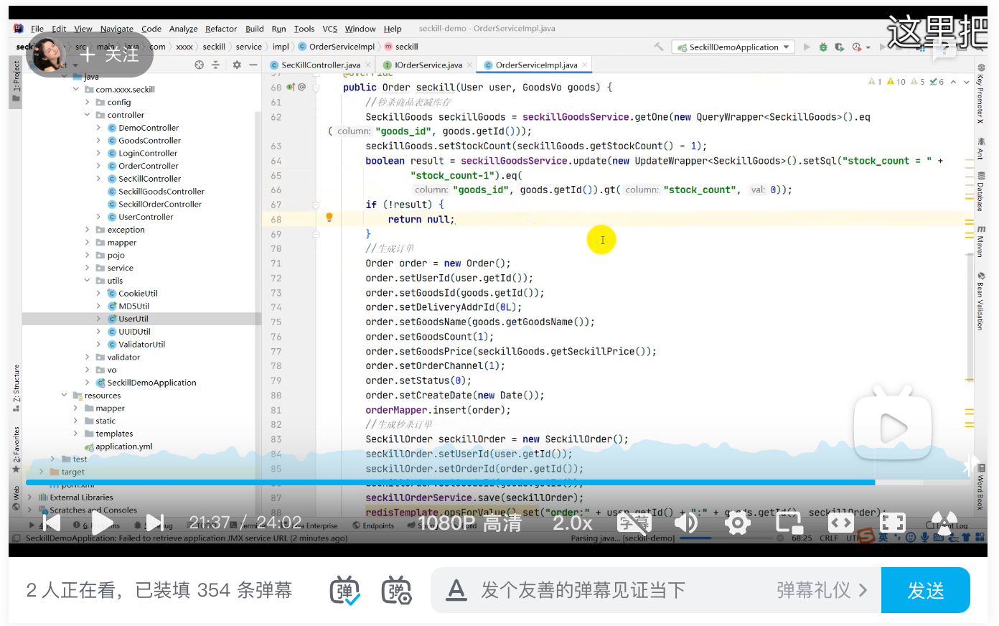

### 如何解决超卖问题

数据库的一致性特性（stock_count=stock_count-1）+事务+mysql的联合索引

mysql有自带的锁，在stock_count=stock_count-1的过程并有条件stock_count>0的情况下，不会出现并发不一致的情况，这里不做赘述。而且，当且仅当有完成seckillGoods-1的的商品，才会生成订单。这里很巧妙的控制了订单的数量。再加上SeckillOrder表上的user_id+good_id索引，方法上再加上事务，当一个用户对一种商品下了多个订单时，触发联合索引不唯一异常，造成事务回滚，stock_count=stock_count-1操作一起也被回滚。
