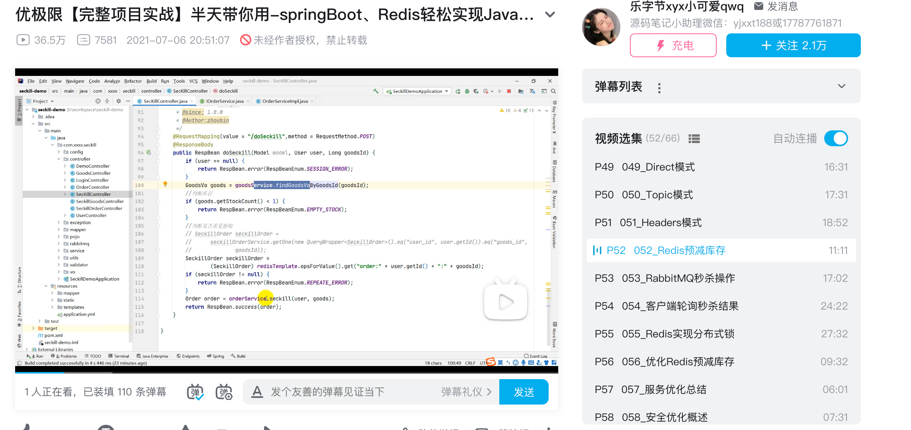
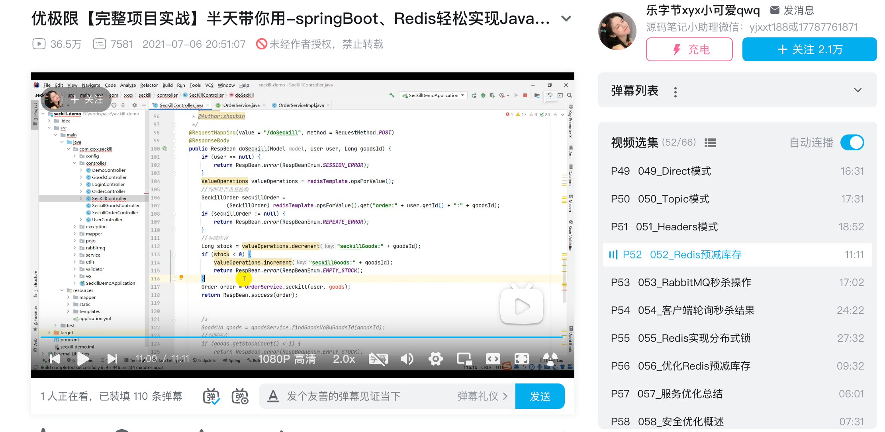
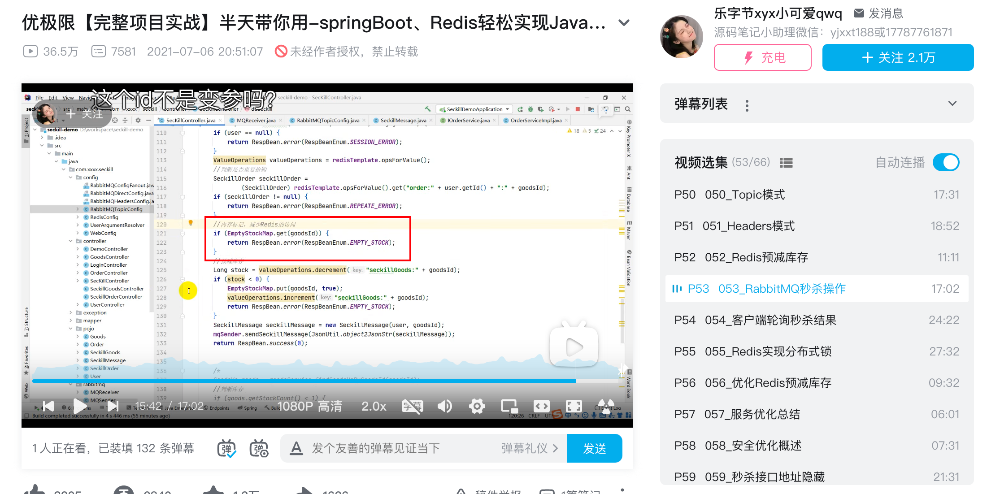

### 减少访问数据库的次数

1. 在数据库中查询库存数量->在Controller初始化InitializingBean的afterPropertiesSet方法中将商品库存初始化到reids中，后面扣减库存只需要在redis中扣减即可。

   

2. 秒杀方法中需要创建订单和创建秒杀订单两步数据库操作->使用RabbitMQ队列缓存创建订单操作，异步完成。

### 在redis中预减库存

### 内存标记减少redis的访问

### 轮询秒杀结果

根据userId+goodId去数据库中查询秒杀订单（多次访问数据库，是否可优化？），返回三种情况：

1. 有订单说明秒杀成功
2. redis中有商品存在isStockEmpty标志，说明秒杀失败
3. 其他表示排队中