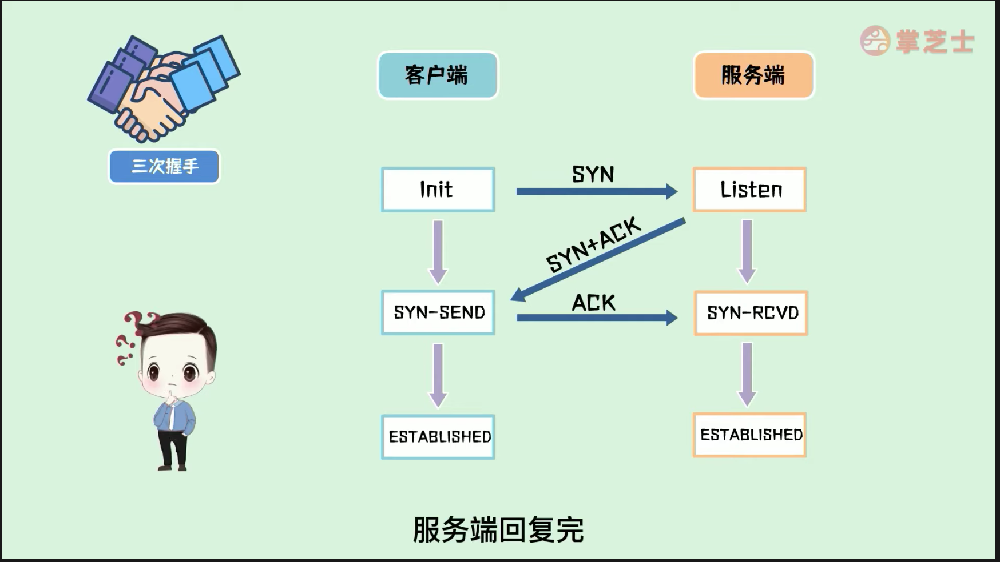
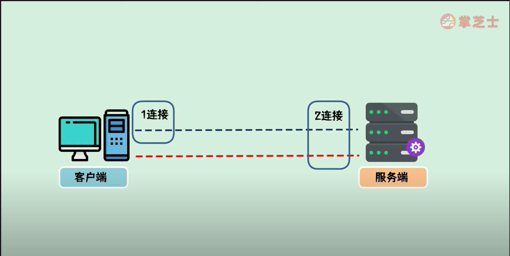

### 为什么要三次握手？

#### 两次握手会产生问题

* 当客户端第一次发送给服务端的SYN包因为网络堵塞
* 客户端重新发送一个SYN包请求连接
* 服务端接收到SYN后回复SYN+ACK作为回应
* 如果此时是两次握手，这时就建立起了连接
* 这是堵塞的SYN包因为网络恢复稳定到达了服务端
* 这时服务端以为这个连接是一个新的连接，这样就出现了客户端只发起一次请求，结果服务端与客户端建立起了两个连接的问题

三次握手解决问题

* 当客户端接受到SYN+ACK后会向服务端发起第三次握手发送ACK
* 服务端接收到ACK后，客户端和服务端会同时进入ESTABLISHED状态
* 由于状态已经改变，此时服务端即使再接收到网络堵塞的SYN包客户端再接收到SYN+ACK包，客户端也不会再发送一个ACK给服务端

