# 企业信息化战略与实施

[toc]

## 信息与信息化的概念

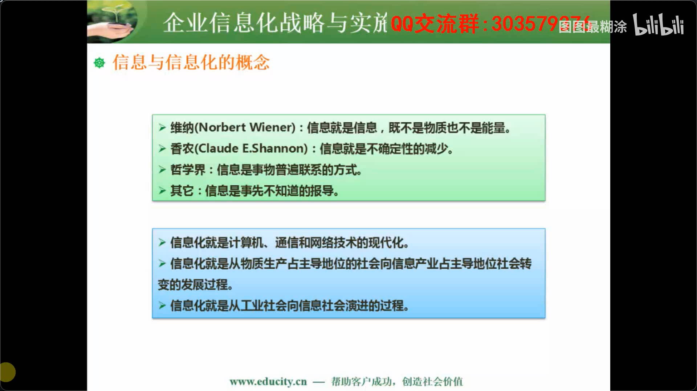

##### 企业信息化

企业信息化涉及到对企业管理理念的创新，按照市场发展的要求，对企业现有的管理流程重新整合，管理核心从对 **财务和物料** 的管理，转向对 **技术、物资和人力资源** 的管理，并延伸到对企业技术创新、工艺设计、产品设计、生产制造过程的管理，进而还要扩展到对 **客户关系和供应链** 的管理乃至发展到电子商务。

##### 信息化需求

一般说来，信息化需求包含3个层次，即**战略需求**、**运作需求**和**技术需求**。

1. 战略需求。组织信息化的目标是提升组织的竞争能力、为组织的可持续发展提供一个支持环境。从某种意义上来说，信息化对组织不仅仅是服务的手段和实现现有战略的辅助工具；信息化可以把组织战略提升到一个新的水平，为组织带来新的发展契机。特别是对于企业，信息化战略是企业竞争的基础。
2. 运作需求。组织信息化的运作需求是组织信息化需求非常重要且关键的一环，它包含三方面的内容：一是实现信息化战略目标的需要；二是运作策略的需要。三是人才培养的需要。
3. 技术需求。由于系统开发时间过长等问题在信息技术层面上对系统的完善、升级、集成和整合提出了需求。也有的组织，原来基本上没有大型的信息系统项目，有的也只是一些单机应用，这样的组织的信息化需求，一般是从头开发新的系统。

##### 企业信息化方法

企业信息化方法主要包括业务流程重构、核心业务应用、信息系统建设、主题数据库、资源管理和人力资本投资方法。不包括组织机构变革。

## 信息系统

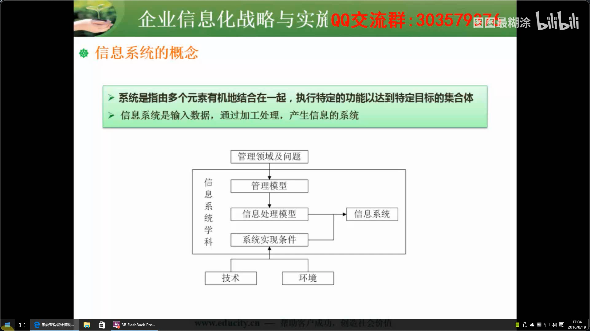

注意：人工处理也可以是信息系统。

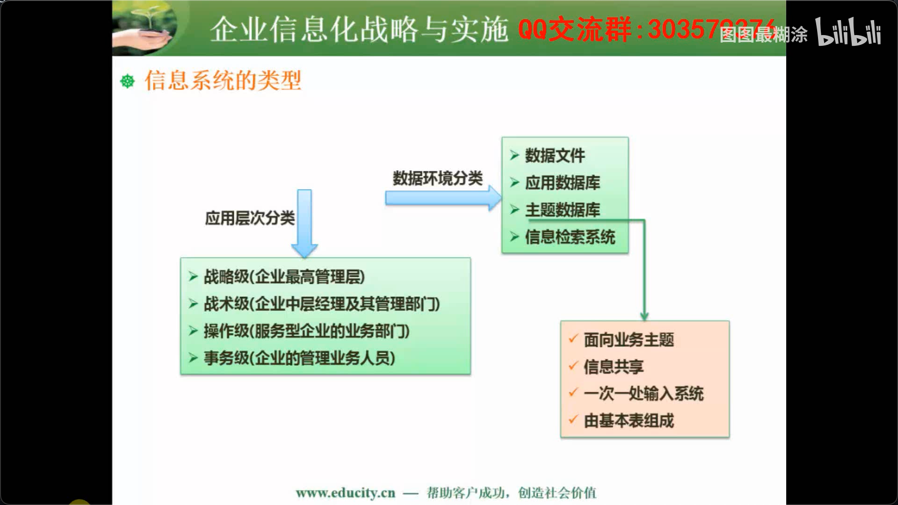

## 信息系统生命周期

- 立项阶段
- 开发阶段：总体规划、系统分析、系统设计、系统实施、系统验收
- 运维阶段
- 消亡阶段

## 信息系统战略规划

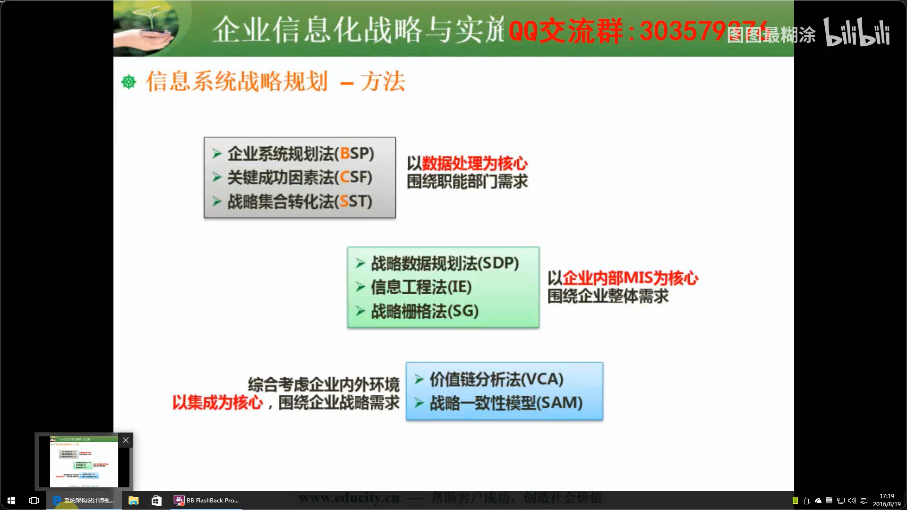

企业信息化涉及到对企业管理理念的创新，按照市场发展的要求，对企业现有的管理流程重新整合，管理核心从对（ ）的管理，转向对（ ）的管理，并延伸到对企业技术创新、工艺设计、产品设计、生产制造过程的管理，进而还要扩展到对（ ）的管理乃至发展到电子商务。

## 政府信息化与电子政务

##### 电子政务分类

- 政府对政府
- 政务对企业
- 政府对公民
- 政府对公务员

## 企业门户

##### 企业门户分类

- 企业信息门户EIP
- 企业信息门户EKP
- 企业应用门户EAP
- 垂直门户

## 企业应用集成

基于JavaEE平台的基础功能服务构建应用系统时，**JDBC、JCA和 Java IDL** 可用来集成遗产系统。

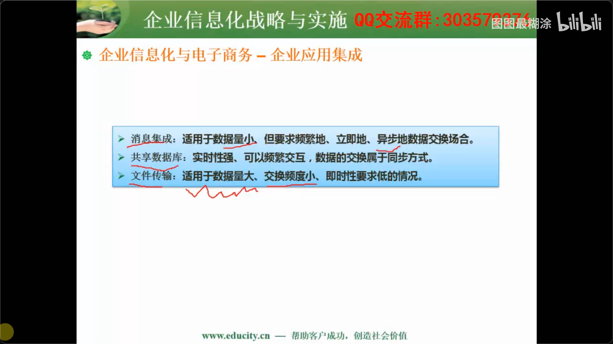

##### 共享数据库

共享数据库是一种重要的企业应用集成方式，它通常将应用程序的数据存储在一个共享数据库中，通过制定统一的数据库模式来处理不同应用的集成需求。共享数据库为不同的应用程序提供了统一的数据存储与格式定义，能够在一定程度上缓解数据语义不一致的问题，但无法完全解决该问题。在共享数据库集成中，多个应用程序可能通过共享数据库频繁地读取和修改相同的数据，这会使数据库成为一个性能瓶颈。共享数据库集成方式的一个重要限制来自外部的已封装应用，这些封装好的应用程序只能采用自己定义的数据库模式，调整和集成余地较小。

##### 企业集成模式

- 面向信息的集成
- 面向过程的集成：强调处理不同应用系统之间的交互逻辑，与核心业务逻辑相分离，并通过不同应用系统之间的协作共同完成某项业务功能。
- 面向服务的集成

## ERP

## CRM

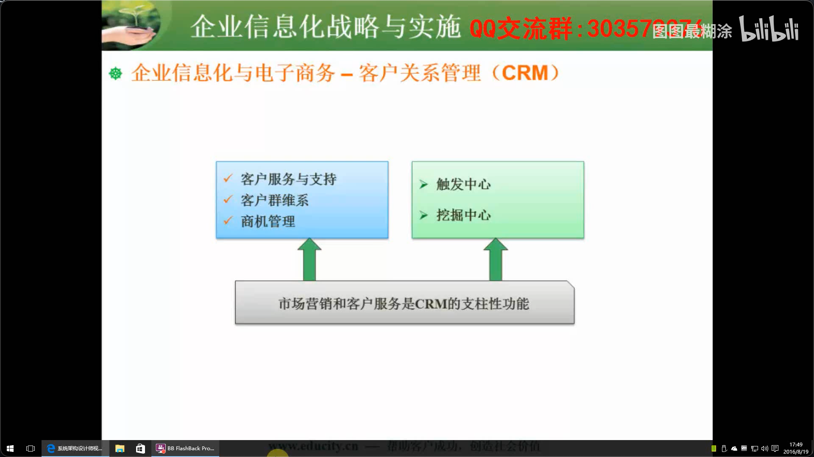

## SCM

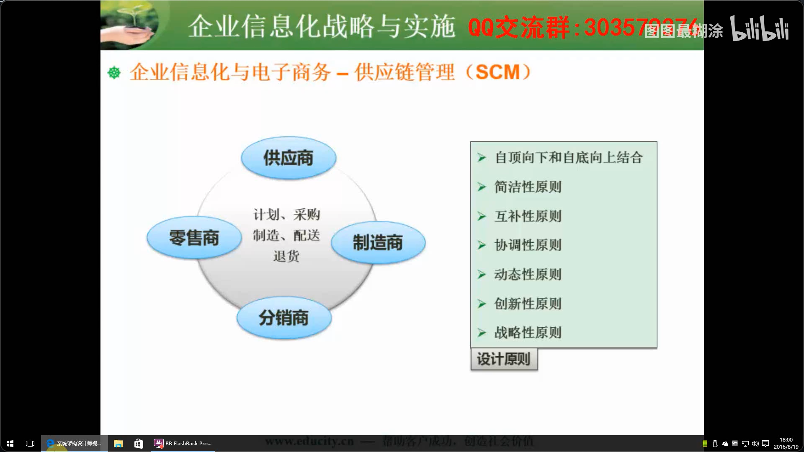

## BI

## EDI

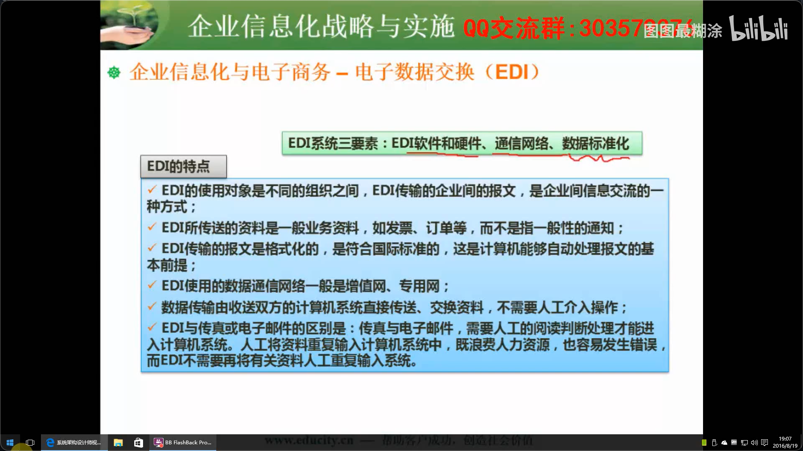

## 电子商务

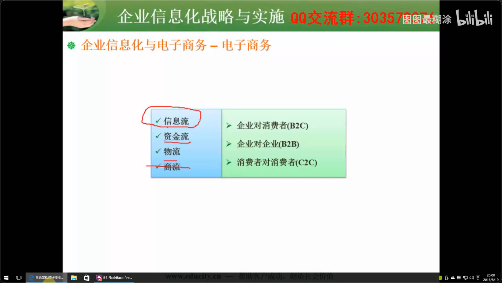

## 电子商务标准体系

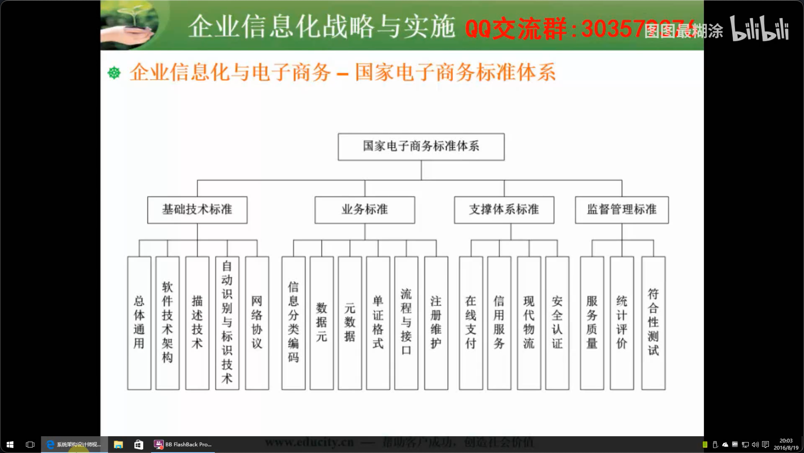

## 信息系统开发方法

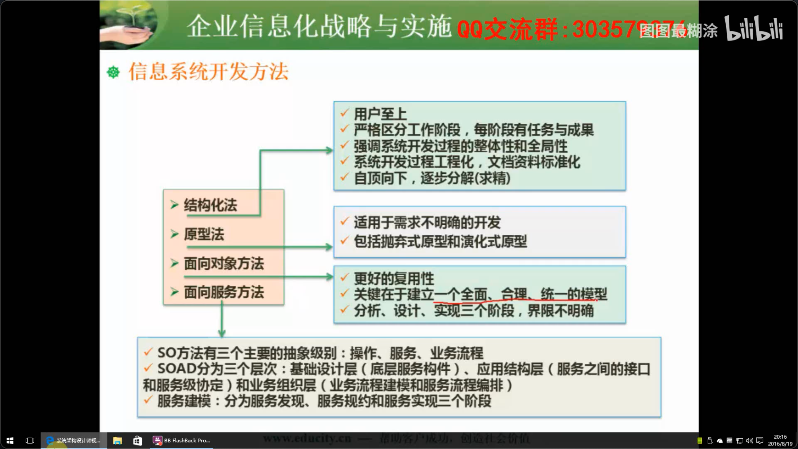