# 操作系统

[toc]

```
4-7分
1. 进程管理
2. 存储管理
3. 文件管理
4. 作业管理
5. 设备管理
```

## 进程管理🌟🌟🌟

```
PV操作，超级超级超级重要
```

##### 进程和线程的区别

- 线程共享：内存地址空间、代码、数据、文件等。
- 非线程共享：程序计数器、寄存器、栈

##### 进程的状态

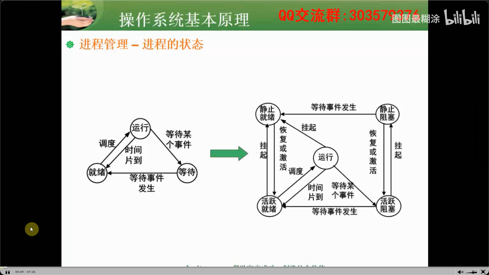

- 三态模型：就绪-运行-阻塞。阻塞态不能直接到运行态。运行态不能直接到就绪态。阻塞态没有CPU状态，也没有非CPU资源。
- 首先考虑非CPU资源，非CPU资源满足条件才会考虑CPU资源。等待事件是等待非CPU资源释放。

##### 前趋图🌟

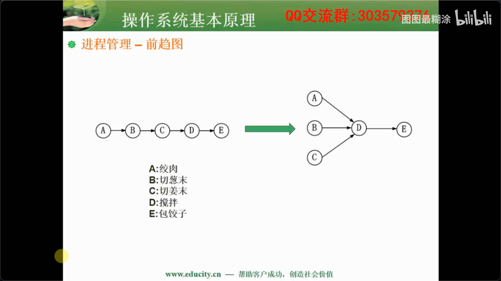

= =

##### 同步与异步

CPU访问内存通常是同步方式

CPU与I/O接口交换信息通常是同步方式

CPU与PCI总线交换信息通常是同步方式

I/O接口与打印机交换信息则通常采用基于缓存池的异步方式

##### 信号量与PV操作🌟

- 互斥：会存在一个共享使用的资源，但是某一时刻只能一个进程使用，临界资源的互斥访问
- 同步：速度有差异，在一定情况停下等待。
- 直接制约：由进程顺序制约，同步
- 间接制约：由资源制约，互斥
- 临界资源：诸进程中需要护持方式对其进行共享的资源，如打印机、磁带机等
- 临界区：每个进程中访问临界资源的那段代码称为临界区
- 信号量：一种特殊的全局变量
- P操作：申请并占用资源、锁定资源，S<0的时候才阻塞
- V操作：释放资源

生产者和消费者就是典型的协同现象。

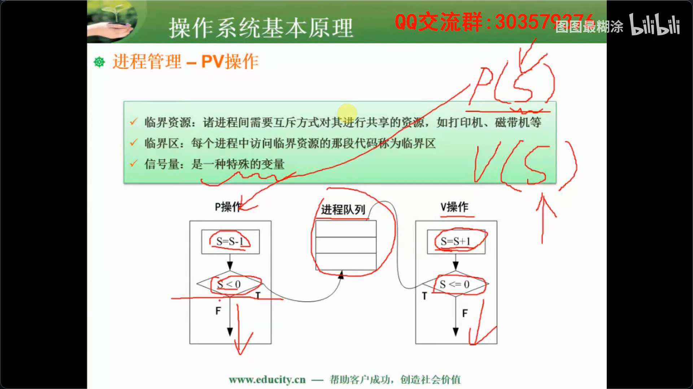

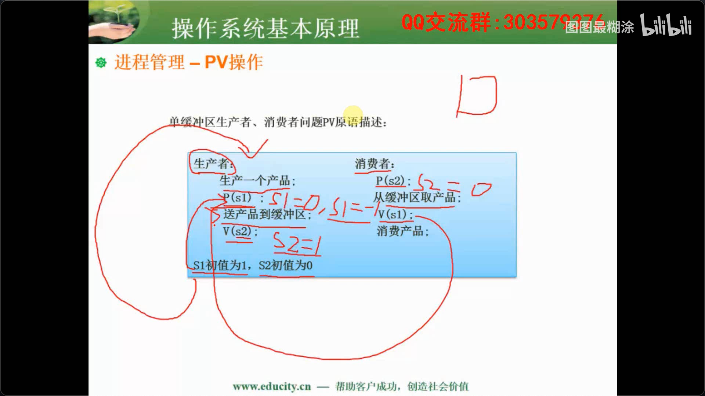

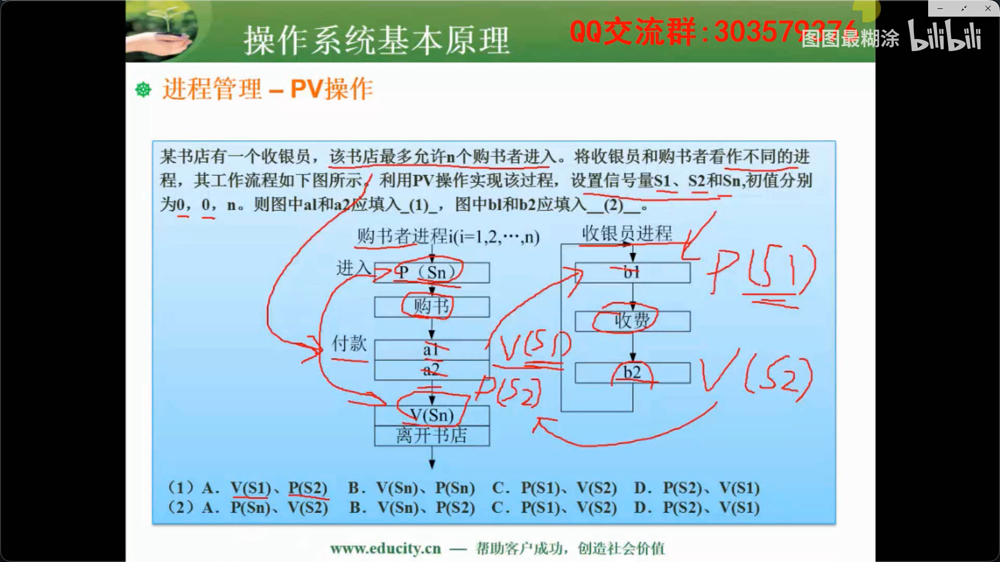

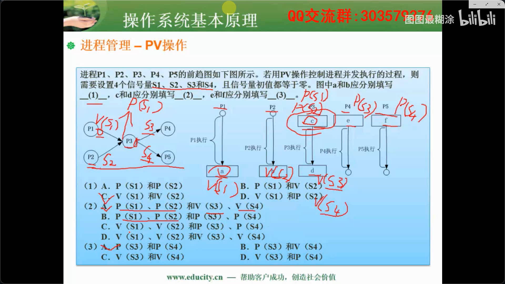

题目分析思路：

* 三个信号量：s1、s2、sn
* P（Sn），V(Sn)控制只能有n个购书者进入书店，如果超过则阻塞
* 假设收银员没有收到付款请求，那么收银员需要阻塞P(s1),所以b1需要放置一个阻塞标志，并且购书者发起购书请求发起购书请求V(s1)可以结束阻塞，所以a1=V(s1)。
* 购书者发完购书请求后仍不能马上离开，这是需要另外一个阻塞P(S2)，所以a2=P(S2)，需要等待收银员完成收银动作并返回激活信号V(S2)，b2=V（S2）后，P(S2)才能继续执行。

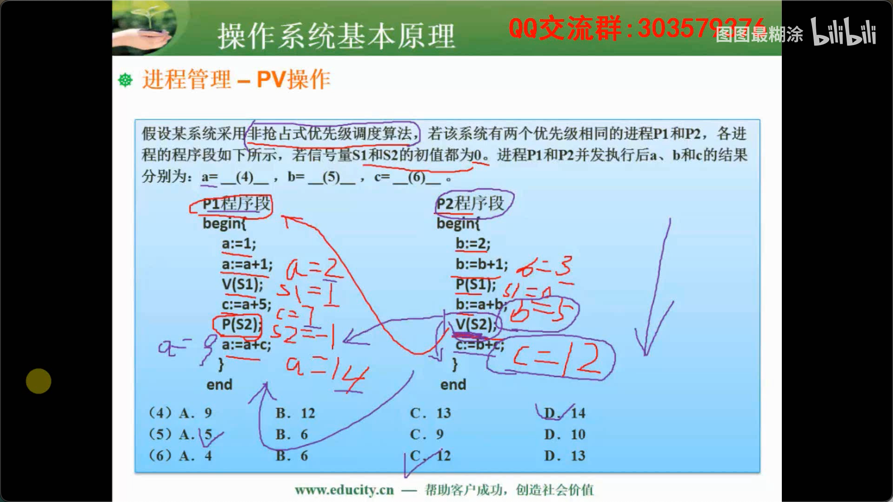

题目分析思路：

1. 题目中比较重要的一个信息点是“非抢占式优先级调度算法”意味着只要没运行到暂停就会一直往下运行。

场景1:

1. 假设P1程序先开始运行，a=2，s1=1，c=7,s2=-1，此时p1程序被暂停
2. P2开始运行，b=3，s1=0,b=5,s2=0,c=12，P2运行结束
3. 因为“非抢占式”，P2运行过程中没有暂停，所以直到P2完整运行完才开始运行S1
4. P1继续运行，a=14

场景2:

1. 假设P2程序先开始运行，b=3,s1=-1,此时P2程序被暂停
2. P1程序开始运行，a=2,s1=0,c=7,s2=-1,此时P1程序被暂停，
3. P2程序被唤醒重新执行，b=5,s2=0,c=12,P2运行结束
4. P1程序被唤醒重新执行，a=14

结论：本题设计比较巧妙，如果是“抢占式”算法，那么a的值会出现好几种情况。而“非抢占式”无论是P1程序还是P2程序先运行都不影响最终运行的结果。

##### 死锁四大条件

- 互斥
- 保持和等待
- 不剥夺
- 环路等待

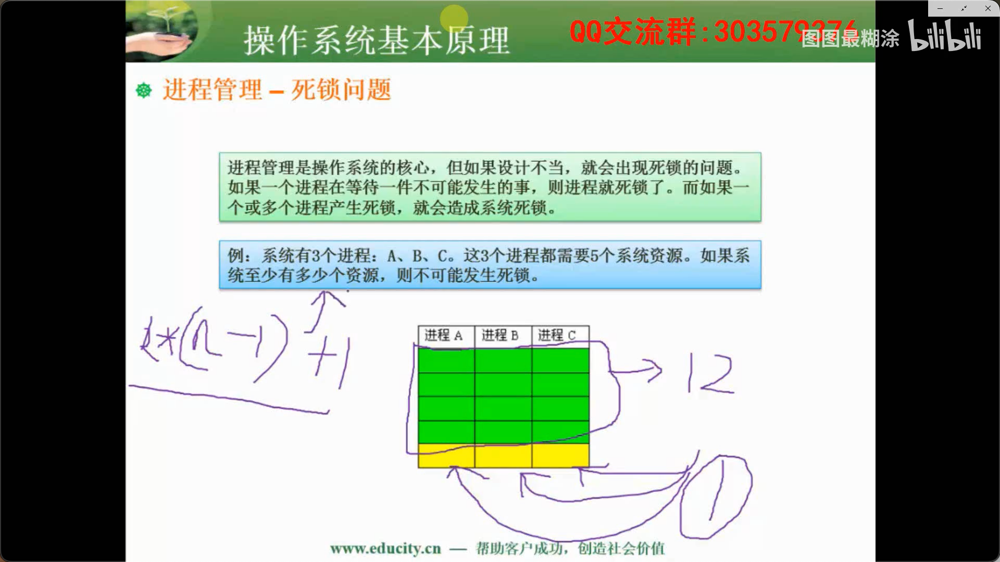

公式：p为进程数，n为进程完成任务需要资源数，那么不产生死锁的最小进程数为p*(n-1)+1，对于本题：3x(5-1)+1=13

##### 银行家算法

- 当一个进程对资源的最大需求量不超过系统中的资源数时可以接纳该进程。
- 进程可以分期请求资源，但请求的总数不能超过最大需求量
- 当系统现有的资源不能满足进程尚需资源数时，对进程的请求可以推迟分配，但总能使进程在有限的时间里得到资源

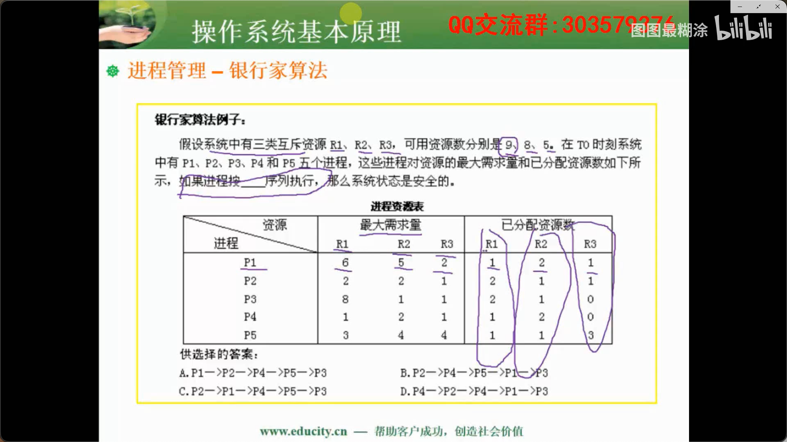

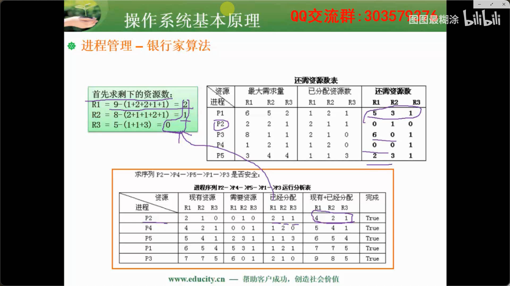

解题思路：

1. 首先计算出剩余资源数：R1=2,R2=1,R3=0
2. 计算出每个进程还需要资源情况，发现只有P2满足
3. P2执行完成后释放资源，当前剩余的资源为R1=2+2=4，R2=1+1=2，R3=0+1=1
4. 发现此时只有P4满足，已得出答案，选B
5. 有时间检查时，可以将答案C也带入验证

## 存储管理🌟🌟🌟

```
- CPU->Cache->内存->外存
- 用的时候通过局部性原理支撑，将外存内容调到内存，统称虚拟化存储
- 页式存储/段式存储/段页式存储
```

##### 页式存储组织

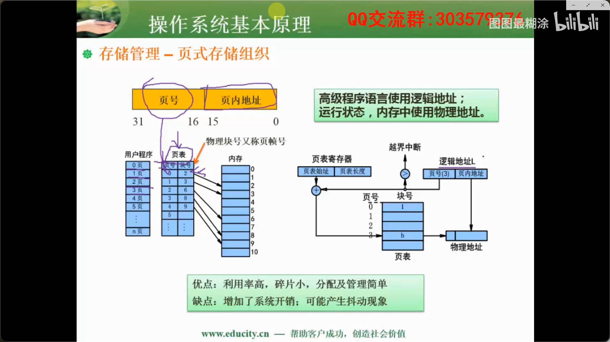

- 优点：利用率高，碎片小，分配及管理简单
- 缺点：增加了系统开销；可能产生抖动现象
- 逻辑地址=页号+页内地址
- 物理地址=页帧号+页内地址（物理块号又称为页帧块）
- 优先淘汰访问位为0，其次考虑修改位为0

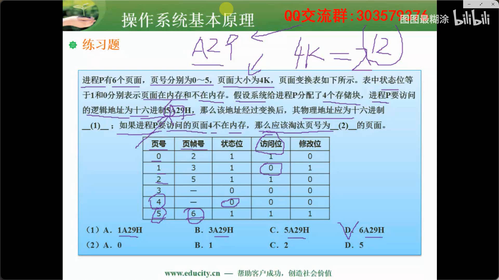

解题思路：

1. 页面大小是4k=2^12
2. 逻辑地址5A29H（H表示HEX,代表16进制）,因为16进制1位等于2进制4位，所以低位的A29为页内地址，5为页号
3. 查表发现页号5对应的页帧号为6，又因为物理地址=页帧号+页内地址，所以最终的物理地址为6A29H，选D
4. 在第二小题中，淘汰只能淘汰在内存中的页，即状态位为1的页，并且访问位1的页表示刚刚被访问，不能被淘汰，所以优先淘汰 状态位为0的页，所以淘汰页1,选B

##### 段式存储组织

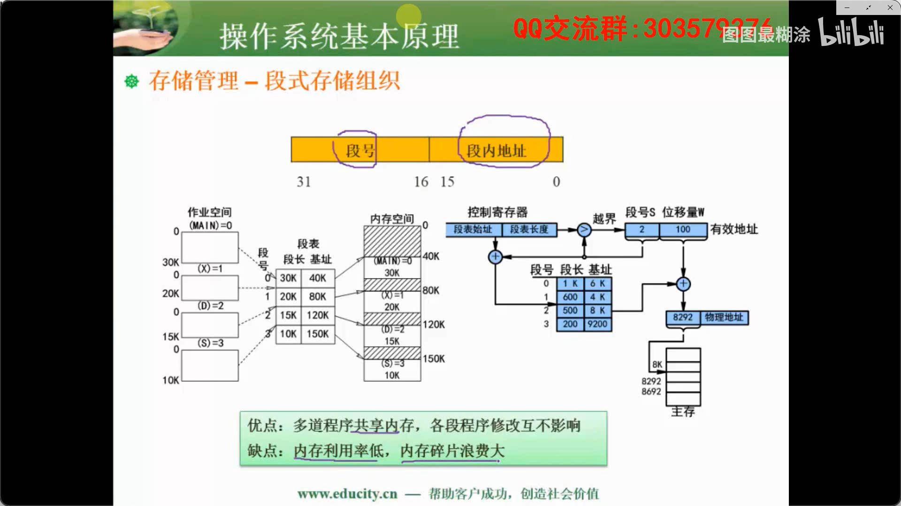

- 按用户作业中的自然段来划分逻辑空间，然后调入内存，段段长度可以不一样。
- 优点：多道程序共享内存，各段程序修改互不影响。
- 缺点：内存利用率低，内存碎片浪费大。
- 逻辑地址：（段号，段内偏移量）

##### 段页式存储组织

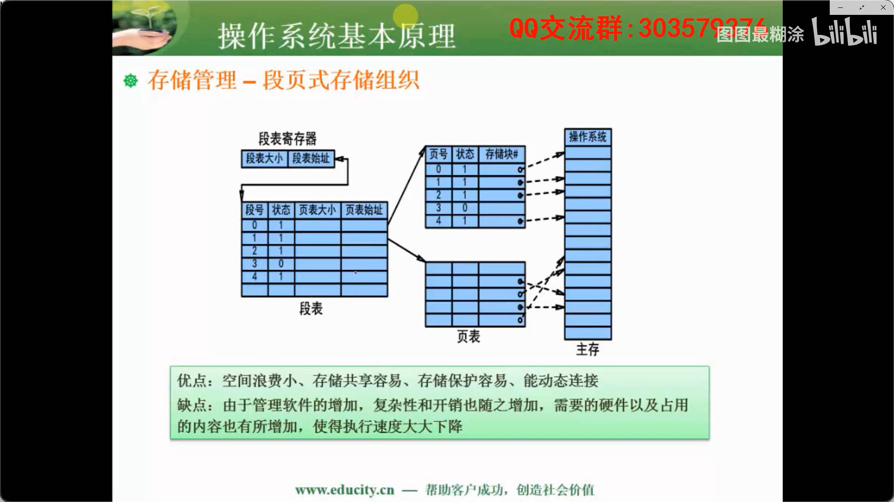

- 段式与页式的综合体，先分段，再分页。
- 优点：空间浪费小、存储共享容易、存储保护容易、能动态连接
- 缺点：由于管理软件的增加，复杂性和开销也随之增加，需要的硬件以及占用的内容也有所增加，使得执行速度大大下降

##### 页面置换算法

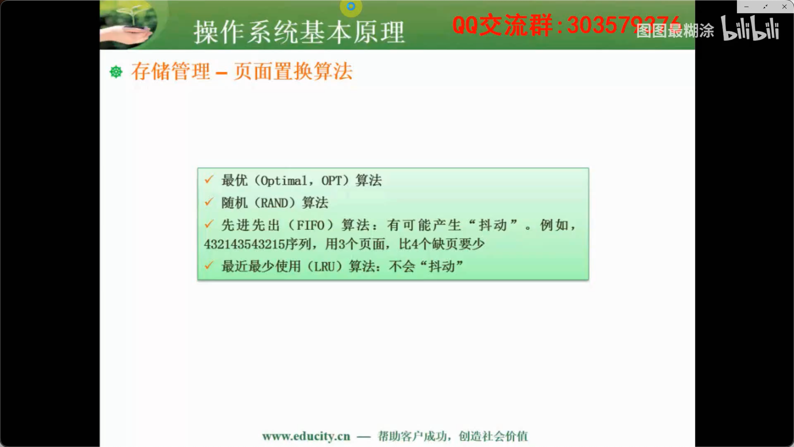

解释FIFO的抖动：

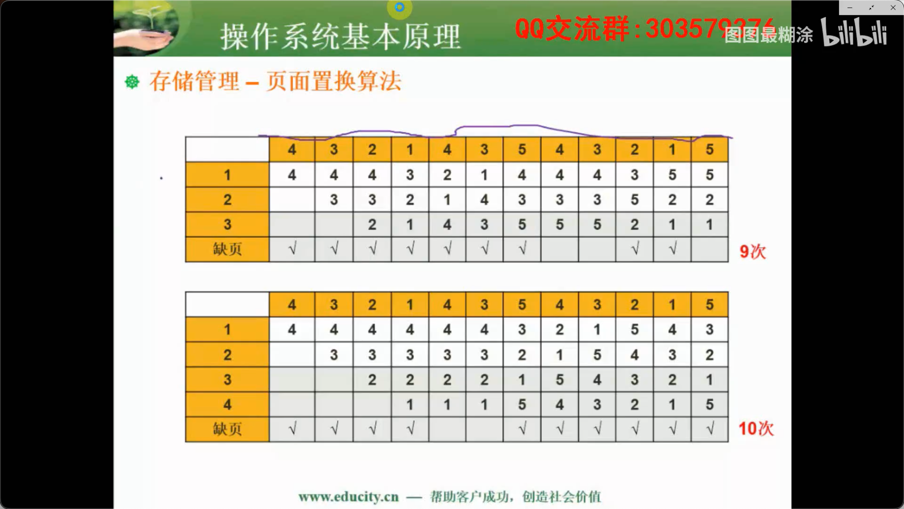

结论：增加了资源（3页变成4页），反而产生了更多缺页中断，这是我们不想看见的

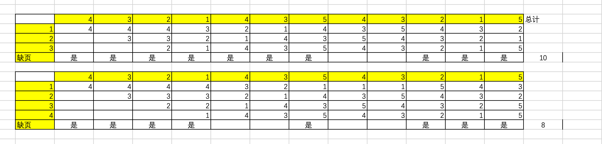

*LRU*是Least Recently Used,即最近最少使用

观察LRU缺页情况，发现LRU随着页数增加，缺页的次数得到了改善

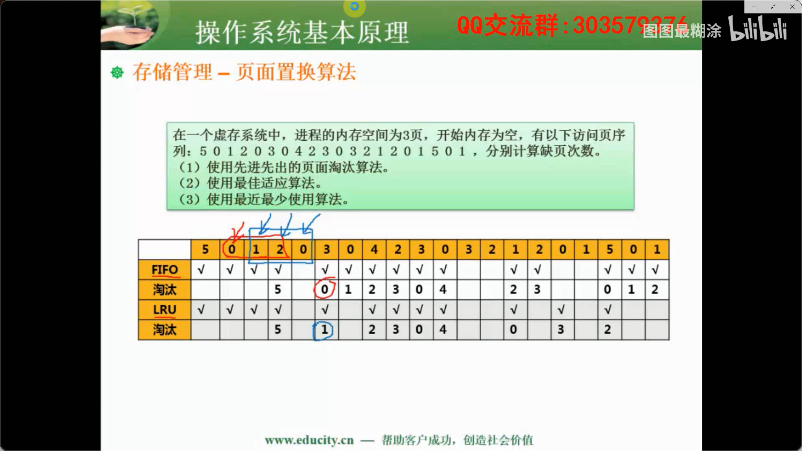

对比FIFO和LRU的页面淘汰情况

##### 快表

- 将页表存于Cache上叫快表
- 将页表存于内存上叫慢表

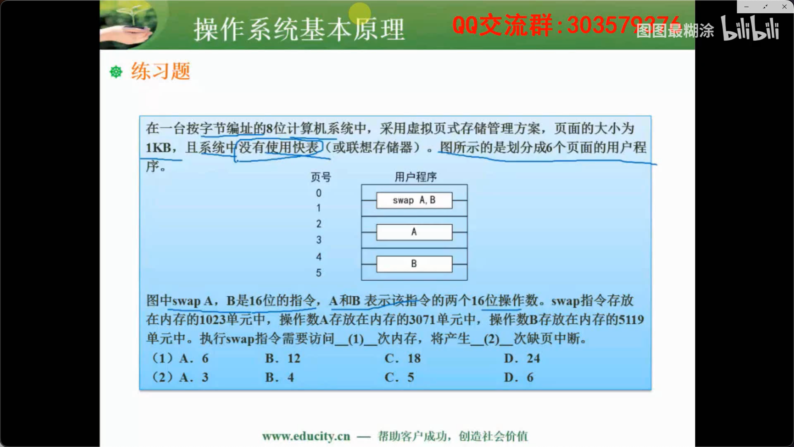

题目解析：

1. 注意题目中的关键字，没有使用快表，即表示数据需要去内存读取，去内存读取通常需要两步，第一步是查表，第二步是读取数据，所以6个页面需要访问内存12次。
2. 指令即使跨了两个页面，但是只会产生一次缺页中断（约定俗成）
3. 操作数跨两个页面，会产生两次缺页中断
4. 总共是5次缺页中断

## 文件管理

```
文件管理的是外存里的文件。
```

##### 索引文件🌟

- 索引可以理解为指针、地址、盘块号

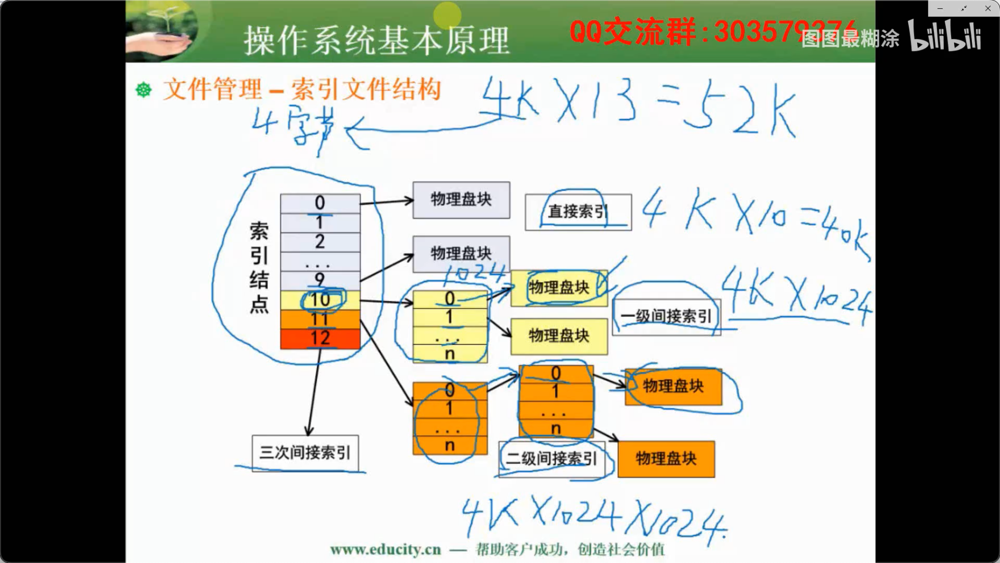

间接层数越多访问效率越低

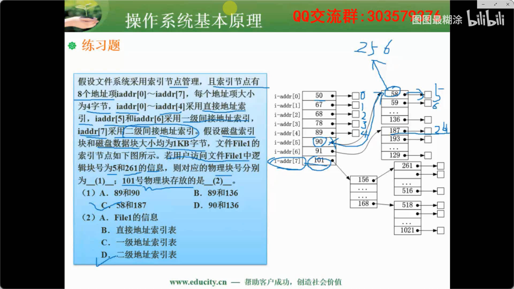

问题1:

1. 逻辑块号从0开始
2. Iaddr[5]~iaddr[6]为一级间接地址，所以按照顺序排布，逻辑块5对应58物理块号
3. 每个地址项的大小为4字节，且索引块的大小为1KB，所以i-addr[5]对应索引项共有256个
4. 所以5+256就等于261即下一个索引块的开始项，所以对应的物理项是187

问题2:

1. 二级地址索引表

##### 位示图

- 空闲区表法
- 空闲链表法
- 位示图法
- 成组链表法

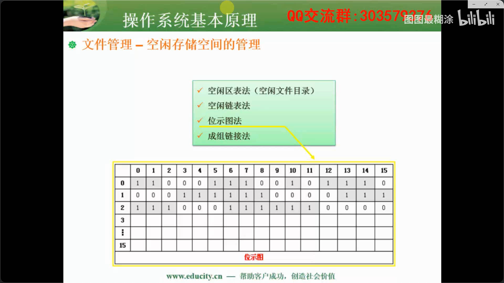

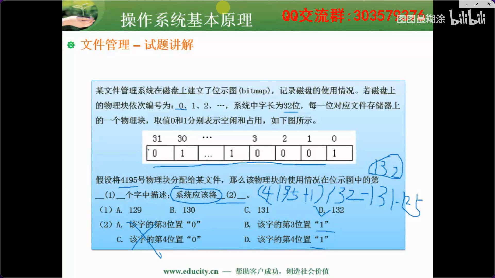

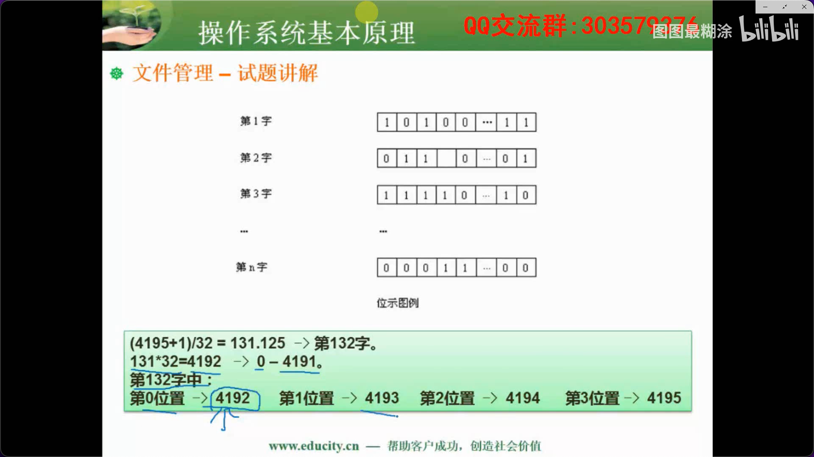

解题思路：

1. 因为物理块号是从0开始，所以（4195+1）/32=131.125，即第132个字中
2. 又32*131=4192,从0开始算起，所以上一个字的结束位置是4191，132个字开始的位置是4192
3. 那么4195就是该字的第3位置“1”
4. 细节：物理块是从0开始计算，字是从1开始计算

##### 文件和树型目录结构

- 文件属性：R只读文件属性 / A存档属性 / S系统文件 / H隐藏文件
- 文件名的组成：驱动器号+路径+主文件名+扩展名
- 绝对路径：是从盘符开始的路径
- 相对路径：是从当前目录开始的路径

##### 空闲存储空间的管理

- 文件管理：空闲区表法、空闲链表法、位示图法 成组链接法

## 作业管理

```
软考中从来没有出现过。
```

## 设备管理

##### 数据传输控制方式

- **程序控制方式**：严重影响CPU。分为无条件传送和程序查询方式。
- **程序中断方式**：CPU无需等待而提高了传输请求的响应速度。
- **DMA方式**：DMA方式比程序控制方式与中断方式都高效。
- 通道方式
- I/O处理机

##### 虚设备与SPOOLING技术

- 假脱机技术，没有真正实现脱机打印

## 微内核操作系统

|          | 实质                                                         |
| -------- | ------------------------------------------------------------ |
| 单体内核 | 将图形、设备驱动及文件系统等功能全部在内核中实现，运行在内核状态和统一地址空间。 |
| 微内核   | 是实现基本功能，将图形系统、文件系统、设备驱动及通信功能放在内核之外。 |

## 嵌入式操作系统

##### 嵌入式操作系统特点

- 1.微型化 2.代码质量高 3.专业化 4.实时性强 5.可裁剪、可配置
- 实时嵌入式操作系统的内核服务有：异常和中断、计时器、I/O管理
- 常见的嵌入式RTOS：VxWorks、RT-Linux、QNX、pSOS

##### 板级支持包（BSP，也称为硬件抽象层HAL）

板级支持包（BSP，也称为硬件抽象层HAL）一般包含相关底层硬件的初始化、数据的输入／输出操作和硬件设备的配置等功能，它主要具有以下两个特点。 ①硬件相关性，因为嵌入式实时系统的硬件环境具有应用相关性，而作为上层软件与硬件平台之间的接口，BSP需为操作系统提供操作和控制具体硬件的方法。 ②操作系统相关性，不同的操作系统具有各自的软件层次结构，因此不同操作系统具有特定的硬件接口形式。

##### JTAG接口

JTAG（Joint Test Action Group，联合测试工作组）是一种国际标准测试协议（IEEE 1149.1兼容），主要用于芯片内部测试。现在多数的高级器件都支持JTAG协议，如DSP、FPGA器件等。标准的JTAG接口是4线：TMS、TCK、TDI、TDO，分别为模式选择、时钟、数据输入和数据输出线。

一般来说，嵌入式系统通常采用接口中的**移位寄存器**来实现数据的串／并和并／串转换操作。