# 数据库系统

[toc]

```
1. 数据库设计阶段：数据将设计阶段
2. 关系代数：关系代数运算、关系代数与SQL结合考察
3. 规范化理论：候选关系式、范式、模式分解、其他
4. 并发控制：并发控制
5. 数据库扩展技术：分布式数据库、数据库分区、数据仓库与数据挖掘、联邦数据库、NoSQL、内存数据库、数据库性能优化、大数据
6. 数据备份与恢复：数据备份与恢复
```

## 数据库模式

##### 三级模式-两层映射

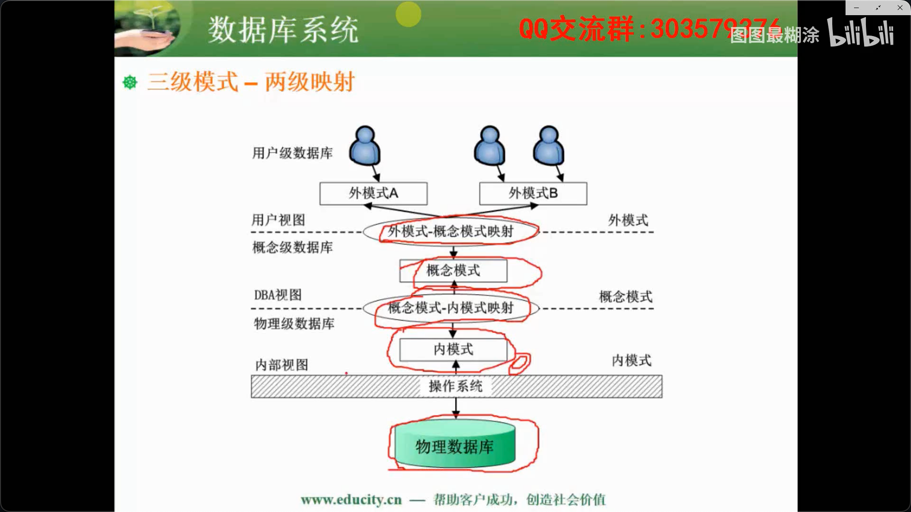

- 外模式(视图、用户模式、用户视图)->概念模式(DBA视图)（表）->内模式(内部试图)（存储文件）
- 外模式-概念模式映射 概念模式-内模式映射

##### 视图

- 数据库试图是一个虚拟表，其内容由查询定义。但是试图并没有真正存储这些数据，而是通过查询原始表动态生成所需要的数据
- 优点：能简化用户操作、使用户能以多角度看待同一数据
- 缺点：查询之后再展示效率比较低

##### 数据库设计过程

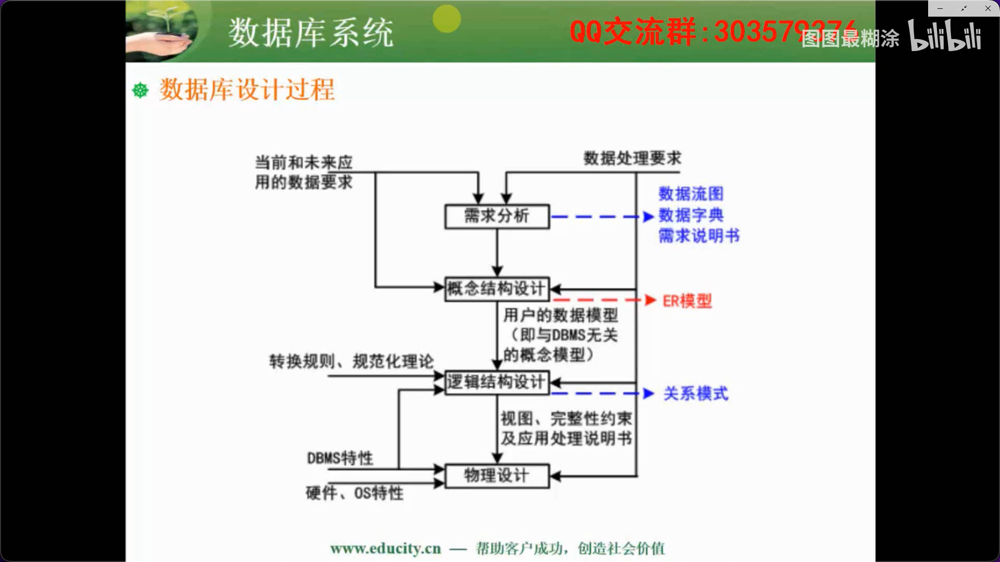

- 需求分析(**数据流图、数据字典**、需求说明书)
- 概念结构设计(ER模型)
- 逻辑结构设计(关系模式)
- 物理设计

## ER模型

##### 关键

- 属性
- 实体
- 联系

##### ER图转关系模式

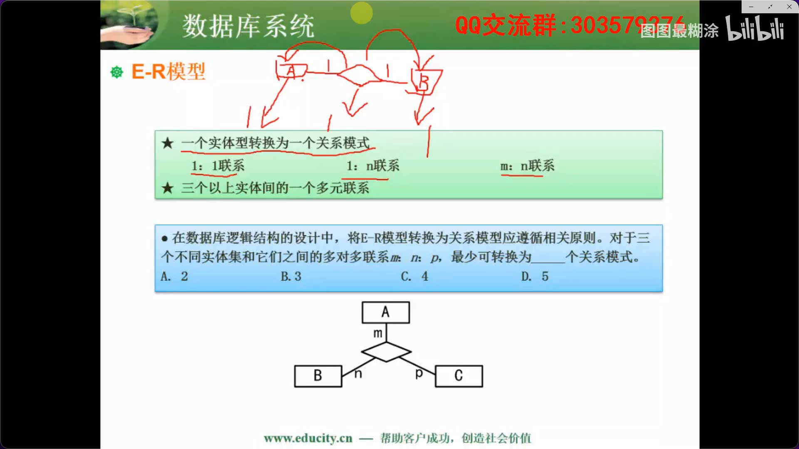

* 1:1 ：关系可以归属于任何一个实体，至少2个关系模式

* 1:n：关系可以记录在多的一边，至少2个关系模式，可以利用部门和员工关系方便记忆，部门id可以方便的放在员工表中，反过来则不好实现。
* m:n：关系必须要单独一个模式。
* 所以上图中的题目选c

## 关系代数

##### 关系代数运算

- 并
- 交
- 差

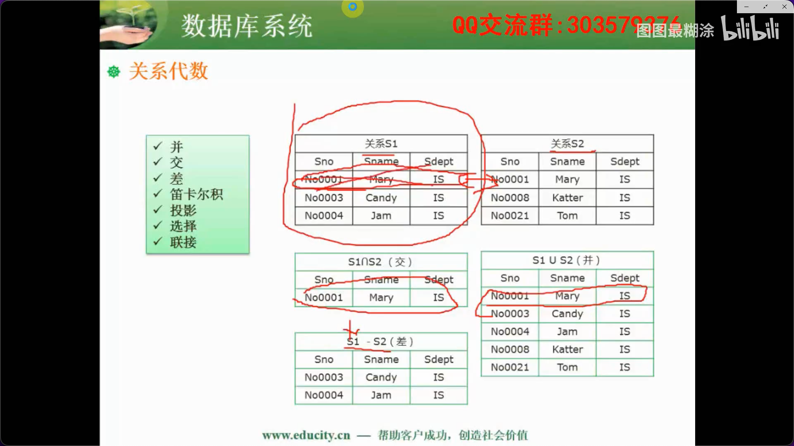

- 笛卡尔积
- 投影
- 选择

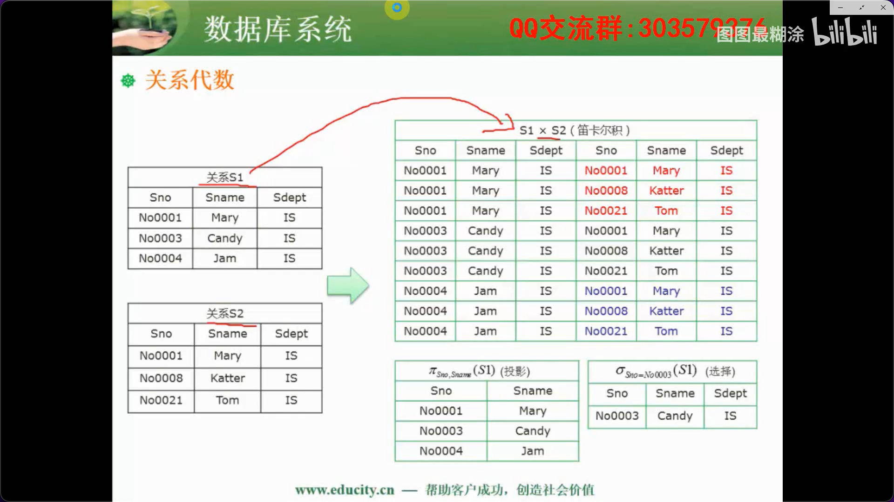

Πsno,sname等价于π1,2

𝜎sno=No0003等价于𝜎1=No0003

- 自然连接

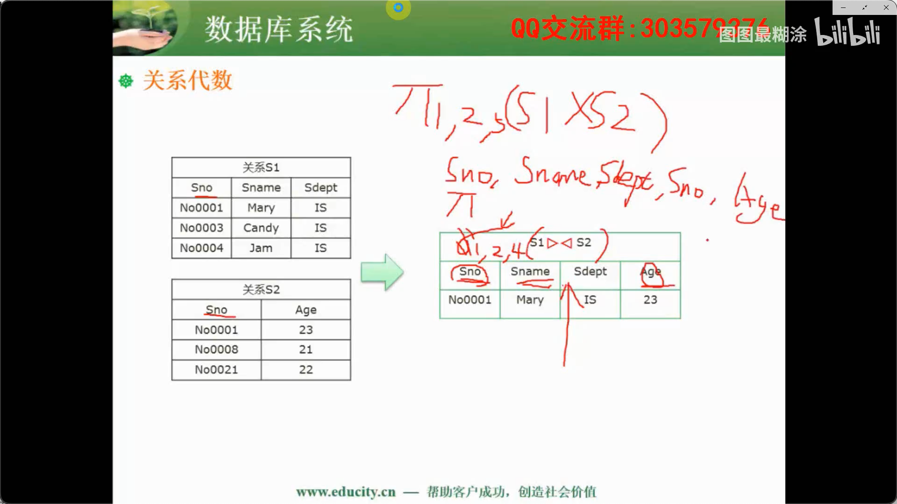

细节：

1. 连接的符号表示：⋈ s1.sno = s2.sno （注意：⋈ 在顶上）
2. 自然连接：两个关系如果只有一个字段相同，不写连接条件时，默认就使用相同的字段连接
3. 连接与笛卡尔积的结果区别：笛卡尔积会保留相同的列s1xs2=sno,sname,sdept,sno,age。s1⋈ s2=sno,sname,sdept,age

## 规范化理论

##### 价值与用途

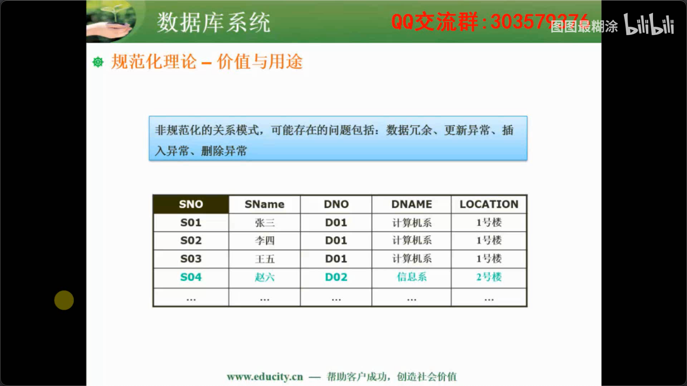

- 非规范化的关系模式：数据冗余、更新异常、插入异常、删除异常

##### 函数依赖

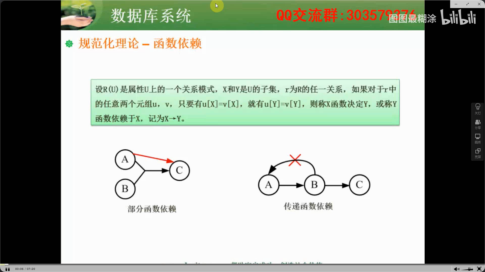

- 部分函数依赖：多个元素的主键才有部分函数依赖。（学号+课程号）=> 姓名，其实只用学好=>姓名
- 传递依赖：注意A=>B，但是B！=>A,否则A与B等价，也就不存在传递的讲法

##### 键

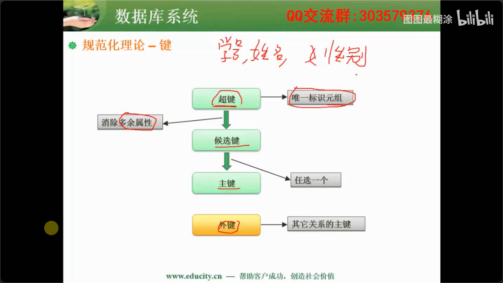

- 超键
- 候选键，候选键与超键的区别在于消除冗余属性，如，超键=（学号，姓名）->性别 有冗余不是候选键，所以（学号）->性别为候选键
- 主键：唯一标识元组的属性集合
- 外键：其他关系的主键

图示法求候选键


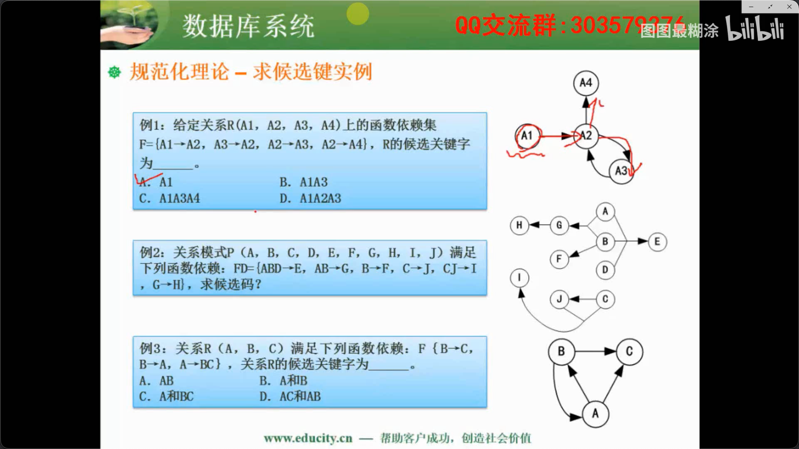

例1：因为A1的入度为0，且能遍历所有节点，所以A1是候选键

例2：因为没有单独的一个节点能遍历整张图，所以考虑联合主键，虽然B可以遍历的节点很多，但是不能遍历到A和D，所以需要ABCD作为候选键

例3：如果没有入度为0的节点，考虑中间节点，A和B都能遍历其他节点。注意：不要写成AB，这表示组合键

##### 范式

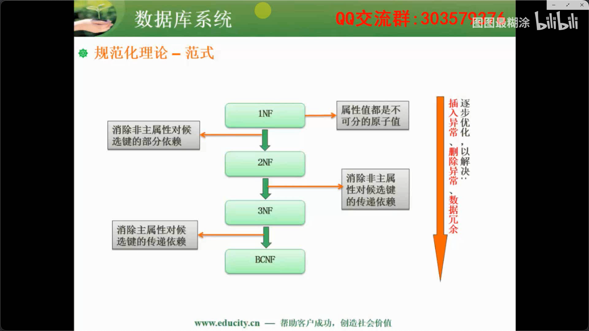

- 1NF：属性值都是不可分的原子值

  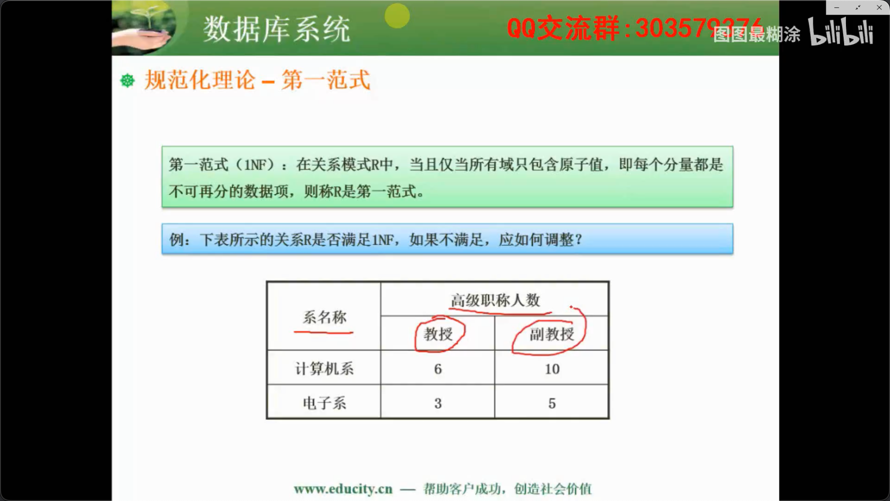

- 2NF：消除非主属性对候选键的部分依赖

  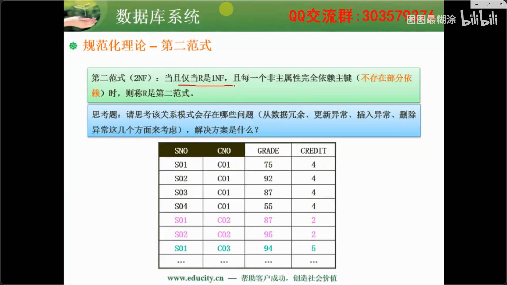

  因为存在非主属性CREDIT(学分)对主键的部分依赖，所以不满足2NF

  * 数据冗余：只需保存[c01，4]这一条记录
  * 更新异常：修改课程学分时，只改部分记录中的学分会造成数据不一致
  * 插入异常：不能插入没有人选的课程，因为没有主键
  * 删除异常：清空学生信息时会将课程信息学分一并清除

  解决方案：将CNO,CREDIT提取成一张单独的表（关系模式），并在原表（关系模式）中删除CREDIT字段

- 3NF：消除非主属性对候选键的传值依赖

  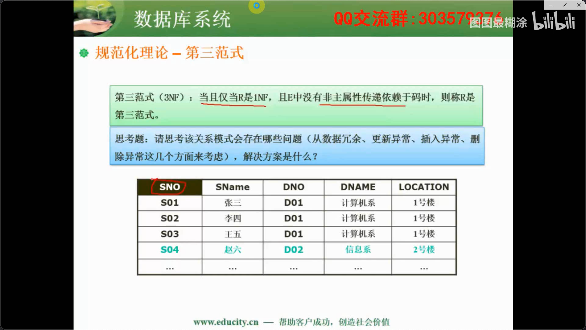

  SNO->DNO->DNAME,LOCATION，非主属性DNAME,LOCATION对主键存在传递依赖，需要将DNO,DNAME,LOCATION单独提取成一个新的关系模式

- BCNF：消除主属性对候选键的部分和传递依赖，左侧决定因素必须包括候选码

  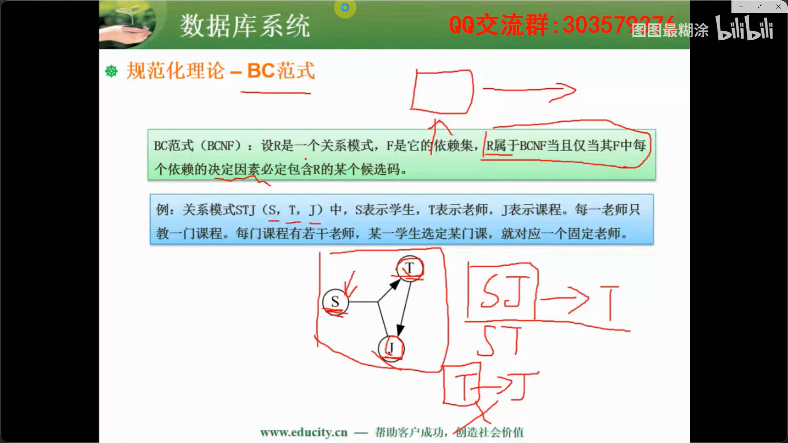

  候选键：ST，SJ

  依赖：SJ->T,T->J

  T不是关系模式的候选键，所以不满足每个依赖的决定因素（SJ,T即依赖关系的左边部分）必定包含候选码

例题

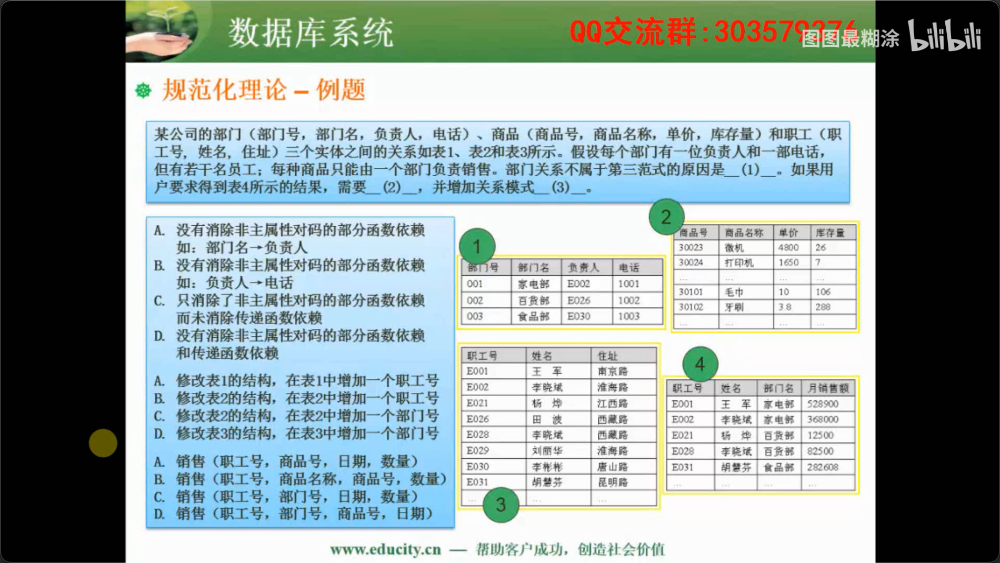

1. 因为部门表中并没有复合主键，所以已经消除了非主属性对码的部分函数依赖，选C,其他选项都可以排除
2. 因为表4中包含员工与部门的关系，所以在表3中需要增加一列部门号，选D
3. 因为需要获得月销售额，那么就需要一个员工与商品的关系模式（排除C,D），又因为商品名称是冗余字段，所以选A

##### 无损分解

- 保持函数依赖分解

  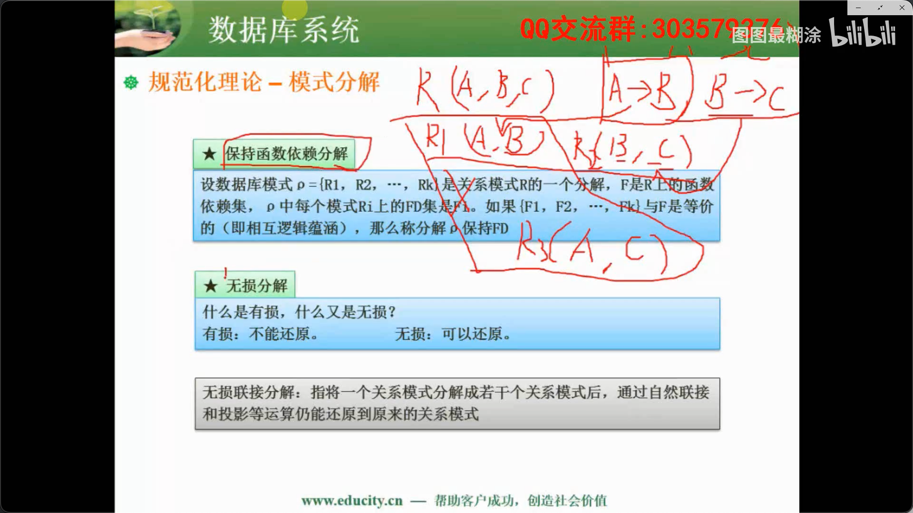

  假设R(A,B,C)中的依赖A->B,B->C,这时分解R为R1(A,B)和R2(B,C)，这样的的分解保持了函数依赖。如果R分解R1(A,B),R2(A,C)，这样的分解没有保存函数依赖。

- 无损分解

  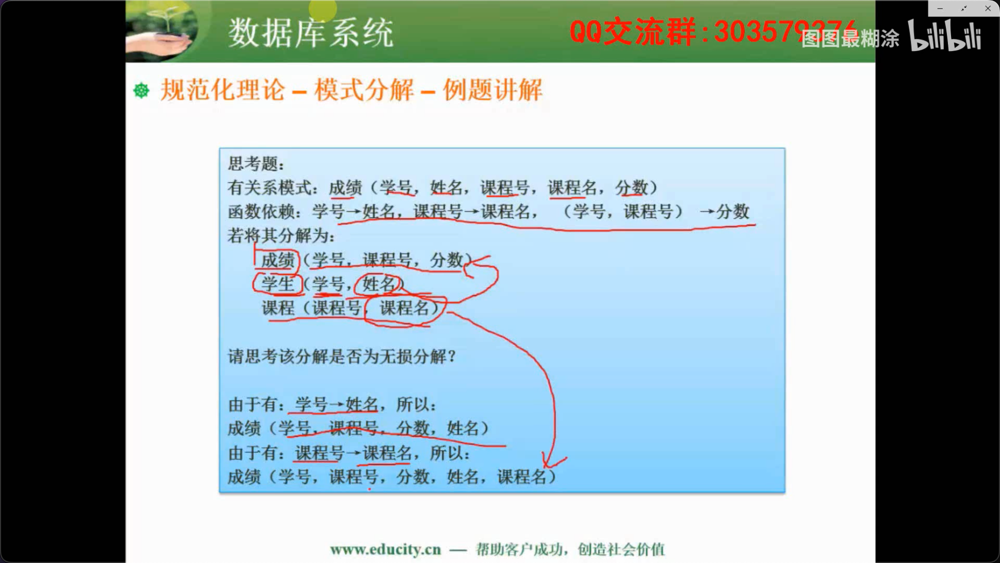
  
  使用常识分解：能将分解后的模式通过关联还原成原来的模式，这样的分解为无损模式
  
  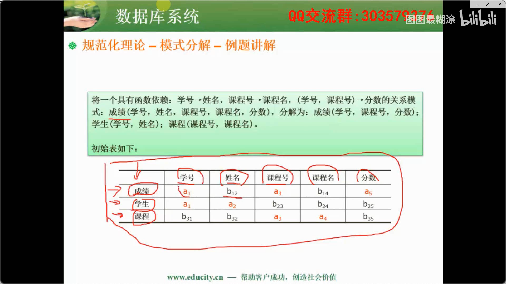
  
  使用表格分解：a代表关系模式中包含的属性，b代表关系模式中不包含的属性，如果可以将表格中的某一行全部替换成a则说明这样的分解是无损分解。
  
  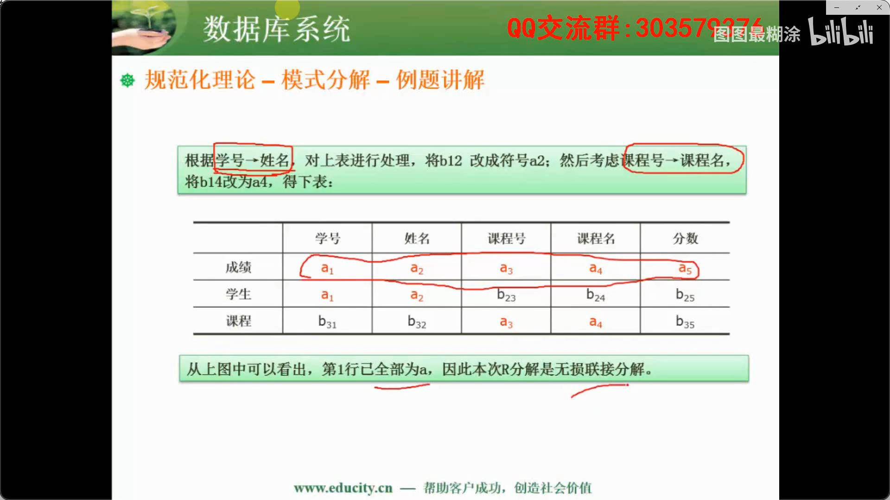
  
  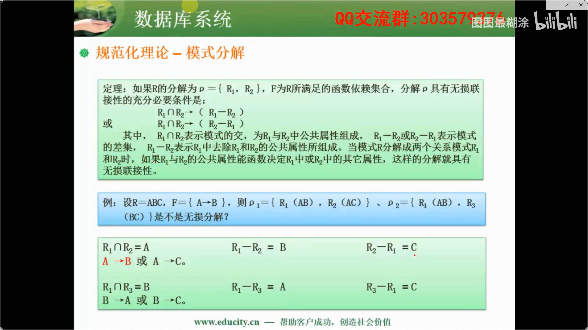
  
  使用定理分解(只适用与一分为二的情况)：如果R1与R2的公共属性能函数决定R1中的或R2中的其他属性。例如：公共属性“学号”->其他属性“姓名”
  
  

##### 反规范化

- 由于规范化会使得表不断的拆分，从而导致数据表过多，会增加查询的工作量。
- 技术手段：增加派生性冗余列、增加冗余列、重新组表、分割表（水平分割、垂直分割）

## 并发控制

##### 事务的特性

- 原子性
- 一致性
- 隔离型
- 持续性

##### 并发产生的问题

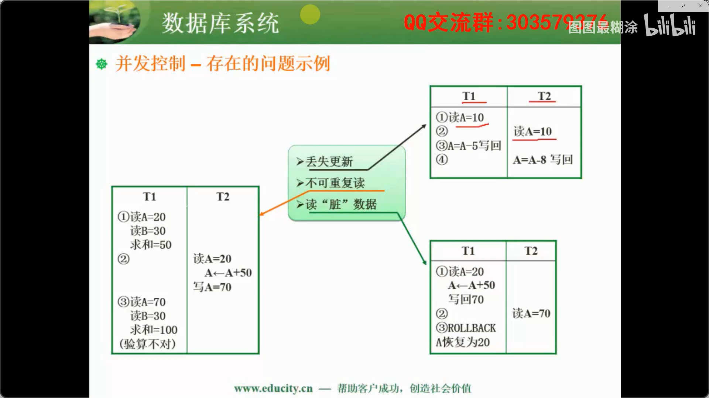

- 丢失更新
- 不可重复读
- 脏数据

##### 封锁协议

> 封锁是实现并发控制的一个非常重要的技术。所谓封锁就是事务T在对某个数据对象例如表、记录等操作之前，先向系统发出请求，对其加锁。加锁后事务T就对该
> 数据对象有了一定的控制，在事务T释放它的锁之前，其它的事务不能更新此数据对象。 基本的封锁类型有两种：排它锁（Exclusive locks 简记为X锁）和共享锁（Share locks 简记为S锁）。

- S锁：读锁、共享锁
- X锁：写锁、排他锁、独占锁
- 一级封锁协议：事务T在修改数据R前必须先对其加X锁，直到事务结束才释放。可防止丢失修改。
- 二级封锁协议：一级封锁协议加上事务T在读取数据R之前先对其加S锁，读完后即可释放S锁。可防止丢失修改，还可防止读脏数据。
- 三级封锁协议：一级封锁协议加上事务T在读取数据R之前先对其加S锁，直到事务结束才释放。可防止丢失修改，还可防止读脏数据、防止数据重复读。
- 两段锁协议：可串行化、可能发生死锁。

> 三级封锁协议
> 一级封锁：修改数据加x锁直到事务结束才释放。在此协议中，仅仅是读数据是不需要加锁的，所以只能解决丢失修改问题，不能解决脏读和不可重复读。
> 二级封锁：在一级封锁的基础上，加了一条：T事务在读取数据R之前必须先对其加上S锁，读完释放S锁。可以解决丢失修改和脏读（加了读锁就可以防止在读的期间其他事务进行修改，但是读完之后，事务结束之前，依然可能会其他事务进行修改，导致不可重复读）。
> 三级封锁协议：一级封锁协议加上事务T在读取数据R之前必须先对其加S锁，直到事务结束才释放。：解决了丢失修改、脏读和不可重复读的问题。

## 数据库完整性约束

##### 约束

- 实体完整性约束：主键唯一且为空
- 参照完整性约束：外键，其他关键的主键，或者为空
- 用户自定义完整性约束，如：0<x<=200
- 针对**复杂的约束**，系统提供了**触发器机制**，通过用户编程实现。

## 数据库安全性

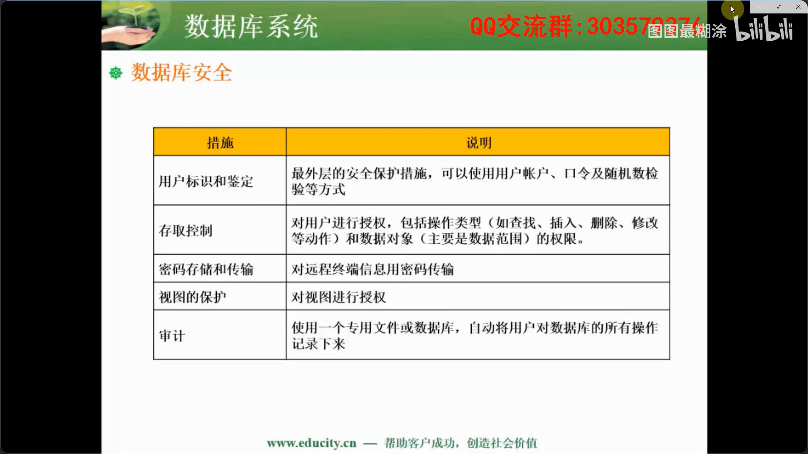

- 用户标识与鉴定
- 存取控制
- 密码存储和传输
- 视图的保护
- 审计

##### 数据备份

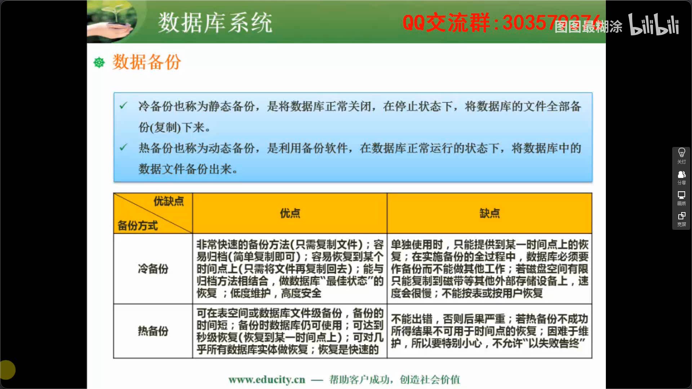

- 冷备份：数据库在停止状态下，将数据库的文件全部备份下来
- 热备份：数据库在运行状态下，将数据库的文件全部备份下来

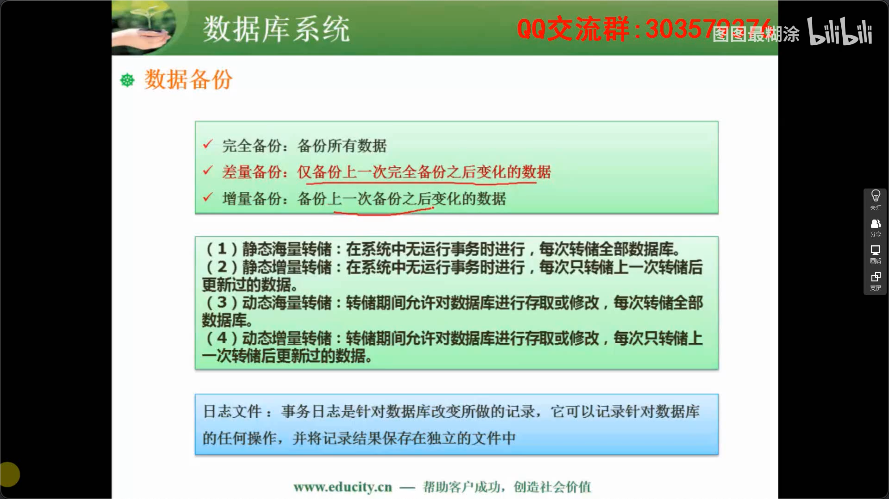

- 完全备份：备份所有数据
- 差量备份：仅备份上一次**完全备份**之后变化的数据
- 增量备份：备份上一次备份之后变化的数据
- 影子拷贝：该策略假设在某一个时刻只有一个活动的事务，首先对数据库做副本（称为影子副本），并在磁盘上维护一个dp_pointer指针，指向数据库的当前副本。对于要执行写操作的数据项，数据库系统在磁盘上维护数据库的一个副本，所有的写操作都在数据库副本上执行，而保持原始数据库不变，如果在任一时刻操作不得不中止，系统仅需要删除新副本，原数据库副本没有受到任何影响。
- 基于日志的延迟修改技术（deferred-modification technique）的设计与恢复过程。该技术通过在日志中记录所有对数据库的修改操作，将一个事务的所有写操作延迟到事务提交后才执行，日志中需要记录“事务开始”和“事务提交”时间，还需要记录数据项被事务修改后的新值，无需记录数据项被事务修改前的原始值。当系统发生故障时，如果某个事务已经开始，但没有提交，则该事务对数据项的修改尚未体现在数据库中，因此无需做任何恢复动作。

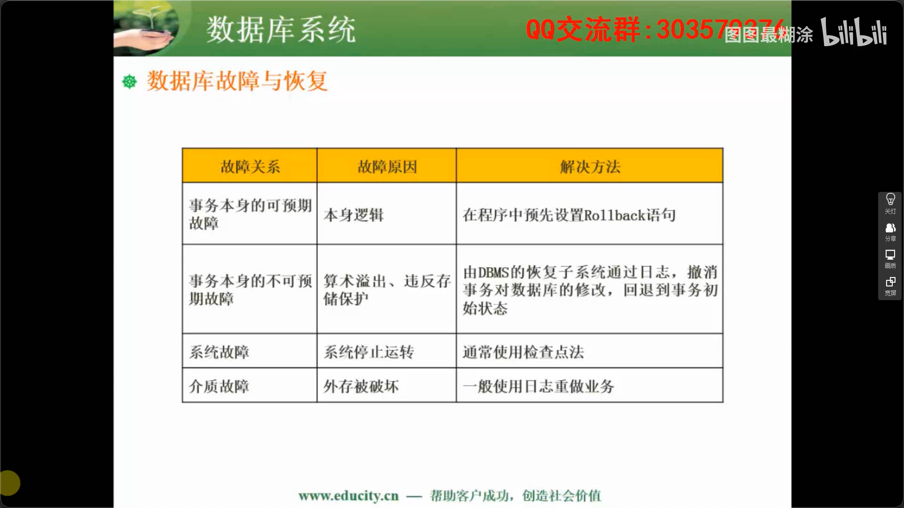

## 分布式数据库

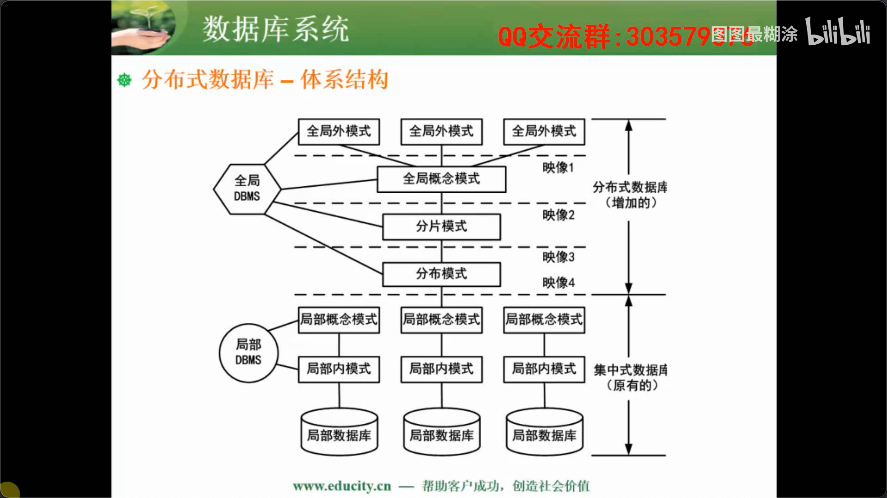

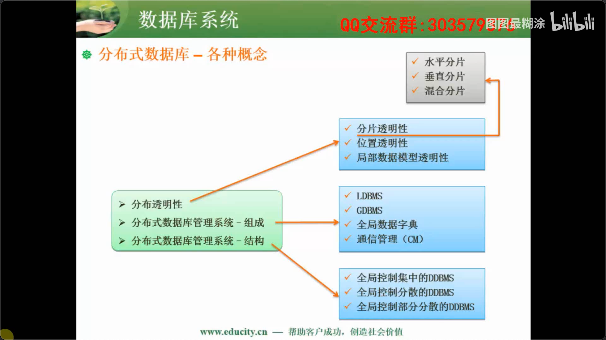

##### 分片透明性

- 分片透明性
- 位置透明性
- 局部数据模型透明性

##### 分布式数据库管理系统DDBMS-组成

- LDBMS（局部数据库管理系统）
- GDBMS（全局数据库管理系统）
- 全局数据字典
- 通信管理Cm

##### 分布式数据库管理系统-结构

- 全局控制集中的DDBMS
- 全局控制分散的DDBMS
- 全局控制部分分散的DDBMS

##### 数据库优化

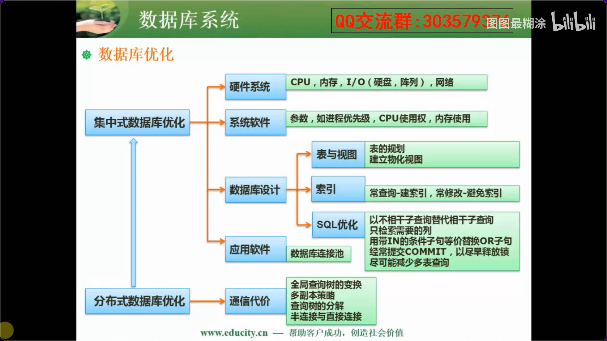

##### 关系数据库与NoSQL数据库对比

| --         | 关系数据库模式          | --                       |
| ---------- | ----------------------- | ------------------------ |
| 并发支持   | 支持并发、效率低        | 并发性能高               |
| 存储与查询 | 关系表方式存储、SQL查询 | 海量数据存储、查询效率高 |
| 扩展方式   | 向上扩展                | 向外扩展                 |
| 索引方式   | B树、哈希等             | 键值索引                 |
| 应用领域   | 面向通用领域            | 特定应用领域             |

##### NoSQL

| 类型         | eg      |
| ------------ | ------- |
| 键值         | redis   |
| 列存储数据库 | HBase   |
| 文档型数据库 | MongoDB |
| 图形数据库   | Neo4j   |

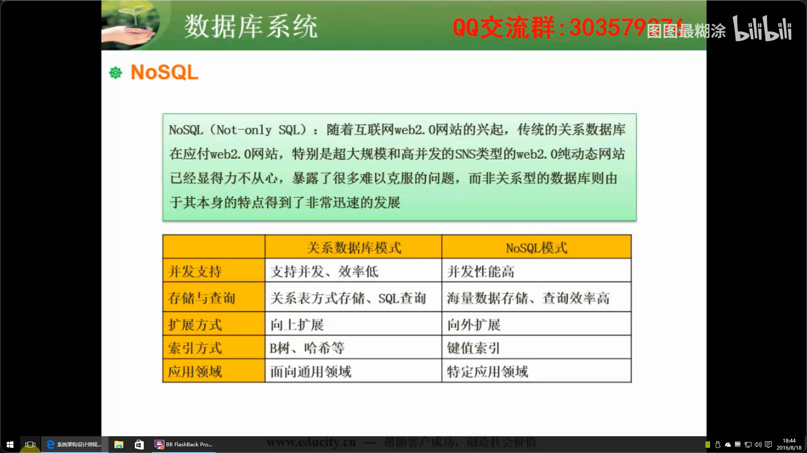

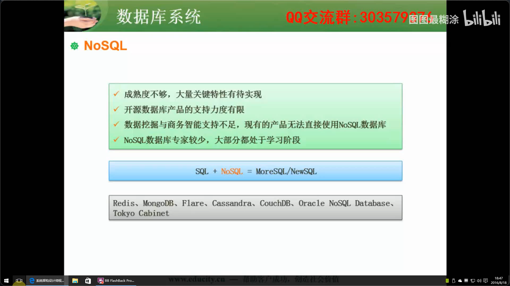

## 数据仓库与数据挖掘

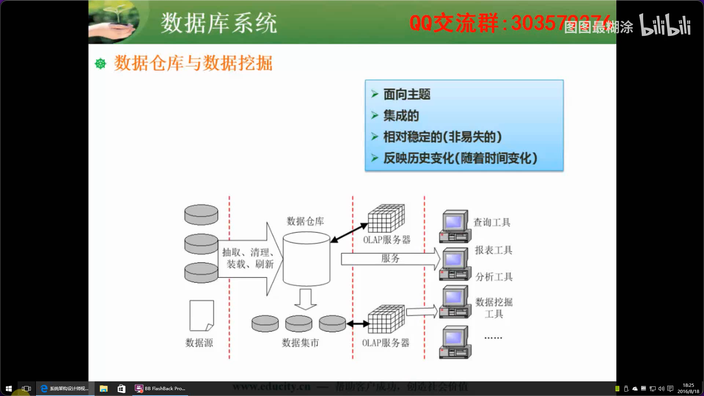

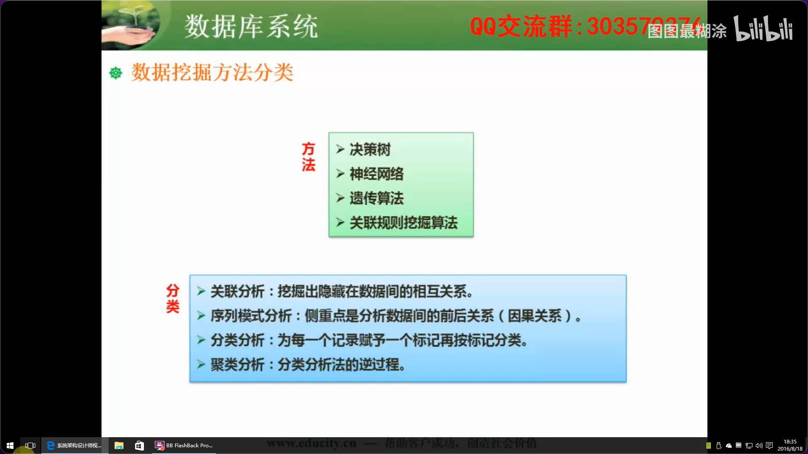

##### 联邦数据库

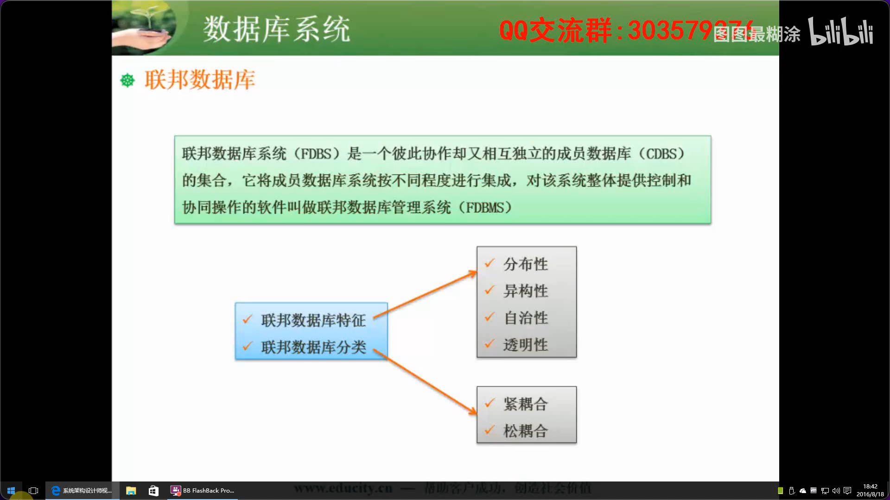

##### 反规范化

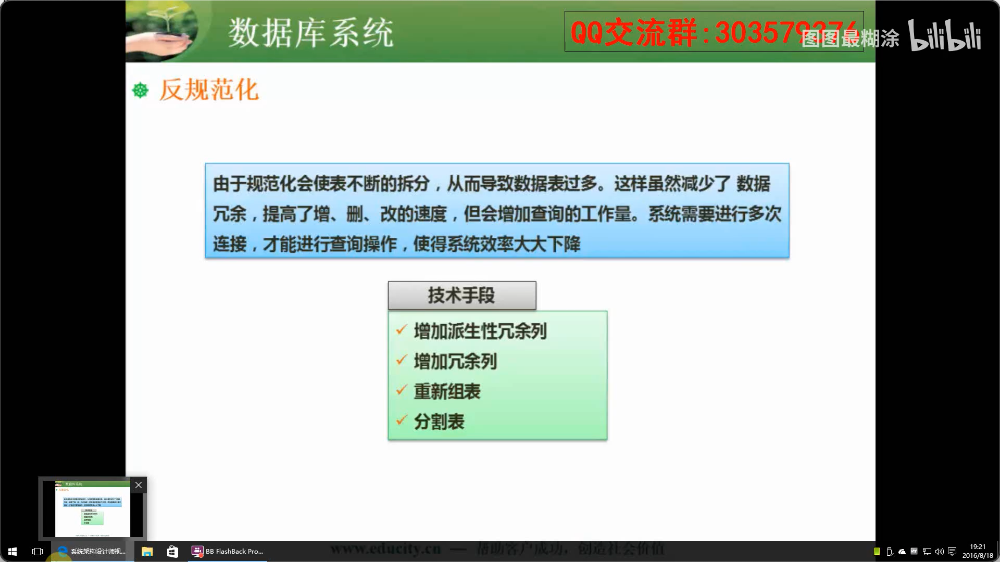

数据库中的数据规范化的优点是减少了数据冗余，节约了存储空间，相应逻辑和物理的I/O次数减少，同时加快了增、删、改的速度，但是对完全规范的数据库查询，通常需要更多的连接操作，从而影响查询速度。因此，有时为了提高某些查询或应用的性能而破坏规范规则，即反规范化（非规范化处理）。
 常见的反规范化技术包括：
 （1）增加冗余列
 增加冗余列是指在多个表中具有相同的列，它常用来在查询时避免连接操作。例如：以规范化设计的理念，学生成绩表中不需要字段“姓名”，因为“姓名”字段可以通过学号查询到，但在反规范化设计中，会将“姓名”字段加入表中。这样查询一个学生的成绩时，不需要与学生表进行连接操作，便可得到对应的“姓名”。
 （2）增加派生列
 增加派生列指增加的列可以通过表中其他数据计算生成。它的作用是在查询时减少计算量，从而加快查询速度。例如：订单表中，有商品号、商品单价、采购数量，我们需要订单总价时，可以通过计算得到总价，所以规范化设计的理念是无须在订单表中设计“订单总价”字段。但反规范化则不这样考虑，由于订单总价在每次查询都需要计算，这样会占用系统大量资源，所以在此表中增加派生列“订单总价”以提高查询效率。
 （3）重新组表
 重新组表指如果许多用户需要查看两个表连接出来的结果数据，则把这两个表重新组成一个表来减少连接而提高性能。
 （4）分割表
 有时对表做分割可以提高性能。表分割有两种方式。水平分割：根据一列或多列数据的值把数据行放到两个独立的表中。水平分割通常在下面的情况下使用。
 情况 1：表很大，分割后可以降低在查询时需要读的数据和索引的页数，同时也降低了索引的层数，提高查询效率。
 情况 2：表中的数据本来就有独立性，例如表中分别记录各个地区的数据或不同时期的数据，特别是有些数据常用，而另外一些数据不常用。
 情况3：需要把数据存放到多个介质上。

垂直分割：把主码和一些列放到一个表，然后把主码和另外的列放到另一个表中。如果一个表中某些列常用，而另外一些列不常用，则可以采用垂直分割，另外垂直分割可以使得数据行变小，一个数据页就能存放更多的数据，在查询时就会减少I/O次数。其缺点是需要管理冗余列，查询所有数据需要连接操作。

##### 大数据

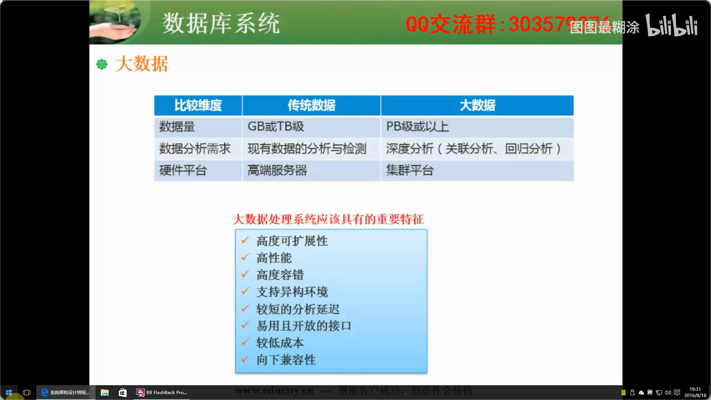

