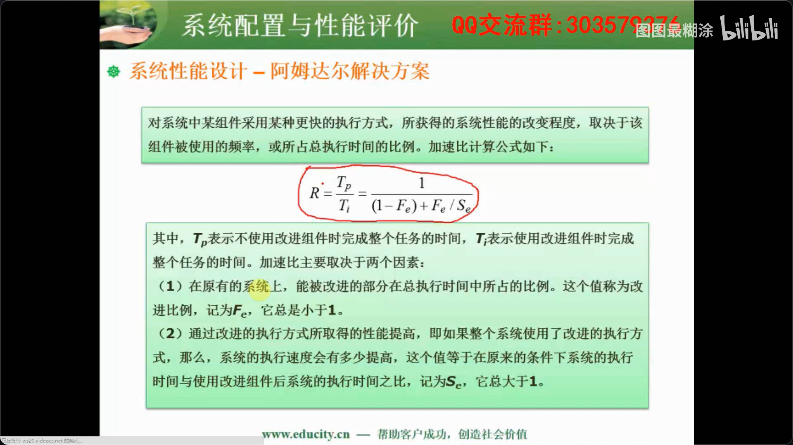
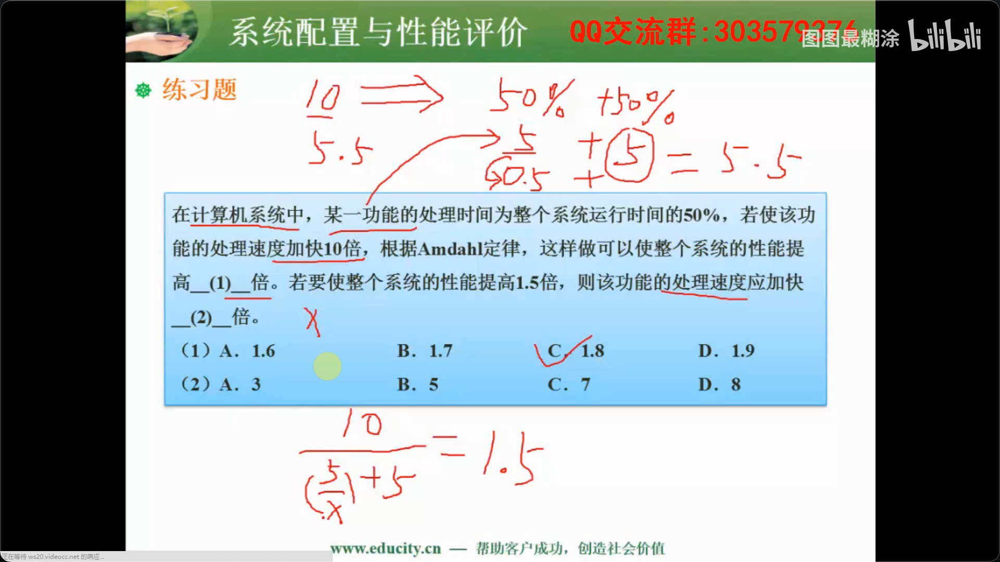
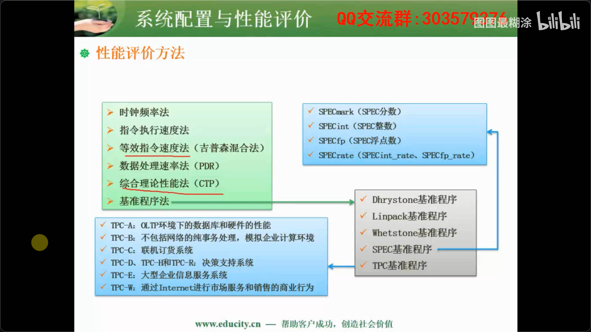

## 性能指标

- 字长与数据通路宽度
- 主存容量与存取速度
- 运算速度
- 吞吐量与吞吐率
- 响应时间
- 与完成时间
- 兼容性

## 阿姆达尔解决方案🌟🌟🌟

可使用估算法，将整个系统时间设置为10s。

可以根据公式计算，也可以假设总的运行时间进行计算

1. 可假设共运行10秒，该功能运行5秒，加速10倍，5/10=0.5，0.5+5，10/5.5=1.8
2. 10/（5/x+5）=1.5,计算x=3

## 性能评价方法🌟🌟🌟

- 时钟频率法，Cpu多少Hz

- 指令执行速度法，计算加法指令运算速度

- 等效指令速度法，结合指令使用频率和各种指令使用时间共同计算运算速度

- 数据处理速率法，开始不止计算cpu运行速率，计算cpu和内存的数据处理速率，内存成为瓶颈 

- 综合理论性能法，美国为了限制高性能计算机出口的一套评价标准

- **基准程序法**（跑分软件）

  

  