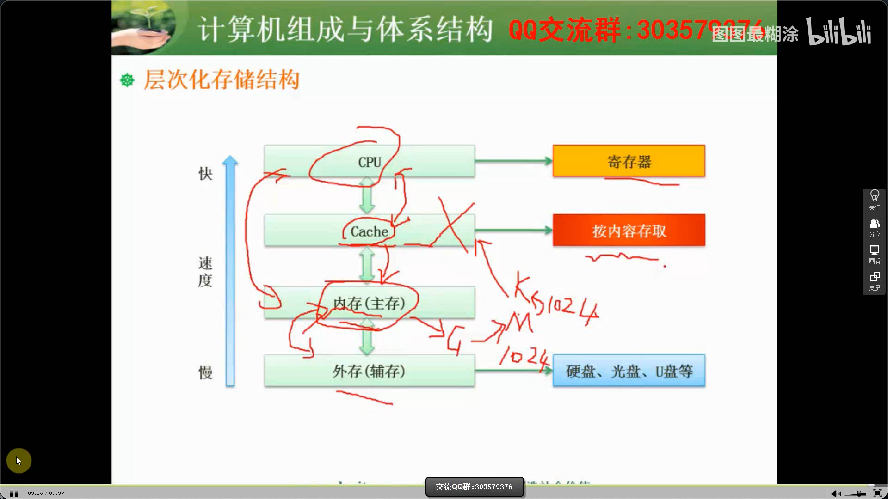
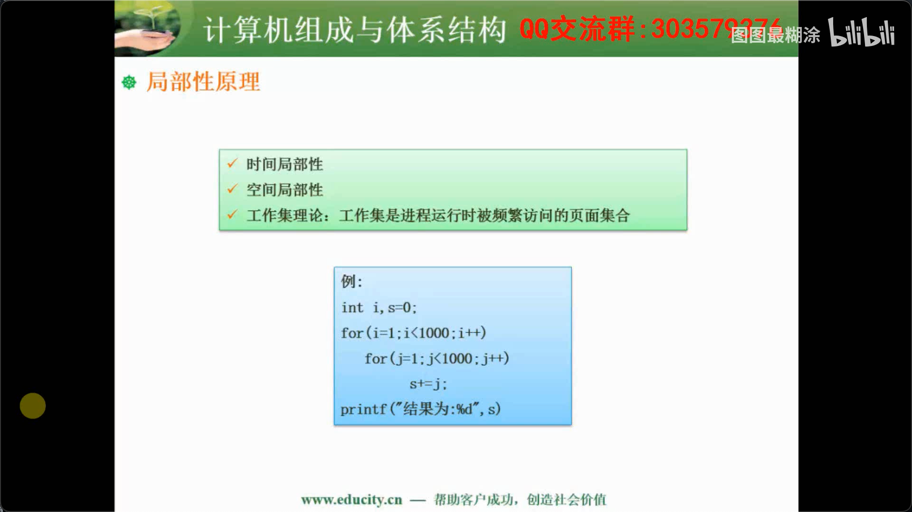
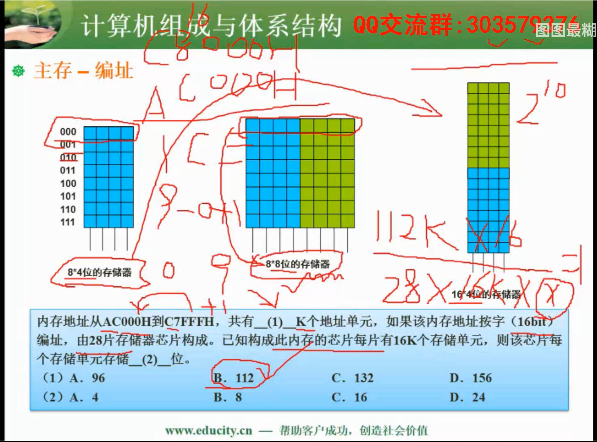
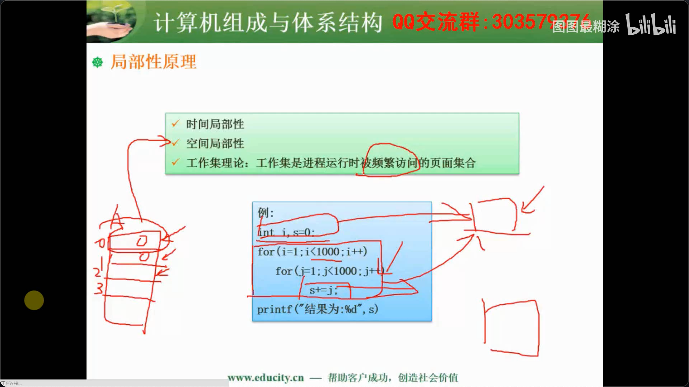
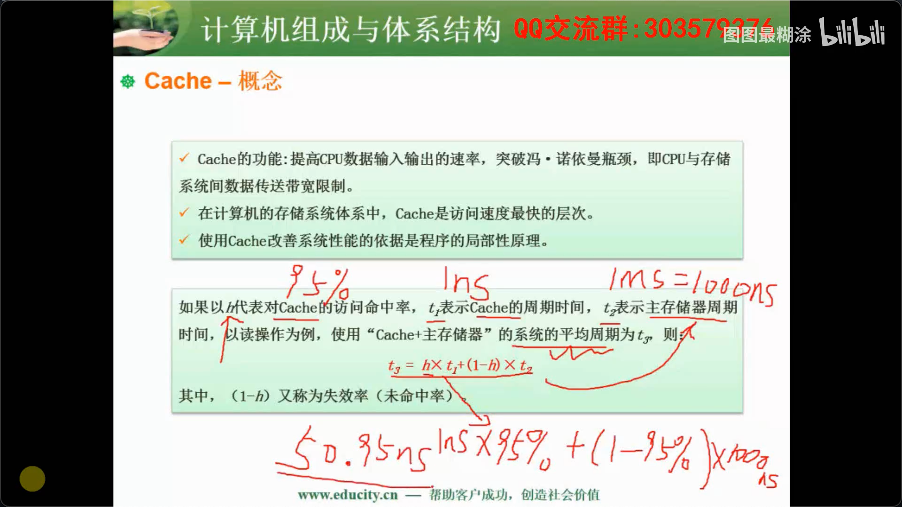
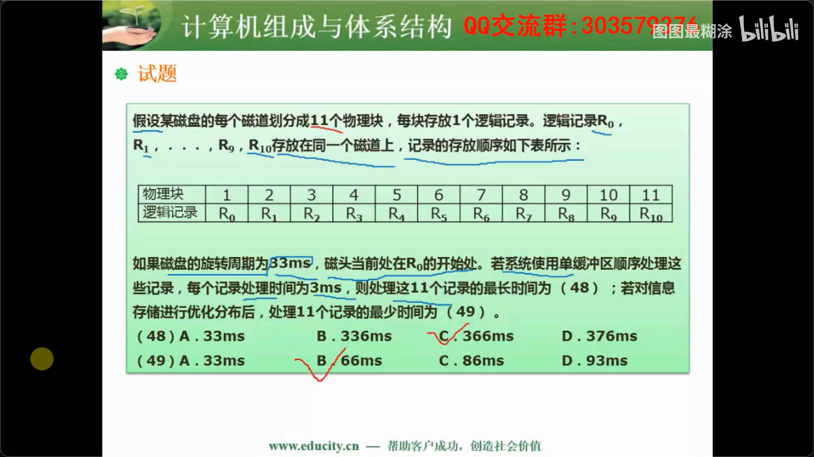
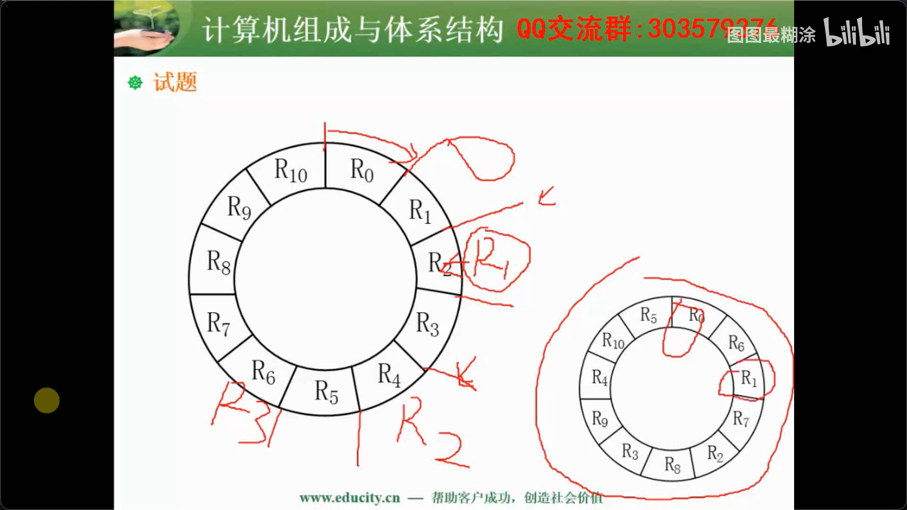

## Flynn分类法

```
架构没有考到，但是系分出现过，所以还是介绍一下
```

##### Flynn分类法

| 体系结构类型         | 结构                                       | 关键特性 | 代表                                       |
| -------------------- | ------------------------------------------ | -------- | ------------------------------------------ |
| SISD单指令流单数据流 | 控制部分：一个 处理器：一个 主存模块：一个 |          | 单处理器系统                               |
| SIMD单指令流多数据流 | 控制部分：一个 处理器：多个 主存模块：多个 |          | 并行处理机、**阵列处理机**、超级向量处理机 |
| MISD多指令流多数据流 | 控制部分：多个 处理器：一个 主存模块：多个 | 不实际   | 目前没有，文献中有                         |
| MIMD多指令多数据流   | 控制部分：多个 处理器：多个 主存模块：多个 |          | 多处理机系统、多计算机                     |

## CISC与RISC🌟

```
考了2-3次，只要区分结构特点就行了，上午题
```

##### CISC与RISC

- CISC：复杂指令集计算机 Complex Instrcution Set Computers
- RISC：精简指令集计算机 Reduced Instruction Set Computers

| 指令系统类型 | 指令                                                         | 寻址方式   | 实现方式                                             | 其他                       |
| ------------ | ------------------------------------------------------------ | ---------- | ---------------------------------------------------- | -------------------------- |
| CISC-复杂    | 数量多，使用频率差别大，可变长格式                           | 支持多种   | 微程序控制技术                                       | 研制周期长                 |
| RISC-精简    | 数量少，使用频率接近，定长格式，大部分为单周期指令，操作寄存器，只有Load/Store操作内存 | 支持方式少 | 增加了通用寄存器；应不限逻辑控制为主；适合采用流水线 | 优化编译，有效支持多种语言 |

## 存储系统🌟🌟🌟

```
重点为磁盘调度算法，存储单元
```


##### 冯·诺依曼结构

一种将程序指令存储器和数据存储器合并在一起的存储器结构。

1. 一般用于PC处理器，如I3，I5，I7处理器
2. 指令与数据存储器合并在一起
3. 指令与数据都通过相同的数据总线传输

##### 哈佛结构

一种将程序指令存储和数据存储分开的存储器结构。

1. 一般用于嵌入式系统处理器DSP(数据信号处理)
2. 指令与数据分开存储，可以并行读取，有较高数据的吞吐率
3. 有4条总线：指令和数据的数据总线与地址总线

##### 层次化存储结构



快->慢：CPU寄存器、Cache、内存(主存)、外存(辅存)

Cache按内容存取：Cache采用相连存取，区别与其他存储使用寻址存取，速度更快，可以根据内容计算出存取的位置

局部性原理：访问数据有局部性原理，故可以使用层次化存储结构。



在CPU访问寄存器时，无论是存取数据还是存取指令，都趋于聚集在一片连续的区域中，这就被称为局部性原理。
局部性原理又分为时间局部性（temporal locality） 和空间局部性 （spatial locality） 。

1. 时间局部性:
如果程序中的某条指令一旦执行，不久以后该指令可能再次执行;如果某数据被访问过，不久以后该数据可能再次被访问。产生时间局部性的典型原因，是由于在程序中存在着大量的循环操作。
----被引用过一次的存储器位置在未来会被多次引用（通常在循环中）。

2. 空间局部性:
一旦程序访问了某个存储单元，在不久之后，其附近的存储单元也将被访问，即程序在一段时间内所访问的地址，可能集中在一定的范围之内，这是因为指令通常是顺序存放、顺序执行的，数据也一般是以向量、数组、表等形式簇聚存储的。
----如果一个存储器的位置被引用，那么将来他附近的位置也会被引用。

##### 存储器分类

| name                                   | eg                              |
| -------------------------------------- | ------------------------------- |
| 随机存取存储器RAM-Random Access Memory | DRAM-动态存储器 SRAM-静态存储器 |
| 只读存储器ROM-Read-Only Memory         | MROM PROM EPRROM 闪速存储器     |

1. 存储单元指的一行的小单元格
2. 编址地址可以按字，也可以按字节8bit
3. 存储单元个数=大地址-小地址+1
4. 总容量=存储单元个数*编址内容
5. 总容量=单元芯片容量*芯片个数

##### 磁盘结构与参数

存取时间=寻道时间+等待时间(平均定位时间+转动延迟)

##### 磁盘调度算法

- FCFS
- SSTF最短寻道时间优先/最短移臂

### 主存与编址



### 局部性原理



### Cache提升效率公式



### 磁盘工作原理





问题1理解:

1. 因为R0处理时间需要3ms，所以单R0处理完以后，再读磁盘时，磁盘已经到达R2起始位置，需要重新转一圈才能再到R1起始位置
2. 所以从开始读R0到磁头移动到R1开始位置需要的时间时33+3=36ms
3. R0~R9共10块，10*（33+3）=360ms
4. R10后没有数据，不需要再转，所以耗时3+3=6ms
5. 总共360+6=366ms

问题2理解：

1. 优化后R0（读+处理）数据的时间过后，磁头刚刚到达R1的位置，没有任何的等待时间，单块处理的时间最小为3+3=6ms
2. 总共11*6=66ms