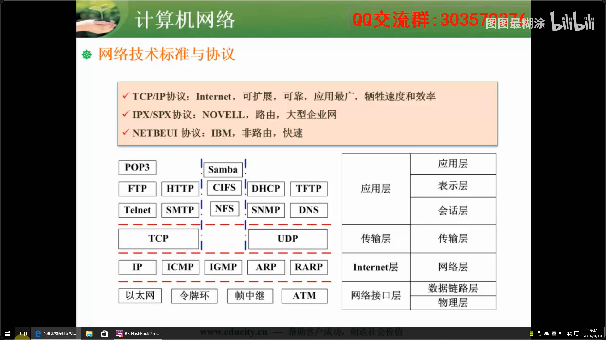

# 计算机网络基础

[toc]

```
1. TCP/IP协议簇：TCP与UDP协议、DNS、DHCP
2. 网络规划与设计：网络设计的任务、层次化网络设计
3. 网络存储：网络存储、RAID
4. 综合布线：综合布线
5. IPv6:IPv6地址分类
```


知识点：全局广播只能在三层以下的介质中传播



* Samba:**SMB(Server Message block)协议**，是window下所使用的文件共享协议，我们在linux系统或者其类unix系统当中可以通过samba服务来实现SMB功能。

  在NetBIOS 出现之后，Microsoft就使用NetBIOS实现了一个网络文件/打印服务系统，这个系统基于NetBIOS设定了一套文件共享协议， Microsoft称之为SMB（Server Message Block）协议。这个协议被Microsoft用于它们Lan Manager和Windows NT服务器系统中，实现不同计算机之间共享打印机、串行口和通讯抽象（如命名管道、邮件插槽等）。

       随着 Internet的流行，Microsoft希望将这个协议扩展到Internet上去，成为Inter net上计算机之间相互共享数据的一种标准。因此它将原有的几乎没有多少技术文档的SMB协议进行整理，重新命名为 CIFS（Common Internet File System），并打算将它与NetBIOS相脱离，试图使它成为Internet上的一个标准协议。
      
       在windows当中我们最常见的就是网上邻居可以看到同一互联网上连接的所有用户
  在服务器端，linux与window Server相比的稳定性，安全性执行效率以及性价比都是较高的。所以好多window Server下跑的一些服务都会切换到运行在linux服务上，但是对于一些桌面用户来说用到的较多的就是文件共享协议。而在linux中我们可以使用 FTP NFS这类型文件共享协议，但是对于window上比较简单的直接打开的服务在linux中的nfs协议来说是不能在window上使用的这种直接将文件系统共享出来的协议为SMB。

  **SMB协议又称为CIFS（Common Internet File System）协议**

  ps：samba可以使用tcp也可以使用udp实现

* 地址解析协议，即ARP（Address Resolution Protocol），是根据[IP地址](https://baike.baidu.com/item/IP地址?fromModule=lemma_inlink)获取[物理地址](https://baike.baidu.com/item/物理地址/2129?fromModule=lemma_inlink)的一个[TCP/IP协议](https://baike.baidu.com/item/TCP%2FIP协议?fromModule=lemma_inlink)。

* 反向地址转换协议（RARP：Reverse Address Resolution Protocol） 允许局域网的物理机器从[网关](https://baike.baidu.com/item/网关/98992?fromModule=lemma_inlink)服务器的 ARP 表或者缓存上请求其 IP 地址。

* 简单网络管理协议(Simple Network Management Protocol--SNMP）的原来名字叫做简单网关监控协议（Simple Gateway Monitoring Protocol-SGMP）。

## TCP/IP协议族

##### DHCP与DNS


- DHCP：动态主机配置协议


- DNS：域名系统。主机向本地域名服务器的查询采用递归查询（正确答案）。本地域名服务器向根域名服务器的查询通过采用迭代查询（线索）。


递归查询会刨根问底，迭代查询只查询一步

##### TCP与UDP

- TCP：可靠的传输协议
- UDP：不可靠的传输协议


## 网络规划与设计


##### 网络规划原则

- 实用性原则
- 开发性原则
- 先进性原则

##### 网络设计任务

- 确定网络总体目标
- 确定总统设计原则
- 通信子网设计
- 资源子网设计
- 设备选型
- 网络操作系统与服务器资源设备
- 网络安全设计

##### 网络实施原则

- 可靠性原则
- 安全性原则
- 高效性原则
- 可扩展性原则

##### 网络实施步骤

- 工程实施计划
- 网络设备到货验收
- 设备安装
- 系统测试
- 系统试运行
- 用户培训
- 系统转换

##### 网络规划与设计阶段

- 需求规范
- 通信规范
- 逻辑网络设计🌟
- 物理网络设计🌟
- 实施阶段

##### 逻辑设计与物理设计

- 逻辑网络设计阶段：拓扑结构、网络地址分配、安全规划、网络管理、选择路由协议、设备命名规范
- 物理网络设计阶段：设备的具体物理分布、运行环境等确定、设备选型、结构化布线、机房设计
- 逻辑网络设计阶段输出：逻辑网络设计图、**IP地址方案**、**安全方案**、招聘和培训网络员工的具体说明、对软硬件、服务、员工和培训费用初步估计
- 物理网络设计阶段输出：网络物理结构图和布线方案、**设备和部件的详细列表清单**、软硬件和安装费用的估算、安装日程表、详细说明服务的时间以及期限、安装后的测试计划、用户的培训计划

##### 分层设计


- 接入层：用户接入、计费管理、MAC地址认证、收集用户信息
- 汇聚层：网络访问策略控制、数据包处理、过滤、寻址
- 核心层：高速数据交换、常用冗余机制。在设计核心层设备的功能时，应尽量避免使用数据包过滤、策略路由等降低数
  据包转发处理的特性，以优化核心层获得低延迟和良好的可管理性。


## 网络接入

##### 有线接入


- 公用交换电话网络PSTN
- 数字数据网DDN
- 综合业务数字网ISDN
- **非对称数字用户线路ADSL**
- 同轴光纤技术HFC

##### 无线接入


- IEEE 802.11（WIFI）
- IEEE 802.15（蓝牙）
- 红外
- WAPI网络存储

[LTE](https://baike.baidu.com/item/LTE/6439078?fromModule=lemma_inlink)（Long Term Evolution，长期演进）项目是3G 的演进，是3G与4G技术之间的一个过渡，是3.9G的全 球标准。它改进并增强了3G的空中接入技术，采用 OFDM和MIMO作为其无线网络演进的唯一标准。在 20MHz频谱带宽下提供下行100Mbit/s与上行50Mbit/s 的峰值速率，改善了小区边缘用户的性能，提高小区 容量和降低系统延迟。

1、LTE系统有两种制式：LTE-FDD和TDD-LTE，即频分双工LTE系统和时分双工LTE系统。
2、二者技术的主要区别在于空中接口的物理层上.
（1）LTE-FDD系统空口上下行传输采用一对对称的频段接收和发送数据。（来自WCDMA）
（2）TDD-LTE系统上下行则使用相同的频段在不同的时隙上传输。（来自TD-SCDMA）
（3）相对于FDD双工方式，TDD有着较高的频谱利用率。


## 网络存储技术

##### 存储分类


- 直连式存储DAS
- 网络附加存储NAS（缺陷即要跑业务数据，又要跑存储数据）
- 存储区域网络SAN（分开业务数据与存储数据，缺点是费用高）
- IPSAN（使用iSCSI协议，性能略低于SAN，费用也低）
- **iSCSI**（Internet Small Computer System Interface，发音为/ˈаɪskʌzi/），[Internet小型计算机系统接口](https://baike.baidu.com/item/Internet小型计算机系统接口/3023938?fromModule=lemma_inlink)，又称为IP-SAN，是一种基于[因特网](https://baike.baidu.com/item/因特网?fromModule=lemma_inlink)及[SCSI-3](https://baike.baidu.com/item/SCSI-3?fromModule=lemma_inlink)协议下的存储技术，由[IETF](https://baike.baidu.com/item/IETF?fromModule=lemma_inlink)提出，并于2003年2月11日成为正式的标准。

##### Raid


- Raid0：条块化。性能最高，并行处理，无冗余，损坏无法恢复
- Raid1：镜像结构。可用性，可修复性好，仅有50%利用率
- Raid0+1：高效也可靠
- Raid3：奇偶校验并行传送。N+1模式，有固定的校验盘，坏一个盘可恢复。（N是数据盘，1是校验盘，每次更新数据盘时，校验盘都会跟着变化，校验盘坏盘的概率比较大）
- Raid5：分布式奇偶校验的独立磁盘。N+1模式，无固定的校验盘，坏一个盘可恢复。（是Raid3的优化，校验盘不在固定的一个盘上）


- Raid6：两种存储的奇偶校验。N+2模式，无固定的校验盘，坏两个盘可恢复

##### IPv6


- IPv6长度为128位，地址空间增大了2^96倍


## 综合布线系统

- 工作区子系统
- 水平干线系统
- 管理间子系统
- 垂直干线子系统
- 设备间子系统
- 建筑群子系统


## 物联网


二维码


## 云计算


##### 特点

- 集合了大量计算机、规模达到成千上万
- 多种软硬件技术相结合
- 对客户端设备的要求低
- 规模化效应