# 软件工程

[toc]

## 软件开发方法

- 原型法
- 结构化法
- 面向对象方法
- 面向服务的方法
- 形式化方法
- 统一过程方法

  
- 敏捷方法
- 基于架构的开发方法ABSD

## 软件开发模型

- 瀑布模型：迭代模型/迭代开发方法

  

  缺点：需求不明确，上线时需求变更，容易带来巨大损失（人力、财力、时间）。使用此模型有较大局限性，如：二次开发

- 演化模型：快速应用开发

- 增量模型：构件组装模型/基于构建的开发方法

  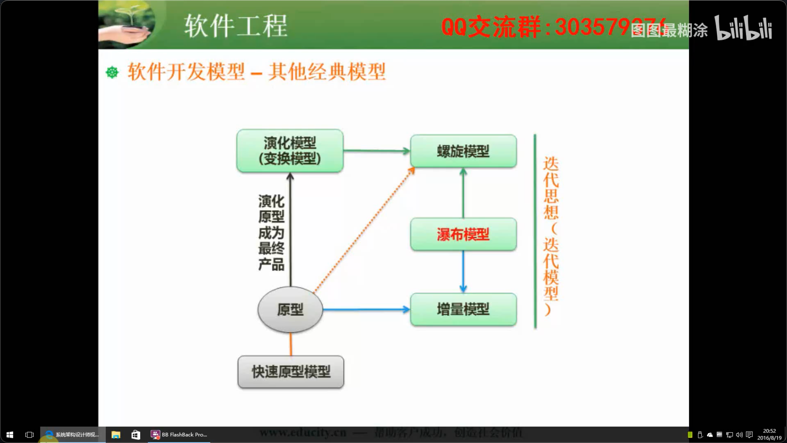

- 螺旋模型：统一过程/统一开发方法

  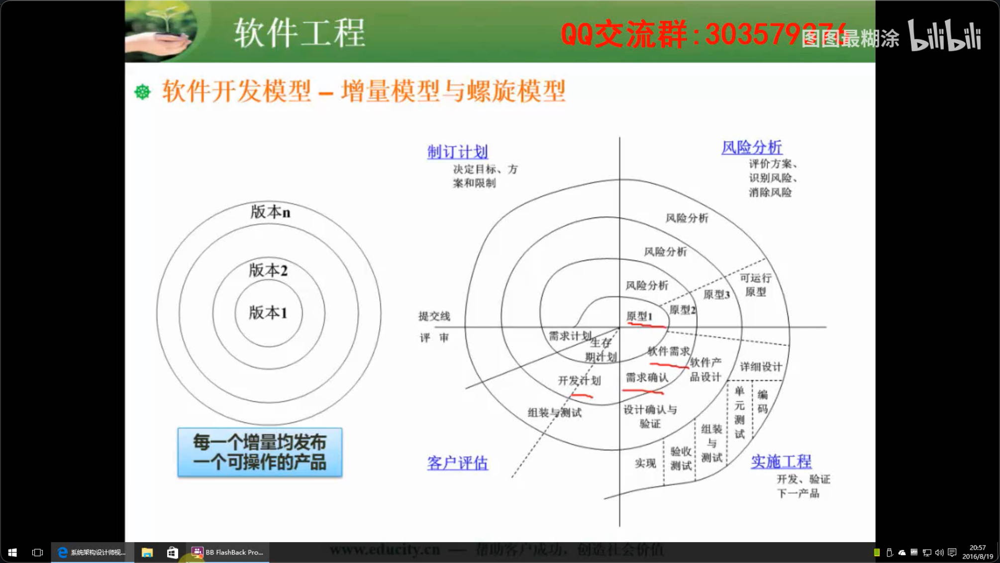

- 原型模型：敏捷开发方法

- 喷泉模型：模型驱动的开发方法，面向对象的模型

- V模型：基于架构的开发方法

  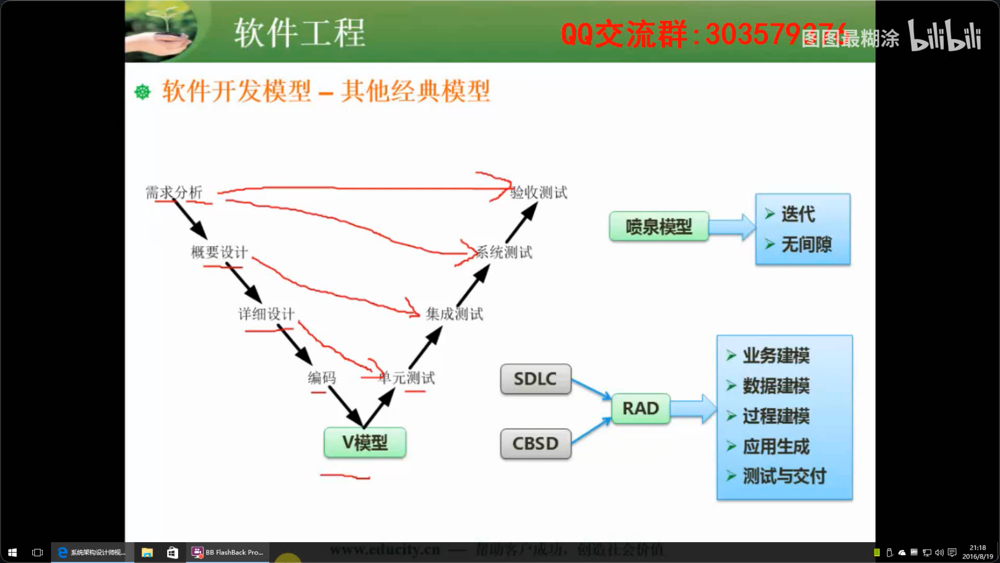

  强调测试的一种模型，将测试融入到软件开发的设计和开发阶段

- RAD：快速应用程式开发工具(Rapid Application Development，简称RAD),瀑布模型(SDLC)+构件组装模型(CBSD)，典型代表VB、delphi

- CBSD:构件组装模型,强调构建的重用

  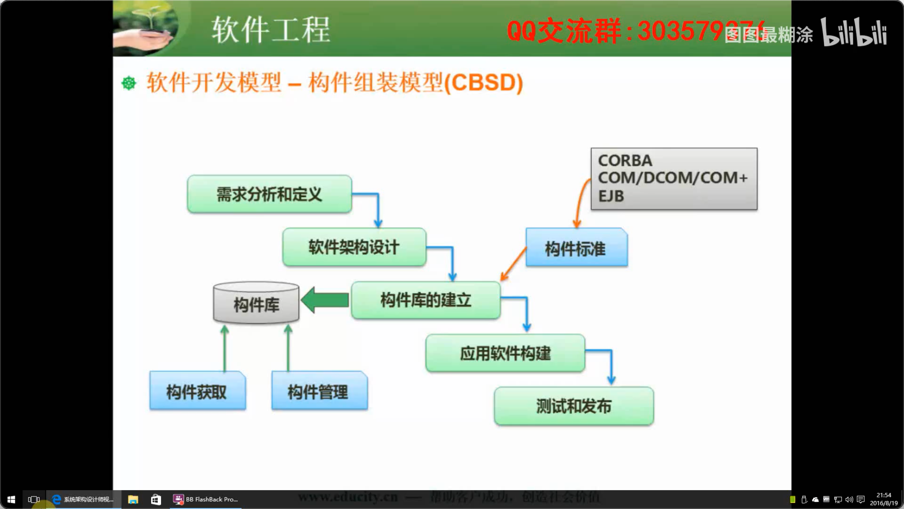

##### 敏捷方法4大价值观

沟通、简单、反馈、勇气

##### 敏捷开发方法

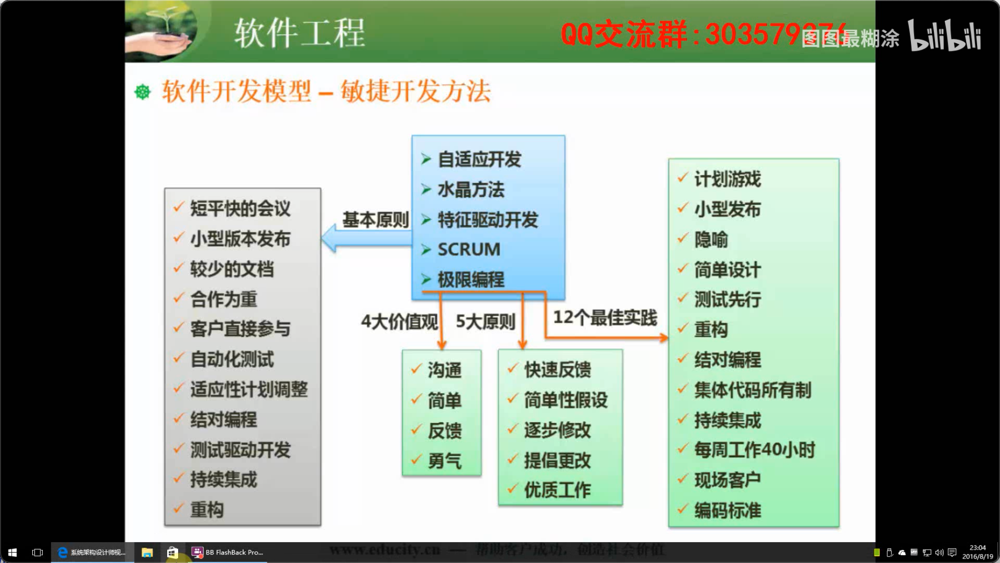

- 极限编程XP：
- 水晶方法：
- 开放式编码：
- SCRUM：明确定义了的可重复的方法过程。
- 功用驱动开发方法FDD：编程开发人员分为两类：首席程序员和“类”程序员
- ASD方法：

##### 逆向工程

- 实现级：抽象语法数、符号表、过程
- 结构级：程序分量之间相互依赖关系
- 功能级：**程序段功能及程序段**
- 领域级：应用领域概念之间对应关系

## 需求工程

##### 需求开发

- 需求获取

  
- 需求分析
- 需求定义
- 需求验证

##### 需求管理

- 变更控制
- 版本控制
- 需求跟踪
- 需求状态跟踪

##### 需求分析

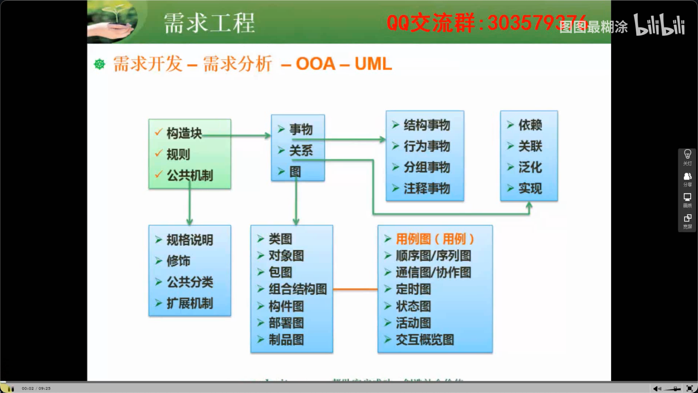

- 状态转换图STD

  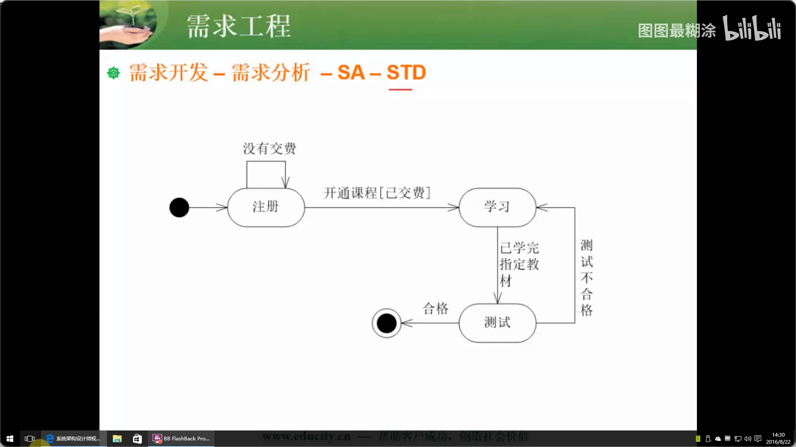

- 数据流图DFD

  

  1. 可分层
  2. 需要平衡。1.指父子图的平衡，父图中有的内容子图中也要有。2.主要指输入输出的平衡（龙门客栈的例子）

- 数据模型ER图

  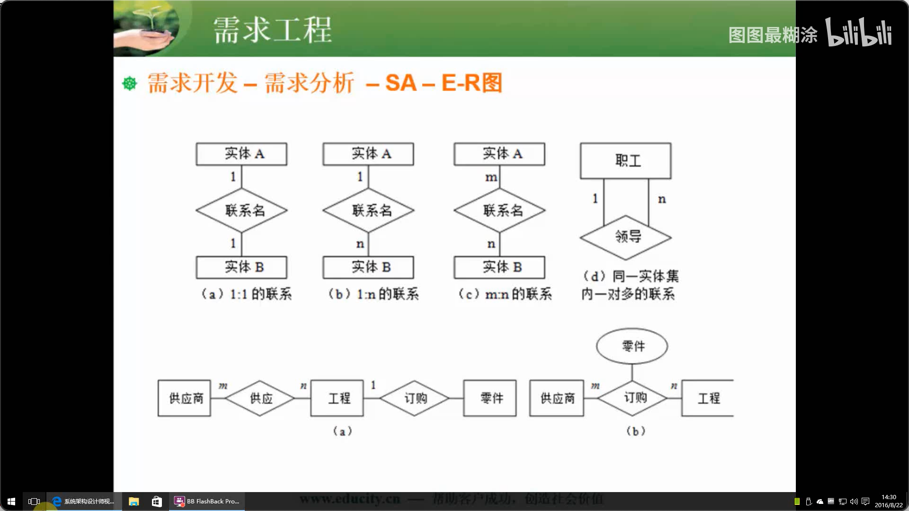

- 数据字典

- UML

##### 需求变更管理

- 问题分析和变更描述
- 变更分析和成本计算
- 变更实现

## 系统设计

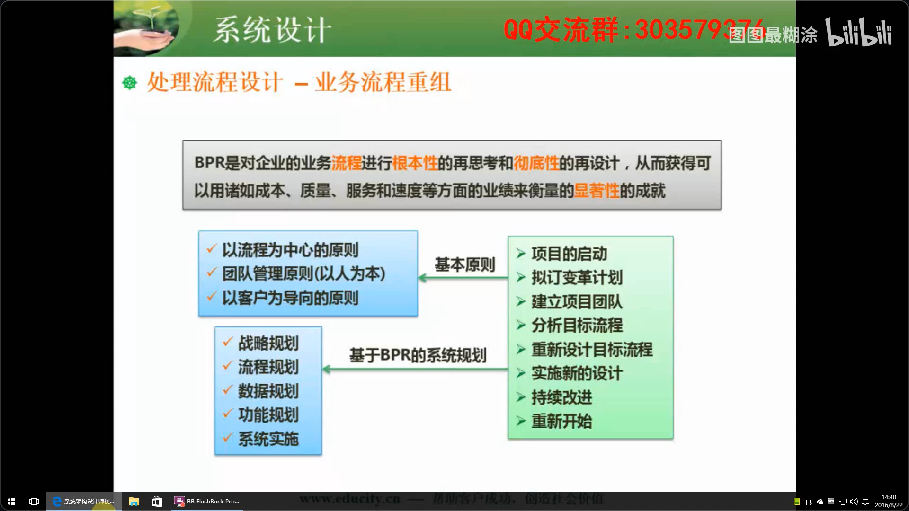

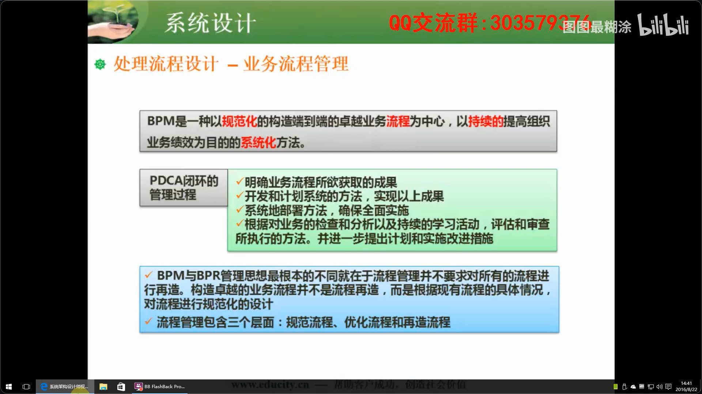

##### 软件设计

- 结构设计
- 数据设计
- 接口设计
- 过程设计

##### 结构化设计

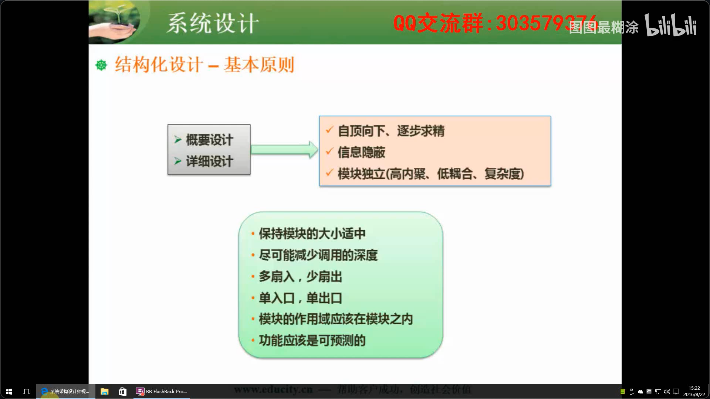

- 需求设计：数据流图
- 概要设计：模块结构图、层次图和HIPO图
- 详细设计：程序流程图、伪代码、盒图

##### 面向对象设计-设计原则

- 单一职责原则：设计目的单一的类。
- 开放-封闭原则：对扩展开放，对修改封闭。
- 李氏（Liskov）替换原则：子类可以替换父类。
- 依赖倒置原则：要依赖于抽象，而不是具体实现；针对接口编程，不要针对实现编程。
- 接口隔离原则：使用多个专门的接口比使用单一的总接口要好。
- 组合重用原则：要尽量使用组合，而不是继承关系达到重用目的。
- 迪米特（Demeter）原则（最少知识法则）：一个对象应当对其他对象有尽可能少的了解。

面向对象的设计模型包含以**包图**表示的软件体系结构图，以**交互图**表示的用例实现图，完整精确的类图，针对复杂对象的状态图和用以**描述流程化处理**的活动图等。

##### 设计模式-创建型模式

- Factory Method工厂方法模式：
- Abstract Factory抽象工厂模式：
- Builder构建器模式：
- Prototype原型模式：
- Singleton单例模式：

##### 设计模式-结构型模式

- Adapter适配器模式
- Bridge桥接模式
- Composite组合模式
- Decorator装饰模式
- Fecade外观模式
- Flyweight享元模式：对庞大对象的管控。eg：汉字编码、棋牌。
- Proxy代理模式：快捷方式

##### 设计模式-行为型模式

- Chain of Responsibility职责链模式：eg：请假审批
- Command命令模式：eg：日志记录，可撤销
- Interpreter解释器模式：eg：虚拟机
- Iterator迭代器模式：数据集
- Mediator中介者模式：不直接引用
- Menmento备忘录模式：游戏存档
- Observer观察者模式：订阅、广播、联动
- State状态模式：状态变成类
- Strategy策略模式：多方案切换
- Template Method模版方法模式：框架
- Visitor访问者模式：数据与操作分离。在不改变原来类结构(活动节点)的基础上增加新功能。

## 软件测试

##### 软件测试方法

- 动态测试：计算机运行。黑盒测试、白盒测试、灰盒测试
- 静态测试：纯人工。桌前检查、代码审查、代码走查

##### 测试阶段

- 单元测试
- 集成测试：主要测试各模块之间的接口是否正常起作用。
- 系统测试
- 确认测试
- 回归测试

##### 面向对象测试

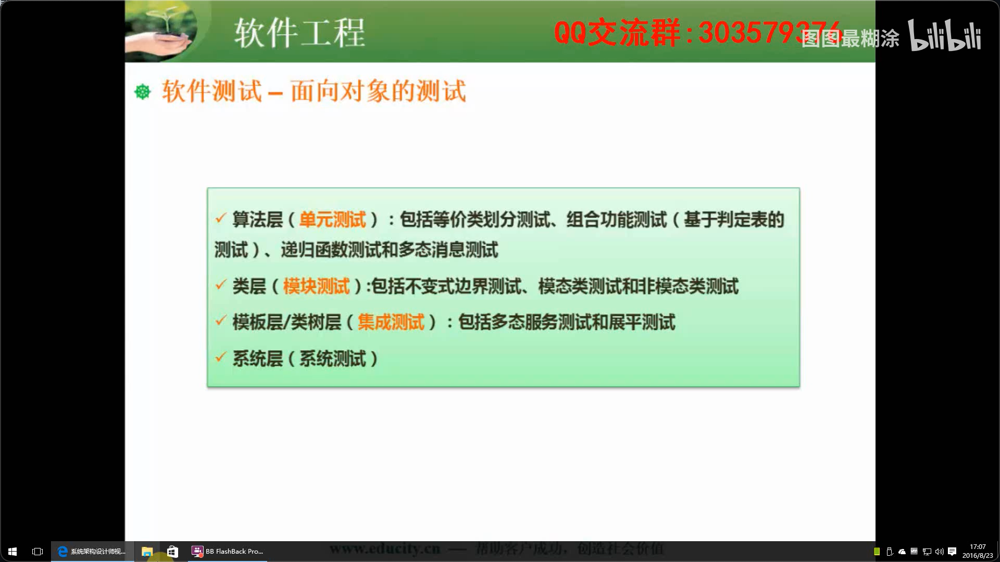

##### 测试管理

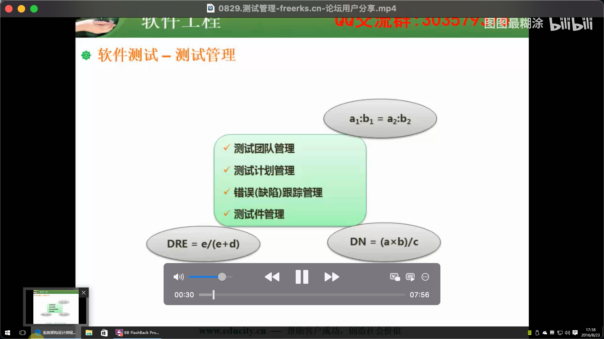

错误跟踪管理

* 错误植入法 a1:b1=a2:b2
* 错误曝光率DRE

##### 软件调试

- 蛮力法
- 回溯法
- 原因排除法

##### 系统测试

系统测试是根据系统方案说明书来设计测试用例，常见的系统测试主要有恢复测试、安全性测试、压力测试、性能测试、可靠性测试、可用性测试、可维护性测试和安装测试。

## 软件运行与软件维护

##### 系统转换计划

- 高水平高价值：改造
- 高水平低价值：集成
- 低水平高价值：继承
- 低水平低价值：淘汰

##### 软件维护

- 正确性维护
- 适应性维护
- 完善性维护
- 预防性维护