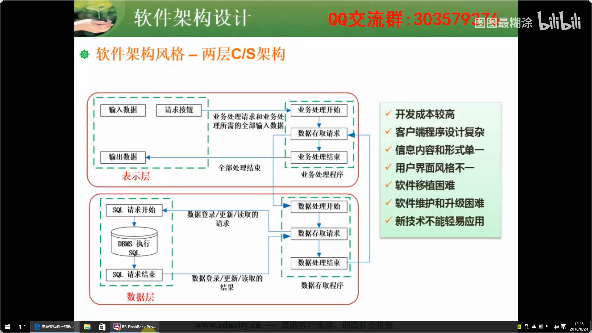
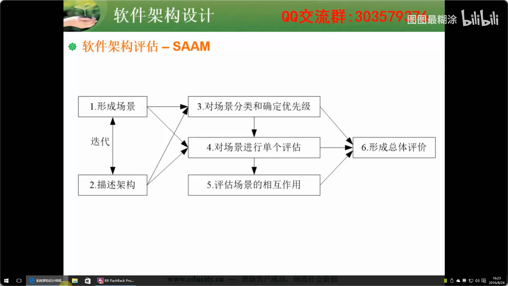
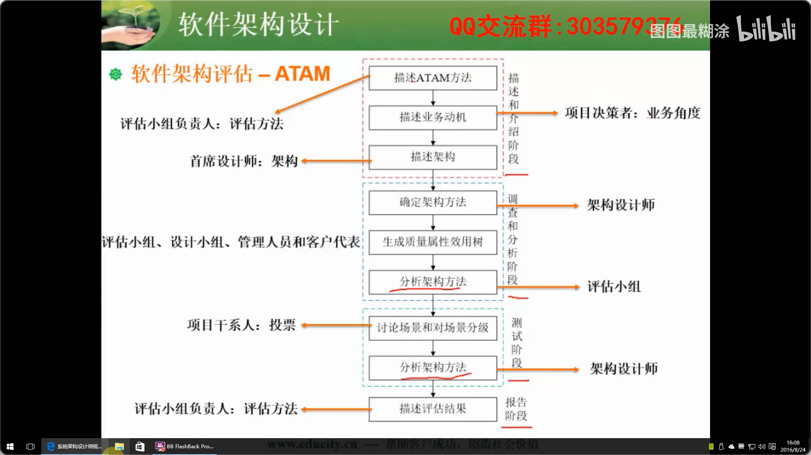

# 软件架构设计

 [toc]

## 软件架构的概念

##### 架构的本质

- 软件架构为软件系统提供了一个结构、行为和属性的高级抽象。

- 架构架构风格是特定应用领域的惯用模式，架构定义一个词汇表和一组约束

##### 架构的“4+1”视图

- 逻辑视图
- 开发视图
- 进程视图
- 物理视图


## 软件架构风格

##### 五大架构风格

- 数据流风格：
  - 批处理：大量**整体**数据、无需用户交互
  - 管道过滤器：流式数据、弱用户交互
- 调用/返回风格：
  - 主程序/子程序
  - 面向对象
  - 层次结构
- 独立构件风格：
  - 进程通信
  - 事件驱动系统（**隐式调用**）：windows图形界面、断点回调
- 虚拟机风格：
  - 解释器：适用于需要“自定义规则”的场合
  - 规则系统：适用于专家系统
- 仓库风格：
  - 数据库系统、
  - 黑板系统：语音识别、知识推理、模式识别、知识推理
  - 超文本系统

##### 其他风格

- **闭环控制架构（过程控制）**：适合于嵌入式系统，**适用于处理简单任务**。经验应用：空调控温、定速巡航
- C2风格：构件和连接件都有一个顶部和一个底部

##### 层次架构风格

- 两层C/S --> 三层C/S --> 三层B/S --> 混合架构

  
- MVC架构风格
- MVP架构风格：MVC的变种
- MVVM
- RIA架构风格

##### 基于服务的架构SOA

- 服务 > 构件 > 对象
- Web Service
- ESB：提供位置透明性的消息路由和寻址服务


## 架构描述语言ADL

##### ADL的三个基本元素：

- 构件：计算或数据存储单元
- 连接件：用于构件之间交互建模的体系结构构造块及其支配这些交互的规则
- 架构配置：描述体系结构的构建与连接件的连接图


## 特定领域软件架构DSSA

##### 基本活动

- 领域分析：建立领域模型
- 领域设计：获得DSSA
- 领域实现：开发和组织可复用信息

##### 角色

- 领域专家：专家只提供意见，不干活
- 领域分析人员：有经验的系统分析员
- 领域设计人员：有经验的软件设计人员
- 领域实现人员：有经验的程序设计人员


## 基于架构的软件开发ABSD

##### 概念

- ABSD方法是架构驱动，即强调由业务、质量和功能需求的组合驱动架构设计
- ABSD有三个基础。1.功能的分解。2.通过选择架构风格来实现质量和业务需求。3.软件模板的使用。
- 采用**视角与视图**来描述软件架构，采用**用例**来描述功能需求，采用**质量场景**来描述质量需求。
- ABSD 方法是一个自顶向下，递归细化的过程，软件系统的架构通过该方法得到细化，直到能产生软件构件的类。

##### 开发过程

- 架构需求
- 架构设计
- 架构文档化：输出结果为**架构规则说明**和**测试架构需求的质量设计说明书**这两个文档。
- 架构复审：目的是**标识潜在的风险**。
- 架构实现
- 架构演化


## 软件质量属性 & 软件架构评估

##### 质量属性

- **性能**：系统的响应能力。增加可用资源/

  性能是指系统的响应能力，性能测试经常要使用基准测试(Benchmark Test).

  提高性能的办法：

  异步化 - 使用消息系统 和 batch处理

  缓存 - 有多重缓存策略，本地缓存，分布式缓存同步，缓存服务器。

  系统分割（水平和垂直分割）- 

  数据库读写分离 - 

  

  性能测试的办法：基准测试

  基准[测试](http://www.blogjava.net/qileilove/archive/2012/07/05/382241.html)（benchmarking）是一种测量和评估软件性能指标的活动。你可以在某个时候通过基准测试建立一个已知的性能水平（称为基准线），当系统的软硬件环境发生变化之后再进行一次基准测试以确定那些变化对性能的影响。这是基准测试最常见的用途。(Reference: http://www.blogjava.net/qileilove/archive/2012/07/05/382241.html)

- 可靠性：

   可靠性度量标准通常用于计算单个解决方案组件的故障概率。用于定义组件或系统可靠性的一个度量标准是平均故障间隔时间 (MTBF)。MTBF 是平均间隔时间，通常以千小时或万小时（有时称为“开机时间”或 *POH*）进行表示，即经过此间隔时间后组件出现故障并需要修复。MTBF 使用以下公式进行计算：

  ```
  MTBF = (total elapsed time - sum of downtime)/number of failures
  ```

  衡量可靠性的指标有容错性和健壮性.

  健壮性。保护应用程序不受错误使用和错误输入的影响，在遇到意外错误事件时确保应用系统处于定义好的状态。也就是尽可能多的考虑到异常情况，并返回给用户有意义的错误信息。尽量减少“系统错误”之类的反馈。

  主要的可靠性设计技术包括：

  

  - 容错设计技术：常用的软件容错技术主要有恢复快设计，N版本程序设计和冗余设计。恢复快设计中包含有若干功能相同、设计差异的程序块，每一时刻有一个处于运行状态，一旦某程序出现故障，则用备份程序块予以替换。N版本设计的核心是通过设计出多个模块或不同版本，对于相同初始条件和相同输入的操作结果进行多数表决（防止因其中某一软件模块/版本的故障而提供了错误的服务，以实现软件容错）。冗余设计的思路来源于硬件系统，但有所不同。软件冗余设计技术是采用多种不同路径，不同算法或不同实现方法的模块或系统作为备份，在出现故障时进行替换，维持系统的正常运行。
  - 检测技术：在无须在线容错或不能采用冗余设计技术的部分，但又有较高可靠性需要时，一般采用检测性设计，在软件出现故障后能及时发现并报警，明显的缺点是不能自动解决故障。
  - 降低复杂度设计： 软件的复杂性与软件可靠性有密切关系，软件复杂性是产生软件缺陷的重要根源。降低复杂度设计的思想就是在保证实现软件功能的基础上，简化软件结构。

- **可用性**：系统能正常运行的时间比例。ping/echo/心跳/主动冗余

  是系统能够正常运行的时间比例。

  可用性＝系统运行时间/(系统运行时间＋系统停机时间)

  **Percentage of availability = (total elapsed time - sum of downtime)/total elapsed time**

  可用性通常以“九”进行度量。例如，可用性级别为“三个九”的解决方案能够在 99.9% 的时间内支持其预期功能，相当于在 24x7x365（每天 24 小时/每周七天/一年 365 天）的基础上，每年 8.76 小时的年停机时间.

  或者用公式**可用度 = MTTF / MTBF**

  MTBF (Mean Time Between Failure) = MTTF (Mean Time To Failure) + MTTR ( Mean Time To Repaire)

  平均失效间隔时间 = 平均失效等待时间 + 平均失效修复时间。

  (Reference: http://book.51cto.com/art/200902/111142.htm)

  提高可用性的设计技术：

  可以能过分布式并行系统来提高系统的准确率，并行系统的好处当一个节点出现问题，另一个节点任然可以工作

- **安全性**：审计追踪/身份验证 

- **可修改性**：信息隐藏

  是指能够快速地以较高的性能价格比对系统进行变更的能力。包含以下4个方面

  - 可维护性（Maintainability)
  - 可扩展性（Extendibility)
  - 结构重组（Reassemble)
  - 可移植性（Portability)

- 功能性

- 可变性

- 互操作性

##### 评估点

- 敏感点：一个或多个构件的特性
- 权衡点：多个质量属性的敏感点
- 风险点
- 非风险点

##### 基于场景的评估方法

- **软件架构分析法SAAM**

  
- **架构权衡分析法ATAM**：1.场景和需求收集。2.架构视图和场景实现。3.属性模型构造和分析。4.折中。

  
- 成本效益分析法CBAM


## 软件产品线

##### 建立产品线的方式

- 演化方式
- 革命方式


## 构件与中间件技术

##### 构建的特性

1. 独立部署单元
2. 作为第三方的组装单元
3. 没有（外部的）可见状态

##### 基于中间件技术的优点

1. 面向需求
2. 业务的分隔和包容性
3. 设计与实现隔离
4. 隔离复杂的系统资源
5. 符合标准的交互模型
6. 软件复用
7. 提供对应用构件的管理

##### 构件的复用

- 检索与提取构件
- 理解与评论构件
- 修改构件
- 组装构件

##### 构件标准

- COBRA
- COM
- EJB

基于构件的开发模型由软件的需求分析定义、体系结构设计、构件库建 立、应用软件构建以及测试和发布 5 个阶段组成。


## 软件架构文档

软件架构文档的写作应该遵循一定的原则，这些原则包括：

- 文档要从**使用者**的角度进行编写；必须分发给所有与系统有关的开发人员：
- 应该保持架构文档的即时更新，但更新不要过于频繁：
- 架构文档中描述应该尽量避免不必要的重复；
- 每次架构文档修改都应该记录进行修改的原则。