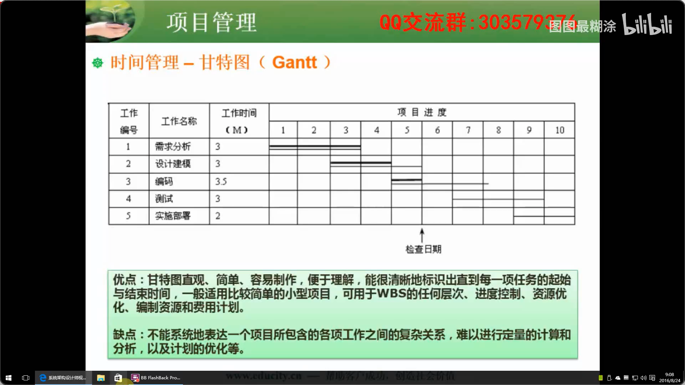

# 项目管理

[toc]

## 立项管理

##### 盈亏平衡分析

- 销售额=固定成本+可变成本+税费+利润【正常情况】
- 销售额=固定成本+可变成本+税费【盈亏平衡】
- 可变成本/销售额不变，税费/销售额不变

## 范围管理

确定项目的边界，即哪些工作是项目应该做的，哪些工作不应该包括在项目中

- 范围计划编制
- 范围定义：**项目章程/项目范围管理计划/批准的变更申请/组织过程资产**
- 创建WBS：便于估算，明确范围，防止需求蔓延。WBS字典
- 范围确认
- 范围控制

## 时间管理

时间管理也叫进度管理。

- 活动定义
- 活动排序
- 活动资源估算
- 活动历时估算
- 指定进度计划
- 进度控制

##### 前导图法（单代号网络图，PDM）

- 关键路径的长度=最短工期=**最长**路径
- 总时差为0的活动为关键活动
- 关键活动组成的路径为关键路径
- 一个项目可以有多条关键路径，但是对项目不好

##### 关键路径法

- 总时差（松弛时间）：在不延误
- 自由时差

##### 甘特图

## 成本管理

##### 成本估算方法

- 自顶向下的估算
- 自底向上的估算
- 差别估算法

##### 成本预算方法

- 直接成本与间接成本
- 管理储备
- 零基准预算

## 软件质量管理 

##### 质量保证&质量控制

- 质量保证：每隔一段时间进行。工具：质量审计和过程分析
- 质量控制：实时监控项目的具体结果

##### 软件过程改进 CMMI

- 已管理级
- 已定义级
- 定量管理级
- 优化级

## 软件配置管理

##### 变更控制过程

- 变更申请
- 变更评估
- 变更决策
- 变更实施
- 变更验证
- 沟通存档

##### 软件工具

- 软件开发工具：需求分析工具、设计工具、编码与排错工具
- 软件维护工具：版本控制工具、文档分析工具、开发信息库工具、逆向工程工具、再工程工具
- 软件管理和软件支持工具：项目管理工具、配置管理工具、软件评价工具、软件开发工具的评价和选择

##### 配置项

- 属于产品组成部分的工作成果：如需求文档、设计文档、源代码和测试用例等；

- 属于项目管理和机构支撑过程域产生的文档：如工作计划、项目质量报告和项目跟踪报告等。

  